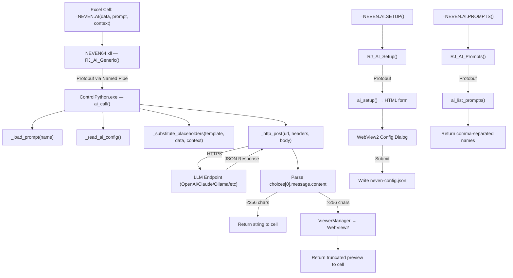
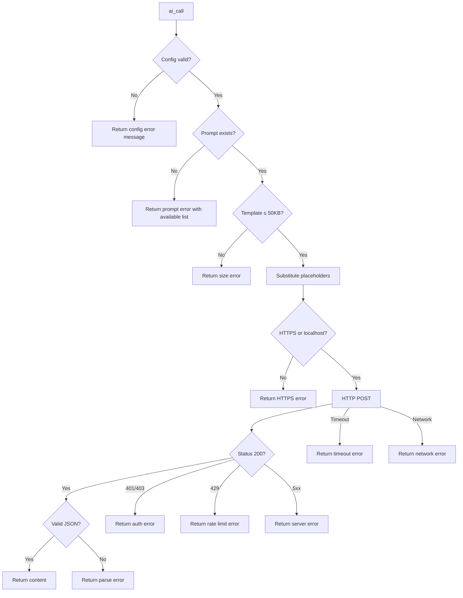

# Design Document — AI Integration (LLM-Powered Result Interpretation)

## Overview

This feature adds AI-powered interpretation of statistical results to NEVEN by calling LLM APIs (OpenAI, Claude, Gemini, or any OpenAI-compatible endpoint) from within Excel. The implementation routes all AI logic through ControlPython.exe, leveraging Python's built-in `urllib.request` for HTTP and `json` for response parsing. Three new Excel functions are exposed: `NEVEN.AI()`, `NEVEN.AI.SETUP()`, and `NEVEN.AI.PROMPTS()`.

The feature is entirely optional — NEVEN operates normally without AI configured. When configured, users call `=NEVEN.AI(A1:D5, "interpretar_regresion", "datos de ventas")` and receive a natural language interpretation in the cell or in a WebView2 viewer for longer responses.

### Design Decisions

1. **Python over C++ for HTTP**: Python's `urllib.request` handles HTTPS, redirects, timeouts, and JSON natively. Implementing this in C++ would require linking OpenSSL or WinHTTP and adds significant complexity for no benefit.

2. **Synchronous-then-async pattern**: The XLL immediately returns "⏳ Procesando..." via Excel's async UDF mechanism, then updates the cell when the response arrives. This prevents Excel from freezing during the 5-60 second API call.

3. **Sequential request queue**: Multiple AI calls are serialized with a 1-second minimum interval to respect API rate limits and avoid overwhelming the single Python pipe.

4. **Prompt templates as plain text files**: Users can create/edit prompts with any text editor. No special format beyond `{{placeholder}}` tokens. Comment lines starting with `#` are stripped before sending to the LLM.

5. **WebView2 overflow at 256 chars**: Statistical interpretations are typically 500-2000 characters. The 256-char threshold ensures short answers fit in cells while longer analyses get proper markdown rendering.

## Architecture



### Integration with Existing Architecture

The AI functions follow the same pattern as `NEVEN.v()` and `NEVEN.pluto.data()`:

1. **XLL Layer** (`basic_functions.cc`): New exported functions `RJ_AI_Generic`, `RJ_AI_Setup`, `RJ_AI_Prompts` registered in `funcTemplates[]` and exported via `rj2xcl.def`.

2. **Pipe Layer**: The XLL sends a `function_call` Protobuf message to ControlPython.exe with `function="ai_call"` and arguments serialized as `Variable` messages. This uses the existing `PythonCall()` path in `python_interface.cc`.

3. **Python Layer** (`startup.py`): New functions `ai_call()`, `ai_setup()`, `ai_list_prompts()` are defined in startup.py and discovered by `list_functions()` for registration.

4. **WebView2 Layer**: Long responses use `ViewerManager::CreateViewer()` — the same infrastructure as `NEVEN.v()`.

## Components and Interfaces

### XLL Functions (C++ — `basic_functions.cc`)

```cpp
// New funcTemplates entries:
{ L"RJ_AI_Generic", L"UQQQ", L"NEVEN.AI", L"Data, PromptName, Context",
  L"1", L"NEVEN", L"", L"",
  L"Call AI to interpret statistical results",
  L"String representation of data range",
  L"Name of prompt template (without .txt)",
  L"Optional context description", L"", L"", L"", L"" },

{ L"RJ_AI_Setup", L"Q", L"NEVEN.AI.SETUP", L"",
  L"1", L"NEVEN", L"", L"",
  L"Interactive AI configuration wizard", L"", L"", L"", L"", L"", L"", L"" },

{ L"RJ_AI_Prompts", L"Q", L"NEVEN.AI.PROMPTS", L"",
  L"1", L"NEVEN", L"", L"",
  L"List available AI prompt templates", L"", L"", L"", L"", L"", L"", L"" },
```

**RJ_AI_Generic** implementation:
```cpp
extern "C" __declspec(dllexport) LPXLOPER12 WINAPI RJ_AI_Generic(
    LPXLOPER12 data, LPXLOPER12 prompt_name, LPXLOPER12 context) {
    
    thread_local XLOPER12 rslt;
    
    // Convert XLOPER12 args to strings
    std::string data_str = Convert::XLOPERToString(data);
    std::string prompt_str = Convert::XLOPERToString(prompt_name);
    std::string context_str = (context && context->xltype != xltypeMissing) 
        ? Convert::XLOPERToString(context) : "";
    
    // Build Protobuf function_call to Python's ai_call()
    RJ2XCLBuffers::CallResponse call, response;
    call.set_wait(true);
    auto function_call = call.mutable_function_call();
    function_call->set_function("ai_call");
    
    // Add arguments: data_str, prompt_name, context
    auto arg0 = function_call->add_arguments();
    arg0->set_str(data_str);
    auto arg1 = function_call->add_arguments();
    arg1->set_str(prompt_str);
    auto arg2 = function_call->add_arguments();
    arg2->set_str(context_str);
    
    // Route to Python language service
    auto& lm = rj2xcl::LanguageManager::Instance();
    auto python_service = lm.GetServiceByName("Python");
    if (!python_service) {
        Convert::StringToXLOPER(&rslt, 
            "❌ Error AI: Python no disponible. Verifique la instalación.", false);
        rslt.xltype |= xlbitDLLFree;
        return &rslt;
    }
    
    python_service->Call(response, call);
    
    // Handle response
    if (response.operation_case() == RJ2XCLBuffers::CallResponse::OperationCase::kResult) {
        std::string result_text = response.result().str();
        
        // Check if response needs WebView2 overflow
        if (result_text.length() > 256) {
            // Open in WebView2 with markdown rendering
            auto& viewer = rj2xcl::ViewerManager::Instance();
            std::string html = _render_markdown_html(result_text);
            viewer.CreateViewer(html, "AI", "AI Response");
            
            // Return truncated preview in cell
            std::string preview = result_text.substr(0, 200) + "... [ver visor]";
            Convert::StringToXLOPER(&rslt, preview, false);
        } else {
            Convert::StringToXLOPER(&rslt, result_text, false);
        }
        rslt.xltype |= xlbitDLLFree;
    }
    else if (response.operation_case() == RJ2XCLBuffers::CallResponse::OperationCase::kErr) {
        Convert::StringToXLOPER(&rslt, response.err(), false);
        rslt.xltype |= xlbitDLLFree;
    }
    
    return &rslt;
}
```

### Python Functions (`startup/startup.py`)


#### `ai_call(data_str, prompt_name, context="")`

Main entry point called by the XLL via Protobuf `function_call`.

```python
def ai_call(data_str, prompt_name, context=""):
    """Call LLM API with data and a named prompt template.
    
    Parameters
    ----------
    data_str : str
        String representation of the Excel data range.
    prompt_name : str
        Name of the prompt template (without .txt extension).
    context : str, optional
        Additional context for the interpretation.
    
    Returns
    -------
    str
        LLM response text, or error message prefixed with "❌ Error AI:".
    """
    # 1. Read and validate AI config
    config = _read_ai_config()
    if isinstance(config, str):  # Error message
        return config
    
    # 2. Load prompt template
    template = _load_prompt(prompt_name, config["promptsDirectory"])
    if template.startswith("❌"):
        return template
    
    # 3. Substitute placeholders
    prompt = _substitute_placeholders(template, data_str, context)
    
    # 4. Build HTTP request
    headers, body = _build_request(config, prompt)
    
    # 5. Make HTTP call
    response_text = _http_post(config["endpoint"], headers, body, timeout=60)
    if response_text.startswith("❌"):
        return response_text
    
    # 6. Enforce 32767 char limit
    if len(response_text) > 32767:
        response_text = response_text[:32700] + "\n\n[... respuesta truncada (límite Excel: 32767 caracteres)]"
    
    return response_text
```

#### `_read_ai_config()`

```python
def _read_ai_config():
    """Read AI configuration from neven-config.json.
    
    Returns
    -------
    dict or str
        Configuration dict with keys: enabled, provider, apiKey, model,
        endpoint, maxTokens, temperature, promptsDirectory.
        Returns error message string if config is invalid/missing.
    """
    import json
    
    neven_home = os.environ.get("NEVEN_HOME", os.environ.get("RJ2XCL_HOME", "C:\\NEVEN\\"))
    config_path = os.path.join(neven_home, "neven-config.json")
    
    try:
        with open(config_path, "r", encoding="utf-8") as f:
            full_config = json.load(f)
    except (FileNotFoundError, json.JSONDecodeError):
        return 'AI no configurado. Use =NEVEN.AI.SETUP() para configurar o edite la sección AI en neven-config.json'
    
    ai_config = full_config.get("AI")
    if ai_config is None:
        return 'AI no configurado. Use =NEVEN.AI.SETUP() para configurar o edite la sección AI en neven-config.json'
    
    if not ai_config.get("enabled", False):
        return 'AI deshabilitado. Cambie enabled:true en neven-config.json para activar.'
    
    provider = ai_config.get("provider", "openai")
    api_key = ai_config.get("apiKey", "")
    
    # Validate API key (not required for local providers)
    if not api_key and provider not in ("ollama", "lmstudio"):
        return 'API key no configurada. Agregue su clave en neven-config.json → AI → apiKey'
    
    # Resolve endpoint
    endpoint = ai_config.get("endpoint", "")
    if not endpoint:
        default_endpoints = {
            "openai": "https://api.openai.com/v1/chat/completions",
            "ollama": "http://localhost:11434/v1/chat/completions",
            "lmstudio": "http://localhost:1234/v1/chat/completions",
        }
        endpoint = default_endpoints.get(provider, "")
        if not endpoint:
            return f'❌ Error AI: Endpoint no configurado para provider "{provider}"'
    
    # Validate and default maxTokens
    max_tokens = ai_config.get("maxTokens", 1000)
    if not isinstance(max_tokens, int) or max_tokens < 100 or max_tokens > 16000:
        max_tokens = 1000
    
    # Validate and default temperature
    temperature = ai_config.get("temperature", 0.3)
    if not isinstance(temperature, (int, float)) or temperature < 0.0 or temperature > 2.0:
        temperature = 0.3
    
    # Prompts directory
    prompts_dir = ai_config.get("promptsDirectory", "")
    if not prompts_dir:
        user_profile = os.environ.get("USERPROFILE", os.path.expanduser("~"))
        prompts_dir = os.path.join(user_profile, "Documents", "NEVEN", "prompts")
    else:
        prompts_dir = os.path.expandvars(prompts_dir)
    
    return {
        "enabled": True,
        "provider": provider,
        "apiKey": api_key,
        "model": ai_config.get("model", "gpt-4o-mini"),
        "endpoint": endpoint,
        "maxTokens": max_tokens,
        "temperature": temperature,
        "promptsDirectory": prompts_dir,
    }
```

#### `_load_prompt(name, prompts_dir)`

```python
def _load_prompt(name, prompts_dir):
    """Load a prompt template file by name.
    
    Parameters
    ----------
    name : str
        Prompt template name (without .txt extension).
    prompts_dir : str
        Path to the prompts directory.
    
    Returns
    -------
    str
        Template content (comment lines stripped), or error message.
    """
    file_path = os.path.join(prompts_dir, f"{name}.txt")
    
    if not os.path.isfile(file_path):
        # List available prompts for the error message
        available = _list_prompt_names(prompts_dir)
        available_str = ", ".join(available) if available else "(ninguno)"
        return f'❌ Error AI: Prompt \'{name}\' no encontrado en {prompts_dir}. Prompts disponibles: {available_str}'
    
    try:
        with open(file_path, "r", encoding="utf-8") as f:
            content = f.read()
    except Exception as e:
        return f'❌ Error AI: No se pudo leer el prompt \'{name}\': {e}'
    
    # Validate size
    if len(content) > 50000:
        return f'❌ Error AI: El prompt \'{name}\' excede el límite de 50,000 caracteres ({len(content)} chars)'
    
    # Strip comment lines (lines starting with #)
    lines = content.split("\n")
    content_lines = [line for line in lines if not line.strip().startswith("#")]
    return "\n".join(content_lines).strip()
```

#### `_substitute_placeholders(template, data_str, context)`

```python
def _substitute_placeholders(template, data_str, context):
    """Replace placeholder tokens in a prompt template.
    
    Parameters
    ----------
    template : str
        Prompt template with {{placeholder}} tokens.
    data_str : str
        Data to substitute for {{resultado}} and {{datos}}.
    context : str
        Context to substitute for {{contexto}}.
    
    Returns
    -------
    str
        Template with all placeholders replaced.
    """
    result = template
    result = result.replace("{{resultado}}", data_str)
    result = result.replace("{{datos}}", data_str)
    result = result.replace("{{contexto}}", context)
    return result
```

#### `_build_request(config, prompt)`

```python
def _build_request(config, prompt):
    """Build HTTP headers and JSON body for the LLM API call.
    
    Parameters
    ----------
    config : dict
        AI configuration dictionary.
    prompt : str
        Fully substituted prompt text.
    
    Returns
    -------
    tuple[dict, str]
        (headers_dict, json_body_string)
    """
    import json
    
    headers = {"Content-Type": "application/json"}
    
    # Add Authorization header (skip for local providers)
    if config["provider"] not in ("ollama", "lmstudio"):
        headers["Authorization"] = f"Bearer {config['apiKey']}"
    
    body = {
        "model": config["model"],
        "messages": [{"role": "user", "content": prompt}],
        "max_tokens": config["maxTokens"],
        "temperature": config["temperature"],
    }
    
    return headers, json.dumps(body, ensure_ascii=False)
```

#### `_http_post(url, headers, body, timeout=60)`

```python
def _http_post(url, headers, body, timeout=60):
    """Make an HTTP POST request to the LLM endpoint.
    
    Parameters
    ----------
    url : str
        The endpoint URL.
    headers : dict
        HTTP headers.
    body : str
        JSON request body.
    timeout : int
        Request timeout in seconds.
    
    Returns
    -------
    str
        Extracted response text, or error message prefixed with "❌ Error AI:".
    """
    import json
    import urllib.request
    import urllib.error
    
    # Security: enforce HTTPS for non-localhost endpoints
    if not url.startswith("https://") and "localhost" not in url and "127.0.0.1" not in url:
        return '❌ Error AI: El endpoint debe usar HTTPS para proteger su API key.'
    
    req = urllib.request.Request(url, data=body.encode("utf-8"), headers=headers, method="POST")
    
    try:
        with urllib.request.urlopen(req, timeout=timeout) as resp:
            response_data = resp.read().decode("utf-8")
            response_json = json.loads(response_data)
            
            # Extract content from OpenAI-compatible response
            content = response_json["choices"][0]["message"]["content"]
            return content.strip()
            
    except urllib.error.HTTPError as e:
        if e.code in (401, 403):
            return '❌ Error AI: Clave API inválida o expirada. Verifique apiKey en neven-config.json'
        elif e.code == 429:
            return '❌ Error AI: Límite de solicitudes alcanzado. Espere unos segundos e intente de nuevo.'
        elif e.code >= 500:
            return f'❌ Error AI: Error del servidor ({e.code}). Intente de nuevo más tarde.'
        else:
            return f'❌ Error AI: Error HTTP {e.code}'
    except urllib.error.URLError as e:
        if "timed out" in str(e.reason).lower() or "timeout" in str(e.reason).lower():
            return '❌ Error AI: Tiempo de espera agotado (60s). Verifique su conexión a internet.'
        return '❌ Error AI: Sin conexión a internet. Verifique su red.'
    except TimeoutError:
        return '❌ Error AI: Tiempo de espera agotado (60s). Verifique su conexión a internet.'
    except (json.JSONDecodeError, KeyError, IndexError):
        return '❌ Error AI: Respuesta inválida del servidor. El formato no es compatible.'
    except Exception as e:
        return f'❌ Error AI: Error inesperado: {type(e).__name__}'
```

#### `ai_setup()`

```python
def ai_setup():
    """Generate HTML configuration form for WebView2 dialog.
    
    Returns
    -------
    str
        HTML string containing the AI configuration form.
    """
    html = '''<!DOCTYPE html>
<html lang="es">
<head>
<meta charset="UTF-8">
<title>NEVEN AI - Configuración</title>
<style>
  body { font-family: Segoe UI, sans-serif; padding: 20px; background: #f5f5f5; }
  .form-group { margin-bottom: 16px; }
  label { display: block; font-weight: 600; margin-bottom: 4px; }
  input, select { width: 100%; padding: 8px; border: 1px solid #ccc; border-radius: 4px; }
  input[type="password"] { font-family: monospace; }
  .btn { background: #0078d4; color: white; border: none; padding: 10px 24px;
         border-radius: 4px; cursor: pointer; font-size: 14px; }
  .btn:hover { background: #106ebe; }
  .help { font-size: 12px; color: #666; margin-top: 2px; }
  h1 { color: #333; font-size: 20px; }
</style>
</head>
<body>
<h1>🤖 Configuración de AI</h1>
<form id="aiForm">
  <div class="form-group">
    <label>Proveedor</label>
    <select id="provider" onchange="updateEndpoint()">
      <option value="openai">OpenAI (GPT-4o, GPT-4o-mini)</option>
      <option value="azure">Azure OpenAI</option>
      <option value="ollama">Ollama (local)</option>
      <option value="lmstudio">LM Studio (local)</option>
      <option value="custom">Personalizado</option>
    </select>
  </div>
  <div class="form-group">
    <label>API Key</label>
    <input type="password" id="apiKey" placeholder="sk-...">
    <div class="help">No requerida para Ollama/LM Studio</div>
  </div>
  <div class="form-group">
    <label>Modelo</label>
    <input type="text" id="model" value="gpt-4o-mini">
  </div>
  <div class="form-group">
    <label>Endpoint URL</label>
    <input type="url" id="endpoint" value="https://api.openai.com/v1/chat/completions">
  </div>
  <div class="form-group">
    <label>Max Tokens (100-16000)</label>
    <input type="number" id="maxTokens" value="1000" min="100" max="16000">
  </div>
  <div class="form-group">
    <label>Temperature (0.0-2.0)</label>
    <input type="number" id="temperature" value="0.3" min="0" max="2" step="0.1">
  </div>
  <button type="submit" class="btn">Guardar Configuración</button>
</form>
<script>
function updateEndpoint() {
  const endpoints = {
    openai: "https://api.openai.com/v1/chat/completions",
    ollama: "http://localhost:11434/v1/chat/completions",
    lmstudio: "http://localhost:1234/v1/chat/completions",
    azure: "", custom: ""
  };
  document.getElementById("endpoint").value = endpoints[document.getElementById("provider").value] || "";
}
document.getElementById("aiForm").onsubmit = function(e) {
  e.preventDefault();
  const config = {
    provider: document.getElementById("provider").value,
    apiKey: document.getElementById("apiKey").value,
    model: document.getElementById("model").value,
    endpoint: document.getElementById("endpoint").value,
    maxTokens: parseInt(document.getElementById("maxTokens").value),
    temperature: parseFloat(document.getElementById("temperature").value)
  };
  window.chrome.webview.postMessage(JSON.stringify(config));
};
</script>
</body>
</html>'''
    return html
```

#### `ai_list_prompts()`

```python
def ai_list_prompts():
    """List available prompt template names.
    
    Returns
    -------
    str
        Comma-separated list of prompt names, or informational message.
    """
    config = _read_ai_config()
    if isinstance(config, str):
        # Even if AI isn't configured, try default directory
        user_profile = os.environ.get("USERPROFILE", os.path.expanduser("~"))
        prompts_dir = os.path.join(user_profile, "Documents", "NEVEN", "prompts")
    else:
        prompts_dir = config["promptsDirectory"]
    
    names = _list_prompt_names(prompts_dir)
    if not names:
        return f'No hay prompts disponibles. Cree archivos .txt en {prompts_dir}'
    
    return ", ".join(sorted(names))


def _list_prompt_names(prompts_dir):
    """Return list of .txt filenames (without extension) in prompts_dir."""
    if not os.path.isdir(prompts_dir):
        return []
    return [f[:-4] for f in os.listdir(prompts_dir) 
            if f.endswith(".txt") and os.path.isfile(os.path.join(prompts_dir, f))]
```

#### `_mask_api_key(key)`

```python
def _mask_api_key(key):
    """Mask an API key for safe logging. Shows first 4 chars only.
    
    Parameters
    ----------
    key : str
        The API key to mask.
    
    Returns
    -------
    str
        Masked key like "sk-****" or "****" if key is shorter than 4 chars.
    """
    if not key or len(key) < 4:
        return "****"
    return key[:4] + "****"
```

### Request Queue and Rate Limiting

```python
import threading
import time

_ai_lock = threading.Lock()
_last_request_time = 0.0

def _rate_limited_post(url, headers, body, timeout=60):
    """Thread-safe, rate-limited HTTP POST.
    
    Enforces sequential execution and 1-second minimum interval.
    """
    global _last_request_time
    
    with _ai_lock:
        elapsed = time.time() - _last_request_time
        if elapsed < 1.0:
            time.sleep(1.0 - elapsed)
        
        result = _http_post(url, headers, body, timeout)
        _last_request_time = time.time()
        return result
```

## Data Models

### AI Configuration Schema (`neven-config.json`)

```json
{
  "NEVEN": { "...existing config..." },
  "WebView2": { "...existing config..." },
  "AI": {
    "enabled": true,
    "provider": "openai",
    "apiKey": "",
    "model": "gpt-4o-mini",
    "endpoint": "https://api.openai.com/v1/chat/completions",
    "maxTokens": 1000,
    "temperature": 0.3,
    "promptsDirectory": "%USERPROFILE%\\Documents\\NEVEN\\prompts"
  }
}
```

| Field | Type | Default | Validation |
|-------|------|---------|------------|
| `enabled` | boolean | `true` | — |
| `provider` | string | `"openai"` | One of: openai, azure, ollama, lmstudio, custom |
| `apiKey` | string | `""` | Required unless provider is ollama/lmstudio |
| `model` | string | `"gpt-4o-mini"` | Non-empty string |
| `endpoint` | string | Provider default | Valid URL |
| `maxTokens` | integer | `1000` | Clamped to [100, 16000] |
| `temperature` | number | `0.3` | Clamped to [0.0, 2.0] |
| `promptsDirectory` | string | `%USERPROFILE%\Documents\NEVEN\prompts` | Supports env vars |

### Prompt Template Format

```
# interpretar_regresion.txt
# Interpreta resultados de regresión lineal
# Entrada esperada: coeficientes, R², p-values, estadísticos

Eres un estadístico experto. Analiza los siguientes resultados de regresión lineal
y proporciona una interpretación clara en español para un usuario no técnico.

Resultados del modelo:
{{resultado}}

Datos originales:
{{datos}}

Contexto adicional proporcionado por el usuario:
{{contexto}}

Instrucciones:
- Explica el R² en términos simples
- Indica qué variables son significativas (p < 0.05)
- Describe la dirección y magnitud de los efectos
- Menciona posibles limitaciones
- Responde siempre en español
```

### Default Prompt Templates

| File | Purpose |
|------|---------|
| `interpretar_regresion.txt` | Linear regression interpretation |
| `detectar_outliers.txt` | Outlier detection and explanation |
| `explicar_acp.txt` | PCA component explanation |
| `resumir_descriptiva.txt` | Descriptive statistics summary |
| `interpretar_series.txt` | Time series analysis interpretation |
| `evaluar_modelo.txt` | Model evaluation (AIC, BIC, residuals) |
| `comparar_modelos.txt` | Model comparison and selection |

### HTTP Request/Response Format

**Request:**
```json
{
  "model": "gpt-4o-mini",
  "messages": [
    {"role": "user", "content": "<substituted prompt text>"}
  ],
  "max_tokens": 1000,
  "temperature": 0.3
}
```

**Response (OpenAI-compatible):**
```json
{
  "choices": [
    {
      "message": {
        "content": "El modelo de regresión lineal explica el 87% de la variabilidad..."
      }
    }
  ]
}
```


## Correctness Properties

*A property is a characteristic or behavior that should hold true across all valid executions of a system — essentially, a formal statement about what the system should do. Properties serve as the bridge between human-readable specifications and machine-verifiable correctness guarantees.*

### Property 1: Placeholder substitution completeness

*For any* prompt template containing any combination of `{{resultado}}`, `{{datos}}`, and `{{contexto}}` placeholders, and *for any* data string and context string (including empty strings), after substitution the result SHALL contain no remaining placeholder tokens and SHALL contain the provided data and context values in the positions where the placeholders were.

**Validates: Requirements 1.3, 1.4, 1.5, 3.5, 3.6, 3.7, 3.8**

### Property 2: AI config parsing round-trip

*For any* valid AI configuration dictionary with fields (enabled, provider, apiKey, model, endpoint, maxTokens, temperature, promptsDirectory), serializing it to JSON and parsing it back with `_read_ai_config()` SHALL produce a configuration with equivalent field values (after defaults and clamping are applied).

**Validates: Requirements 2.1**

### Property 3: maxTokens clamping

*For any* integer value provided as `maxTokens`, `_read_ai_config()` SHALL return 1000 if the value is less than 100, greater than 16000, or not an integer; otherwise it SHALL return the original value unchanged.

**Validates: Requirements 2.7**

### Property 4: Temperature clamping

*For any* numeric value provided as `temperature`, `_read_ai_config()` SHALL return 0.3 if the value is less than 0.0, greater than 2.0, or not a number; otherwise it SHALL return the original value unchanged.

**Validates: Requirements 2.8**

### Property 5: Endpoint override

*For any* provider string and *for any* non-empty endpoint URL string in the configuration, `_read_ai_config()` SHALL return the provided endpoint URL regardless of the provider value.

**Validates: Requirements 2.6**

### Property 6: API key required for cloud providers

*For any* provider string that is not "ollama" and not "lmstudio", when the apiKey is empty, `_read_ai_config()` SHALL return the API key missing error message.

**Validates: Requirements 2.4**

### Property 7: Response routing by length

*For any* response string of length N: if N ≤ 256, the full string SHALL be returned directly; if N > 256, the cell SHALL receive the first 200 characters followed by "... [ver visor]" and the full response SHALL be sent to WebView2.

**Validates: Requirements 1.7, 1.8, 9.1, 9.2, 9.3**

### Property 8: Response JSON extraction

*For any* valid OpenAI-compatible JSON response containing `choices[0].message.content`, the `_http_post()` function SHALL extract and return exactly the content string value (stripped of leading/trailing whitespace).

**Validates: Requirements 1.6, 5.5**

### Property 9: HTTP request body construction

*For any* valid configuration (model, prompt, maxTokens, temperature) and *for any* prompt string, `_build_request()` SHALL produce a JSON body containing exactly the fields `model`, `messages` (array with one user message containing the prompt), `max_tokens`, and `temperature` with their correct values, and headers SHALL include `Content-Type: application/json` and `Authorization: Bearer <key>` (unless provider is ollama/lmstudio).

**Validates: Requirements 5.1, 5.2**

### Property 10: API key never exposed in output

*For any* API key string and *for any* error condition or log output produced by the AI_Engine, the full API key value SHALL NOT appear in the output. When logged for debugging, only the first 4 characters followed by "****" SHALL be shown.

**Validates: Requirements 6.2, 6.4, 6.5**

### Property 11: HTTPS enforcement for non-localhost endpoints

*For any* endpoint URL that does not contain "localhost" or "127.0.0.1", if the URL does not start with "https://", the `_http_post()` function SHALL return an error message and SHALL NOT transmit the API key.

**Validates: Requirements 6.6**

### Property 12: Error message format

*For any* error condition produced by the AI_Engine, the returned error message SHALL start with the prefix "❌ Error AI:" and SHALL be in Spanish.

**Validates: Requirements 11.1, 11.2**

### Property 13: Server error status mapping

*For any* HTTP response status code ≥ 500, the `_http_post()` function SHALL return an error message containing the status code and indicating a server error.

**Validates: Requirements 5.8**

### Property 14: Prompt listing filters .txt only

*For any* directory containing a mix of files with various extensions, `_list_prompt_names()` SHALL return only the names of files ending in `.txt` (without the extension), and SHALL NOT include files with other extensions.

**Validates: Requirements 12.2, 12.4**

### Property 15: Setup form validation

*For any* form submission with maxTokens outside [100, 16000] or temperature outside [0.0, 2.0] or empty apiKey with a cloud provider, the setup validation SHALL reject the submission.

**Validates: Requirements 8.3**

### Property 16: Config write preserves existing sections

*For any* existing `neven-config.json` content with arbitrary sections (NEVEN, WebView2, Pluto, etc.), writing the AI configuration section SHALL preserve all other sections unchanged.

**Validates: Requirements 8.4**

### Property 17: Response length cap

*For any* LLM response string longer than 32,767 characters, the AI_Engine SHALL truncate it to at most 32,767 characters and append a truncation notice.

**Validates: Requirements 9.6**

## Error Handling

### Error Categories and Messages

| Condition | Error Message | Source |
|-----------|--------------|--------|
| AI not configured | `AI no configurado. Use =NEVEN.AI.SETUP() para configurar o edite la sección AI en neven-config.json` | `_read_ai_config()` |
| AI disabled | `AI deshabilitado. Cambie enabled:true en neven-config.json para activar.` | `_read_ai_config()` |
| API key missing | `API key no configurada. Agregue su clave en neven-config.json → AI → apiKey` | `_read_ai_config()` |
| Prompt not found | `❌ Error AI: Prompt '<name>' no encontrado en <dir>. Prompts disponibles: <list>` | `_load_prompt()` |
| Template too large | `❌ Error AI: El prompt '<name>' excede el límite de 50,000 caracteres` | `_load_prompt()` |
| Auth error (401/403) | `❌ Error AI: Clave API inválida o expirada. Verifique apiKey en neven-config.json` | `_http_post()` |
| Rate limit (429) | `❌ Error AI: Límite de solicitudes alcanzado. Espere unos segundos e intente de nuevo.` | `_http_post()` |
| Server error (5xx) | `❌ Error AI: Error del servidor (<code>). Intente de nuevo más tarde.` | `_http_post()` |
| Timeout | `❌ Error AI: Tiempo de espera agotado (60s). Verifique su conexión a internet.` | `_http_post()` |
| Network unreachable | `❌ Error AI: Sin conexión a internet. Verifique su red.` | `_http_post()` |
| Non-HTTPS endpoint | `❌ Error AI: El endpoint debe usar HTTPS para proteger su API key.` | `_http_post()` |
| Invalid response JSON | `❌ Error AI: Respuesta inválida del servidor. El formato no es compatible.` | `_http_post()` |
| Python unavailable | `❌ Error AI: Python no disponible. Verifique la instalación.` | `RJ_AI_Generic()` |

### Error Flow



### Security Considerations

1. **API key isolation**: The key is read from disk at call time, held only in local variables during the HTTP request, and never stored in module-level state beyond the request lifetime.

2. **No cross-process leakage**: The API key exists only in ControlPython.exe's memory. It is never sent via Protobuf to the XLL, ControlR, or ControlJulia. The XLL only receives the response text.

3. **Log masking**: Any debug logging uses `_mask_api_key()` to show only the first 4 characters.

4. **HTTPS enforcement**: Non-localhost endpoints must use HTTPS. The function refuses to send the API key over plain HTTP.

5. **No key in errors**: All error messages are pre-defined strings that never interpolate the API key value.

## Testing Strategy

### Property-Based Tests (Python — `pytest` + `hypothesis`)

Property-based testing is appropriate for this feature because the core logic consists of pure functions (placeholder substitution, config parsing, request building, response routing) with clear input/output behavior and large input spaces.

**Library**: [Hypothesis](https://hypothesis.readthedocs.io/) for Python property-based testing.

**Configuration**: Minimum 100 examples per property test.

Each property test references its design document property with a tag comment:
```python
# Feature: ai-integration, Property 1: Placeholder substitution completeness
```

#### Property Tests to Implement

| Property | Function Under Test | Generator Strategy |
|----------|--------------------|--------------------|
| 1: Placeholder substitution | `_substitute_placeholders()` | Random templates with 0-3 placeholders, random data/context strings |
| 2: Config round-trip | `_read_ai_config()` | Random valid config dicts serialized to JSON |
| 3: maxTokens clamping | `_read_ai_config()` | Random integers (including negatives, very large) |
| 4: Temperature clamping | `_read_ai_config()` | Random floats (including negatives, > 2.0) |
| 5: Endpoint override | `_read_ai_config()` | Random provider + random URL combinations |
| 6: API key required | `_read_ai_config()` | Random non-local provider names with empty key |
| 7: Response routing | Response handler | Random strings of length 0-1000 |
| 8: JSON extraction | `_http_post()` response parsing | Random valid OpenAI response JSONs |
| 9: Request body | `_build_request()` | Random config + prompt combinations |
| 10: Key not exposed | All error paths | Random API keys + triggered errors |
| 11: HTTPS enforcement | `_http_post()` | Random non-localhost HTTP URLs |
| 12: Error format | All error paths | Various error conditions |
| 13: Server error mapping | `_http_post()` | Random status codes ≥ 500 |
| 14: Prompt listing | `_list_prompt_names()` | Temp directories with mixed file types |
| 15: Setup validation | Validation function | Random form inputs |
| 16: Config preservation | Config writer | Random existing configs + new AI section |
| 17: Response cap | Response handler | Random strings > 32767 chars |

### Unit Tests (Example-Based)

| Test | Validates |
|------|-----------|
| Config missing AI section → setup message | Req 2.2, 7.1 |
| Config enabled=false → disabled message | Req 2.3, 7.2 |
| Provider "openai" → correct default endpoint | Req 2.5 |
| Provider "ollama" → no auth header | Req 5.3 |
| Provider "lmstudio" → no auth header | Req 5.3 |
| HTTP 401 → auth error message | Req 5.6 |
| HTTP 429 → rate limit message | Req 5.7 |
| Timeout → timeout message | Req 5.9 |
| Network error → network message | Req 5.10 |
| Prompt not found → error with available list | Req 3.3 |
| Empty prompts directory → "No hay prompts" | Req 12.3 |
| Setup save success → success message | Req 8.5 |
| Setup write failure → file error message | Req 8.6 |

### Integration Tests

| Test | Validates |
|------|-----------|
| Full ai_call with mocked HTTP → correct response | Req 1.2 |
| ai_call with response > 256 chars → WebView2 triggered | Req 1.8, 9.2 |
| Sequential request enforcement with concurrent calls | Req 10.3 |
| Rate limiting (1-second interval) | Req 10.4 |
| Config change between calls → new key used | Req 6.1 |
| NEVEN functions work without AI config | Req 7.4 |

### Test Infrastructure

- **Mocking HTTP**: Use `unittest.mock.patch` on `urllib.request.urlopen` to simulate API responses without network calls.
- **Temp directories**: Use `tempfile.mkdtemp()` for prompt template tests.
- **Config isolation**: Each test writes its own temporary `neven-config.json`.
- **No external dependencies**: All tests run without API keys or network access.
