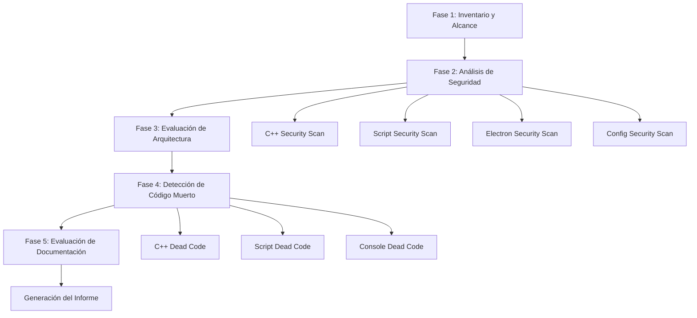

# Design Document: Code Audit

## Overview

Este diseño describe la ejecución sistemática de una auditoría integral del código fuente del proyecto NEVEN. La auditoría cubre cuatro dimensiones (seguridad, arquitectura, código muerto, documentación) a través de múltiples lenguajes (C++17, R, Julia, Python, TypeScript) y componentes (Core, Common, ControlR, ControlJulia, ControlPython, Console, Ribbon, librerías de scripts, configuración).

El proceso de auditoría se estructura como un pipeline de análisis por fases, donde cada fase aplica técnicas específicas a los artefactos del proyecto y produce hallazgos clasificados por severidad. El resultado final es un Informe de Auditoría en español con estructura estandarizada.

### Decisiones de Diseño Clave

1. **Análisis estático como técnica primaria**: La auditoría se basa en análisis estático del código fuente (pattern matching, análisis de dependencias, análisis de flujo de datos) sin requerir ejecución del sistema.
2. **Cobertura por capas**: Cada dimensión de análisis se aplica a cada capa del sistema (C++ nativo → IPC → scripts embebidos → Electron → configuración).
3. **Severidad basada en impacto**: La clasificación de severidad sigue el modelo CVSS simplificado: Crítica (explotación remota/escalación), Alta (compromiso de integridad), Media (degradación de calidad), Baja (deuda técnica).
4. **Informe unificado**: Todos los hallazgos se consolidan en un único documento estructurado con trazabilidad a archivo y línea.

## Architecture

La auditoría se organiza en un pipeline de 5 fases secuenciales:



### Fase 1: Inventario y Alcance

Enumera todos los archivos del proyecto, clasifica por lenguaje/tipo, y establece la línea base de métricas (LOC, archivos, módulos). Identifica exclusiones justificadas (binarios, dependencias de terceros, archivos generados).

### Fase 2: Análisis de Seguridad

Aplica reglas de detección de patrones inseguros específicas por lenguaje:
- **C++**: Buffer overflows, inyección de comandos, credenciales hardcodeadas, handles sin validar, fugas de memoria, bypass de sandbox, validación de Protobuf.
- **R/Julia/Python**: Ejecución de comandos OS, eval con entrada no sanitizada, acceso a filesystem sin restricción, dependencias sin verificación.
- **Electron/TypeScript**: nodeIntegration, contextIsolation, XSS via DOM, IPC sin validación, dependencias vulnerables.
- **Configuración**: Flags de compilación inseguros, secretos en config, permisos excesivos en CI/CD, .gitignore incompleto.

### Fase 3: Evaluación de Arquitectura

Analiza la estructura de dependencias entre módulos, evalúa cohesión y acoplamiento, identifica violaciones de principios SOLID, y evalúa la escalabilidad del diseño IPC.

### Fase 4: Detección de Código Muerto

Identifica funciones no invocadas, archivos no referenciados, bloques comentados, directivas de preprocesador inactivas, variables no leídas, dependencias no utilizadas, y assets huérfanos.

### Fase 5: Evaluación de Documentación

Verifica cobertura de documentación por módulo, consistencia terminológica, actualidad respecto al código, y completitud de documentación de API.

## Components and Interfaces

### Componente: Inventario de Archivos

**Responsabilidad**: Enumerar y clasificar todos los archivos del proyecto.

**Entradas**:
- Árbol de directorios del proyecto
- Reglas de exclusión (binarios, `node_modules/`, `Build/`, archivos generados)

**Salidas**:
- Lista clasificada de archivos por lenguaje: C++ (.cc, .h), R (.R), Julia (.jl), Python (.py), TypeScript (.ts), JavaScript (.js)
- Lista de archivos de configuración: CMakeLists.txt, .json, .yml, .xml, .proto
- Métricas base: total archivos, LOC por lenguaje, LOC por módulo

**Directorios cubiertos**:
| Directorio | Contenido | Lenguajes |
|---|---|---|
| Core/ | NEVEN_Core (XLL) | C++ |
| Common/ | Common.lib | C++ |
| ControlR/ | ControlR.exe | C++ |
| ControlJulia/ | ControlJulia.exe | C++ |
| ControlPython/ | ControlPython.exe | C++ |
| Console/ | REPL Electron | TypeScript, JavaScript |
| Ribbon/ | COM Ribbon DLL | C++ |
| PB/ | Protocol Buffers | .proto, C++ generado |
| tests/ | GTest suite | C++ |
| startup/ | Scripts de inicio | R, Julia, Python |
| libreria/R/ | R4XCL | R |
| libreria/JULIA/ | J4XCL | Julia |
| docs/ | Documentación | Markdown |
| Addin/ | Empaquetado XLL | CMake, XML |
| .github/ | CI/CD | YAML |

### Componente: Analizador de Seguridad C++

**Responsabilidad**: Detectar patrones inseguros en código C++.

**Reglas de detección**:

| Patrón | Severidad | Descripción |
|---|---|---|
| `strcpy`, `sprintf`, `strcat` sin bounds | Alta | Buffer overflow potencial |
| `CreateProcess`, `ShellExecute`, `system` con datos de usuario | Crítica | Inyección de comandos |
| Strings literales con tokens/passwords/rutas sensibles | Crítica | Credenciales hardcodeadas |
| `ReadFile`/`WriteFile` en pipe sin `INVALID_HANDLE_VALUE` check | Alta | Handle inválido |
| `new`/`malloc` sin `delete`/`free` en todas las rutas | Media | Fuga de memoria |
| Sandbox bypass (eval de código arbitrario sin restricción) | Crítica | Bypass de sandbox |
| Protobuf `ParseFromString` sin validación de tamaño/contenido | Alta | Mensaje malformado |

**Archivos objetivo**: `Core/src/*.cc`, `Core/include/*.h`, `Common/*.cc`, `Common/*.h`, `ControlR/src/*.cc`, `ControlJulia/src/*.cc`, `ControlPython/src/*.cc`

### Componente: Analizador de Seguridad de Scripts

**Responsabilidad**: Detectar uso inseguro de funciones peligrosas en R, Julia y Python.

**Reglas por lenguaje**:

| Lenguaje | Funciones peligrosas | Condición de hallazgo |
|---|---|---|
| R | `system`, `system2`, `shell`, `eval` | Parámetros derivados de entrada sin sanitización |
| Julia | `run`, `eval`, `Meta.parse` | Entrada no controlada |
| Python | `exec`, `eval`, `subprocess`, `os.system` | Entrada no sanitizada |

**Verificaciones adicionales**:
- Acceso a filesystem fuera del directorio de trabajo
- Dependencias cargadas sin verificación de versión
- Variables de entorno sensibles expuestas en startup scripts

### Componente: Analizador de Seguridad Electron

**Responsabilidad**: Detectar vulnerabilidades en la Console_App.

**Reglas de detección**:

| Patrón | Severidad | Descripción |
|---|---|---|
| `nodeIntegration: true` | Crítica | Acceso completo a Node desde renderer |
| `contextIsolation: false` | Crítica | Sin aislamiento de contexto |
| `innerHTML` / `document.write` con datos de usuario | Alta | XSS |
| IPC sin validación de origen | Alta | Escalación de privilegios |
| Dependencias npm con CVE conocidos | Variable | Según CVSS |
| APIs privilegiadas expuestas al renderer | Alta | Superficie de ataque ampliada |

**Nota**: El `main.js` actual usa Electron 1.8.2 (2018) que no tiene `contextIsolation` habilitado por defecto — esto es un hallazgo esperado de severidad Crítica.

### Componente: Analizador de Configuración

**Responsabilidad**: Verificar seguridad y consistencia de archivos de configuración.

**Verificaciones**:
- CMakeLists.txt: flags de seguridad MSVC (`/GS`, `/DYNAMICBASE`, `/NXCOMPAT`, `/guard:cf`)
- JSON configs: ausencia de secretos hardcodeados
- GitHub Actions: versiones fijadas de actions, no exposición de secretos en logs, permisos mínimos
- .gitignore: exclusión de Build/, .env, claves privadas, artefactos temporales

### Componente: Evaluador de Arquitectura

**Responsabilidad**: Analizar estructura, acoplamiento y cohesión del sistema.

**Técnicas de análisis**:
1. **Grafo de dependencias**: Construir grafo dirigido de `#include` y dependencias CMake entre módulos
2. **Detección de ciclos**: Identificar dependencias circulares mediante DFS en el grafo
3. **Métricas de acoplamiento**: Contar dependencias entrantes/salientes por módulo
4. **Análisis de cohesión**: Verificar que cada módulo tiene responsabilidad única
5. **Evaluación IPC**: Analizar si el patrón Named Pipe + Protobuf es extensible
6. **Patrones de diseño**: Identificar Singleton, Factory, Observer y evaluar consistencia
7. **Testabilidad**: Verificar abstracción de dependencias externas (Excel, R, Julia)

### Componente: Detector de Código Muerto

**Responsabilidad**: Identificar código no utilizado en todos los lenguajes.

**Técnicas por lenguaje**:

| Lenguaje | Técnica | Objetivo |
|---|---|---|
| C++ | Análisis de referencias cruzadas (grep de símbolos) | Funciones no invocadas |
| C++ | Análisis de CMakeLists.txt | Archivos no compilados |
| C++ | Detección de `#if 0` / bloques comentados | Código inactivo |
| C++ | Tabla de funciones XLL vs exports | Funciones no registradas |
| R | Análisis de `source()` y auto-carga | Funciones/archivos no usados |
| Julia | Análisis de `include()` y exports | Funciones/archivos no usados |
| TypeScript | Análisis de imports desde entry points | Módulos no alcanzables |
| TypeScript | package.json vs imports reales | Dependencias no usadas |

### Componente: Evaluador de Documentación

**Responsabilidad**: Verificar calidad y completitud de la documentación.

**Verificaciones**:
1. Cobertura por módulo: cada módulo principal tiene docs correspondientes
2. API documentation: funciones XLL exportadas documentadas
3. Doxygen: funciones públicas con comentarios Doxygen en headers
4. Consistencia: mismos conceptos usan mismos nombres
5. Actualidad: documentación corresponde al código actual
6. Procedimientos: build/deploy/troubleshooting actualizados
7. Librería R/Julia: cada función exportada con parámetros, retorno y ejemplo

### Componente: Generador de Informe

**Responsabilidad**: Consolidar hallazgos en el formato de informe especificado.

**Estructura del informe**:
1. Resumen Ejecutivo (conteo por severidad/categoría, puntuación 1-10)
2. Metodología (técnicas usadas, alcance, exclusiones)
3. Hallazgos de Seguridad
4. Hallazgos de Arquitectura
5. Hallazgos de Código Muerto
6. Hallazgos de Documentación
7. Fortalezas Identificadas
8. Recomendaciones Priorizadas (por impacto, con referencias a hallazgos)
9. Anexos (lista de archivos analizados, métricas, tabla resumen)

**Formato de cada hallazgo**:
```
ID: [CAT]-[SEV]-[NNN]
Título: [Descripción breve]
Descripción: [Detalle del problema]
Ubicación: [archivo:línea]
Severidad: [Crítica|Alta|Media|Baja]
Categoría: [Seguridad|Arquitectura|Código_Muerto|Documentación]
Recomendación: [Acción correctiva sugerida]
```

## Data Models

### Modelo: Hallazgo (Finding)

```
Finding {
  id: string              // Formato: [CAT]-[SEV]-[NNN] (ej: SEC-CRI-001)
  title: string           // Título descriptivo corto
  description: string     // Descripción detallada del hallazgo
  file_path: string       // Ruta relativa al archivo
  line_number: int?       // Línea específica (opcional)
  severity: enum          // CRITICA | ALTA | MEDIA | BAJA
  category: enum          // SEGURIDAD | ARQUITECTURA | CODIGO_MUERTO | DOCUMENTACION
  recommendation: string  // Acción correctiva sugerida
  is_positive: bool       // true si es fortaleza, false si es debilidad
  related_requirement: string  // Referencia al requerimiento que valida
}
```

### Modelo: Métrica de Módulo (ModuleMetrics)

```
ModuleMetrics {
  module_name: string     // Nombre del módulo (Core, Common, etc.)
  directory: string       // Directorio raíz del módulo
  file_count: int         // Total de archivos analizados
  loc_total: int          // Líneas de código totales
  loc_by_language: map    // LOC desglosado por lenguaje
  findings_count: map     // Hallazgos por severidad
  coverage_percent: float // Porcentaje de archivos cubiertos
}
```

### Modelo: Informe de Auditoría (AuditReport)

```
AuditReport {
  project_name: string           // "NEVEN"
  audit_date: date               // Fecha de ejecución
  auditor: string                // Identificación del auditor
  health_score: float            // Puntuación 1-10
  executive_summary: string      // Resumen ejecutivo
  methodology: string            // Descripción de metodología
  findings: Finding[]            // Lista completa de hallazgos
  strengths: Finding[]           // Hallazgos positivos
  recommendations: Recommendation[]  // Recomendaciones priorizadas
  metrics: ModuleMetrics[]       // Métricas por módulo
  files_analyzed: string[]       // Lista de archivos analizados
  files_excluded: ExcludedFile[] // Archivos excluidos con justificación
}
```

### Modelo: Recomendación (Recommendation)

```
Recommendation {
  priority: int           // Orden de prioridad (1 = más urgente)
  title: string           // Título de la recomendación
  description: string     // Descripción detallada
  impact: enum            // ALTO | MEDIO | BAJO
  effort: enum            // ALTO | MEDIO | BAJO
  related_findings: string[]  // IDs de hallazgos que resuelve
}
```

### Modelo: Archivo Excluido (ExcludedFile)

```
ExcludedFile {
  file_path: string       // Ruta del archivo excluido
  reason: string          // Justificación de exclusión
  category: enum          // BINARIO | GENERADO | TERCEROS | OTRO
}
```

## Correctness Properties

*A property is a characteristic or behavior that should hold true across all valid executions of a system — essentially, a formal statement about what the system should do. Properties serve as the bridge between human-readable specifications and machine-verifiable correctness guarantees.*

### Property 1: Scanner Completeness

*For any* set of directories and file extension patterns specified in the audit scope, every file matching those patterns within those directories SHALL be included in the analysis results.

**Validates: Requirements 1.1, 2.1, 2.2, 2.3, 3.1, 11.1, 11.2**

### Property 2: Pattern Detection Correctness

*For any* source code snippet containing a known insecure pattern (unsafe string functions, system calls with user input, unvalidated pipe handles, DOM injection, disabled security flags), the pattern detector SHALL identify and flag the pattern with the correct severity classification.

**Validates: Requirements 1.2, 1.3, 1.5, 1.6, 2.4, 2.5, 3.3, 9.1, 9.2**

### Property 3: Credential and Secret Detection

*For any* source file or configuration file containing hardcoded credentials, tokens, API keys, or sensitive paths in any supported format (C++ string literals, JSON values, environment variable assignments, R/Julia/Python strings), the detector SHALL identify and flag the secret with Severidad Crítica.

**Validates: Requirements 1.4, 2.6, 9.3**

### Property 4: Dead Symbol Detection

*For any* function or class defined in the codebase that is not referenced (invoked, imported, or included) by any other file in the project, the dead code detector SHALL identify it as unused.

**Validates: Requirements 5.1, 6.1, 6.2, 7.1**

### Property 5: Commented Block Detection

*For any* source file containing a block of consecutive commented lines exceeding the threshold (5 lines for C++, 3 lines for R/Julia), the detector SHALL identify and report the commented block with its location.

**Validates: Requirements 5.2, 6.5**

### Property 6: Orphan File and Module Detection

*For any* source file that is neither referenced by a build system file (CMakeLists.txt), nor included/imported by another source file, nor transitively reachable from a defined entry point, the detector SHALL identify it as an orphan.

**Validates: Requirements 5.4, 6.3, 7.2, 7.3, 7.5**

### Property 7: Finding Model Completeness

*For any* finding generated by the audit system, it SHALL contain all required fields: unique identifier, title, description, file path, severity, category, and recommendation. No field SHALL be empty or null.

**Validates: Requirements 10.3, 10.4, 11.5**

### Property 8: Report Summary Consistency

*For any* generated audit report, the counts in the executive summary (findings by severity and category) SHALL exactly match the actual count of findings in the detailed sections. Recommendations SHALL be ordered by decreasing impact.

**Validates: Requirements 10.5, 10.7**

### Property 9: Report Structure Completeness

*For any* generated audit report, it SHALL contain all required sections in the specified order: Resumen Ejecutivo, Metodología, Hallazgos de Seguridad, Hallazgos de Arquitectura, Hallazgos de Código Muerto, Hallazgos de Documentación, Fortalezas Identificadas, Recomendaciones Priorizadas, Anexos.

**Validates: Requirements 10.2**

### Property 10: Documentation Coverage Detection

*For any* public function exported by the XLL or defined in the R/Julia libraries, if it lacks corresponding documentation (Doxygen comment in header, API docs entry, or function documentation with parameters/return/example), the detector SHALL flag it as undocumented.

**Validates: Requirements 8.2, 8.3, 8.7, 8.8**

### Property 11: File Accounting Invariant

*For any* completed audit execution, the union of files reported as "analyzed" and files reported as "excluded" SHALL equal the total set of files discovered during the inventory phase. No file SHALL appear in both sets or be absent from both.

**Validates: Requirements 11.4**

### Property 12: Circular Dependency Detection

*For any* module dependency graph containing one or more cycles, the architecture evaluator SHALL detect and report every cycle with the complete chain of dependencies involved.

**Validates: Requirements 4.4**

## Error Handling

### Errores de Acceso a Archivos

| Situación | Comportamiento |
|---|---|
| Archivo no legible (permisos) | Registrar en exclusiones con justificación, continuar análisis |
| Archivo binario detectado | Excluir automáticamente, registrar en exclusiones |
| Encoding no reconocido | Intentar UTF-8, luego Latin-1; si falla, excluir con justificación |
| Archivo vacío | Incluir en inventario, no generar hallazgos |

### Errores de Análisis

| Situación | Comportamiento |
|---|---|
| Patrón regex falla en archivo | Log del error, continuar con siguiente patrón |
| Archivo demasiado grande (>1MB) | Analizar en chunks, no excluir |
| Sintaxis inválida en archivo de configuración | Registrar hallazgo de Severidad Baja, continuar |
| Dependencia circular en análisis de imports | Detectar ciclo, registrar, no entrar en loop infinito |

### Errores de Generación de Informe

| Situación | Comportamiento |
|---|---|
| No se encontraron hallazgos en una categoría | Incluir sección con nota "No se identificaron hallazgos" |
| Hallazgo sin ubicación precisa (línea) | Usar solo ruta de archivo, campo línea como N/A |
| Métricas incalculables para un módulo | Registrar como "no disponible" con justificación |

## Testing Strategy

### Enfoque General

La auditoría de código es fundamentalmente un proceso de análisis estático que produce un informe estructurado. La estrategia de testing se enfoca en verificar:

1. **Completitud del análisis** — que todos los archivos y patrones son cubiertos
2. **Correctitud de la detección** — que los patrones inseguros/muertos son correctamente identificados
3. **Integridad del informe** — que el informe generado cumple con la estructura y contenido requeridos

### Unit Tests (Example-Based)

- Verificar detección de patrones específicos conocidos en el código NEVEN actual (nodeIntegration en main.js, Electron 1.8.2 desactualizado, etc.)
- Verificar que archivos específicos conocidos como excluibles (binarios, generados) son correctamente excluidos
- Verificar que la estructura del informe contiene todas las secciones requeridas
- Verificar que hallazgos específicos del proyecto (Python deprecado, dependencias npm antiguas) son detectados

### Property-Based Tests

La librería de PBT recomendada es **rapid** (C++ header-only) para los componentes de detección implementados en C++, o **fast-check** si se implementan herramientas de análisis en TypeScript/JavaScript.

Configuración: mínimo 100 iteraciones por propiedad.

Cada test de propiedad debe estar etiquetado con:
**Feature: code-audit, Property {number}: {property_text}**

Las propiedades 1-12 definidas arriba se implementan como tests de propiedad que generan:
- Estructuras de directorios aleatorias con archivos de diversos tipos
- Snippets de código con y sin patrones inseguros
- Grafos de dependencias con y sin ciclos
- Modelos de hallazgos con campos variados
- Conjuntos de archivos para verificar la invariante de contabilidad

### Integration Tests

- Ejecutar el pipeline completo contra un subconjunto representativo del proyecto NEVEN
- Verificar que el informe generado es parseable y contiene las secciones esperadas
- Verificar que hallazgos conocidos (Electron desactualizado, falta de contextIsolation) aparecen en el informe

### Smoke Tests

- Verificar que el auditor puede iniciar y completar sin errores en el proyecto NEVEN completo
- Verificar que el informe se genera en español
- Verificar que las métricas de cobertura son razonables (>90% de archivos analizados)

