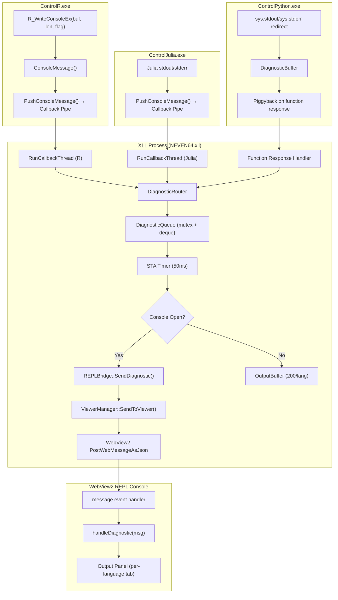

# Design Document: Console Diagnostic Stream

## Overview

This design adds a **diagnostic message stream** that routes stdout/stderr output from R, Julia, and Python cell executions to the existing WebView2 REPL console. Currently, when a user calls `=R.MR_Lineal(...)` from a cell, any warnings, package-loading messages, or partial errors emitted by R are silently discarded because there is no visible destination. This feature turns the REPL console into a diagnostic panel that captures and displays these messages in real time.

The design leverages the existing callback pipe infrastructure (`RunCallbackThread` in `language_service.cc`) and the protobuf `CallResponse.kConsole` operation case, which is already used by ControlR and ControlJulia to send console messages. The key insight is that `kConsole` messages on the callback pipe currently flow through `HandleCallback()` (the COM automation path), but they should be intercepted earlier and routed directly to the REPL console via `REPLBridge`.

### Key Design Decisions

1. **Intercept at `operation_case()` level**: In `RunCallbackThread`, check `call.operation_case() == kConsole` *before* calling `engine->HandleCallback()`. Console messages are fire-and-forget (no response needed), so they bypass the COM marshaling path entirely.

2. **Python uses response-piggybacked delivery**: Since ControlPython's callback pipe is disabled (timing bug), Python diagnostic messages are captured via `sys.stdout`/`sys.stderr` redirection in `startup.py`, buffered in-process, and delivered as a new `console_output` repeated field in the protobuf response when a cell execution completes.

3. **Thread-safe queue for STA delivery**: A `DiagnosticQueue` (mutex + `std::deque`) transfers messages from `RunCallbackThread` (one per language) to the STA thread where `PostWebMessageAsJson` is called. The STA thread drains the queue on a 50ms timer.

4. **Output buffer for offline console**: A per-language circular buffer (200 messages each) stores diagnostics when the console is closed, delivering them on console open.

5. **New `"diagnostic"` action in JS protocol**: Extends the existing `repl-result`/`repl-status` protocol with a `"diagnostic"` action that carries `language`, `type`, `text`, and `timestamp` fields.

## Architecture



### Data Flow — R/Julia (Real-time via Callback Pipe)

1. R calls `R_WriteConsoleEx("Warning: NAs introduced", 26, 1)` during cell execution
2. ControlR's `ConsoleMessage()` wraps it in a `CallResponse` with `console.err` set
3. `PushConsoleMessage()` writes the framed protobuf to the callback pipe
4. XLL's `RunCallbackThread` reads the message, checks `operation_case() == kConsole`
5. `DiagnosticRouter::Route()` extracts text/err, constructs a `DiagnosticMessage`, enqueues it
6. STA timer fires, drains queue, calls `REPLBridge::SendDiagnostic()` for each message
7. `SendDiagnostic()` builds JSON `{ action: "diagnostic", language: "R", type: "warning", text: "...", timestamp: 1234567890 }` and calls `ViewerManager::SendToViewer()`
8. JavaScript receives the message and appends it to the R output panel

### Data Flow — Python (Piggybacked on Response)

1. Python function prints `"Loading model..."` via `print()` during cell execution
2. Redirected `sys.stdout` captures the text in `DiagnosticBuffer`
3. When the function returns, ControlPython appends buffer contents to the response's `console_output` field
4. XLL receives the response, extracts `console_output`, routes each line through `DiagnosticRouter`
5. Same delivery path as R/Julia from step 6 onward

## Components and Interfaces

### 1. DiagnosticRouter (New — `Common/DiagnosticRouter.h/.cc`)

Central routing component that receives console messages from multiple sources and delivers them to the REPL console.

```cpp
namespace rj2xcl {

struct DiagnosticMessage {
    std::string language;    // "R", "Julia", "Python"
    std::string type;        // "output" or "warning"
    std::string text;        // message content
    int64_t timestamp;       // milliseconds since epoch
};

class DiagnosticRouter {
public:
    static DiagnosticRouter& Instance();

    /// Route a console message from a callback thread. Thread-safe.
    /// Called from RunCallbackThread when operation_case == kConsole.
    void Route(const std::string& language,
               const RJ2XCLBuffers::Console& console_msg);

    /// Route Python diagnostic messages extracted from a function response.
    /// Called from the pipe read thread after receiving a Python response.
    void RoutePythonDiagnostics(const std::string& console_output);

    /// Drain queued messages and deliver to WebView2.
    /// Called from STA timer callback.
    void DeliverPending();

    /// Deliver buffered messages when console opens.
    /// Called from REPLManager::ShowConsole().
    void FlushBufferToConsole();

    /// Set/clear the diagnostics-enabled flag (UI toggle).
    void SetEnabled(bool enabled);
    bool IsEnabled() const;

    /// Shutdown and release resources.
    void Shutdown();

private:
    DiagnosticRouter();

    /// Thread-safe queue for pending messages
    std::mutex queue_mutex_;
    std::deque<DiagnosticMessage> pending_queue_;

    /// Per-language output buffer for when console is closed
    struct LanguageBuffer {
        std::deque<DiagnosticMessage> messages;
        static constexpr size_t MAX_MESSAGES = 200;

        void Push(const DiagnosticMessage& msg) {
            if (messages.size() >= MAX_MESSAGES) messages.pop_front();
            messages.push_back(msg);
        }
        void Clear() { messages.clear(); }
    };

    std::mutex buffer_mutex_;
    std::unordered_map<std::string, LanguageBuffer> buffers_;

    bool enabled_ = true;
};

} // namespace rj2xcl
```

### 2. Modified RunCallbackThread (language_service.cc)

The callback thread intercepts `kConsole` messages before they reach `HandleCallback`:

```cpp
// In RunCallbackThread, after Unframe(call, ...):

if (call.operation_case() == RJ2XCLBuffers::CallResponse::OperationCase::kConsole) {
    // Fire-and-forget: route to diagnostic stream, no response needed
    DiagnosticRouter::Instance().Route(
        language_descriptor_.name_, call.console());
    // Do NOT call engine->HandleCallback() for console messages
    // Do NOT write a response back (no call.wait() check needed)
    // Restart read immediately
    ResetEvent(io.hEvent);
    ReadFile(callback_pipe_handle, buffer.data(), (DWORD)buffer.size(), 0, &io);
    continue;  // or equivalent control flow
}

// Existing path for kFunctionCall, kFunctionList, etc.
engine->HandleCallback(language_descriptor_.name_);
```

### 3. REPLBridge Extensions (Common/REPLBridge.h/.cc)

New static method for sending diagnostic messages:

```cpp
class REPLBridge {
public:
    // ... existing methods ...

    /// Send a diagnostic message to the REPL console.
    /// Called from STA thread (via DiagnosticRouter::DeliverPending).
    static void SendDiagnostic(
        const std::string& viewer_id,
        const std::string& language,
        const std::string& type,
        const std::string& text,
        int64_t timestamp);

    /// Send multiple buffered diagnostics at once (batch delivery on console open).
    static void SendDiagnosticBatch(
        const std::string& viewer_id,
        const std::vector<DiagnosticMessage>& messages);
};
```

### 4. Python DiagnosticBuffer (ControlPython — startup.py modification)

Python captures stdout/stderr during cell execution and delivers with the response:

```python
# In startup.py — diagnostic capture wrapper
import sys
import io

class _DiagnosticCapture:
    """Captures stdout/stderr during cell execution for diagnostic delivery."""
    MAX_BUFFER = 64 * 1024  # 64 KB

    def __init__(self):
        self._buffer = io.StringIO()
        self._truncated = False

    def write(self, text):
        if self._buffer.tell() >= self.MAX_BUFFER:
            if not self._truncated:
                self._buffer.write("\n[...truncated...]")
                self._truncated = True
            return
        self._buffer.write(text)

    def flush(self):
        pass

    def get_and_clear(self):
        result = self._buffer.getvalue()
        self._buffer = io.StringIO()
        self._truncated = False
        return result

_diag_stdout = _DiagnosticCapture()
_diag_stderr = _DiagnosticCapture()
```

### 5. Protobuf Extension (variable.proto)

Add a field to `CallResponse` for Python diagnostic piggybacking:

```protobuf
message CallResponse {
    // ... existing fields ...

    // Diagnostic output captured during execution (Python only).
    // Contains stdout/stderr text accumulated during a cell function call.
    string console_output = 11;       // stdout text
    string console_error_output = 12; // stderr text
}
```

### 6. STA Timer for Queue Draining

A Windows timer on the STA thread fires every 50ms to drain the diagnostic queue:

```cpp
// In ViewerManager's STA thread setup:
SetTimer(NULL, DIAGNOSTIC_TIMER_ID, 50, [](HWND, UINT, UINT_PTR, DWORD) {
    DiagnosticRouter::Instance().DeliverPending();
});
```

### 7. JavaScript Diagnostic Handler (repl.html)

Extension to the existing message handler:

```javascript
// In the message event listener switch:
case 'diagnostic':
    handleDiagnostic(msg);
    break;
case 'diagnostic-batch':
    msg.messages.forEach(m => handleDiagnostic(m));
    break;

function handleDiagnostic(msg) {
    const lang = msg.language;
    if (!lang || !state.tabs[lang]) return;

    // Check if diagnostics are enabled
    if (!state.diagnosticsEnabled) {
        // Buffer for later display
        state.tabs[lang].bufferedDiagnostics.push(msg);
        return;
    }

    // Check severity filter
    if (!state.filters[msg.type]) return;

    // Format and display
    const prefix = `[${lang}]`;
    const cssClass = msg.type === 'warning' ? 'diagnostic warning' : 'diagnostic output';
    appendOutput(lang, cssClass, `${prefix} ${msg.text}`);

    // Update badge if not active tab
    if (lang !== state.activeTab) {
        state.tabs[lang].unreadCount++;
        updateTabBadge(lang);
    }
}
```

## Data Models

### DiagnosticMessage (C++ struct)

| Field | Type | Description |
|-------|------|-------------|
| `language` | `std::string` | Source language: "R", "Julia", "Python" |
| `type` | `std::string` | "output" (stdout) or "warning" (stderr) |
| `text` | `std::string` | Message content (UTF-8) |
| `timestamp` | `int64_t` | Milliseconds since epoch (from `GetTickCount64` or `chrono`) |

### JSON Protocol — `"diagnostic"` action

```json
{
    "action": "diagnostic",
    "language": "R",
    "type": "warning",
    "text": "Warning: NAs introduced by coercion",
    "timestamp": 1719849600000
}
```

### JSON Protocol — `"diagnostic-batch"` action (buffer flush)

```json
{
    "action": "diagnostic-batch",
    "messages": [
        { "language": "R", "type": "output", "text": "Loading MASS...", "timestamp": 1719849599000 },
        { "language": "R", "type": "warning", "text": "Warning: ...", "timestamp": 1719849599500 }
    ]
}
```

### OutputBuffer State (per language)

| Property | Value |
|----------|-------|
| Max capacity | 200 messages per language |
| Eviction policy | FIFO (oldest discarded first) |
| Persistence | In-memory only (session-scoped) |
| Thread safety | Protected by `buffer_mutex_` |

### JavaScript State Extensions

```javascript
// Added to existing state object:
state.diagnosticsEnabled = true;       // Global toggle
state.filters = { output: true, warning: true };  // Per-type filters
state.tabs[lang].bufferedDiagnostics = [];        // Hidden messages
state.tabs[lang].unreadCount = 0;                 // Badge counter
```

### Protobuf Extensions

| Message | Field | Number | Type | Purpose |
|---------|-------|--------|------|---------|
| `CallResponse` | `console_output` | 11 | `string` | Python stdout captured during cell exec |
| `CallResponse` | `console_error_output` | 12 | `string` | Python stderr captured during cell exec |


## Correctness Properties

*A property is a characteristic or behavior that should hold true across all valid executions of a system — essentially, a formal statement about what the system should do. Properties serve as the bridge between human-readable specifications and machine-verifiable correctness guarantees.*

### Property 1: Console message type mapping

*For any* language (R, Julia, Python) and *for any* protobuf `Console` message, if the `text` field is set the DiagnosticRouter SHALL produce a DiagnosticMessage with `type = "output"`, and if the `err` field is set it SHALL produce a DiagnosticMessage with `type = "warning"`, with the message text preserved exactly.

**Validates: Requirements 1.1, 1.2, 2.1, 2.2**

### Property 2: Operation case dispatch correctness

*For any* `CallResponse` message received on the callback pipe, if `operation_case() == kConsole` then the message SHALL be routed to `DiagnosticRouter::Route()` and SHALL NOT reach `HandleCallback()`; if `operation_case() == kFunctionCall` then the message SHALL be routed to `HandleCallback()` and SHALL NOT reach `DiagnosticRouter::Route()`.

**Validates: Requirements 1.3, 6.1, 6.2**

### Property 3: Queue ordering preservation

*For any* sequence of N diagnostic messages enqueued (from one or more languages), when the queue is drained, the messages SHALL be delivered in exactly the same order they were enqueued (FIFO).

**Validates: Requirements 1.5**

### Property 4: Buffer capacity with FIFO eviction

*For any* language and *for any* sequence of N messages buffered when the console is closed, the OutputBuffer SHALL contain exactly `min(N, 200)` messages, and those messages SHALL be the most recent N messages (or all N if N ≤ 200), in their original chronological order.

**Validates: Requirements 5.3, 7.1, 7.2**

### Property 5: Buffer flush delivers all and clears

*For any* non-empty OutputBuffer state, calling `FlushBufferToConsole()` SHALL deliver all buffered messages in chronological order and SHALL leave the buffer empty.

**Validates: Requirements 5.4, 7.3**

### Property 6: Python capture buffer accumulation

*For any* sequence of strings written to the Python DiagnosticCapture, `get_and_clear()` SHALL return the concatenation of all written strings in order, and after calling `get_and_clear()` the buffer SHALL be empty.

**Validates: Requirements 3.1, 3.2**

### Property 7: Python buffer truncation at 64KB

*For any* sequence of strings whose total length exceeds 64 KB written to the Python DiagnosticCapture, the buffer content SHALL not exceed 64 KB plus the truncation indicator length, and SHALL end with `"[...truncated...]"`.

**Validates: Requirements 3.5**

### Property 8: Python response diagnostic routing

*For any* non-empty `console_output` string in a Python function response, `RoutePythonDiagnostics()` SHALL produce one or more DiagnosticMessages with `language = "Python"`, where stdout content maps to `type = "output"` and stderr content maps to `type = "warning"`.

**Validates: Requirements 3.4**

### Property 9: Diagnostic JSON serialization round-trip

*For any* valid DiagnosticMessage (with non-empty language, type, text, and positive timestamp), serializing it to the JSON protocol format and parsing it back SHALL produce an equivalent message with all fields preserved.

**Validates: Requirements 5.1**

### Property 10: Thread-safe concurrent enqueue

*For any* set of M messages pushed concurrently from N threads (N ≥ 2), after all threads complete and the queue is drained, the total number of messages delivered SHALL equal M (no messages lost), and each message SHALL appear exactly once.

**Validates: Requirements 9.1, 9.2, 9.3**

### Property 11: Tab routing correctness

*For any* diagnostic message with a given `language` field, the JavaScript handler SHALL append the message to the output panel corresponding to that language and to no other panel.

**Validates: Requirements 4.5**

### Property 12: Badge increment on cross-tab message

*For any* diagnostic message where `message.language ≠ state.activeTab`, the unread count for `message.language` SHALL increment by 1. When `message.language == state.activeTab`, the unread count SHALL remain unchanged.

**Validates: Requirements 4.6**

### Property 13: Toggle disable buffers without display

*For any* diagnostic message received while `diagnosticsEnabled == false`, the message SHALL be added to `bufferedDiagnostics` for that language and SHALL NOT be appended to the visible output panel.

**Validates: Requirements 8.2**

### Property 14: Toggle re-enable flushes buffered

*For any* non-empty `bufferedDiagnostics` array when the diagnostics toggle transitions from disabled to enabled, all buffered messages SHALL be appended to the output panel in order, and `bufferedDiagnostics` SHALL be cleared.

**Validates: Requirements 8.3**

### Property 15: Filter visibility

*For any* set of diagnostic messages and *for any* filter state (`{ output: bool, warning: bool }`), the visible messages in the output panel SHALL be exactly those messages whose `type` matches an enabled filter. Toggling a filter SHALL immediately update the visible set without page reload.

**Validates: Requirements 10.2, 10.3, 10.5**

### Property 16: Display prefix formatting

*For any* diagnostic message with language L and text T, the rendered output line SHALL contain the prefix `[L]` followed by the text T.

**Validates: Requirements 4.1**

## Error Handling

### Malformed Console Messages (Requirement 6.4)

When `DiagnosticRouter::Route()` receives a `Console` protobuf where both `text` and `err` are empty (and no other oneof field is set that maps to a diagnostic), the router discards the message silently and logs a warning via `RJ2XCL_LOG_WARN`. No message is enqueued, no error propagates.

### Callback Pipe Disconnection

If the callback pipe breaks during message read (ERROR_BROKEN_PIPE), the existing reconnection logic in `RunCallbackThread` handles it. Diagnostic messages in-flight are lost (acceptable — they are best-effort). The `DiagnosticRouter` does not need special handling for pipe failures.

### Console Not Available

When `ViewerManager::SendToViewer()` fails (viewer closed between queue drain and delivery), the message is re-buffered in the OutputBuffer rather than discarded. This handles the race condition where the console closes between the timer firing and the actual delivery.

### Python Buffer Overflow

The `_DiagnosticCapture` class enforces a 64 KB hard limit. Once exceeded, further writes are silently dropped and a single `[...truncated...]` marker is appended. This prevents runaway print loops from consuming unbounded memory in the ControlPython process.

### Thread Contention

The `queue_mutex_` is held only for the duration of push/pop operations (microseconds). The STA timer drains the queue by swapping the deque under the lock (O(1) swap), then processes messages outside the lock. This ensures `RunCallbackThread` is never blocked waiting for WebView2 delivery.

### Invalid Language in Diagnostic Message

If a diagnostic message arrives with an unrecognized language string (not "R", "Julia", or "Python"), the JavaScript handler logs a warning and discards the message. The C++ side does not validate language strings — it trusts the `language_descriptor_.name_` value from `LanguageService`.

## Testing Strategy

### Property-Based Tests (C++ — Google Test + RapidCheck)

The project uses Google Test v1.14.0. For property-based testing, we will use **RapidCheck** (header-only, integrates with GTest via `rc::gtest`). Each property test runs a minimum of **100 iterations**.

**Tag format:** `Feature: console-diagnostic-stream, Property N: <property_text>`

Tests target the pure logic components:

1. **DiagnosticRouter routing logic** (Properties 1, 2, 8)
   - Generate random `Console` protobuf messages, verify type mapping
   - Generate random `CallResponse` messages, verify dispatch decision
   - Generate random multi-line strings, verify Python routing

2. **DiagnosticQueue ordering and thread safety** (Properties 3, 10)
   - Generate random message sequences, verify FIFO ordering
   - Concurrent push from multiple threads, verify no message loss

3. **OutputBuffer capacity and eviction** (Properties 4, 5)
   - Generate sequences of varying length, verify capacity invariant
   - Verify flush delivers all and clears

4. **Python DiagnosticCapture** (Properties 6, 7)
   - Generate random string sequences, verify accumulation
   - Generate strings exceeding 64KB, verify truncation

5. **JSON serialization round-trip** (Property 9)
   - Generate random DiagnosticMessage structs, serialize/deserialize, verify equality

### Property-Based Tests (JavaScript — fast-check)

For the JavaScript logic in `repl.html`, extract testable functions into a module and test with **fast-check**:

6. **Tab routing** (Property 11) — verify messages go to correct panel
7. **Badge logic** (Property 12) — verify increment on cross-tab
8. **Toggle buffer/flush** (Properties 13, 14) — verify buffer and flush behavior
9. **Filter visibility** (Property 15) — verify filter logic
10. **Prefix formatting** (Property 16) — verify [Language] prefix

### Unit Tests (Example-Based)

- Malformed message handling (empty Console, edge case)
- Default state values (toggle enabled, filters all-on)
- Console close/reopen buffer persistence
- CSS class assignment for warning vs output types

### Integration Tests

- End-to-end: R cell execution → warning appears in console (1-2 examples)
- Python cell execution → stdout appears after response (1-2 examples)
- Timing: message delivery within 100ms of Route() call
- Coexistence: diagnostic and repl-result messages interleaved correctly
- Callback pipe reconnection preserves diagnostic routing

### Test Configuration

```
Property tests: minimum 100 iterations per property
C++ framework: Google Test + RapidCheck (FetchContent)
JS framework: fast-check + Jest (or Vitest)
Tag format: Feature: console-diagnostic-stream, Property {N}: {title}
```
