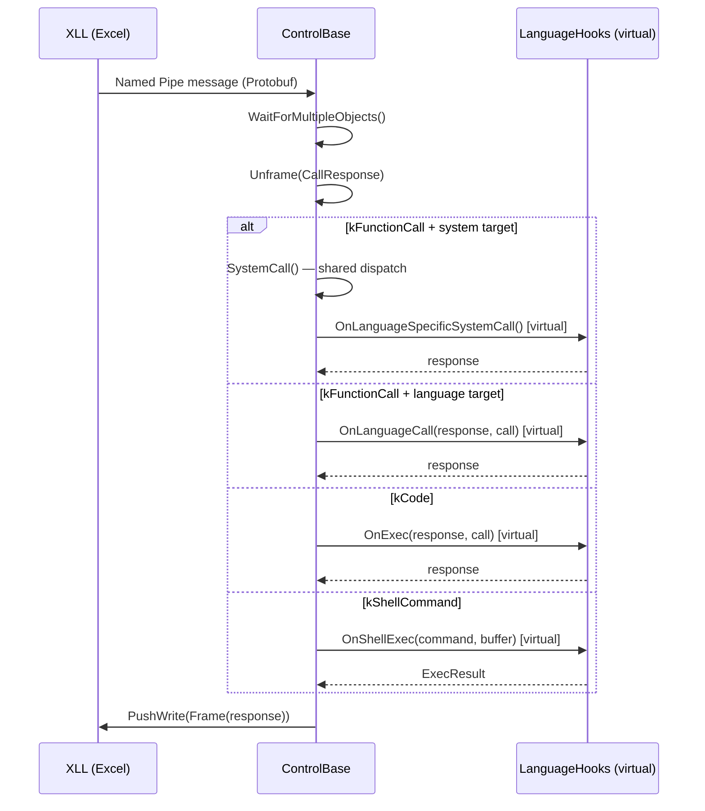
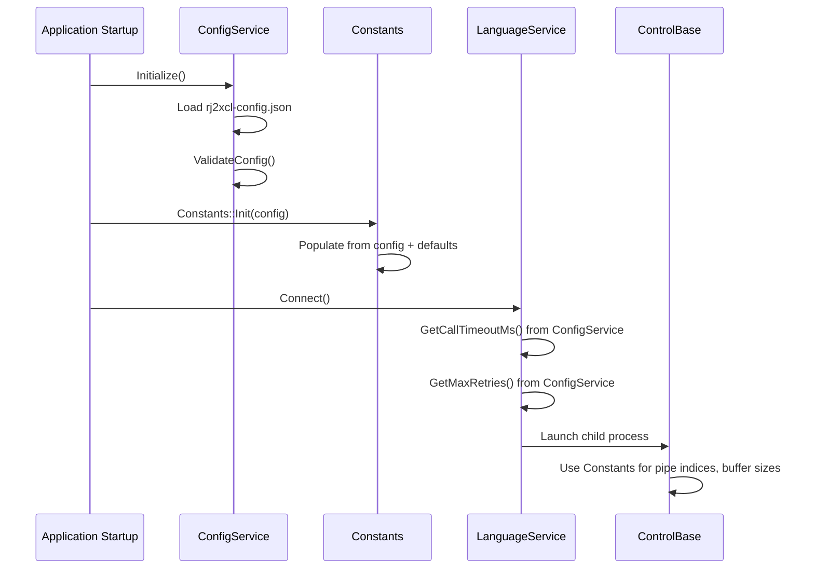

# Design Document: Maintainability Improvements

## Overview

RJ2XCL is a C++17 Excel add-in (XLL) that integrates R, Julia, and Python with Microsoft Excel via process isolation (Named Pipes + Protobuf). The project currently scores 5.5/10 on Maintainability in an objective evaluation. This design targets raising it to 8/10 by addressing five concrete areas: (1) extracting a shared base for the three ControlX processes to eliminate ~400 lines of duplicated code per process, (2) centralizing scattered constants and configuration, (3) adding inline documentation to key functions, (4) removing dead code and disabled features, and (5) introducing clean interfaces between architectural layers.

The approach is conservative — no new features, no protocol changes, no behavioral changes. Every refactoring must preserve the existing 165-test suite at 100% pass rate. The design prioritizes mechanical, low-risk transformations that yield measurable improvements in code metrics (duplication ratio, comment density, coupling fan-out).

## Architecture

### Current State

The current architecture has three independent ControlX executables that each implement the same pipe management, message dispatch, stdio forwarding, and management thread patterns from scratch.

```mermaid
graph TD
    subgraph "XLL Process (Excel)"
        XLL[rj2xcl.xll]
        LS[LanguageService]
        LM[LanguageManager]
        FW[FileWatchService]
        CB[CallbackDispatcher]
        CS[ConfigService]
    end

    subgraph "ControlR.exe"
        CR_MAIN[main / InputStreamRead]
        CR_MGMT[ManagementThread]
        CR_SYS[SystemCall]
        CR_PIPE[Pipe helpers]
        CR_RINTF[R Interface]
    end

    subgraph "ControlJulia.exe"
        CJ_MAIN[main / pipe_loop]
        CJ_MGMT[ManagementThread]
        CJ_STDIO[StdioThread]
        CJ_SYS[SystemCall]
        CJ_PIPE[Pipe helpers]
        CJ_JINTF[Julia Interface]
    end

    subgraph "ControlPython.exe"
        CP_MAIN[main / pipe_loop]
        CP_MGMT[ManagementThread]
        CP_STDIO[StdioThread]
        CP_SYS[SystemCall]
        CP_PIPE[Pipe helpers]
        CP_PINTF[Python Interface]
    end

    XLL --> LS
    LS --> LM
    XLL --> FW
    XLL --> CB
    XLL --> CS

    LS -.->|Named Pipe| CR_MAIN
    LS -.->|Named Pipe| CJ_MAIN
    LS -.->|Named Pipe| CP_MAIN

    style CR_SYS fill:#f96,stroke:#333
    style CJ_SYS fill:#f96,stroke:#333
    style CP_SYS fill:#f96,stroke:#333
    style CR_PIPE fill:#f96,stroke:#333
    style CJ_PIPE fill:#f96,stroke:#333
    style CP_PIPE fill:#f96,stroke:#333
    style CR_MGMT fill:#f96,stroke:#333
    style CJ_MGMT fill:#f96,stroke:#333
    style CP_MGMT fill:#f96,stroke:#333


*Orange nodes = duplicated code across all three processes*

### Target State

After refactoring, the shared pipe/message/thread infrastructure moves into a `ControlBase` class in `Common/`, and each ControlX process only implements its language-specific hooks.

```mermaid
graph TD
    subgraph "XLL Process (Excel)"
        XLL[rj2xcl.xll]
        LS[LanguageService]
        LM[LanguageManager]
        FW[FileWatchService]
        CB[CallbackDispatcher]
        CS[ConfigService]
        CONST[Constants — centralized]
    end

    subgraph "Common Library"
        BASE[ControlBase]
        PIPE_H[Pipe helpers]
        MGMT_T[ManagementThread]
        STDIO_T[StdioThread]
        PLOOP[PipeLoop]
        SYSC[SystemCall dispatch]
        CLOG[ChildProcessLog]
    end

    subgraph "ControlR.exe"
        CR[ControlR : ControlBase]
        CR_RINTF[R Interface]
    end

    subgraph "ControlJulia.exe"
        CJ[ControlJulia : ControlBase]
        CJ_JINTF[Julia Interface]
    end

    subgraph "ControlPython.exe"
        CP[ControlPython : ControlBase]
        CP_PINTF[Python Interface]
    end

    XLL --> LS
    LS --> LM
    XLL --> FW
    XLL --> CB
    XLL --> CS
    CS --> CONST

    CR --> BASE
    CJ --> BASE
    CP --> BASE

    BASE --> PIPE_H
    BASE --> MGMT_T
    BASE --> STDIO_T
    BASE --> PLOOP
    BASE --> SYSC
    BASE --> CLOG

    CR --> CR_RINTF
    CJ --> CJ_JINTF
    CP --> CP_PINTF

    LS -.->|Named Pipe| CR
    LS -.->|Named Pipe| CJ
    LS -.->|Named Pipe| CP

    style BASE fill:#6f6,stroke:#333
    style CONST fill:#6f6,stroke:#333
    style CLOG fill:#6f6,stroke:#333
```

## Sequence Diagrams

### Main Pipe Loop (After Refactoring)



### Configuration Centralization Flow



## Components and Interfaces

### Component 1: ControlBase (New — Common/)

**Purpose**: Abstract base class that encapsulates the shared pipe management, message dispatch, management thread, stdio thread, and console buffering logic currently duplicated across ControlR, ControlJulia, and ControlPython.

**Interface**:
```cpp
// Common/ControlBase.h
#pragma once

#include <string>
#include <vector>
#include <deque>
#include <atomic>
#include "pipe.h"
#include "variable.pb.h"
#include "message_utilities.h"
#include "process_exit_codes.h"
#include "child_log.h"

namespace rj2xcl {

/**
 * @brief Result of a shell exec operation.
 * Shared across all language backends.
 */
enum class ExecResult { Complete, Incomplete };

/**
 * @brief Abstract base for language service child processes.
 *
 * Encapsulates the pipe loop, management thread, stdio forwarding,
 * console buffering, and system call dispatch that are common to
 * ControlR, ControlJulia, and ControlPython.
 *
 * Subclasses implement only the language-specific hooks:
 *   - OnInit(), OnShutdown()
 *   - OnLanguageCall(), OnExec(), OnShellExec()
 *   - OnBreak()
 *   - GetDefaultPrompt(), GetContinuationPrompt()
 */
class ControlBase {
public:
    virtual ~ControlBase() = default;

    /**
     * @brief Main entry point — parses args, initializes, runs pipe loop.
     * @param argc Argument count from main().
     * @param argv Argument vector from main().
     * @return Process exit code.
     */
    int Run(int argc, char** argv);

protected:
    // ─── Language-Specific Hooks (pure virtual) ─────────────────────

    /** @brief Initialize the language runtime (called after pipes are set up). */
    virtual void OnInit() = 0;

    /** @brief Shut down the language runtime cleanly. */
    virtual void OnShutdown() = 0;

    /** @brief Handle a language-targeted function call. */
    virtual void OnLanguageCall(
        RJ2XCLBuffers::CallResponse& response,
        const RJ2XCLBuffers::CallResponse& call) = 0;

    /** @brief Execute code lines. */
    virtual void OnExec(
        RJ2XCLBuffers::CallResponse& response,
        const RJ2XCLBuffers::CallResponse& call) = 0;

    /** @brief Execute a shell/REPL command. */
    virtual ExecResult OnShellExec(
        const std::string& command,
        std::string& shell_buffer) = 0;

    /** @brief Handle user break/interrupt signal. */
    virtual void OnBreak() = 0;

    /** @brief Return the language tag (e.g., "Python::3.12.10"). */
    virtual std::string GetLanguageTag() const = 0;

    /** @brief Return the default REPL prompt (e.g., ">>> ", "> "). */
    virtual const char* GetDefaultPrompt() const = 0;

    /** @brief Return the continuation prompt (e.g., "... ", "+ "). */
    virtual const char* GetContinuationPrompt() const = 0;

    /** @brief Handle language-specific system calls not covered by base. */
    virtual bool OnLanguageSpecificSystemCall(
        RJ2XCLBuffers::CallResponse& response,
        const RJ2XCLBuffers::CallResponse& call,
        int pipe_index) { return false; }

    /** @brief Parse language-specific command-line arguments. */
    virtual void OnParseArgs(int argc, char** argv) {}

    /** @brief Called to list script functions. */
    virtual void OnListFunctions(
        RJ2XCLBuffers::CallResponse& response,
        const RJ2XCLBuffers::CallResponse& call) = 0;

    /** @brief Called to read a source file into the language runtime. */
    virtual bool OnReadSourceFile(
        const std::string& file, bool notify) = 0;

    // ─── Shared Infrastructure (available to subclasses) ────────────

    /** @brief Push a framed message to the console client or buffer. */
    void PushConsoleMessage(google::protobuf::Message& message);

    /** @brief Send a console prompt. */
    void ConsolePrompt(const char* prompt, uint32_t id);

    /** @brief Access the pipe name. */
    const std::string& pipename() const { return pipename_; }

    /** @brief Perform a callback to the XLL via the callback pipe. */
    bool Callback(
        const RJ2XCLBuffers::CallResponse& call,
        RJ2XCLBuffers::CallResponse& response);

private:
    // ─── Shared Implementation ──────────────────────────────────────

    void PipeLoop();
    bool SystemCall(
        RJ2XCLBuffers::CallResponse& response,
        const RJ2XCLBuffers::CallResponse& call,
        int pipe_index);
    void NextPipeInstance(bool block, std::string& name);
    void CloseClient(int index);
    void QueueConsoleWrites();
    void InitLog(const std::string& process_name);

    static unsigned __stdcall ManagementThreadFunction(void* data);
    static unsigned __stdcall StdioThreadFunction(void* data);
    static void TruncateBuffer(std::string& buffer, uint32_t target = 8192);

    // ─── State ──────────────────────────────────────────────────────

    std::string pipename_;
    std::string language_tag_;
    std::vector<HANDLE> handles_;
    std::vector<Pipe*> pipes_;
    std::vector<std::string> console_buffer_;
    int console_client_ = -1;
    Pipe stdout_pipe_, stderr_pipe_;
    std::atomic<bool> user_break_flag_{false};
};

} // namespace rj2xcl
```

**Responsibilities**:
- Pipe lifecycle management (create, connect, read, write, close)
- Message framing/unframing via Protobuf
- Management thread for break signals
- Stdio thread for stdout/stderr forwarding
- Console client buffering
- System call dispatch (get-language, read-source-file, list-functions, shutdown, console, close)
- Callback pipe communication with XLL

### Component 2: Constants (New — Common/)

**Purpose**: Single source of truth for all compile-time and runtime constants currently scattered across headers, source files, and macros.

**Interface**:
```cpp
// Common/Constants.h
#pragma once

#include <cstdint>
#include <string>

namespace rj2xcl {

/**
 * @brief Centralized constants for the RJ2XCL system.
 *
 * Replaces scattered #define macros and magic numbers across:
 *   - pipe.h (DEFAULT_BUFFER_SIZE, MAX_PIPE_COUNT)
 *   - controlr.h (CALLBACK_INDEX, PRIMARY_CLIENT_INDEX)
 *   - control_python.cc (kCallbackIndex, kPrimaryClientIndex, kMaxPipeCount)
 *   - file_change_watcher.h (FILE_WATCH_LOOP_DEBOUNCE_TIMEOUT, etc.)
 *   - language_service.h (PIPE_BUFFER_SIZE)
 */
namespace Constants {

    // ─── Pipe Configuration ─────────────────────────────────────────
    /** Default buffer size for Named Pipe read/write operations (8 KB). */
    inline constexpr uint32_t kPipeBufferSize = 8 * 1024;

    /** Maximum concurrent pipe connections per language process. */
    inline constexpr int kMaxPipeCount = 4;

    /** Pipe index for the callback channel (XLL → ControlX). */
    inline constexpr int kCallbackPipeIndex = 0;

    /** Pipe index for the primary client connection. */
    inline constexpr int kPrimaryClientPipeIndex = 1;

    // ─── Timeouts ───────────────────────────────────────────────────
    /** Default call timeout in milliseconds (10 minutes). */
    inline constexpr uint32_t kDefaultCallTimeoutMs = 600'000;

    /** Maximum allowed call timeout (30 minutes). */
    inline constexpr uint32_t kMaxCallTimeoutMs = 1'800'000;

    /** File loading timeout during startup (30 seconds). */
    inline constexpr uint32_t kFileLoadingTimeoutMs = 30'000;

    /** File watch debounce timeout in milliseconds. */
    inline constexpr uint32_t kFileWatchDebounceMs = 150;

    /** File watch normal polling interval in milliseconds. */
    inline constexpr uint32_t kFileWatchNormalMs = 500;

    /** Pipe connection retry delay in milliseconds. */
    inline constexpr uint32_t kPipeRetryDelayMs = 100;

    /** Maximum pipe connection retries. */
    inline constexpr int kMaxPipeConnectRetries = 30;

    // ─── Retry Limits ───────────────────────────────────────────────
    /** Default max retries for pipe reconnection. */
    inline constexpr int kDefaultMaxRetries = 2;

    /** Maximum allowed retries (config validation ceiling). */
    inline constexpr int kMaxRetriesCeiling = 10;

    // ─── Buffer Limits ──────────────────────────────────────────────
    /** Maximum dynamic buffer growth for pipe reads (256 KB). */
    inline constexpr uint32_t kMaxDynamicBufferSize = 256 * 1024;

    /** Stdio buffer truncation target (8 KB). */
    inline constexpr uint32_t kStdioBufferTruncateTarget = 8 * 1024;

    // ─── Registry Keys ──────────────────────────────────────────────
    /** Registry key for development options. */
    inline constexpr const char* kDevOptionsRegistryKey = "RJ2XCL.DevOptions";

    // ─── Environment Variables ──────────────────────────────────────
    /** Environment variable for RJ2XCL home directory. */
    inline constexpr const char* kHomeEnvVar = "RJ2XCL_HOME";

} // namespace Constants
} // namespace rj2xcl
```

**Responsibilities**:
- Single definition point for all numeric constants
- Eliminates `#define` macros that pollute the global namespace
- Type-safe `constexpr` values with documentation
- Replaces 6+ separate definition sites with one header

### Component 3: ChildProcessLog (Improved — Common/)

**Purpose**: Unified logging for child processes that replaces the current mix of `std::cout`, `std::cerr`, hardcoded `C:\RJ2XCL\*.log` paths, and the `CHILD_LOG` macros with inconsistent backing.

**Interface**:
```cpp
// Common/child_process_log.h
#pragma once

#include <cstdio>
#include <string>

namespace rj2xcl {

/**
 * @brief Logging facility for child processes (ControlR/Julia/Python).
 *
 * Writes to %TEMP%\control{language}.log by default.
 * Replaces:
 *   - Hardcoded "C:\RJ2XCL\controlr.log" paths
 *   - Raw std::cout/std::cerr in ControlJulia
 *   - Inconsistent g_logFile management across processes
 */
class ChildProcessLog {
public:
    /**
     * @brief Opens the log file for a given process name.
     * @param process_name E.g., "controlr", "controljulia", "controlpython".
     * @return true if log file opened successfully.
     */
    static bool Initialize(const std::string& process_name);

    /** @brief Closes the log file. */
    static void Shutdown();

    /** @brief Printf-style log at INFO level. */
    static void Info(const char* fmt, ...);

    /** @brief Printf-style log at WARNING level. */
    static void Warn(const char* fmt, ...);

    /** @brief Printf-style log at ERROR level. */
    static void Error(const char* fmt, ...);

    /** @brief Printf-style log at DEBUG level. */
    static void Debug(const char* fmt, ...);

    /** @brief Returns the raw FILE* for legacy compatibility. */
    static FILE* GetFile();

private:
    static FILE* log_file_;
    static std::string log_path_;
};

} // namespace rj2xcl

// Updated macros — same API, unified backing
#define CHILD_LOG(fmt, ...)       rj2xcl::ChildProcessLog::Info(fmt, ##__VA_ARGS__)
#define CHILD_LOG_WARN(fmt, ...)  rj2xcl::ChildProcessLog::Warn(fmt, ##__VA_ARGS__)
#define CHILD_LOG_ERR(fmt, ...)   rj2xcl::ChildProcessLog::Error(fmt, ##__VA_ARGS__)
#define CHILD_LOG_DEBUG(fmt, ...) rj2xcl::ChildProcessLog::Debug(fmt, ##__VA_ARGS__)
```

**Responsibilities**:
- Unified log file management for all child processes
- Dynamic log path via `%TEMP%` (no hardcoded `C:\RJ2XCL\`)
- Replaces raw `std::cout`/`std::cerr` in ControlJulia with structured logging
- Backward-compatible `CHILD_LOG` macros

## Data Models

### ControlBase State (replaces per-process globals)

```cpp
// Internal to ControlBase — not a public data model
struct ControlState {
    std::string pipename;
    std::string language_tag;
    std::vector<HANDLE> handles;
    std::vector<Pipe*> pipes;
    std::vector<std::string> console_buffer;
    int console_client = -1;
    std::atomic<bool> user_break_flag{false};
    Pipe stdout_pipe;
    Pipe stderr_pipe;
};
```

**Validation Rules**:
- `pipename` must be non-empty (validated in `Run()`)
- `console_client` is -1 when no console is connected
- `user_break_flag` is atomic for cross-thread safety

### Dead Code Inventory (to be removed)

| File | Lines | Description |
|:-----|:------|:------------|
| `control_julia.cc:57-76` | 20 | Commented-out `CloseClient` shutdown logic |
| `control_julia.cc:127-131` | 5 | Commented-out `ConsoleMessage` function |
| `control_julia.cc:133` | 1 | Commented-out `prompt_string` variable |
| `control_julia.cc:553-556` | 4 | Commented-out active pipe stack in `Callback` |
| `julia_interface.cc:382-427` | 46 | Commented-out type introspection debug block |
| `julia_interface.cc:57` | 1 | Commented-out COM pointer debug line |
| `julia_interface.cc:332` | 1 | Commented-out array debug line |
| `julia_interface.cc:442` | 1 | Commented-out pointer debug line |
| `control_julia.cc:579` | 1 | Commented-out log file initialization |
| `language_service.h:95-110` | 16 | Commented-out member variables (replaced by descriptor) |
| `rinterface_win.cc:144-210` | ~12 | Hardcoded `C:\RJ2XCL\controlr.log` debug statements (should use CHILD_LOG) |

**Total estimated dead code**: ~110 lines across 4 files.


## Key Functions with Formal Specifications

### Function 1: ControlBase::Run()

```cpp
int ControlBase::Run(int argc, char** argv);
```

**Preconditions:**
- `argc >= 1` (at minimum the executable name)
- `argv` is a valid null-terminated array
- `-p pipename` argument is present in argv

**Postconditions:**
- Returns 0 on normal exit
- Returns `PROCESS_ERROR_CONFIGURATION_ERROR` if pipename missing
- Returns `PROCESS_ERROR_UNSUPPORTED_VERSION` if language version check fails
- All pipes are closed and freed before return
- Log file is flushed and closed

**Loop Invariants:** N/A (orchestration function)

### Function 2: ControlBase::PipeLoop()

```cpp
void ControlBase::PipeLoop();
```

**Preconditions:**
- At least one pipe is connected (the primary client)
- Callback pipe is created (index 0)
- Language runtime is initialized via `OnInit()`

**Postconditions:**
- Loop exits only on fatal pipe error or process shutdown
- All received messages are dispatched to appropriate handler
- Console prompts are sent after each shell command completes

**Loop Invariants:**
- `handles_.size() == pipes_.size() * 2` (each pipe has read + write handles)
- `console_client_` is either -1 or a valid index into `pipes_`
- All connected pipes have an active read operation pending

### Function 3: ControlBase::SystemCall()

```cpp
bool ControlBase::SystemCall(
    RJ2XCLBuffers::CallResponse& response,
    const RJ2XCLBuffers::CallResponse& call,
    int pipe_index);
```

**Preconditions:**
- `call.function_call().target() == CallTarget::system`
- `call.function_call().function()` is a non-empty string
- `pipe_index` is a valid index into `pipes_`

**Postconditions:**
- Returns `true` if the pipe should continue (normal operation)
- Returns `false` if the pipe was closed (close command)
- `response` is populated with the result of the system call
- For "get-language": `response.result().str()` contains the language tag
- For "shutdown": process exits via `OnShutdown()` + `ExitProcess(0)`
- For unknown commands: `response.result().boolean()` is false

**Loop Invariants:** N/A (single dispatch)

### Function 4: ControlBase::Callback()

```cpp
bool ControlBase::Callback(
    const RJ2XCLBuffers::CallResponse& call,
    RJ2XCLBuffers::CallResponse& response);
```

**Preconditions:**
- Callback pipe (index `kCallbackPipeIndex`) exists in `pipes_`
- `call` is a valid framed Protobuf message

**Postconditions:**
- Returns `true` if callback completed successfully
- Returns `false` if callback pipe is not connected
- `response` contains the XLL's reply to the callback
- Callback pipe read is restarted after completion

**Loop Invariants:** N/A

## Algorithmic Pseudocode

### Main Processing Algorithm: PipeLoop

```pascal
ALGORITHM PipeLoop()
INPUT: initialized pipes, language runtime
OUTPUT: none (runs until shutdown or fatal error)

BEGIN
  console_prompt_id ← 1
  ConsolePrompt(GetDefaultPrompt(), console_prompt_id++)

  WHILE true DO
    ASSERT handles.size = pipes.size × 2
    ASSERT console_client = -1 OR console_client < pipes.size

    result ← WaitForMultipleObjects(handles, timeout=100ms)

    IF result IS pipe_event THEN
      offset ← result - WAIT_OBJECT_0
      index ← offset / 2
      is_write ← offset MOD 2
      pipe ← pipes[index]

      ResetEvent(handles[result])

      IF NOT pipe.connected THEN
        pipe.Connect()
        IF pipes.size < Constants.kMaxPipeCount THEN
          NextPipeInstance(false, pipename)
        END IF

      ELSE IF is_write THEN
        pipe.NextWrite()

      ELSE
        // Read event
        message ← pipe.Read()
        IF read_success THEN
          call ← Unframe(message)

          SWITCH call.operation_case
            CASE kFunctionCall:
              IF call.target = system THEN
                SystemCall(response, call, index)
              ELSE
                OnLanguageCall(response, call)  // virtual
              END IF
              IF call.wait THEN pipe.PushWrite(Frame(response))

            CASE kCode:
              OnExec(response, call)  // virtual
              IF call.wait THEN pipe.PushWrite(Frame(response))

            CASE kShellCommand:
              exec_result ← OnShellExec(command, shell_buffer)  // virtual
              IF exec_result = Incomplete THEN
                shell_buffer += command + "\n"
                ConsolePrompt(GetContinuationPrompt(), id)
              ELSE
                shell_buffer ← ""
                ConsolePrompt(GetDefaultPrompt(), id)
              END IF
          END SWITCH

        ELSE IF result = ERROR_BROKEN_PIPE THEN
          CloseClient(index)
        END IF
      END IF

    ELSE IF result = WAIT_TIMEOUT THEN
      // Idle — subclass may override for UV loop, R tick, etc.

    ELSE
      // Fatal error
      BREAK
    END IF
  END WHILE
END
```

**Preconditions:**
- Pipes are initialized and primary client is connected
- Language runtime is initialized

**Postconditions:**
- All messages dispatched to correct handler
- Pipe state is consistent on exit

**Loop Invariants:**
- `handles.size = pipes.size × 2`
- All connected pipes have pending read operations
- `console_client` is valid or -1

### SystemCall Dispatch Algorithm

```pascal
ALGORITHM SystemCall(response, call, pipe_index)
INPUT: response (out), call (in), pipe_index (in)
OUTPUT: continue_flag (boolean)

BEGIN
  function ← call.function_call.function

  SWITCH function
    CASE "get-language":
      response.result.str ← language_tag

    CASE "read-source-file":
      file ← call.arguments[0].str
      notify ← call.arguments[1].boolean IF exists ELSE false
      success ← OnReadSourceFile(file, notify)  // virtual
      response.result.boolean ← success

    CASE "list-functions":
      OnListFunctions(response, call)  // virtual

    CASE "install-application-pointer":
      OnLanguageSpecificSystemCall(response, call, pipe_index)  // virtual

    CASE "shutdown":
      OnShutdown()  // virtual
      ExitProcess(0)

    CASE "console":
      IF console_client < 0 THEN
        console_client ← pipe_index
        QueueConsoleWrites()
      END IF

    CASE "close":
      CloseClient(pipe_index)
      RETURN false

    DEFAULT:
      IF NOT OnLanguageSpecificSystemCall(response, call, pipe_index) THEN
        response.result.boolean ← false
      END IF
  END SWITCH

  RETURN true
END
```

**Preconditions:**
- `function` is a non-empty string
- `pipe_index` is valid

**Postconditions:**
- Returns false only for "close" command
- Response is populated for all recognized commands

## Example Usage

### Before: ControlPython (current — duplicated code)

```cpp
// control_python.cc — 500+ lines, most duplicated from control_julia.cc

// These functions are copy-pasted across all three ControlX files:
std::string GetLastErrorAsString(DWORD err = -1) { /* identical */ }
void NextPipeInstance(bool block, std::string &name) { /* identical */ }
void CloseClient(int index) { /* nearly identical */ }
void PushConsoleMessage(google::protobuf::Message &message) { /* identical */ }
void ConsolePrompt(const char *prompt, uint32_t id) { /* identical */ }
void QueueConsoleWrites() { /* identical */ }
bool Callback(...) { /* identical */ }
void TruncateBuffer(...) { /* identical */ }
unsigned __stdcall StdioThreadFunction(void *data) { /* identical */ }
unsigned __stdcall ManagementThreadFunction(void *data) { /* nearly identical */ }
void pipe_loop() { /* nearly identical — only language calls differ */ }
bool SystemCall(...) { /* partially identical — shared commands duplicated */ }
```

### After: ControlPython (refactored — only language-specific code)

```cpp
// control_python.cc — ~120 lines, language-specific only

#include "ControlBase.h"
#include "python_interface.h"

namespace rj2xcl {

class ControlPython : public ControlBase {
protected:
    void OnInit() override {
        Py_Initialize();
        PythonInit();
    }

    void OnShutdown() override {
        PythonShutdown();
    }

    void OnLanguageCall(
        RJ2XCLBuffers::CallResponse& response,
        const RJ2XCLBuffers::CallResponse& call) override {
        PythonCall(response, call);
    }

    void OnExec(
        RJ2XCLBuffers::CallResponse& response,
        const RJ2XCLBuffers::CallResponse& call) override {
        PythonExec(response, call);
    }

    ExecResult OnShellExec(
        const std::string& command,
        std::string& shell_buffer) override {
        return PythonShellExec(command, shell_buffer);
    }

    void OnBreak() override {
        PythonSetInterrupt();
    }

    std::string GetLanguageTag() const override {
        int32_t major, minor, patch;
        PythonGetVersion(&major, &minor, &patch);
        return "Python::" + std::to_string(major) + "." +
               std::to_string(minor) + "." + std::to_string(patch);
    }

    const char* GetDefaultPrompt() const override { return ">>> "; }
    const char* GetContinuationPrompt() const override { return "... "; }

    void OnListFunctions(
        RJ2XCLBuffers::CallResponse& response,
        const RJ2XCLBuffers::CallResponse& call) override {
        ListScriptFunctions(response, call);
    }

    bool OnReadSourceFile(const std::string& file, bool notify) override {
        return ReadSourceFile(file, notify);
    }
};

} // namespace rj2xcl

int main(int argc, char** argv) {
    rj2xcl::ControlPython controller;
    return controller.Run(argc, argv);
}
```

## Correctness Properties

*A property is a characteristic or behavior that should hold true across all valid executions of a system — essentially, a formal statement about what the system should do. Properties serve as the bridge between human-readable specifications and machine-verifiable correctness guarantees.*

### Property 1: Behavioral Equivalence

*For any* valid Protobuf `CallResponse` message `M` sent to any ControlX process, the response `R` produced after refactoring SHALL be byte-identical to the response produced by the pre-refactoring implementation for the same input `M`. The refactoring is purely structural.

**Validates: Requirements 1.3, 6.2**

### Property 2: Constant Value Preservation

*For any* constant `C` defined in `Constants.h`, the numeric value of `C` SHALL be equal to the value of the original `#define` macro or literal it replaces. No constant changes value during this refactoring.

**Validates: Requirement 2.5**

### Property 3: Pipe Loop Invariant

*For any* sequence of pipe connect, disconnect, read, and write events processed by `ControlBase::PipeLoop()`, the invariant `handles.size() == pipes.size() * 2` SHALL hold after each event is processed.

**Validates: Requirement 1.6**

### Property 4: System Call Dispatch Priority

*For any* valid `CallResponse` message with `function_call().target() == system`, `ControlBase` SHALL route the message to `SystemCall()` and not to any language-specific virtual hook (`OnLanguageCall`, `OnExec`, `OnShellExec`).

**Validates: Requirement 1.8**

### Property 5: Log Message Formatting

*For any* non-empty log message string `S` and any log level (Info, Warn, Error, Debug), the output written by `ChildProcessLog` SHALL begin with the corresponding level tag (`[INFO]`, `[WARN]`, `[ERROR]`, `[DEBUG]`), contain `S`, and end with a newline character.

**Validates: Requirement 3.2**

## Error Handling

### Error Scenario 1: Pipe Broken During Refactored PipeLoop

**Condition**: `pipe->Read()` returns `ERROR_BROKEN_PIPE` in the shared `ControlBase::PipeLoop()`
**Response**: Call `CloseClient(index)` which resets the pipe. If it's the primary client, behavior depends on the language (R exits, Julia/Python reset).
**Recovery**: The pipe slot is available for reconnection. The XLL side handles reconnection via `LanguageService::Call()` retry logic.

### Error Scenario 2: Constants Migration Introduces Wrong Value

**Condition**: A constant in `Constants.h` has a different value than the original `#define` it replaces.
**Response**: Compilation succeeds but runtime behavior changes (e.g., wrong timeout, wrong pipe index).
**Recovery**: The existing test suite catches behavioral regressions. Each constant replacement is verified by grep-comparing old and new values.

### Error Scenario 3: Virtual Method Not Overridden

**Condition**: A ControlX subclass fails to override a pure virtual method.
**Response**: Compilation error (C++ enforces pure virtual implementation).
**Recovery**: Compiler error message identifies the missing override.

## Testing Strategy

### Unit Testing Approach

All 165 existing tests must pass unchanged. The refactoring is structural only — no behavioral changes.

**New tests to add:**
- `ConstantsTest`: Verify each constant in `Constants.h` matches its expected value (regression guard).
- `ControlBaseTest`: Test `SystemCall` dispatch with mock language hooks (verify "get-language", "console", "close", "shutdown" routing).
- `ChildProcessLogTest`: Verify log file creation in `%TEMP%`, message formatting, level filtering.

### Property-Based Testing Approach

**Property Test Library**: Google Test (already in use) + custom generators.

- **Property**: For any valid `CallResponse` message with `target=system`, `ControlBase::SystemCall` produces a response with the correct operation for the given function name.
- **Property**: `Constants::kPipeBufferSize == 8 * 1024` (and similar for all constants — trivial but guards against accidental edits).

### Integration Testing Approach

The existing IPC integration test (`IPCIntegrationTest`) validates the full pipe lifecycle. After refactoring, this test must still pass, confirming that the `ControlBase` abstraction doesn't break the wire protocol.

## Performance Considerations

This refactoring introduces one virtual function call per message dispatch (the `OnLanguageCall`, `OnExec`, `OnShellExec` hooks). On modern CPUs, a virtual call adds ~2-5 nanoseconds of overhead. Given that the pipe round-trip is measured in microseconds to milliseconds, this is negligible.

The `Constants.h` header uses `inline constexpr`, which is resolved at compile time with zero runtime cost.

No new allocations, no new threads, no new synchronization primitives are introduced.

## Security Considerations

This refactoring does not modify any security-sensitive code paths:
- `SandboxVerifier` is untouched
- `SecurityService` (SHA-256 integrity checks) is untouched
- `ConfigService::ValidateConfig()` (path traversal prevention) is untouched
- No new external inputs are introduced

The only security-adjacent change is moving hardcoded log paths from `C:\RJ2XCL\` to `%TEMP%\`, which actually improves security by not requiring write access to a fixed system directory.

## Dependencies

No new external dependencies are introduced. The refactoring uses only:
- C++17 standard library (already required)
- Windows API (already required)
- Google Protobuf (already required)
- Google Test (already required for tests)

The `ControlBase` class is added to the existing `Common` CMake library, which is already linked by all three ControlX targets.
