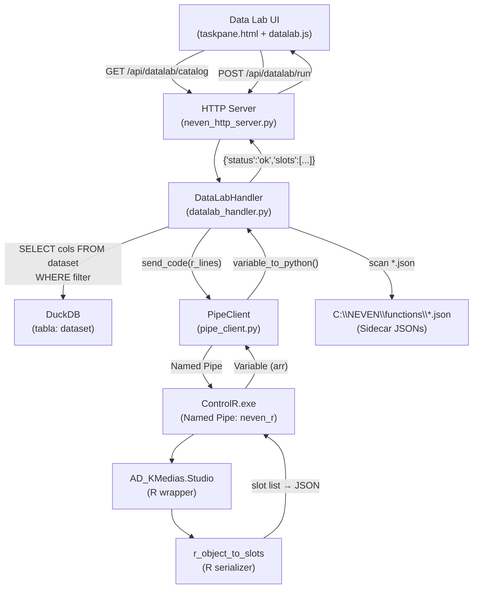

# Documento de Diseño: NEVEN Data Lab

## Overview

NEVEN Data Lab es una pestaña nueva en NEVEN Studio Standalone que expone la librería analítica de R mediante una interfaz guiada de punto y clic. El usuario selecciona una función del catálogo, asigna columnas del dataset activo a roles de variables, configura parámetros mediante controles dinámicos y recibe resultados estructurados en slots tipificados — sin escribir código.

### Componentes Principales



### Capas del Sistema

| Capa | Tecnología | Archivos involucrados |
|------|-----------|----------------------|
| UI | HTML + JS vanilla | `taskpane.html`, `datalab.js` |
| HTTP routing | Python `BaseHTTPRequestHandler` | `neven_http_server.py` |
| Lógica de negocio | Python | `datalab_handler.py` |
| Base de datos | DuckDB in-memory | singleton `_db` |
| IPC | Named Pipes + Protobuf | `pipe_client.py` |
| Runtime analítico | R 4.4.1 en ControlR.exe | `AD_KMedias.Studio.R`, `r_object_to_slots.R` |
| Metadatos | JSON | `*.json` en `C:\NEVEN\functions\` |

---

## Architecture

### 2.1 Archivos Nuevos (a crear)

| Archivo | Propósito |
|---------|-----------|
| `NEVEN/ControlPython/startup/datalab_handler.py` | Clase `DataLabHandler` con `handle_catalog()` y `handle_run()` |
| `NEVEN/startup/r_object_to_slots.R` | Función serializadora R cargada en el arranque de ControlR |
| `NEVEN/libreria/R/R4XCL-AD-KMediass.Studio.R` | Wrapper `AD_KMedias.Studio` para K-Means |
| `NEVEN/Install/functions/R4XCL-AD-KMediass.json` | Sidecar JSON para K-Means |
| `NEVEN/scripts/migrate_attr_to_json.R` | Script de migración one-shot |
| Sección Data Lab en `taskpane.html` | Nuevo div de pestaña y contenido |
| `NEVEN/TaskPane/datalab.js` | Módulo JS para Data Lab |

### 2.2 Archivos Modificados (a extender)

| Archivo | Cambio |
|---------|--------|
| `NEVEN/ControlPython/startup/neven_http_server.py` | Importar `DataLabHandler`; agregar `elif` en `do_GET` y `do_POST` |
| `NEVEN/TaskPane/taskpane.html` | Agregar tab "Data Lab" y su div de contenido |
| `NEVEN/startup/startup.r` | Agregar `source()` para `r_object_to_slots.R` |

### 2.3 Cadena de Llamadas Completa (K-Means)

```
Usuario → clic "Ejecutar"
  → JS: runAnalysis()
    → POST /api/datalab/run  {function_id:"AD_KMedias", language:"r",
                               column_roles:{X:["col1","col2"]},
                               parameters:{K:3,Escala:false,TipoModelo:1,Semilla:123456},
                               filter_clause:""}
      → NEVENHandler.do_POST()
        → DataLabHandler.handle_run(body, config)
          → DuckDB: SELECT "col1","col2" FROM dataset
          → Construir string R:
              data <- as.data.frame(jsonlite::fromJSON('<json>'))
              result <- AD_KMedias.Studio(data, K=3, Escala=FALSE, TipoModelo=1, Semilla=123456)
              r_object_to_slots(result, tier_map=c(centers=1,cluster_assignments=1,
                                                    within_ss=2,total_ss=2,between_ss=2))
          → PipeClient("neven_r").send_code(r_lines)
            → ControlR.exe (Named Pipe \\.\pipe\neven_r)
              → AD_KMedias.Studio() → kmeans() → lista de resultados
              → r_object_to_slots() → lista de Slots
              → retorna Variable(arr) con slots serializados
            → variable_to_python(var) → {"columns":[...], "rows":[[...],...]}
          → DataLabHandler reconstruye lista de slots desde arr
          → retorna {"status":"ok","slots":[...]}
      → HTTP 200 JSON
    → JS: renderResults(slots)
      → Results_Panel renderizado con tabla, vectores, etc.
```

---

## Data Models

### 3.1 Interfaz Sidecar JSON

```typescript
interface VariableRole {
  label: string;           // Etiqueta visible al usuario
  types: string[];         // Tipos permitidos: ["numeric"] | ["text"] | ["numeric","text"]
  multiple: boolean;       // Permite asignar más de una columna
  required: boolean;       // Obligatorio para ejecutar
}

interface ParameterOption {
  value: string | number;
  label: string;
}

interface Parameter {
  name: string;            // Nombre del parámetro en la función R/Py/Jl
  label: string;           // Etiqueta visible al usuario
  type: "integer" | "boolean" | "select";
  default: number | boolean | string;
  tier: 1 | 2;             // 1 = visible por defecto, 2 = avanzado colapsado
  options?: ParameterOption[];  // Requerido cuando type === "select"
}

interface SidecarJSON {
  id: string;              // Identificador único, e.g. "AD_KMedias"
  family: string;          // Código de familia, e.g. "AD"
  family_label: string;    // Etiqueta legible, e.g. "Análisis de Datos"
  name: string;            // Nombre para mostrar, e.g. "K-Medias"
  description: string;     // Descripción breve
  languages: string[];     // ["r"] | ["r","python"] | etc.
  function_name: string;   // Nombre exacto del wrapper, e.g. "AD_KMedias.Studio"
  file: string;            // Basename del archivo fuente, e.g. "R4XCL-AD-KMediass.Studio.R"
  variable_roles: { [roleKey: string]: VariableRole };
  parameters: Parameter[];
}
```

### 3.2 Function_Card (respuesta del catálogo)

```typescript
interface FunctionCard {
  id: string;
  family: string;
  family_label: string;
  name: string;
  description: string;
  languages: string[];
  function_name: string;
  file: string;
  variable_roles: { [roleKey: string]: VariableRole };
  parameters: Parameter[];
  // Campos adicionales inyectados por handle_catalog:
  _source_file: string;    // Ruta absoluta del .json para debugging
}
```

### 3.3 Slot (unidad de resultado)

```typescript
interface Slot {
  name: string;            // Nombre del elemento en la lista R
  label: string;           // Etiqueta para mostrar (puede ser igual a name)
  type: "table" | "scalar" | "vector" | "html" | "text" | "unknown";
  value: object[] | string | number | boolean | null;
  // Para table: value = array de objetos {col: val, ...}
  // Para vector: value = array de primitivos
  // Para scalar: value = número, string o boolean
  // Para html: value = string HTML
  // Para text: value = string plano
  tier: 1 | 2;
}
```

### 3.4 Cuerpo de POST /api/datalab/run

```typescript
interface RunRequest {
  function_id: string;              // e.g. "AD_KMedias"
  language: "r" | "python" | "julia";
  column_roles: {
    [roleKey: string]: string[];    // e.g. {X: ["Edad", "Ingreso"]}
  };
  parameters: {
    [paramName: string]: number | boolean | string;
  };
  filter_clause: string;            // e.g. "id NOT IN (1,20)" o "" para sin filtro
}
```

### 3.5 Respuesta de GET /api/datalab/catalog

```typescript
interface CatalogResponse {
  status: "ok";
  catalog: {
    [language: string]: {           // e.g. "r", "python"
      [family: string]: FunctionCard[];
    };
  };
  warnings: string[];               // Sidecars omitidos con razón
  scan_time_ms: number;
}
```

### 3.6 Respuesta de POST /api/datalab/run (éxito)

```typescript
interface RunResponse {
  status: "ok";
  slots: Slot[];
  execution_time_ms: number;
}
```

### 3.7 Respuesta de error (ambos endpoints)

```typescript
interface ErrorResponse {
  status: "error";
  message: string;    // En español, descriptivo
  code?: "NO_DATASET" | "FILTER_ERROR" | "R_ERROR" | "ENGINE_UNAVAILABLE"
       | "VALIDATION_ERROR" | "CATALOG_TIMEOUT";
}
```

---

## Components and Interfaces

### 4a. DataLabHandler (Python)

**Archivo:** `NEVEN/ControlPython/startup/datalab_handler.py`

```python
# ═══════════════════════════════════════════════════════════════════════════════
# NEVEN Data Lab — DataLabHandler
# ═══════════════════════════════════════════════════════════════════════════════
import os
import json
import time
import threading
from typing import Any

# Constantes
FUNCTIONS_DIR_DEFAULT = r"C:\NEVEN\functions"
CATALOG_TIMEOUT_MS    = 2000
REQUIRED_SIDECAR_FIELDS = {
    "id", "family", "family_label", "name", "description",
    "languages", "function_name", "file", "variable_roles", "parameters"
}


class DataLabHandler:
    """Maneja los endpoints GET /api/datalab/catalog y POST /api/datalab/run."""

    # ------------------------------------------------------------------
    # handle_catalog
    # ------------------------------------------------------------------
    def handle_catalog(self, config: dict) -> dict:
        """
        Escanea el directorio de funciones, valida cada .json y retorna
        el catálogo agrupado por idioma → familia.

        Args:
            config: Diccionario de configuración del servidor. Se lee la clave
                    "functions_dir" (por defecto FUNCTIONS_DIR_DEFAULT).

        Returns:
            dict con keys: status, catalog, warnings, scan_time_ms
        """
        functions_dir = config.get("functions_dir", FUNCTIONS_DIR_DEFAULT)
        start_ms = time.time() * 1000
        warnings = []
        catalog = {}  # {language: {family: [FunctionCard, ...]}}

        if not os.path.isdir(functions_dir):
            return {
                "status": "ok",
                "catalog": {},
                "warnings": [f"Directorio no encontrado: {functions_dir}"],
                "scan_time_ms": 0,
            }

        json_files = [
            f for f in os.listdir(functions_dir) if f.lower().endswith(".json")
        ]

        for fname in json_files:
            # Verificar timeout
            if (time.time() * 1000 - start_ms) > CATALOG_TIMEOUT_MS:
                warnings.append("Escaneo interrumpido: tiempo límite de 2000ms alcanzado")
                break

            fpath = os.path.join(functions_dir, fname)
            try:
                with open(fpath, "r", encoding="utf-8") as f:
                    card = json.load(f)
            except (json.JSONDecodeError, OSError) as exc:
                warnings.append(f"{fname}: JSON inválido — {exc}")
                continue

            # Validar campos obligatorios
            missing = REQUIRED_SIDECAR_FIELDS - set(card.keys())
            if missing:
                warnings.append(f"{fname}: faltan campos obligatorios: {missing}")
                continue

            # Validar parámetros select tienen options con value+label
            for param in card.get("parameters", []):
                if param.get("type") == "select":
                    opts = param.get("options", [])
                    if not opts or not all("value" in o and "label" in o for o in opts):
                        warnings.append(
                            f"{fname}: parámetro '{param.get('name')}' type=select "
                            f"requiere options con 'value' y 'label'"
                        )
                        continue

            # Verificar que el archivo fuente existe (opcional, solo advertencia)
            file_basename = card.get("file", "")
            source_path = os.path.join(functions_dir, file_basename)
            if file_basename and not os.path.isfile(source_path):
                warnings.append(
                    f"{fname}: archivo fuente '{file_basename}' no encontrado "
                    f"(la función será incluida de todas formas)"
                )

            card["_source_file"] = fpath

            # Agrupar por idioma → familia
            for lang in card.get("languages", []):
                family = card.get("family", "GENERAL")
                catalog.setdefault(lang, {}).setdefault(family, []).append(card)

        scan_time = round(time.time() * 1000 - start_ms)
        return {
            "status": "ok",
            "catalog": catalog,
            "warnings": warnings,
            "scan_time_ms": scan_time,
        }
```

```python
    # ------------------------------------------------------------------
    # handle_run
    # ------------------------------------------------------------------
    def handle_run(self, body: dict, config: dict,
                   db, db_lock: threading.Lock,
                   get_pipe_client) -> dict:
        """
        Valida el cuerpo, consulta DuckDB, genera código R, lo envía por Named
        Pipe y retorna la lista de slots.

        Args:
            body:           Cuerpo JSON del POST /api/datalab/run.
            config:         Configuración del servidor.
            db:             Conexión DuckDB (_db de neven_http_server.py).
            db_lock:        Lock de DuckDB (_db_lock).
            get_pipe_client: Callable(lang) → PipeClient (NEVENHandler._get_pipe_client).

        Returns:
            dict con keys: status, slots, execution_time_ms  (o status, message, code)
        """
        start_ms = time.time() * 1000

        # 1. Validar campos obligatorios del body
        function_id   = body.get("function_id", "").strip()
        language      = body.get("language", "r").strip().lower()
        column_roles  = body.get("column_roles", {})
        parameters    = body.get("parameters", {})
        filter_clause = body.get("filter_clause", "").strip()

        if not function_id:
            return {"status": "error", "message": "Falta el campo 'function_id'.",
                    "code": "VALIDATION_ERROR"}
        if language != "r":
            return {"status": "error",
                    "message": f"Idioma '{language}' no soportado en V1.",
                    "code": "VALIDATION_ERROR"}

        # 2. Verificar que existe tabla dataset en DuckDB
        try:
            with db_lock:
                db.execute("SELECT COUNT(*) FROM dataset")
        except Exception:
            return {"status": "error",
                    "message": "No hay datos cargados. Cargue un dataset primero.",
                    "code": "NO_DATASET"}

        # 3. Construir la lista de columnas desde column_roles
        all_columns = []
        for role_key, cols in column_roles.items():
            for col in cols:
                if col not in all_columns:
                    all_columns.append(col)

        if not all_columns:
            return {"status": "error",
                    "message": "No se asignaron columnas a ningún rol.",
                    "code": "VALIDATION_ERROR"}

        # 4. Consultar DuckDB con filtro opcional
        quoted_cols = ", ".join(f'"{c}"' for c in all_columns)
        sql = f"SELECT {quoted_cols} FROM dataset"
        if filter_clause:
            sql += f" WHERE {filter_clause}"

        try:
            with db_lock:
                result = db.execute(sql)
                col_names = [d[0] for d in result.description]
                raw_rows  = result.fetchall()
        except Exception as exc:
            return {"status": "error",
                    "message": f"Error en filtro DuckDB: {exc}",
                    "code": "FILTER_ERROR"}

        # 5. Serializar datos a JSON para pasarlos a R
        rows_as_dicts = [
            {col: (row[i] if row[i] is not None else None)
             for i, col in enumerate(col_names)}
            for row in raw_rows
        ]
        json_data = json.dumps(rows_as_dicts, default=str)
        json_escaped = json_data.replace("\\", "\\\\").replace("'", "\\'")

        # 6. Construir el script R
        r_lines = self._build_r_script(
            function_id, column_roles, parameters, json_escaped, col_names
        )

        # 7. Enviar a ControlR
        try:
            client = get_pipe_client("r")
        except KeyError:
            return {"status": "error",
                    "message": "El motor R no está disponible. Verifique que ControlR.exe esté activo.",
                    "code": "ENGINE_UNAVAILABLE"}

        try:
            var = client.send_code(r_lines, wait=True)
        except Exception as exc:
            msg = str(exc)
            if "timed out" in msg.lower():
                return {"status": "error",
                        "message": "La ejecución superó el tiempo límite.",
                        "code": "ENGINE_UNAVAILABLE"}
            return {"status": "error",
                    "message": f"Error en ControlR: {msg}",
                    "code": "R_ERROR"}

        # 8. Convertir Variable → lista de slots
        from pipe_client import variable_to_python  # type: ignore
        raw = variable_to_python(var)
        slots = self._parse_slots_from_variable(raw)

        exec_time = round(time.time() * 1000 - start_ms)
        return {"status": "ok", "slots": slots, "execution_time_ms": exec_time}
```

```python
    # ------------------------------------------------------------------
    # Métodos auxiliares internos
    # ------------------------------------------------------------------
    def _build_r_script(self, function_id: str, column_roles: dict,
                        parameters: dict, json_escaped: str,
                        col_names: list) -> list[str]:
        """Genera las líneas de código R para ejecutar el wrapper."""
        lines = [
            # Cargar datos desde JSON
            f"data_json <- '{json_escaped}'",
            "data <- jsonlite::fromJSON(data_json)",
            "data <- as.data.frame(data)",
            "",
        ]

        # Construir sub-data.frames por rol si la función lo requiere
        # En V1 (K-Means) el rol X se convierte en el data.frame completo
        # con solo columnas numéricas asignadas.
        x_cols = column_roles.get("X", col_names)
        if x_cols:
            quoted = ", ".join(f'"{c}"' for c in x_cols)
            lines.append(f"data_X <- data[, c({quoted}), drop=FALSE]")

        # Construir llamada al wrapper con parámetros nombrados
        param_strs = []
        for k, v in parameters.items():
            if isinstance(v, bool):
                param_strs.append(f"{k}={'TRUE' if v else 'FALSE'}")
            elif isinstance(v, str):
                param_strs.append(f"{k}='{v}'")
            else:
                param_strs.append(f"{k}={v}")

        params_r = ", ".join(param_strs)
        func_call = f"result <- {function_id}.Studio(data_X"
        if params_r:
            func_call += f", {params_r}"
        func_call += ")"
        lines.append(func_call)

        # Llamar al serializador (ya cargado en startup)
        # El tier_map para K-Means: centros y asignaciones son tier 1
        tier_map_r = (
            'c(centers=1L, cluster_assignments=1L, '
            'within_ss=2L, total_ss=2L, between_ss=2L)'
        )
        lines.append(f"r_object_to_slots(result, tier_map={tier_map_r})")
        return lines

    def _parse_slots_from_variable(self, raw: Any) -> list[dict]:
        """
        Convierte la representación Python de una Variable arr en una lista de Slots.

        El serializer retorna una Variable de tipo arr donde:
          - colnames = ["name","label","type","value","tier"]
          - rows     = una fila por slot
        """
        if not isinstance(raw, dict):
            return []
        cols = raw.get("columns", [])
        rows = raw.get("rows", [])
        if not cols or not rows:
            return []

        try:
            idx = {c.lower(): i for i, c in enumerate(cols)}
            slots = []
            for row in rows:
                slot = {
                    "name":  row[idx["name"]],
                    "label": row[idx["label"]],
                    "type":  row[idx["type"]],
                    "value": json.loads(row[idx["value"]])
                              if isinstance(row[idx["value"]], str) else row[idx["value"]],
                    "tier":  int(row[idx["tier"]]),
                }
                slots.append(slot)
            return slots
        except (KeyError, IndexError, json.JSONDecodeError):
            return []
```

> **Convención de retorno de ControlR:** `r_object_to_slots()` retorna una lista R. ControlR la serializa como una Variable de tipo `arr` donde cada elemento de la lista ocupa una fila y las columnas son `name`, `label`, `type`, `value`, `tier`. El campo `value` contiene JSON serializado como string (via `jsonlite::toJSON`). `variable_to_python()` convierte el `arr` a `{"columns":[...], "rows":[[...],...]}`.

### 4b. Integración en neven_http_server.py

**Importación (agregar al inicio del archivo, después de los imports existentes):**

```python
# Data Lab handler (nuevo en Data Lab V1)
try:
    from datalab_handler import DataLabHandler as _DataLabHandler
    _datalab_handler = _DataLabHandler()
    _DATALAB_AVAILABLE = True
except ImportError:
    _DATALAB_AVAILABLE = False
```

**Rama `do_GET` (agregar antes del bloque de archivos estáticos):**

```python
# ── Data Lab catalog ──────────────────────────────────────────────────
if path == 'api/datalab/catalog':
    if not _DATALAB_AVAILABLE:
        self._send_error_json("DataLab no disponible", 503)
        return
    result = _datalab_handler.handle_catalog(_config)
    self._send_json(result)
    return
```

**Rama `do_POST` (agregar en el bloque `elif` después de `api/rpivot`):**

```python
elif path == 'api/datalab/run':
    if not _DATALAB_AVAILABLE:
        self._send_error_json("DataLab no disponible", 503)
        return
    result = _datalab_handler.handle_run(
        body, _config,
        _get_db(), _db_lock,
        self._get_pipe_client
    )
    status_code = 200 if result.get("status") == "ok" else 400
    self._send_json(result, status_code)
```

**Clave de configuración adicional en `DEFAULT_CONFIG`:**

```python
DEFAULT_CONFIG = {
    # ... campos existentes ...
    "functions_dir": r"C:\NEVEN\functions",  # Directorio de sidecar JSONs
}
```

### 4c. r_object_to_slots.R (Serializador R)

**Archivo:** `NEVEN/startup/r_object_to_slots.R`

```r
# ═══════════════════════════════════════════════════════════════════════════════
# NEVEN Data Lab — Serializador de objetos R a Slots tipificados
# Cargado por startup.r al iniciar ControlR.exe
# ═══════════════════════════════════════════════════════════════════════════════

#' Convierte un objeto R S3 en una lista de Slots para Data Lab.
#'
#' @param obj       Cualquier objeto R S3 con elementos nombrados (lista, data.frame,
#'                  objeto kmeans, lm, etc.). Solo se procesan los elementos del nivel
#'                  superior obtenidos con names(obj).
#' @param tier_map  Vector entero nombrado opcional para anular el tier por defecto (1).
#'                  Ejemplo: c(centers = 1L, within_ss = 2L)
#'
#' @return Data.frame con columnas: name, label, type, value, tier.
#'         Cada fila es un Slot. El campo 'value' contiene JSON serializado como string.
#'
r_object_to_slots <- function(obj, tier_map = NULL) {
  if (!requireNamespace("jsonlite", quietly = TRUE)) {
    stop("El paquete 'jsonlite' es necesario para r_object_to_slots.")
  }

  nms <- names(obj)
  if (is.null(nms) || length(nms) == 0) {
    # Objeto sin nombres: tratarlo como un slot único
    nms <- "result"
    obj_list <- list(result = obj)
  } else {
    obj_list <- as.list(obj)
  }

  slots <- vector("list", length(nms))

  for (i in seq_along(nms)) {
    nm  <- nms[i]
    val <- obj_list[[nm]]

    # ── Asignación de tipo (orden de prioridad según Req 9.2) ──────────
    tipo <- .neven_dl_detect_type(val)

    # ── Serialización del valor a JSON ─────────────────────────────────
    val_json <- .neven_dl_serialize_value(val, tipo)

    # ── Tier: default 1, override desde tier_map ───────────────────────
    tier <- 1L
    if (!is.null(tier_map) && !is.na(tier_map[nm])) {
      tier <- as.integer(tier_map[nm])
    }

    slots[[i]] <- list(
      name  = nm,
      label = nm,     # En V1 label == name; futuras versiones pueden usar i18n
      type  = tipo,
      value = val_json,
      tier  = tier
    )
  }

  # Retornar como data.frame para que ControlR lo serialice como Variable arr
  result_df <- do.call(rbind, lapply(slots, as.data.frame, stringsAsFactors = FALSE))
  return(result_df)
}

# ── Detección de tipo (Req 9.2) ─────────────────────────────────────────────

.neven_dl_detect_type <- function(val) {
  # Prioridad 1: data.frame o matrix → table
  if (is.data.frame(val) || is.matrix(val)) return("table")

  # Prioridad 2: string que contiene "<html" (case-insensitive) → html
  if (is.character(val) && length(val) == 1) {
    if (grepl("<html", val, ignore.case = TRUE)) return("html")
  }

  # Prioridad 3: vector atómico de longitud > 1 → vector
  if (is.atomic(val) && length(val) > 1) return("vector")

  # Prioridad 4: vector atómico de longitud 1 → scalar
  if (is.atomic(val) && length(val) == 1) return("scalar")

  # Prioridad 5: cualquier otro → unknown
  return("unknown")
}

# ── Serialización por tipo ──────────────────────────────────────────────────

.neven_dl_serialize_value <- function(val, tipo) {
  tryCatch({
    switch(tipo,
      "table" = {
        df <- as.data.frame(val, stringsAsFactors = FALSE)
        jsonlite::toJSON(df, dataframe = "rows", auto_unbox = TRUE, na = "null")
      },
      "html" = {
        as.character(val)  # HTML se pasa tal cual como string
      },
      "vector" = {
        jsonlite::toJSON(as.list(val), auto_unbox = FALSE, na = "null")
      },
      "scalar" = {
        jsonlite::toJSON(val, auto_unbox = TRUE, na = "null")
      },
      # unknown y cualquier otro: representación de texto
      {
        tryCatch(
          jsonlite::toJSON(val, auto_unbox = TRUE, na = "null"),
          error = function(e) paste(capture.output(print(val)), collapse = "\n")
        )
      }
    )
  }, error = function(e) {
    paste0('"[Error al serializar: ', gsub('"', '\\"', conditionMessage(e)), ']"')
  })
}
```

**Carga en `startup.r` (agregar al final del archivo):**

```r
# ── Data Lab: Serializador de slots ─────────────────────────────────────────
local({
  sr_path <- file.path(dirname(sys.frame(1)$ofile), "r_object_to_slots.R")
  if (!file.exists(sr_path)) {
    # Fallback: buscar en el directorio estándar de producción
    sr_path <- "C:\\NEVEN\\startup\\r_object_to_slots.R"
  }
  if (file.exists(sr_path)) {
    source(sr_path, local = FALSE)
    cat("NEVEN Data Lab: r_object_to_slots cargado\n")
  } else {
    warning("r_object_to_slots.R no encontrado — Data Lab no disponible")
  }
})
```

### 4d. AD_KMedias.Studio (Wrapper R para K-Means)

**Archivo:** `NEVEN/libreria/R/R4XCL-AD-KMediass.Studio.R`

```r
# ═══════════════════════════════════════════════════════════════════════════════
# NEVEN Data Lab — Wrapper Studio para K-Medias
# Requiere: r_object_to_slots.R cargado en el entorno global
# ═══════════════════════════════════════════════════════════════════════════════

#' Wrapper Data Lab para el algoritmo de K-Medias.
#'
#' Recibe un data.frame numérico, ejecuta kmeans(), serializa los resultados
#' usando r_object_to_slots() y retorna el data.frame de slots.
#'
#' @param data       data.frame con columnas numéricas (rol X).
#' @param K          Número de clusters (default: 3).
#' @param Escala     Escalar los datos con scale() antes de clustering (default: FALSE).
#' @param TipoModelo Índice del algoritmo: 1=Hartigan-Wong, 2=Lloyd,
#'                   3=Forgy, 4=MacQueen (default: 1).
#' @param Semilla    Semilla aleatoria para reproducibilidad (default: 123456).
#'
#' @return data.frame de slots (name, label, type, value, tier).
#'
AD_KMedias.Studio <- function(data,
                               K          = 3L,
                               Escala     = FALSE,
                               TipoModelo = 1L,
                               Semilla    = 123456L) {

  # ── Validaciones ───────────────────────────────────────────────────────────
  if (!is.data.frame(data) && !is.matrix(data)) {
    stop("'data' debe ser un data.frame o matrix.")
  }
  data <- as.data.frame(data)

  # Conservar solo columnas numéricas
  num_cols <- sapply(data, is.numeric)
  if (!any(num_cols)) {
    stop("No se encontraron columnas numéricas en los datos.")
  }
  data_num <- data[, num_cols, drop = FALSE]

  K <- as.integer(K)
  if (K < 1 || K >= nrow(data_num)) {
    stop(paste0("K (", K, ") debe ser >= 1 y < número de filas (", nrow(data_num), ")."))
  }

  TipoModelo <- as.integer(TipoModelo)
  algoritmos <- c("Hartigan-Wong", "Lloyd", "Forgy", "MacQueen")
  if (TipoModelo < 1 || TipoModelo > 4) {
    stop("TipoModelo debe ser 1 (Hartigan-Wong), 2 (Lloyd), 3 (Forgy) o 4 (MacQueen).")
  }

  # ── Preparación de datos ───────────────────────────────────────────────────
  set.seed(as.integer(Semilla))

  if (Escala) {
    data_proc <- as.data.frame(scale(data_num))
  } else {
    data_proc <- data_num
  }

  # ── Ejecución de kmeans() ──────────────────────────────────────────────────
  res_km <- kmeans(
    data_proc,
    centers   = K,
    algorithm = algoritmos[TipoModelo],
    nstart    = 10L
  )

  # ── Construcción del objeto de resultados ──────────────────────────────────
  centers_df           <- as.data.frame(res_km$centers)
  centers_df$Cluster   <- seq_len(K)
  centers_df           <- centers_df[, c("Cluster", setdiff(names(centers_df), "Cluster"))]

  resultado <- list(
    centers              = centers_df,
    cluster_assignments  = as.integer(res_km$cluster),
    within_ss            = round(res_km$withinss, 4),
    total_ss             = round(res_km$totss,    4),
    between_ss           = round(res_km$betweenss, 4)
  )

  # ── Serialización con tier_map ─────────────────────────────────────────────
  tier_map <- c(
    centers             = 1L,
    cluster_assignments = 1L,
    within_ss           = 2L,
    total_ss            = 2L,
    between_ss          = 2L
  )

  r_object_to_slots(resultado, tier_map = tier_map)
}
```

### 4e. Sidecar JSON para K-Means

**Archivo:** `NEVEN/Install/functions/R4XCL-AD-KMediass.json`

```json
{
  "id": "AD_KMedias",
  "family": "AD",
  "family_label": "Análisis de Datos",
  "name": "K-Medias",
  "description": "Agrupa observaciones en K clusters minimizando la variabilidad intra-cluster mediante el algoritmo de K-Medias.",
  "languages": ["r"],
  "function_name": "AD_KMedias.Studio",
  "file": "R4XCL-AD-KMediass.Studio.R",
  "variable_roles": {
    "X": {
      "label": "Variables activas",
      "types": ["numeric"],
      "multiple": true,
      "required": true
    }
  },
  "parameters": [
    {
      "name": "K",
      "label": "Número de clusters (K)",
      "type": "integer",
      "default": 3,
      "tier": 1
    },
    {
      "name": "Escala",
      "label": "Escalar variables",
      "type": "boolean",
      "default": false,
      "tier": 1
    },
    {
      "name": "TipoModelo",
      "label": "Algoritmo",
      "type": "select",
      "default": 1,
      "tier": 1,
      "options": [
        { "value": 1, "label": "Hartigan-Wong" },
        { "value": 2, "label": "Lloyd" },
        { "value": 3, "label": "Forgy" },
        { "value": 4, "label": "MacQueen" }
      ]
    },
    {
      "name": "Semilla",
      "label": "Semilla aleatoria",
      "type": "integer",
      "default": 123456,
      "tier": 2
    }
  ]
}
```

### 4f. Script de Migración

**Archivo:** `NEVEN/scripts/migrate_attr_to_json.R`

```r
# ═══════════════════════════════════════════════════════════════════════════════
# NEVEN Data Lab — Script de Migración: attr(fn,"description") → Sidecar JSON
# Uso: Rscript migrate_attr_to_json.R [directorio_funciones]
# ═══════════════════════════════════════════════════════════════════════════════

args         <- commandArgs(trailingOnly = TRUE)
funcs_dir    <- if (length(args) > 0) args[1] else "C:\\NEVEN\\functions"

if (!dir.exists(funcs_dir)) {
  stop(paste("Directorio no encontrado:", funcs_dir))
}

# ── Mapeo de prefijo de archivo → familia ──────────────────────────────────
PREFIX_FAMILY_MAP <- c(
  "R4XCL-AD-" = "AD",
  "R4XCL-RG-" = "RG",
  "R4XCL-GR-" = "GR",
  "R4XCL-MT-" = "MT",
  "R4XCL-FX-" = "FX"
)

FAMILY_LABELS <- c(
  "AD" = "Análisis de Datos",
  "RG" = "Regresión",
  "GR" = "Gráficos",
  "MT" = "Matrices",
  "FX" = "Funciones"
)

# ── Función auxiliar: extraer familia del nombre de archivo ────────────────
derive_family <- function(filename) {
  for (prefix in names(PREFIX_FAMILY_MAP)) {
    if (startsWith(basename(filename), prefix)) {
      return(PREFIX_FAMILY_MAP[prefix])
    }
  }
  return("GENERAL")
}

# ── Función auxiliar: generar sidecar JSON para una función ────────────────
generate_sidecar <- function(r_file) {
  json_file <- sub("\\.R$", ".json", r_file, ignore.case = TRUE)

  # Req 11.5: skip si ya existe
  if (file.exists(json_file)) {
    cat(sprintf("  [SKIP] %s — ya existe sidecar\n", basename(r_file)))
    return("skip")
  }

  # Cargar el archivo .R en un entorno limpio
  env <- new.env(parent = emptyenv())
  tryCatch({
    sys.source(r_file, envir = env)
  }, error = function(e) {
    cat(sprintf("  [FAIL] %s — error al cargar: %s\n", basename(r_file), conditionMessage(e)))
    return("fail")
  })

  # Buscar funciones con attr(fn, "description")
  fns_with_desc <- Filter(function(nm) {
    obj <- get(nm, envir = env)
    is.function(obj) && !is.null(attr(obj, "description"))
  }, ls(env))

  if (length(fns_with_desc) == 0) {
    cat(sprintf("  [SKIP] %s — sin attr(description)\n", basename(r_file)))
    return("skip")
  }

  # Usar la primera función encontrada
  fn_name  <- fns_with_desc[1]
  fn_obj   <- get(fn_name, envir = env)
  desc_val <- attr(fn_obj, "description")

  # Extraer descripción legible
  description <- ""
  if (is.character(desc_val)) {
    description <- desc_val[1]
  } else if (is.list(desc_val) && !is.null(desc_val$Detalle)) {
    description <- as.character(desc_val$Detalle)
  }

  family       <- derive_family(r_file)
  family_label <- FAMILY_LABELS[family]
  if (is.na(family_label)) family_label <- family
  file_basename <- basename(r_file)

  sidecar <- list(
    id             = fn_name,
    family         = family,
    family_label   = family_label,
    name           = fn_name,
    description    = description,
    languages      = list("r"),
    function_name  = fn_name,
    file           = file_basename,
    variable_roles = list(),     # Req 11.4: vacío, enriquecer manualmente
    parameters     = list()      # Req 11.4: vacío, enriquecer manualmente
  )

  json_str <- jsonlite::toJSON(sidecar, pretty = TRUE, auto_unbox = TRUE, null = "null")
  writeLines(json_str, json_file, useBytes = FALSE)
  cat(sprintf("  [OK]   %s → %s\n", basename(r_file), basename(json_file)))
  return("ok")
}

# ── Ejecución principal ────────────────────────────────────────────────────
r_files <- list.files(funcs_dir, pattern = "\\.R$", full.names = TRUE, ignore.case = TRUE)
cat(sprintf("Migrando %d archivos .R en: %s\n\n", length(r_files), funcs_dir))

counters <- list(processed = 0L, skipped = 0L, failed = 0L)

for (rf in r_files) {
  status <- tryCatch(
    generate_sidecar(rf),
    error = function(e) {
      cat(sprintf("  [FAIL] %s — %s\n", basename(rf), conditionMessage(e)))
      "fail"
    }
  )
  if      (status == "ok"  ) counters$processed <- counters$processed + 1L
  else if (status == "skip") counters$skipped   <- counters$skipped   + 1L
  else                       counters$failed    <- counters$failed    + 1L
}

# Req 11.6: resumen
cat(sprintf(
  "\n──────────────────────────────────────\n",
))
cat(sprintf("Migración completada.\n"))
cat(sprintf("  Procesados : %d\n", counters$processed))
cat(sprintf("  Omitidos   : %d\n", counters$skipped))
cat(sprintf("  Fallidos   : %d\n", counters$failed))
```

### 4g. Data Lab UI (HTML + JS)

#### Estructura HTML (agregar en `taskpane.html`)

**Pestaña (agregar después de `data-tab="run-script"`):**

```html
<div class="tab" data-tab="data-lab">Data Lab</div>
```

**Contenido de la pestaña (agregar antes del cierre `</body>`):**

```html
<!-- Tab: Data Lab -->
<div class="tab-content" id="data-lab">

  <!-- Mensaje sin dataset -->
  <div id="dl-no-dataset" class="card" style="display:none">
    <div class="msg-info">
      ⚠️ No hay datos cargados. Cargue un archivo en la pestaña
      <strong>Data Studio</strong> o use <strong>Leer de Excel</strong>.
    </div>
  </div>

  <!-- Selector de función -->
  <div class="card" id="dl-selector-card">
    <div class="card-title">Función Analítica</div>
    <div class="controls">
      <label>Familia:</label>
      <select id="dl-family-select" disabled>
        <option value="">— cargando catálogo —</option>
      </select>
      <span id="dl-catalog-spinner" class="spinner" style="display:none"></span>
    </div>
    <div id="dl-catalog-error" class="msg-error" style="display:none">
      <span id="dl-catalog-error-msg"></span>
      <button class="btn btn-secondary" id="dl-retry-catalog"
              style="margin-left:8px">Reintentar</button>
    </div>
    <div id="dl-function-list" style="margin-top:6px"></div>
    <div id="dl-lang-selector-row" class="controls" style="display:none;margin-top:6px">
      <label>Idioma:</label>
      <select id="dl-lang-select"></select>
    </div>
  </div>

  <!-- Column Panel -->
  <div class="card" id="dl-column-panel" style="display:none">
    <div class="card-title">Asignación de Variables</div>
    <div style="display:flex;gap:12px;flex-wrap:wrap">
      <div style="flex:1;min-width:120px">
        <div style="color:var(--text-secondary);font-size:9px;margin-bottom:4px">
          COLUMNAS DEL DATASET
        </div>
        <div id="dl-column-list"></div>
      </div>
      <div style="flex:1;min-width:120px">
        <div style="color:var(--text-secondary);font-size:9px;margin-bottom:4px">
          ROLES
        </div>
        <div id="dl-role-slots"></div>
      </div>
    </div>
  </div>

  <!-- Parameter Form -->
  <div class="card" id="dl-param-card" style="display:none">
    <div class="card-title">Parámetros</div>
    <div id="dl-param-tier1"></div>
    <details id="dl-param-advanced" style="display:none;margin-top:6px">
      <summary style="color:var(--text-secondary);font-size:10px;cursor:pointer">
        Parámetros avanzados
      </summary>
      <div id="dl-param-tier2" style="margin-top:6px"></div>
    </details>
  </div>

  <!-- Filter Box -->
  <div class="card" id="dl-filter-card" style="display:none">
    <div class="card-title">Filtro WHERE (opcional)</div>
    <input type="text" id="dl-filter-input"
           placeholder="Ej: edad > 18 AND pais = 'CR'"
           style="width:100%;background:#111;color:var(--accent);
                  border:1px solid #333;border-radius:4px;padding:6px 8px;
                  font-family:monospace;font-size:11px">
  </div>

  <!-- Run Button -->
  <div style="margin-bottom:8px;display:none" id="dl-run-row">
    <button class="btn btn-primary" id="dl-run-btn" disabled>
      ▶ Ejecutar análisis
    </button>
    <span id="dl-run-spinner" style="display:none;margin-left:8px">
      <span class="spinner"></span>
    </span>
  </div>

  <!-- Results Panel -->
  <div id="dl-results-panel" style="display:none">
    <div class="card-title" style="margin-bottom:6px">Resultados</div>
    <div id="dl-results-error" class="msg-error" style="display:none"></div>
    <div id="dl-results-content"></div>
  </div>

</div>
```

#### Módulo JavaScript — `datalab.js`

```javascript
// ═══════════════════════════════════════════════════════════════════════════════
// NEVEN Studio — Data Lab Module
// ═══════════════════════════════════════════════════════════════════════════════

const _DL_API = window.location.origin;

// ── Estado interno ────────────────────────────────────────────────────────────
const _dlState = {
  catalog:         null,    // Respuesta completa de GET /api/datalab/catalog
  selectedCard:    null,    // FunctionCard seleccionada
  columnRoles:     {},      // { roleKey: [colName, ...] }
  parameters:      {},      // { paramName: value }
  datasetColumns:  [],      // [{ name, type }] del dataset activo
  language:        "r",     // Idioma seleccionado
  pendingColumn:   null,    // Columna seleccionada, esperando click en slot
};

// ── Inicialización ────────────────────────────────────────────────────────────

function initDataLab() {
  document.getElementById('dl-retry-catalog')
    .addEventListener('click', loadCatalog);
  document.getElementById('dl-family-select')
    .addEventListener('change', onFamilyChange);
  document.getElementById('dl-run-btn')
    .addEventListener('click', runAnalysis);
  loadCatalog();
}

// ── Activación de pestaña ─────────────────────────────────────────────────────

async function onDataLabTabActivated() {
  await introspectDataset();
  if (!_dlState.catalog) {
    await loadCatalog();
  }
}

// ── Catálogo ──────────────────────────────────────────────────────────────────

async function loadCatalog() {
  const spinner  = document.getElementById('dl-catalog-spinner');
  const errDiv   = document.getElementById('dl-catalog-error');
  const sel      = document.getElementById('dl-family-select');
  errDiv.style.display = 'none';
  spinner.style.display = '';
  sel.disabled = true;
  sel.innerHTML = '<option value="">— cargando —</option>';

  try {
    const resp = await fetch(_DL_API + '/api/datalab/catalog');
    if (!resp.ok) throw new Error(`HTTP ${resp.status}`);
    const data = await resp.json();
    if (data.status === 'error') throw new Error(data.message);
    _dlState.catalog = data.catalog;
    renderFamilyDropdown(data.catalog);
    spinner.style.display = 'none';
  } catch (err) {
    spinner.style.display = 'none';
    document.getElementById('dl-catalog-error-msg').textContent =
      'Error al cargar el catálogo: ' + err.message;
    errDiv.style.display = '';
    sel.innerHTML = '<option value="">— error —</option>';
  }
}

function renderFamilyDropdown(catalog) {
  const sel = document.getElementById('dl-family-select');
  const families = {};
  for (const lang of Object.values(catalog)) {
    for (const [fam, cards] of Object.entries(lang)) {
      if (!families[fam]) families[fam] = cards[0].family_label || fam;
    }
  }
  sel.innerHTML = '<option value="">Seleccione una familia…</option>';
  for (const [fam, label] of Object.entries(families)) {
    const opt = document.createElement('option');
    opt.value = fam; opt.textContent = label;
    sel.appendChild(opt);
  }
  sel.disabled = false;
}

// ── Selección de familia ──────────────────────────────────────────────────────

function onFamilyChange() {
  const family = document.getElementById('dl-family-select').value;
  clearFunctionSelection();
  const listEl = document.getElementById('dl-function-list');
  listEl.innerHTML = '';
  if (!family || !_dlState.catalog) return;

  const allCards = [];
  for (const langCatalog of Object.values(_dlState.catalog)) {
    if (langCatalog[family]) allCards.push(...langCatalog[family]);
  }

  allCards.forEach(card => {
    const btn = document.createElement('button');
    btn.className = 'btn btn-secondary';
    btn.style.cssText = 'display:block;width:100%;text-align:left;margin:2px 0;';
    btn.innerHTML = `<strong>${card.name}</strong>
      <span style="color:var(--text-secondary);font-size:9px;margin-left:6px">
        ${card.description || ''}
      </span>`;
    btn.addEventListener('click', () => selectFunction(card));
    listEl.appendChild(btn);
  });
}

// ── Selección de función ──────────────────────────────────────────────────────

function selectFunction(card) {
  _dlState.selectedCard   = card;
  _dlState.columnRoles    = {};
  _dlState.parameters     = {};
  _dlState.pendingColumn  = null;

  // Highlight botón seleccionado
  document.querySelectorAll('#dl-function-list .btn').forEach(b => {
    b.style.borderColor = b.textContent.includes(card.name)
      ? 'var(--accent)' : '';
  });

  // Selector de idioma
  renderLanguageSelector(card);

  // Panels
  renderColumnPanel(card);
  renderParameterForm(card);

  document.getElementById('dl-filter-card').style.display = '';
  document.getElementById('dl-run-row').style.display = '';
  document.getElementById('dl-results-panel').style.display = 'none';
  document.getElementById('dl-results-content').innerHTML = '';
  updateRunButtonState();
}

function clearFunctionSelection() {
  _dlState.selectedCard  = null;
  _dlState.columnRoles   = {};
  _dlState.parameters    = {};
  _dlState.pendingColumn = null;
  ['dl-column-panel','dl-param-card','dl-filter-card','dl-run-row',
   'dl-results-panel','dl-lang-selector-row'].forEach(id => {
    document.getElementById(id).style.display = 'none';
  });
  document.getElementById('dl-results-content').innerHTML = '';
}
```

```javascript
// ── Introspección del dataset ──────────────────────────────────────────────

async function introspectDataset() {
  try {
    const resp = await fetch(_DL_API + '/api/query', {
      method: 'POST',
      headers: {'Content-Type': 'application/json'},
      body: JSON.stringify({ sql: 'SELECT * FROM dataset LIMIT 0', page: 1, page_size: 1 })
    });
    const data = await resp.json();
    if (data.status === 'ok') {
      // Inferir tipos desde la respuesta del analyze
      const statsResp = await fetch(_DL_API + '/api/analyze', {
        method: 'POST', headers: {'Content-Type': 'application/json'}, body: '{}'
      });
      const stats = await statsResp.json();
      if (stats.status === 'ok') {
        _dlState.datasetColumns = stats.statistics.map(s => ({
          name: s.column,
          type: s.numeric ? 'numeric' : 'text'
        }));
        document.getElementById('dl-no-dataset').style.display = 'none';
        document.getElementById('dl-run-btn').disabled = false;
        return true;
      }
    }
  } catch (_) {}

  _dlState.datasetColumns = [];
  document.getElementById('dl-no-dataset').style.display = '';
  document.getElementById('dl-run-btn').disabled = true;
  return false;
}

// ── Column Panel ──────────────────────────────────────────────────────────────

function renderColumnPanel(card) {
  const panel = document.getElementById('dl-column-panel');
  const colList = document.getElementById('dl-column-list');
  const roleSlots = document.getElementById('dl-role-slots');
  panel.style.display = '';
  colList.innerHTML = '';
  roleSlots.innerHTML = '';

  // Lista de columnas del dataset
  _dlState.datasetColumns.forEach(col => {
    const chip = document.createElement('div');
    chip.className = 'dl-col-chip';
    chip.dataset.colname = col.name;
    chip.dataset.coltype = col.type;
    chip.style.cssText = `padding:3px 8px;margin:2px 0;border-radius:3px;
      background:#2a2a2a;border:1px solid #444;cursor:pointer;font-size:10px;
      display:flex;justify-content:space-between;align-items:center;`;
    chip.innerHTML = `<span>${col.name}</span>
      <span style="color:var(--text-muted);font-size:9px">${col.type}</span>`;
    chip.addEventListener('click', () => onColumnChipClick(col.name, col.type));
    colList.appendChild(chip);
  });

  // Slots de roles
  const roles = card.variable_roles || {};
  Object.entries(roles).forEach(([roleKey, roleDef]) => {
    const slotDiv = document.createElement('div');
    slotDiv.className = 'dl-role-slot';
    slotDiv.dataset.rolekey = roleKey;
    slotDiv.style.cssText = `min-height:32px;padding:4px;margin:2px 0;
      border:1px dashed #555;border-radius:4px;font-size:10px;`;

    const labelDiv = document.createElement('div');
    labelDiv.style.cssText = 'color:var(--accent);font-size:9px;margin-bottom:3px;';
    labelDiv.textContent = `${roleDef.label} ${roleDef.required ? '*' : ''}`;
    slotDiv.appendChild(labelDiv);

    const chipsDiv = document.createElement('div');
    chipsDiv.id = `dl-role-chips-${roleKey}`;
    chipsDiv.dataset.rolekey = roleKey;
    chipsDiv.dataset.allowedtypes = JSON.stringify(roleDef.types || []);
    chipsDiv.dataset.multiple = roleDef.multiple ? 'true' : 'false';
    slotDiv.appendChild(chipsDiv);

    const errDiv = document.createElement('div');
    errDiv.id = `dl-role-err-${roleKey}`;
    errDiv.className = 'msg-error';
    errDiv.style.display = 'none';
    slotDiv.appendChild(errDiv);

    slotDiv.addEventListener('click', () => onRoleSlotClick(roleKey, roleDef));
    roleSlots.appendChild(slotDiv);
  });
}

function onColumnChipClick(colName, colType) {
  // Deseleccionar anterior
  document.querySelectorAll('.dl-col-chip').forEach(c =>
    c.style.borderColor = '#444');
  // Seleccionar actual
  const chipEl = document.querySelector(`.dl-col-chip[data-colname="${CSS.escape(colName)}"]`);
  if (chipEl) chipEl.style.borderColor = 'var(--accent)';
  _dlState.pendingColumn = { name: colName, type: colType };
}

function onRoleSlotClick(roleKey, roleDef) {
  if (!_dlState.pendingColumn) return;
  const col       = _dlState.pendingColumn;
  const allowed   = roleDef.types || [];
  const isNumeric = col.type === 'numeric';

  // Validar tipo
  if (allowed.includes('numeric') && !allowed.includes('text') && !isNumeric) {
    showRoleError(roleKey, `Solo columnas numéricas para este rol.`);
    return;
  }

  // Validar multiple
  if (!roleDef.multiple) {
    _dlState.columnRoles[roleKey] = [col.name];
  } else {
    if (!_dlState.columnRoles[roleKey]) _dlState.columnRoles[roleKey] = [];
    if (!_dlState.columnRoles[roleKey].includes(col.name)) {
      _dlState.columnRoles[roleKey].push(col.name);
    }
  }

  _dlState.pendingColumn = null;
  document.querySelectorAll('.dl-col-chip').forEach(c =>
    c.style.borderColor = '#444');
  renderRoleChips(roleKey);
  hideRoleError(roleKey);
  updateRunButtonState();
}

function renderRoleChips(roleKey) {
  const container = document.getElementById(`dl-role-chips-${roleKey}`);
  if (!container) return;
  const cols = _dlState.columnRoles[roleKey] || [];
  container.innerHTML = '';
  cols.forEach(colName => {
    const chip = document.createElement('span');
    chip.style.cssText = `display:inline-flex;align-items:center;gap:3px;
      background:var(--accent-dim);border:1px solid var(--accent);
      border-radius:10px;padding:1px 6px;font-size:9px;margin:1px;`;
    chip.innerHTML = `${colName}
      <span style="cursor:pointer;color:var(--text-secondary)"
            onclick="removeRoleColumn('${roleKey}','${colName}')">×</span>`;
    container.appendChild(chip);
  });
}

function removeRoleColumn(roleKey, colName) {
  if (_dlState.columnRoles[roleKey]) {
    _dlState.columnRoles[roleKey] =
      _dlState.columnRoles[roleKey].filter(c => c !== colName);
  }
  renderRoleChips(roleKey);
  updateRunButtonState();
}

function showRoleError(roleKey, msg) {
  const el = document.getElementById(`dl-role-err-${roleKey}`);
  if (el) { el.textContent = msg; el.style.display = ''; }
}
function hideRoleError(roleKey) {
  const el = document.getElementById(`dl-role-err-${roleKey}`);
  if (el) el.style.display = 'none';
}
```

```javascript
// ── Parameter Form ────────────────────────────────────────────────────────────

function renderParameterForm(card) {
  const tier1El = document.getElementById('dl-param-tier1');
  const tier2El = document.getElementById('dl-param-tier2');
  const advEl   = document.getElementById('dl-param-advanced');
  const cardEl  = document.getElementById('dl-param-card');

  tier1El.innerHTML = '';
  tier2El.innerHTML = '';
  cardEl.style.display = '';

  const params = card.parameters || [];
  let hasTier2 = false;

  params.forEach(param => {
    // Inicializar valor por defecto
    _dlState.parameters[param.name] = param.default;

    const row = document.createElement('div');
    row.style.cssText = 'display:flex;align-items:center;gap:8px;margin:4px 0;';

    const label = document.createElement('label');
    label.style.cssText = 'color:var(--text-secondary);font-size:10px;min-width:120px;';
    label.textContent = param.label;

    let control;
    const errSpan = document.createElement('span');
    errSpan.id = `dl-param-err-${param.name}`;
    errSpan.className = 'msg-error';
    errSpan.style.display = 'none';

    if (param.type === 'integer') {
      control = document.createElement('input');
      control.type = 'number';
      control.step = '1';
      control.value = param.default;
      control.style.cssText = 'background:#333;color:var(--text-primary);' +
        'border:1px solid #555;border-radius:4px;padding:3px 6px;width:80px;font-size:10px;';
      control.addEventListener('input', () => {
        const v = control.value;
        if (v === '' || !Number.isInteger(Number(v))) {
          errSpan.textContent = `Ingrese un número entero.`;
          errSpan.style.display = '';
          _dlState.parameters[param.name] = null;
        } else {
          errSpan.style.display = 'none';
          _dlState.parameters[param.name] = parseInt(v, 10);
        }
        updateRunButtonState();
      });

    } else if (param.type === 'boolean') {
      control = document.createElement('input');
      control.type = 'checkbox';
      control.checked = !!param.default;
      control.style.accentColor = 'var(--accent)';
      control.addEventListener('change', () => {
        _dlState.parameters[param.name] = control.checked;
      });

    } else if (param.type === 'select') {
      control = document.createElement('select');
      control.style.cssText = 'background:#333;color:var(--text-primary);' +
        'border:1px solid #555;border-radius:4px;padding:3px 6px;font-size:10px;';
      (param.options || []).forEach(opt => {
        const o = document.createElement('option');
        o.value = opt.value; o.textContent = opt.label;
        if (String(opt.value) === String(param.default)) o.selected = true;
        control.appendChild(o);
      });
      control.addEventListener('change', () => {
        const v = control.value;
        _dlState.parameters[param.name] = isNaN(v) ? v : Number(v);
      });
    }

    row.appendChild(label);
    if (control) row.appendChild(control);
    row.appendChild(errSpan);

    if (param.tier === 2) {
      tier2El.appendChild(row);
      hasTier2 = true;
    } else {
      tier1El.appendChild(row);
    }
  });

  advEl.style.display = hasTier2 ? '' : 'none';
}

// ── Selector de idioma ────────────────────────────────────────────────────────

function renderLanguageSelector(card) {
  const row = document.getElementById('dl-lang-selector-row');
  const sel = document.getElementById('dl-lang-select');
  const langs = card.languages || ['r'];

  if (langs.length <= 1) {
    _dlState.language = langs[0] || 'r';
    row.style.display = 'none';
  } else {
    sel.innerHTML = '';
    langs.forEach(l => {
      const o = document.createElement('option');
      o.value = l; o.textContent = l.toUpperCase();
      sel.appendChild(o);
    });
    _dlState.language = langs[0];
    sel.addEventListener('change', () => { _dlState.language = sel.value; });
    row.style.display = '';
  }
}

// ── Validación y estado del botón Run ─────────────────────────────────────────

function updateRunButtonState() {
  const btn = document.getElementById('dl-run-btn');
  if (!_dlState.selectedCard || _dlState.datasetColumns.length === 0) {
    btn.disabled = true; return;
  }
  // Verificar roles requeridos
  const allValid = validateRoles(false);
  // Verificar parámetros enteros
  const paramsValid = Object.values(_dlState.parameters).every(v => v !== null);
  btn.disabled = !(allValid && paramsValid);
}

function validateRoles(showErrors = true) {
  if (!_dlState.selectedCard) return false;
  const roles = _dlState.selectedCard.variable_roles || {};
  let valid = true;
  for (const [key, def] of Object.entries(roles)) {
    if (def.required) {
      const assigned = (_dlState.columnRoles[key] || []).length;
      if (assigned === 0) {
        if (showErrors)
          showRoleError(key, `El rol "${def.label}" es obligatorio.`);
        valid = false;
      }
    }
  }
  return valid;
}
```

```javascript
// ── Ejecución ─────────────────────────────────────────────────────────────────

async function runAnalysis() {
  if (!validateRoles(true)) return;

  const btn     = document.getElementById('dl-run-btn');
  const spinner = document.getElementById('dl-run-spinner');
  const errDiv  = document.getElementById('dl-results-error');
  const content = document.getElementById('dl-results-content');
  const panel   = document.getElementById('dl-results-panel');

  btn.disabled = true;
  spinner.style.display = '';
  panel.style.display = '';
  errDiv.style.display = 'none';
  content.innerHTML = '<span class="spinner"></span>';

  const card   = _dlState.selectedCard;
  const body   = {
    function_id:  card.id,
    language:     _dlState.language,
    column_roles: _dlState.columnRoles,
    parameters:   _dlState.parameters,
    filter_clause: document.getElementById('dl-filter-input').value.trim()
  };

  try {
    const resp = await fetch(_DL_API + '/api/datalab/run', {
      method: 'POST',
      headers: {'Content-Type': 'application/json'},
      body: JSON.stringify(body)
    });
    const data = await resp.json();

    if (data.status === 'error') {
      content.innerHTML = '';
      errDiv.textContent = data.message || 'Error desconocido.';
      errDiv.style.display = '';
    } else {
      renderResults(data.slots || []);
    }
  } catch (err) {
    content.innerHTML = '';
    errDiv.textContent = 'Error de red: ' + err.message;
    errDiv.style.display = '';
  } finally {
    btn.disabled = false;
    spinner.style.display = 'none';
  }
}

// ── Renderizado de Resultados ─────────────────────────────────────────────────

function renderResults(slots) {
  const content = document.getElementById('dl-results-content');
  content.innerHTML = '';

  const tier2Slots = slots.filter(s => s.tier === 2);
  const tier1Slots = slots.filter(s => s.tier !== 2);

  // Renderizar tier 1 directamente
  tier1Slots.forEach(slot => {
    content.appendChild(buildSlotElement(slot));
  });

  // Renderizar tier 2 dentro de <details>
  if (tier2Slots.length > 0) {
    const details = document.createElement('details');
    details.style.marginTop = '8px';
    const summary = document.createElement('summary');
    summary.style.cssText = 'color:var(--text-secondary);font-size:10px;cursor:pointer;';
    summary.textContent = 'Detalles técnicos';
    details.appendChild(summary);
    tier2Slots.forEach(slot => details.appendChild(buildSlotElement(slot)));
    content.appendChild(details);
  }
}

function buildSlotElement(slot) {
  const wrapper = document.createElement('div');
  wrapper.style.marginBottom = '10px';

  const heading = document.createElement('div');
  heading.className = 'card-title';
  heading.style.marginBottom = '4px';
  heading.textContent = slot.label || slot.name;
  wrapper.appendChild(heading);

  switch (slot.type) {
    case 'table':
      wrapper.appendChild(renderSlotTable(slot.value));
      break;
    case 'html':
      const iframe = document.createElement('iframe');
      iframe.srcdoc = slot.value;
      iframe.style.cssText = 'width:100%;height:400px;border:0;border-radius:4px;';
      iframe.sandbox = 'allow-scripts allow-same-origin';
      wrapper.appendChild(iframe);
      break;
    case 'vector':
    case 'scalar':
    case 'text':
    default:
      const pre = document.createElement('pre');
      pre.style.cssText = 'background:#111;padding:8px;border-radius:4px;' +
        'color:var(--accent);font-size:10px;overflow:auto;max-height:200px;';
      pre.textContent = Array.isArray(slot.value)
        ? slot.value.join('\n')
        : String(slot.value);
      wrapper.appendChild(pre);
      break;
  }
  return wrapper;
}

function renderSlotTable(rows) {
  if (!Array.isArray(rows) || rows.length === 0) {
    const p = document.createElement('p');
    p.className = 'msg-info'; p.textContent = 'Sin datos.';
    return p;
  }
  const cols = Object.keys(rows[0]);
  let html = '<div style="overflow:auto;max-height:300px"><table class="data-table"><thead><tr>';
  cols.forEach(c => { html += `<th>${c}</th>`; });
  html += '</tr></thead><tbody>';
  rows.forEach(row => {
    html += '<tr>';
    cols.forEach(c => {
      const v = row[c];
      html += `<td>${v !== null && v !== undefined ? v : ''}</td>`;
    });
    html += '</tr>';
  });
  html += '</tbody></table></div>';
  const div = document.createElement('div');
  div.innerHTML = html;
  return div;
}

// ── Integración con switchTab ──────────────────────────────────────────────────
// Agregar en la función switchTab() existente de taskpane.html:
//   if (tabId === 'data-lab') onDataLabTabActivated();
```

**Nota de integración:** En `taskpane.html` o en el `<script>` inline que maneja tabs, agregar:

```javascript
// En el listener de click de tabs (bloque existente):
if (tab.dataset.tab === 'data-lab') {
  setTimeout(onDataLabTabActivated, 50);
}
```

Y al final del HTML, antes de `</body>`, agregar:

```html
<script src="datalab.js"></script>
```

---

## 5. Estrategia de Generación de Código R

### 5.1 Conversión de column_roles a data.frame en R

El `DataLabHandler._build_r_script()` produce el siguiente patrón:

```r
# 1. Cargar JSON con los datos seleccionados
data_json <- '<json_escapado>'
data      <- jsonlite::fromJSON(data_json)
data      <- as.data.frame(data)

# 2. Para el rol X (columnas numéricas asignadas)
data_X <- data[, c("Edad", "Ingreso", "GastoMensual"), drop=FALSE]

# 3. Llamar al wrapper con parámetros nombrados
result <- AD_KMedias.Studio(data_X, K=3, Escala=FALSE, TipoModelo=1, Semilla=123456)

# 4. Serializar con tier_map (ya definido dentro del wrapper; esta línea la llama el wrapper)
# r_object_to_slots(result, tier_map=c(centers=1L, cluster_assignments=1L, ...))
```

> **Nota:** En V1, `AD_KMedias.Studio` llama internamente a `r_object_to_slots`. El script generado solo llama al wrapper y retorna su valor, que ya es el data.frame de slots.

### 5.2 Disponibilidad de r_object_to_slots

`r_object_to_slots` es cargado por `startup.r` cuando ControlR.exe inicia. Está disponible en el entorno global de R cuando llega el primer request a `/api/datalab/run`. No se necesita importar ni cargar en el script generado.

### 5.3 Convención de retorno ControlR → Python

```
ControlR.exe
  │  AD_KMedias.Studio() retorna data.frame (slots)
  │  do.call(rbind, lapply(slots, as.data.frame))
  │  → data.frame con columnas: name, label, type, value, tier
  │  → serializado como Variable(arr) por ControlR
  ▼
PipeClient.send_code() → Variable protobuf
  ▼
variable_to_python(var) → {"columns":["name","label","type","value","tier"],
                           "rows": [["centers","centers","table","[{...}]",1],
                                    ["cluster_assignments","cluster_assignments","vector","[1,2,1,...]",1],
                                    ...]}
  ▼
DataLabHandler._parse_slots_from_variable() → lista de dicts Slot
```

---

## 6. Flujo de Ejecución Detallado (K-Means)

```
1. JS construye body:
   {
     "function_id": "AD_KMedias",
     "language": "r",
     "column_roles": {"X": ["Edad", "Ingreso", "GastoMensual"]},
     "parameters": {"K": 3, "Escala": false, "TipoModelo": 1, "Semilla": 123456},
     "filter_clause": ""
   }

2. DataLabHandler.handle_run():
   a. Verifica tabla dataset existe en DuckDB
   b. Construye SQL:
      SELECT "Edad","Ingreso","GastoMensual" FROM dataset
   c. Si filter_clause != "":
      SELECT "Edad","Ingreso","GastoMensual" FROM dataset WHERE <clause>
   d. Ejecuta query con _db_lock
   e. Convierte filas a lista de dicts → json.dumps() → json_escaped
   f. Genera r_lines:
      data_json <- '...'
      data      <- jsonlite::fromJSON(data_json)
      data      <- as.data.frame(data)
      data_X    <- data[, c("Edad","Ingreso","GastoMensual"), drop=FALSE]
      result    <- AD_KMedias.Studio(data_X, K=3, Escala=FALSE, TipoModelo=1, Semilla=123456)

3. client.send_code(r_lines, wait=True)
   → ControlR ejecuta el script
   → AD_KMedias.Studio:
       set.seed(123456)
       data_proc <- data_X  (Escala=FALSE, no scale)
       res_km    <- kmeans(data_proc, centers=3, algorithm="Hartigan-Wong", nstart=10)
       resultado <- list(
         centers             = data.frame con centroides,
         cluster_assignments = vector de enteros,
         within_ss           = vector de SS por cluster,
         total_ss            = escalar,
         between_ss          = escalar
       )
       r_object_to_slots(resultado, tier_map=c(centers=1L,cluster_assignments=1L,
                                               within_ss=2L,total_ss=2L,between_ss=2L))
       → data.frame de 5 filas × 5 columnas
   → ControlR serializa como Variable(arr) y escribe en el pipe

4. variable_to_python(var):
   → {"columns":["name","label","type","value","tier"],
      "rows":[
        ["centers","centers","table","[{\"Cluster\":1,...},...]",1],
        ["cluster_assignments","cluster_assignments","vector","[2,1,3,...]",1],
        ["within_ss","within_ss","vector","[12.3,8.7,...]",2],
        ["total_ss","total_ss","scalar","45.2",2],
        ["between_ss","between_ss","scalar","24.2",2]
      ]}

5. _parse_slots_from_variable() → lista de 5 dicts Slot

6. Respuesta HTTP 200:
   {"status":"ok","slots":[
     {"name":"centers","label":"centers","type":"table","value":[{...},...],"tier":1},
     {"name":"cluster_assignments","label":"cluster_assignments","type":"vector","value":[2,1,3,...],"tier":1},
     {"name":"within_ss","label":"within_ss","type":"vector","value":[12.3,8.7,...],"tier":2},
     {"name":"total_ss","label":"total_ss","type":"scalar","value":45.2,"tier":2},
     {"name":"between_ss","label":"between_ss","type":"scalar","value":24.2,"tier":2}
   ],"execution_time_ms":342}

7. JS renderResults(slots):
   - centers (table, tier=1) → <table class="data-table"> con centroides
   - cluster_assignments (vector, tier=1) → <pre> con asignaciones
   - within_ss/total_ss/between_ss (tier=2) → dentro de <details> colapsado
```

---

## Error Handling

| Escenario | Dónde se detecta | Código HTTP / Respuesta | Comportamiento en UI |
|-----------|-----------------|------------------------|----------------------|
| No hay tabla `dataset` en DuckDB | `DataLabHandler.handle_run()` — paso 2 | 400 `{"status":"error","code":"NO_DATASET","message":"No hay datos cargados..."}` | Mensaje en `dl-results-error`; Run_Button deshabilitado |
| Filter_Box con SQL inválido | `DataLabHandler.handle_run()` — paso 4 | 400 `{"status":"error","code":"FILTER_ERROR","message":"Error en filtro DuckDB: ..."}` | Mensaje en `dl-results-error` |
| ControlR no disponible (pipe no existe) | `DataLabHandler.handle_run()` — paso 7, `KeyError` | 400 `{"status":"error","code":"ENGINE_UNAVAILABLE","message":"El motor R no está disponible..."}` | Mensaje en `dl-results-error` |
| Error a nivel R (excepción en `kmeans()` etc.) | `PipeClientError` en `send_code()` | 400 `{"status":"error","code":"R_ERROR","message":"Error en ControlR: ..."}` | Mensaje en `dl-results-error` |
| Timeout de ejecución R | `PipeTimeoutError` en `send_code()` | 400 `{"status":"error","code":"ENGINE_UNAVAILABLE","message":"La ejecución superó el tiempo límite."}` | Mensaje en `dl-results-error` |
| Sidecar JSON inválido | `handle_catalog()` — validación | Sidecar omitido del catálogo; advertencia en `warnings[]` | Sidecar no aparece en la UI (no bloquea el catálogo) |
| Timeout del escaneo de catálogo (>2000ms) | `handle_catalog()` — check del loop | Catálogo parcial retornado con HTTP 200 + advertencia | Catálogo parcial renderizado; sin bloqueo |
| Rol requerido sin asignar (clic en Run) | JavaScript `validateRoles()` | No se envía request | Mensaje de error junto al slot del rol; Run_Button permanece habilitado |
| Valor no entero en parámetro integer | JavaScript — event listener del `<input>` | No se envía request | Mensaje de error debajo del control; `_dlState.parameters[name] = null` → Run_Button deshabilitado |
| Error de red al obtener catálogo | `fetch()` → catch | No aplica | Mensaje en `dl-catalog-error`; botón "Reintentar" visible |
| Error de red al ejecutar análisis | `fetch()` → catch en `runAnalysis()` | No aplica | Mensaje en `dl-results-error` ("Error de red: ...") |
| Directorio `functions_dir` no existe | `handle_catalog()` — `os.path.isdir()` | 200 con catálogo vacío + advertencia | Sin funciones en el selector (selector deshabilitado) |

---

## Correctness Properties

*Una propiedad es una característica o comportamiento que debe ser verdadero en todas las ejecuciones válidas del sistema — esencialmente, un enunciado formal sobre lo que el sistema debe hacer. Las propiedades sirven como puente entre las especificaciones legibles por humanos y las garantías de corrección verificables automáticamente.*

### Property 1: Solo sidecars válidos en el catálogo

*Para cualquier* conjunto de archivos `.json` en el directorio de funciones, el endpoint `GET /api/datalab/catalog` debe retornar solo aquellos que pasan la validación de esquema (todos los campos obligatorios presentes, options para select bien formados). Los archivos inválidos deben ser omitidos sin que fallen los válidos.

**Validates: Requirements 2.2, 2.3, 2.5**

---

### Property 2: Asignación de tipo en r_object_to_slots sigue la prioridad

*Para cualquier* valor R, `r_object_to_slots` asigna exactamente un tipo según la prioridad definida: `data.frame`/`matrix` → `"table"` antes que cualquier otra regla; string con `<html` → `"html"` antes de verificar longitud; vector de longitud > 1 → `"vector"` antes de longitud 1; longitud 1 → `"scalar"`; cualquier otro → `"unknown"`. Nunca se asignan dos tipos al mismo valor.

**Validates: Requirements 9.2**

---

### Property 3: Tier por defecto = 1 en r_object_to_slots

*Para cualquier* objeto R S3 válido `obj` llamado con `r_object_to_slots(obj)` sin `tier_map`, todos los slots del resultado deben tener `tier == 1`.

**Validates: Requirements 9.3**

---

### Property 4: Round-trip de nombres en r_object_to_slots

*Para cualquier* lista R nombrada `obj`, llamar a `r_object_to_slots(obj)`, serializar el resultado a JSON y deserializarlo debe producir una lista de slots donde el campo `name` de cada slot coincide exactamente con el nombre correspondiente en `names(obj)`.

**Validates: Requirements 9.5**

---

### Property 5: Round-trip de estabilidad del esquema sidecar

*Para cualquier* archivo Sidecar_JSON que el endpoint de catálogo procesa exitosamente, parsear el JSON, re-serializarlo con las mismas opciones y volver a parsearlo debe producir un objeto con los mismos valores en todos los campos.

**Validates: Requirements 10.4**

---

### Property 6: El filtro DuckDB no alcanza la ejecución R cuando es inválido

*Para cualquier* `filter_clause` que produce una excepción en DuckDB, `POST /api/datalab/run` debe retornar un error con `code: "FILTER_ERROR"` y el `PipeClient` nunca debe ser invocado.

**Validates: Requirements 6.4, 14.2**

---

### Property 7: Roles requeridos sin asignar bloquean el envío

*Para cualquier* estado de la UI donde al menos un rol `required: true` no tiene columnas asignadas, la función `validateRoles(true)` debe retornar `false` y `runAnalysis()` no debe enviar ningún request HTTP.

**Validates: Requirements 4.7, 14.3**

---

### Property 8: Todos los slots son JSON-serializables

*Para cualquier* lista de slots válida retornada por `r_object_to_slots`, la respuesta completa de `POST /api/datalab/run` debe ser serializable a JSON sin errores (sin valores `NaN`, `Infinity`, o tipos no serializables).

**Validates: Requirements 7.2**

---

### Property 9: Los resultados se renderizan en el orden entregado

*Para cualquier* lista de slots `[s1, s2, ..., sN]` en la respuesta de ejecución, los elementos renderizados en `Results_Panel` deben aparecer en el mismo orden. El i-ésimo slot renderizado (ignorando la separación tier-1/tier-2 visual) debe corresponder al i-ésimo slot de la respuesta.

**Validates: Requirements 8.1**

---

### Property 10: Tipo de slot determina el elemento HTML renderizado

*Para cualquier* slot con `type` ∈ `{table, scalar, vector, html, text}`, el elemento raíz del slot renderizado debe ser del tipo correcto: `table` → elemento `<table>` con clase `data-table`; `html` → elemento `<iframe>` con atributo `srcdoc`; `scalar`/`vector`/`text` → elemento `<pre>`.

**Validates: Requirements 8.2**

---

### Property 11: Slots tier-2 siempre dentro de `<details>` sin `open`

*Para cualquier* slot con `tier === 2`, el elemento renderizado debe ser descendiente de un elemento `<details>` que no tenga el atributo `open` (colapsado por defecto).

**Validates: Requirements 8.5**

---

### Property 12: Parámetros de migración: variable_roles vacío e parameters vacío

*Para cualquier* sidecar generado por `migrate_attr_to_json.R`, el campo `variable_roles` debe ser `{}` (objeto vacío) y `parameters` debe ser `[]` (array vacío).

**Validates: Requirements 11.4**

---

### Property 13: Derivación de familia es determinista

*Para cualquier* nombre de archivo que comienza con uno de los prefijos mapeados (`R4XCL-AD-`, `R4XCL-RG-`, `R4XCL-GR-`, `R4XCL-MT-`, `R4XCL-FX-`), la función `derive_family()` del migration script debe retornar siempre el mismo código de familia, independientemente del resto del nombre.

**Validates: Requirements 11.2**

---

### Property 14: Error de ControlR produce respuesta estructurada en español

*Para cualquier* condición de indisponibilidad de ControlR (pipe no existe o `PipeClientError`), `POST /api/datalab/run` debe retornar un JSON con `status: "error"` y un campo `message` que contenga texto en español.

**Validates: Requirements 14.1**

---

## Testing Strategy

### 9.1 Enfoque Dual

Data Lab utiliza dos tipos de pruebas complementarias:

- **Tests de ejemplo** (unit tests específicos): verifican comportamientos concretos, casos de error, e integración de componentes.
- **Tests basados en propiedades** (property-based testing): verifican invariantes universales sobre rangos amplios de entradas generadas.

### 9.2 Framework de Pruebas

| Capa | Framework | Biblioteca de generadores |
|------|-----------|--------------------------|
| Python (`DataLabHandler`) | `pytest` + `hypothesis` | `hypothesis.strategies` |
| R (`r_object_to_slots`, `AD_KMedias.Studio`) | `testthat` | `hedgehog` (property-based) o generadores manuales |
| JS (`datalab.js`) | `jest` (si se agrega) | Manual |

### 9.3 Tests de Propiedades (Python con hypothesis)

Cada propiedad del documento se mapea a un test. Configuración mínima: 100 iteraciones (`@settings(max_examples=100)`).

```python
# Feature: neven-data-lab, Property 1: Solo sidecars válidos en el catálogo
@settings(max_examples=100)
@given(st.lists(sidecar_strategy(), min_size=0, max_size=20))
def test_catalog_only_valid_sidecars(sidecar_files):
    """Solo sidecars que pasan validación aparecen en el catálogo."""
    ...

# Feature: neven-data-lab, Property 6: Filtro DuckDB inválido no alcanza R
@settings(max_examples=100)
@given(st.text().filter(lambda s: s.strip() and not _is_valid_sql(s)))
def test_invalid_filter_blocked_before_r(bad_filter):
    """Para cualquier filter_clause inválido, R no es invocado."""
    ...

# Feature: neven-data-lab, Property 8: Todos los slots son JSON-serializables
@settings(max_examples=100)
@given(slot_list_strategy())
def test_slots_are_json_serializable(slots):
    """Para cualquier lista de slots válida, json.dumps no debe lanzar excepción."""
    import json
    json.dumps(slots)  # No debe lanzar
```

### 9.4 Tests de Propiedades (R con testthat + hedgehog)

```r
# Feature: neven-data-lab, Property 2: Asignación de tipo en r_object_to_slots
test_that("tipo data.frame → 'table' tiene máxima prioridad", {
  expect_equal(.neven_dl_detect_type(data.frame(x=1:3)), "table")
})

test_that("tipo matrix → 'table'", {
  expect_equal(.neven_dl_detect_type(matrix(1:4, 2, 2)), "table")
})

# Feature: neven-data-lab, Property 3: Tier por defecto = 1
# (con hedgehog: for_all sobre listas R nombradas arbitrarias)
test_that("tier por defecto es 1 para todos los slots", {
  forall(gen_named_list(), function(obj) {
    slots <- r_object_to_slots(obj)
    all(slots$tier == 1L)
  })
})

# Feature: neven-data-lab, Property 4: Round-trip de nombres
test_that("nombres se preservan en round-trip JSON", {
  forall(gen_named_list(), function(obj) {
    slots <- r_object_to_slots(obj)
    nms_original <- names(obj)
    nms_slots    <- slots$name
    identical(sort(nms_original), sort(nms_slots))
  })
})
```

### 9.5 Tests de Ejemplo (unit tests concretos)

```python
def test_catalog_empty_dir(tmp_path):
    """Directorio vacío → catálogo vacío, HTTP 200."""
    handler = DataLabHandler()
    result = handler.handle_catalog({"functions_dir": str(tmp_path)})
    assert result["status"] == "ok"
    assert result["catalog"] == {}

def test_run_no_dataset_returns_error(mock_empty_db):
    """Sin tabla dataset → error NO_DATASET."""
    handler = DataLabHandler()
    result = handler.handle_run(
        {"function_id":"AD_KMedias","language":"r","column_roles":{},"parameters":{},"filter_clause":""},
        {}, mock_empty_db, threading.Lock(), lambda lang: None
    )
    assert result["status"] == "error"
    assert result["code"] == "NO_DATASET"

def test_run_invalid_filter_error(mock_db_with_data):
    """Filtro SQL inválido → error FILTER_ERROR antes de invocar R."""
    pipe_calls = []
    handler = DataLabHandler()
    result = handler.handle_run(
        {"function_id":"AD_KMedias","language":"r",
         "column_roles":{"X":["a"]},"parameters":{},"filter_clause":"INVALID ## SQL!!!"},
        {}, mock_db_with_data, threading.Lock(),
        lambda lang: type('P', (), {'send_code': lambda *a,**k: pipe_calls.append(1)})()
    )
    assert result["status"] == "error"
    assert result["code"] == "FILTER_ERROR"
    assert len(pipe_calls) == 0  # R no fue invocado
```

### 9.6 Configuración de Iterations

Cada property-based test debe ejecutarse con **mínimo 100 iteraciones**. En `hypothesis`:

```python
from hypothesis import settings
settings.register_profile("ci", max_examples=100)
settings.load_profile("ci")
```

En `hedgehog` (R):

```r
library(hedgehog)
# forall() ejecuta 100 ejemplos por defecto
```

---

## 10. Manifiesto de Archivos

### Archivos a Crear

| Archivo | Tipo | Propósito |
|---------|------|-----------|
| `NEVEN/ControlPython/startup/datalab_handler.py` | Python | `DataLabHandler`: lógica de catálogo y ejecución |
| `NEVEN/startup/r_object_to_slots.R` | R | Serializador universal de objetos R a slots |
| `NEVEN/libreria/R/R4XCL-AD-KMediass.Studio.R` | R | Wrapper `AD_KMedias.Studio` para K-Means |
| `NEVEN/Install/functions/R4XCL-AD-KMediass.json` | JSON | Sidecar JSON para K-Means |
| `NEVEN/scripts/migrate_attr_to_json.R` | R | Script one-shot de migración de metadatos |
| `NEVEN/TaskPane/datalab.js` | JavaScript | Módulo Data Lab para la TaskPane |

### Archivos a Modificar

| Archivo | Cambio requerido |
|---------|-----------------|
| `NEVEN/ControlPython/startup/neven_http_server.py` | Importar `DataLabHandler`; agregar ramas `elif` en `do_GET` y `do_POST`; agregar `"functions_dir"` a `DEFAULT_CONFIG` |
| `NEVEN/TaskPane/taskpane.html` | Agregar tab "Data Lab" y div `id="data-lab"` con todo su contenido; agregar `<script src="datalab.js">` |
| `NEVEN/startup/startup.r` | Agregar `source()` de `r_object_to_slots.R` al final |

### Archivos de Distribución (a copiar en `C:\NEVEN\`)

| Fuente en repositorio | Destino en producción |
|-----------------------|-----------------------|
| `NEVEN/startup/r_object_to_slots.R` | `C:\NEVEN\startup\r_object_to_slots.R` |
| `NEVEN/Install/functions/R4XCL-AD-KMediass.json` | `C:\NEVEN\functions\R4XCL-AD-KMediass.json` |
| `NEVEN/libreria/R/R4XCL-AD-KMediass.Studio.R` | `C:\NEVEN\functions\R4XCL-AD-KMediass.Studio.R` |
| `NEVEN/TaskPane/datalab.js` | `C:\NEVEN\taskpane\datalab.js` |
| `NEVEN/ControlPython/startup/datalab_handler.py` | `C:\NEVEN\startup\datalab_handler.py` (junto a `neven_http_server.py`) |

---

## 11. Preguntas Abiertas y Restricciones

### 11.1 Ruta configurable de `functions_dir`

**Situación:** En producción, las funciones están en `C:\NEVEN\functions\`. En el repositorio, el equivalente es `NEVEN/Install/functions/`.

**Decisión de diseño:** `handle_catalog()` lee `config.get("functions_dir", r"C:\NEVEN\functions")`. La clave `"functions_dir"` se agrega a `DEFAULT_CONFIG` en `neven_http_server.py` y puede ser sobreescrita desde `neven-config.json` al iniciar el servidor. Los tests pasan un `tmp_path` directamente.

### 11.2 Coexistencia de `Extraer_outputs` y `r_object_to_slots`

`Extraer_outputs` en `startup.r` usa un esquema plano `(Modelo, Seccion, Parametro, Metrica, Valor)` orientado a la integración Excel clásica. `r_object_to_slots` usa un esquema de slots tipificados orientado a la TaskPane. **Coexisten sin conflicto** — son funciones independientes en el entorno global. Data Lab usa exclusivamente `r_object_to_slots`; las funciones Excel clásicas continúan usando `Extraer_outputs`.

### 11.3 Convención de retorno de ControlR para el slot list

**Decisión:** `AD_KMedias.Studio` (y todos los wrappers Studio futuros) retornan el resultado de `r_object_to_slots()` directamente — un `data.frame` con columnas `name, label, type, value, tier`. ControlR serializa este data.frame como una `Variable(arr)`. `variable_to_python()` lo convierte a `{"columns":[...], "rows":[[...],...]}`. `DataLabHandler._parse_slots_from_variable()` reconstruye la lista de dicts Slot.

El campo `value` de cada fila contiene JSON como string (`jsonlite::toJSON(...)`). `_parse_slots_from_variable()` aplica `json.loads()` para deserializar el valor antes de incluirlo en el Slot.

### 11.4 V1 cubre solo R

El campo `language` en el body de `/api/datalab/run` es validado contra `"r"` en V1. Otros idiomas retornan error `VALIDATION_ERROR`. El diseño está preparado para múltiples idiomas: `get_pipe_client(language)` ya soporta `"python"` y `"julia"`, y el sidecar JSON tiene el campo `languages` como array.

### 11.5 Sin Gap Statistic ni Elbow en K-Means V1

`AD_KMedias.Studio` no llama a `clusGap()` ni calcula inercias para un rango de K. Req 12.6 es explícito al respecto. El resultado contiene solo los 5 slots documentados.

### 11.6 Paginación de tablas en Results_Panel

En V1, las tablas se renderizan con scroll vertical (`max-height: 300px`) sin paginación dinámica. La paginación completa (con botones prev/next) queda como mejora futura. Para datasets muy grandes, DuckDB ya aplicó la selección de columnas relevantes, por lo que el data.frame de K-Means contiene solo `K` filas (centroides) — generalmente pocos cientos.
