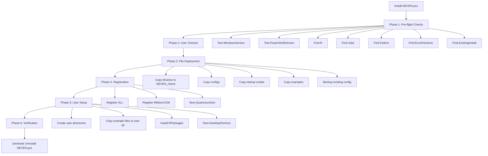

# Design Document — NEVEN Installer

## Overview

The NEVEN Installer is a single PowerShell script (`Install-NEVEN.ps1`) that automates the full deployment of the NEVEN Excel add-in on Windows 10+ (64-bit) systems. It replaces the existing C# GUI installer (`InstaladorRJ2XCL.cs` + `crear_instalador.ps1`) with a lightweight, zero-dependency approach that runs in any PowerShell 5.1+ terminal.

The installer executes six sequential phases: pre-flight checks, user choices, file deployment, registration, user setup, and verification. A companion `Uninstall-NEVEN.ps1` script is generated during installation to provide clean removal.

### Design Rationale

**PowerShell over C# GUI installer:**
- No compilation step needed (no `csc.exe`, no Visual Studio)
- Runs on all Windows 10+ systems out of the box (PowerShell 5.1 is built-in)
- Single file distribution alongside the `Dist/` folder
- Easier to maintain, audit, and modify than compiled C# with WinForms
- The existing C# installer targets the old `RJ2XCL` naming; a fresh PowerShell script avoids carrying legacy naming

**Single script architecture:**
- All logic in one `Install-NEVEN.ps1` file (~400-500 lines)
- Functions organized by phase for readability
- No external module dependencies — only built-in PowerShell cmdlets and .NET APIs

## Architecture



### Execution Flow

The script runs top-to-bottom through six phases. Each phase is a function that returns a success/failure status. Non-critical failures are logged and execution continues. Critical failures (wrong OS, wrong PowerShell version) cause an immediate exit.

### Privilege Model

The installer runs without elevation for the majority of operations:
- File copy to `C:\NEVEN\` (user-writable if created by the user, or the script creates it)
- HKCU registry writes (XLL registration, Ribbon COM registration)
- User directory creation under `%USERPROFILE%\Documents\`

Two operations may require elevation:
1. **COM registration** via `regsvr32` — attempted first without elevation; if it fails, the script offers to retry with `Start-Process -Verb RunAs`
2. **Quarto junction** at `C:\Quarto` — directory junctions at the root of `C:\` typically require admin; same elevation pattern

### Logging

All operations are logged to `$NEVEN_Home\install.log` with timestamps. The log format is:

```
[2025-01-15 14:30:22] INFO  Installation started
[2025-01-15 14:30:22] INFO  Windows 10.0.19045 (64-bit) — OK
[2025-01-15 14:30:23] WARN  R not found
[2025-01-15 14:30:45] ERROR Failed to register COM: Access denied
```

Each log entry has: `[timestamp] LEVEL message`

## Components and Interfaces

### Function Signatures

The script is organized as a set of PowerShell functions. Below are the complete signatures and responsibilities.

#### Logging

```powershell
function Write-Log {
    [CmdletBinding()]
    param(
        [Parameter(Mandatory)][string]$Message,
        [ValidateSet('INFO','WARN','ERROR')][string]$Level = 'INFO'
    )
    # Appends "[timestamp] LEVEL Message" to $script:LogFile
    # Also writes to host with color coding: INFO=White, WARN=Yellow, ERROR=Red
}
```

#### Phase 1: Pre-flight Checks

```powershell
function Test-WindowsVersion {
    [OutputType([bool])]
    param()
    # Returns $true if Windows 10+ (build >= 10240) and 64-bit OS
    # Checks [Environment]::Is64BitOperatingSystem and [Environment]::OSVersion.Version.Build
}

function Test-PowerShellVersion {
    [OutputType([bool])]
    param()
    # Returns $true if $PSVersionTable.PSVersion >= 5.1
}

function Find-R {
    [OutputType([PSCustomObject])]  # { Found, Path, Version, Adequate }
    param()
    # Search order:
    #   1. Registry: HKLM:\SOFTWARE\R-core\R → "InstallPath"
    #   2. PATH: Get-Command Rscript.exe -ErrorAction SilentlyContinue
    #   3. Filesystem: C:\Program Files\R\R-* (newest first)
    # Extracts version by running: & "$RHome\bin\Rscript.exe" --version
    # Returns object with Found=$true/$false, Path=R_Home, Version="4.4.1", Adequate=$true if >= 4.4.1
}

function Find-Julia {
    [OutputType([PSCustomObject])]  # { Found, Path, Version, Adequate }
    param()
    # Search order:
    #   1. PATH: Get-Command julia.exe -ErrorAction SilentlyContinue
    #   2. Filesystem: $env:LOCALAPPDATA\Programs\Julia-* (newest first)
    # Extracts version by running: & julia.exe --version
    # Returns object with Found, Path, Version, Adequate ($true if >= 1.12.6)
}

function Find-Python {
    [OutputType([PSCustomObject])]  # { Found, Path, Version, Adequate }
    param()
    # Search order:
    #   1. PATH: Get-Command python.exe -ErrorAction SilentlyContinue
    #   2. Registry: HKLM:\SOFTWARE\Python\PythonCore\*\InstallPath
    #   3. Filesystem: $env:LOCALAPPDATA\Programs\Python\Python3*
    # Extracts version by running: & python.exe --version
    # Returns object with Found, Path, Version, Adequate ($true if >= 3.10)
}

function Find-ExcelVersions {
    [OutputType([string[]])]
    param()
    # Scans HKCU:\Software\Microsoft\Office\{15.0,16.0}\Excel\Options
    # Returns array of version strings found (e.g., @("16.0"))
    # 15.0 = Excel 2013, 16.0 = Excel 2016/2019/365
}

function Find-ExistingInstall {
    [OutputType([PSCustomObject])]  # { Found, Path, HasConfig }
    param([string]$TargetPath)
    # Checks if $TargetPath exists and contains NEVEN64.xll
    # Returns object indicating whether an existing installation was found
}

function Show-PreflightSummary {
    param(
        [PSCustomObject]$RInfo,
        [PSCustomObject]$JuliaInfo,
        [PSCustomObject]$PythonInfo,
        [string[]]$ExcelVersions,
        [PSCustomObject]$ExistingInstall
    )
    # Displays a formatted summary table with color-coded status:
    #   ✓ Green  = Found and adequate
    #   ⚠ Yellow = Found but version too old, or optional and missing
    #   ✗ Red    = Required and missing
    # Shows download URLs for missing runtimes
}
```

#### Phase 2: User Choices

```powershell
function Get-UserChoices {
    [OutputType([PSCustomObject])]
    param(
        [PSCustomObject]$RInfo,
        [PSCustomObject]$JuliaInfo,
        [PSCustomObject]$ExistingInstall
    )
    # Interactive prompts:
    #   1. Installation directory (default: C:\NEVEN\)
    #   2. If R not found: continue without R? (y/n)
    #   3. If R found: install R packages? (y/n, default: y)
    #   4. Create desktop shortcut? (y/n, default: y)
    #   5. If existing install found: update/reinstall? (y/n)
    # Returns object: { InstallDir, ContinueWithoutR, InstallRPackages, CreateShortcut, IsUpdate }
}
```

#### Phase 3: File Deployment

```powershell
function Install-NEVENFiles {
    [OutputType([bool])]
    param(
        [Parameter(Mandatory)][string]$InstallDir,
        [Parameter(Mandatory)][string]$DistDir,
        [bool]$IsUpdate = $false
    )
    # Creates $InstallDir if not exists
    # If $IsUpdate and neven-config.json exists, backs up to neven-config.json.bak
    # Copies from $DistDir to $InstallDir:
    #   NEVEN64.xll, ControlR.exe, ControlJulia.exe, ControlPython.exe,
    #   NEVENRibbon.dll, neven-config.json, neven-languages.json
    # Creates startup/ subdirectory, copies startup.r, startup.jl, startup.py
    # Creates examples/ subdirectory, copies all files from Dist/examples/
    # Logs each file copy; continues on individual file failures
    # Returns $true if all critical files (NEVEN64.xll) were copied successfully
}
```

#### Phase 4: Registration

```powershell
function Register-XLL {
    [OutputType([bool])]
    param(
        [Parameter(Mandatory)][string]$XllPath,
        [Parameter(Mandatory)][string[]]$ExcelVersions
    )
    # For each Excel version in $ExcelVersions:
    #   Opens HKCU:\Software\Microsoft\Office\$ver\Excel\Options
    #   Scans existing OPEN, OPEN1, OPEN2... values
    #   If an existing NEVEN entry found → updates the path
    #   If no existing entry → finds next available OPENn key, sets value to /R "$XllPath"
    # Returns $true if at least one version was registered
}

function Unregister-XLL {
    [OutputType([void])]
    param([string]$XllPath, [string[]]$ExcelVersions)
    # Removes NEVEN XLL entries from all Excel version registry keys
    # Used by uninstaller
}

function Register-RibbonCOM {
    [OutputType([bool])]
    param([Parameter(Mandatory)][string]$DllPath)
    # Step 1: Run regsvr32 /s "$DllPath"
    #   Uses Start-Process -Wait -PassThru to capture exit code
    # Step 2: If exit code != 0, offer elevation:
    #   Start-Process regsvr32 -ArgumentList "/s `"$DllPath`"" -Verb RunAs -Wait
    # Step 3: If registration succeeded, create Ribbon registry key:
    #   Path: HKCU:\Software\Microsoft\Office\Excel\Addins\NEVENRibbon.Connect
    #   Values: FriendlyName="NEVEN", Description="NEVEN Ribbon Menu", LoadBehavior=3 (DWORD)
    # Returns $true if regsvr32 succeeded
}

function Unregister-RibbonCOM {
    [OutputType([void])]
    param([string]$DllPath)
    # Runs regsvr32 /u /s "$DllPath"
    # Removes HKCU:\Software\Microsoft\Office\Excel\Addins\NEVENRibbon.Connect
}

function New-QuartoJunction {
    [OutputType([bool])]
    param()
    # Checks if C:\Program Files\Quarto\ exists
    # If not → skip, log "Quarto not detected"
    # If C:\Quarto already exists → verify target, log "already configured"
    # Otherwise → cmd /c mklink /J C:\Quarto "C:\Program Files\Quarto"
    # If fails (access denied) → offer elevation via Start-Process -Verb RunAs
    # If user declines → log warning with manual command
    # Returns $true if junction exists and is correct after operation
}
```

#### Phase 5: User Setup

```powershell
function Initialize-UserDirectories {
    [OutputType([void])]
    param()
    # Creates:
    #   $env:USERPROFILE\Documents\NEVEN\functions\
    #   $env:USERPROFILE\Documents\NEVEN\graphics\
    # If directories already exist → log "already present", preserve contents
}

function Copy-ExampleFiles {
    [OutputType([void])]
    param(
        [Parameter(Mandatory)][string]$SourceExamplesDir,
        [Parameter(Mandatory)][string]$TargetFunctionsDir
    )
    # Copies .r, .jl, .py files from $SourceExamplesDir to $TargetFunctionsDir
    # If a file already exists in target → skip and log "preserved existing"
    # This preserves user modifications to example files
}

function Install-RPackages {
    [OutputType([bool])]
    param([Parameter(Mandatory)][string]$RscriptPath)
    # Invokes Rscript.exe to install packages in two batches:
    #   Batch 1 (base): stargazer, svDialogs, lmtest, sandwich, margins, plm,
    #     rpart, rpart.plot, PerformanceAnalytics, tseries, mFilter, e1071,
    #     wooldridge, lme4, survival, psych, car, Hmisc, forecast
    #   Batch 2 (visualization): plotly, htmlwidgets, ggplot2, corrplot
    # Displays progress for each batch
    # Logs failures per-package and continues
    # Returns $true if Rscript.exe executed without fatal error
}

function New-DesktopShortcut {
    [OutputType([void])]
    param(
        [Parameter(Mandatory)][string]$XllPath
    )
    # Creates a .lnk file on the Desktop using WScript.Shell COM object:
    #   Target: Excel.exe path (from registry or default)
    #   Arguments: /r "$XllPath"
    #   WorkingDir: NEVEN_Home
    #   IconLocation: NEVEN icon if available, else Excel default
    # If shortcut already exists → update target path
}
```

#### Phase 6: Verification

```powershell
function Test-Installation {
    [OutputType([PSCustomObject])]  # { AllPassed, Results[] }
    param(
        [Parameter(Mandatory)][string]$InstallDir,
        [Parameter(Mandatory)][string[]]$ExcelVersions
    )
    # Runs verification checks:
    #   1. NEVEN64.xll exists in $InstallDir
    #   2. ControlR.exe exists in $InstallDir
    #   3. neven-config.json exists in $InstallDir
    #   4. XLL is registered in Excel registry (at least one version)
    #   5. User functions directory exists
    # Returns object with AllPassed flag and array of individual results
}

function Show-InstallationResult {
    param(
        [PSCustomObject]$VerificationResult,
        [string]$InstallDir,
        [string]$LogPath
    )
    # If all checks passed:
    #   Displays green success message
    #   Shows test instruction: =NEVEN.R("1+1") should return 2
    # If some checks failed:
    #   Displays yellow warning with failed checks
    #   Points user to install.log for details
}
```

#### Uninstaller Generation

```powershell
function New-Uninstaller {
    [OutputType([void])]
    param(
        [Parameter(Mandatory)][string]$InstallDir,
        [Parameter(Mandatory)][string[]]$ExcelVersions
    )
    # Generates Uninstall-NEVEN.ps1 in $InstallDir
    # The generated script contains:
    #   - Confirmation prompt
    #   - Excel running check
    #   - regsvr32 /u /s for NEVENRibbon.dll
    #   - XLL registry removal for all detected Excel versions
    #   - Ribbon registry key removal
    #   - Prompt to delete user scripts (Documents\NEVEN\)
    #   - Quarto junction removal (if created by installer)
    #   - NEVEN_Home directory removal
    #   - Desktop shortcut removal
    #   - Summary of removed components
}
```

### Script Entry Point

```powershell
# Install-NEVEN.ps1 — Main entry point
param(
    [string]$InstallDir = 'C:\NEVEN',
    [string]$DistDir = (Join-Path $PSScriptRoot 'Dist'),
    [switch]$Silent
)

$ErrorActionPreference = 'Continue'
$script:LogFile = $null  # Set after InstallDir is confirmed

# --- Phase 1: Pre-flight ---
# Test-WindowsVersion, Test-PowerShellVersion → exit if fail
# Find-R, Find-Julia, Find-Python, Find-ExcelVersions, Find-ExistingInstall
# Show-PreflightSummary

# --- Phase 2: User Choices ---
# Get-UserChoices → $choices

# --- Phase 3: File Deployment ---
# Install-NEVENFiles -InstallDir $choices.InstallDir -DistDir $DistDir -IsUpdate $choices.IsUpdate

# --- Phase 4: Registration ---
# Register-XLL, Register-RibbonCOM, New-QuartoJunction

# --- Phase 5: User Setup ---
# Initialize-UserDirectories, Copy-ExampleFiles, Install-RPackages, New-DesktopShortcut

# --- Phase 6: Verification ---
# Test-Installation, Show-InstallationResult, New-Uninstaller
```

## Data Models

### Configuration Files

**neven-config.json** — Deployed to `NEVEN_Home`, patched at install time with detected paths:

```json
{
  "NEVEN": {
    "functionsDirectory": "%USERPROFILE%\\Documents\\NEVEN\\functions",
    "graphicsDirectory": "%USERPROFILE%\\Documents\\NEVEN\\graphics",
    "logFile": "%NEVEN_HOME%\\neven.log",
    "R": { "home": "C:\\Program Files\\R\\R-4.4.1" },
    "Julia": { "home": "C:\\Users\\user\\AppData\\Local\\Programs\\Julia-1.12.6" },
    "Python": { "home": "" }
  }
}
```

The installer patches the `R.home` and `Julia.home` fields with detected paths. If a runtime is not found, the field is left as an empty string.

**neven-languages.json** — Deployed as-is from `Dist/`, no patching needed.

### Registry Keys

**XLL Registration** (per Excel version):

| Path | Value Name | Value Data | Type |
|:---|:---|:---|:---|
| `HKCU:\Software\Microsoft\Office\16.0\Excel\Options` | `OPEN` (or `OPEN1`, `OPEN2`...) | `/R "C:\NEVEN\NEVEN64.xll"` | REG_SZ |

The `OPEN` key naming convention: Excel uses `OPEN` for the first add-in, `OPEN1` for the second, etc. The installer scans existing values to find the next available slot, or updates an existing NEVEN entry.

**Ribbon COM Registration**:

| Path | Value Name | Value Data | Type |
|:---|:---|:---|:---|
| `HKCU:\Software\Microsoft\Office\Excel\Addins\NEVENRibbon.Connect` | `FriendlyName` | `NEVEN` | REG_SZ |
| | `Description` | `NEVEN Ribbon Menu` | REG_SZ |
| | `LoadBehavior` | `3` | REG_DWORD |

### Directory Structure Created

```
C:\NEVEN\                          ← NEVEN_Home
├── NEVEN64.xll                    ← Excel add-in DLL
├── ControlR.exe                   ← R child process
├── ControlJulia.exe               ← Julia child process
├── ControlPython.exe              ← Python child process
├── NEVENRibbon.dll                ← COM Ribbon add-in
├── neven-config.json              ← Main configuration
├── neven-languages.json           ← Language definitions
├── install.log                    ← Installation log
├── Uninstall-NEVEN.ps1            ← Generated uninstaller
├── startup/
│   ├── startup.r
│   ├── startup.jl
│   └── startup.py
└── examples/
    ├── R/
    │   ├── excel-functions.r
    │   ├── excel-scripting.r
    │   └── functions.r
    ├── Julia/
    │   ├── excel-scripting.jl
    │   ├── functions.jl
    │   └── julia-rich-output.jl
    └── Python/
        └── quarto_functions.py

%USERPROFILE%\Documents\NEVEN\     ← User data
├── functions/                     ← User scripts + copied examples
│   ├── functions.r
│   ├── functions.jl
│   └── ...
└── graphics/                      ← Generated graphics output
```

### Install Log Format

```
========================================
NEVEN Installer Log
Started: 2025-01-15 14:30:22
========================================
[2025-01-15 14:30:22] INFO  Windows 10.0.19045 (64-bit) — OK
[2025-01-15 14:30:22] INFO  PowerShell 5.1.19041.5007 — OK
[2025-01-15 14:30:23] INFO  R 4.4.1 found at C:\Program Files\R\R-4.4.1
[2025-01-15 14:30:23] WARN  Julia not found
[2025-01-15 14:30:23] INFO  Python 3.12.0 found
[2025-01-15 14:30:23] INFO  Excel 16.0 detected
[2025-01-15 14:30:25] INFO  Install directory: C:\NEVEN
[2025-01-15 14:30:25] INFO  Copied NEVEN64.xll
[2025-01-15 14:30:25] INFO  Copied ControlR.exe
...
[2025-01-15 14:30:30] INFO  XLL registered for Excel 16.0
[2025-01-15 14:30:31] INFO  Ribbon COM registered
[2025-01-15 14:30:32] INFO  Verification: 5/5 checks passed
========================================
Completed: 2025-01-15 14:30:32
Duration: 10 seconds
========================================
```


## Correctness Properties

*A property is a characteristic or behavior that should hold true across all valid executions of a system — essentially, a formal statement about what the system should do. Properties serve as the bridge between human-readable specifications and machine-verifiable correctness guarantees.*

### Property 1: Language detection finds runtimes present on the system

*For any* system configuration where a language runtime (R, Julia, or Python) is installed at one of the known search locations (registry, PATH, or standard filesystem path), the corresponding `Find-*` function shall return `Found = $true` with the correct path. Conversely, *for any* system configuration where the runtime is absent from all search locations, the function shall return `Found = $false`.

**Validates: Requirements 1.1, 1.2, 1.3**

### Property 2: Version string parsing extracts correct version tuple

*For any* valid version output string produced by `Rscript --version`, `julia --version`, or `python --version`, the version parser shall extract a `[major, minor, patch]` tuple that matches the version numbers embedded in the string. The `Adequate` flag shall be `$true` if and only if the extracted version is greater than or equal to the minimum required version for that runtime.

**Validates: Requirements 1.4, 1.5, 1.6, 1.8, 1.10**

### Property 3: XLL registration is idempotent — no duplicate entries

*For any* initial state of the Excel `Options` registry key (containing zero or more existing `OPEN`/`OPEN1`/`OPEN2`... values, possibly including a prior NEVEN entry), running `Register-XLL` shall result in exactly one NEVEN XLL entry. Running `Register-XLL` a second time on the resulting state shall not change the number of entries or create duplicates.

**Validates: Requirements 4.1, 4.2, 12.4**

### Property 4: User files are preserved across installation and update

*For any* set of pre-existing files in the `User_Functions_Dir` or `User_Graphics_Dir`, running the installer (whether fresh install or update) shall not delete, modify, or overwrite those files. Example files that already exist in the user directory shall be skipped.

**Validates: Requirements 6.3, 6.4, 7.4, 12.3**

### Property 5: Non-critical failures do not halt installation

*For any* sequence of installation operations where one or more non-critical operations fail (file copy, R package install), the installer shall log each failure and continue executing the remaining operations. The total number of operations attempted shall equal the total number of planned operations regardless of individual failures.

**Validates: Requirements 3.7, 9.5**

### Property 6: Config backup preserves original content on update

*For any* existing `neven-config.json` file in `NEVEN_Home`, when the installer runs in update mode, it shall create a `neven-config.json.bak` file whose content is byte-identical to the original `neven-config.json` before overwriting with the new template.

**Validates: Requirements 12.2**

### Property 7: Verification reports all failures

*For any* combination of verification check results (pass/fail for each of the 5 checks), the warning message shall list every failed check. The number of failures mentioned in the output shall equal the number of checks that actually failed.

**Validates: Requirements 14.3, 14.5**

## Error Handling

### Strategy: Continue on Non-Critical, Abort on Critical

The installer distinguishes between critical and non-critical failures:

**Critical failures (abort immediately):**
- Windows version < 10 or not 64-bit → display error, exit with code 1
- PowerShell version < 5.1 → display error, exit with code 1
- `Dist/` directory not found or missing `NEVEN64.xll` → display error, exit with code 1

**Non-critical failures (log and continue):**
- Individual file copy failure → log ERROR with filename, continue with remaining files
- `regsvr32` failure → log WARN, offer elevation retry, continue if declined
- Quarto junction failure → log WARN, show manual command, continue
- R package installation failure → log WARN per package, continue with remaining packages
- Desktop shortcut creation failure → log WARN, continue
- Excel not detected (no registry keys) → log WARN, skip XLL registration

### Error Handling Patterns

```powershell
# Pattern 1: Critical check — abort
if (-not (Test-WindowsVersion)) {
    Write-Log "Windows 10+ (64-bit) required. Found: $osInfo" -Level ERROR
    Write-Host "ERROR: This installer requires Windows 10 or later (64-bit)." -ForegroundColor Red
    exit 1
}

# Pattern 2: Non-critical file operation — log and continue
foreach ($file in $filesToCopy) {
    try {
        Copy-Item -Path $file.Source -Destination $file.Dest -Force
        Write-Log "Copied $($file.Name)"
    }
    catch {
        Write-Log "Failed to copy $($file.Name): $_" -Level ERROR
        $script:HasWarnings = $true
    }
}

# Pattern 3: Privilege escalation — try, offer elevation, accept decline
$result = Start-Process regsvr32 -ArgumentList "/s `"$DllPath`"" -Wait -PassThru
if ($result.ExitCode -ne 0) {
    Write-Log "regsvr32 failed (exit code $($result.ExitCode)). Elevation may be required." -Level WARN
    $retry = Read-Host "Retry with administrator privileges? (y/n)"
    if ($retry -eq 'y') {
        try {
            Start-Process regsvr32 -ArgumentList "/s `"$DllPath`"" -Verb RunAs -Wait
        }
        catch {
            Write-Log "Elevated regsvr32 also failed: $_" -Level ERROR
        }
    }
    else {
        Write-Log "User declined elevation. Ribbon will not be available." -Level WARN
    }
}
```

### Exit Codes

| Code | Meaning |
|:---|:---|
| 0 | Installation completed (possibly with non-critical warnings) |
| 1 | Critical pre-flight check failed (wrong OS, wrong PS version, missing Dist) |

## Testing Strategy

### Approach

The NEVEN installer is a PowerShell script that performs filesystem I/O, registry operations, and external process invocations. Testing requires a combination of:

1. **Pester unit tests** — for pure logic functions (version parsing, registry key slot finding, verification logic)
2. **Pester integration tests** — for filesystem and registry operations using temp directories and `TestRegistry:` drives
3. **Property-based tests** — for functions with meaningful input variation (language detection, XLL registration idempotency, version parsing)

### Property-Based Testing

**Library:** [PSQuickCheck](https://github.com/functionaldude/PSQuickCheck) or a custom lightweight PBT harness using Pester with randomized inputs, since PowerShell PBT libraries are limited. The practical approach is to write Pester tests that generate 100+ random inputs per property using PowerShell's `Get-Random` and custom generators.

**Configuration:** Minimum 100 iterations per property test.

**Tag format:** `Feature: neven-installer, Property {number}: {property_text}`

Each correctness property maps to a single property-based test:

| Property | Test File | Generator |
|:---|:---|:---|
| 1: Language detection | `Tests/Find-Language.Tests.ps1` | Random combinations of registry entries, PATH entries, filesystem paths |
| 2: Version parsing | `Tests/Parse-Version.Tests.ps1` | Random valid version strings in R/Julia/Python formats |
| 3: XLL idempotency | `Tests/Register-XLL.Tests.ps1` | Random initial OPEN key states (0-10 existing entries, with/without NEVEN) |
| 4: User file preservation | `Tests/UserFiles.Tests.ps1` | Random pre-existing files with random content |
| 5: Error resilience | `Tests/ErrorResilience.Tests.ps1` | Random failure injection into file copy and package install sequences |
| 6: Config backup | `Tests/ConfigBackup.Tests.ps1` | Random JSON config content |
| 7: Verification reporting | `Tests/Verification.Tests.ps1` | Random pass/fail combinations for 5 checks |

### Unit Tests (Example-Based)

Pester tests for specific scenarios and edge cases:

| Test Area | Scenarios |
|:---|:---|
| Pre-flight checks | Windows version too old, PS version too old, correct versions |
| Display logic | R found/adequate, R found/old, R missing, Julia missing, Python missing |
| Missing runtime guidance | Download URLs displayed, continue-without-R prompt |
| XLL registration | No Excel detected, single version, multiple versions |
| Ribbon COM | regsvr32 success, failure, elevated retry |
| Quarto junction | Quarto present, absent, junction already exists, permission denied |
| Uninstaller generation | Script contains all required cleanup operations |
| Desktop shortcut | Creation, update existing, icon selection |

### Integration Tests

End-to-end tests using a temp directory as `NEVEN_Home` and `TestRegistry:` PSDrive for registry operations:

| Test | What It Verifies |
|:---|:---|
| Fresh install | All files deployed, registry entries created, user dirs created, log written |
| Update install | Config backed up, binaries overwritten, user files preserved |
| Uninstall | All files removed, registry cleaned, user files optionally preserved |
| Idempotent install | Running twice produces same result as running once |

### Test Execution

```powershell
# Run all tests
Invoke-Pester -Path ./Tests/ -Output Detailed

# Run only property-based tests
Invoke-Pester -Path ./Tests/ -Tag 'Property' -Output Detailed

# Run only unit tests
Invoke-Pester -Path ./Tests/ -Tag 'Unit' -Output Detailed
```
