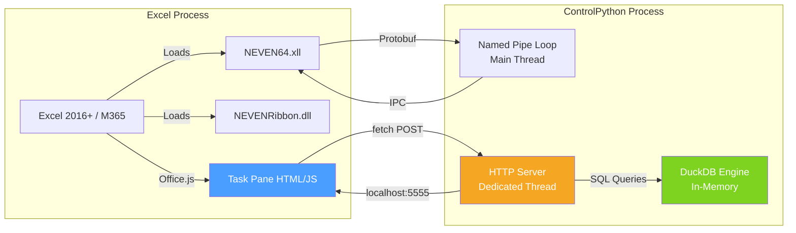
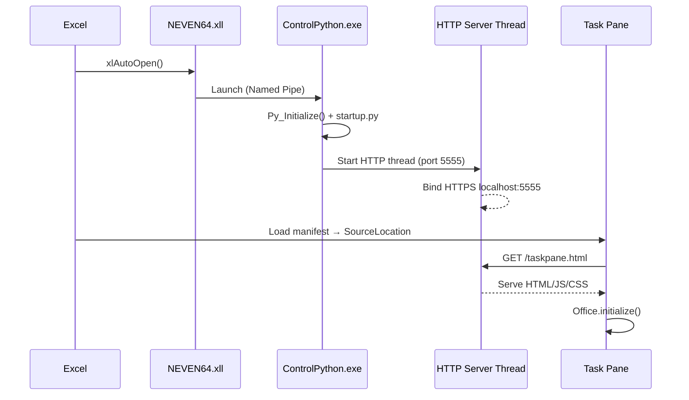
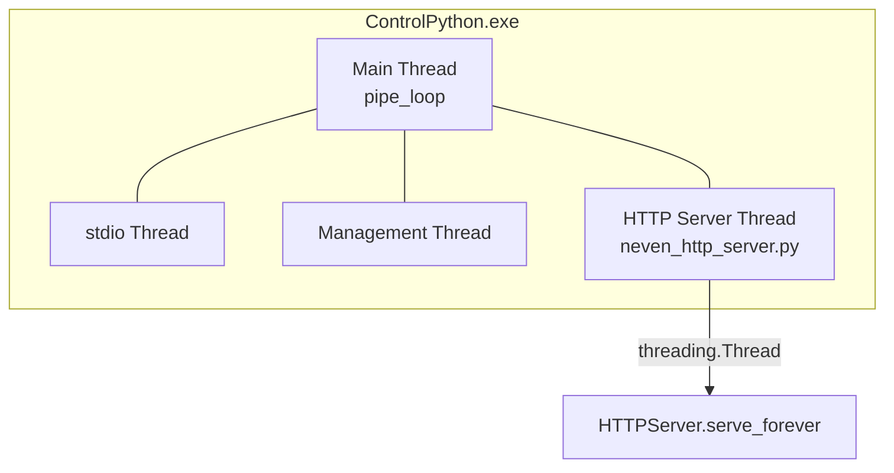
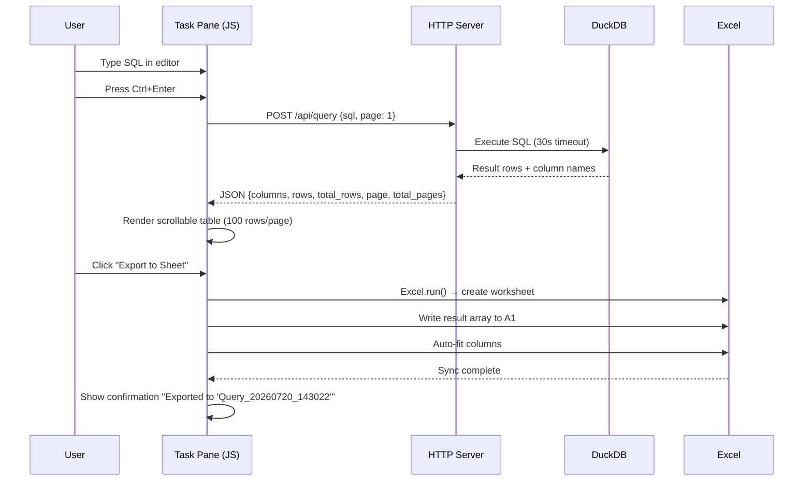
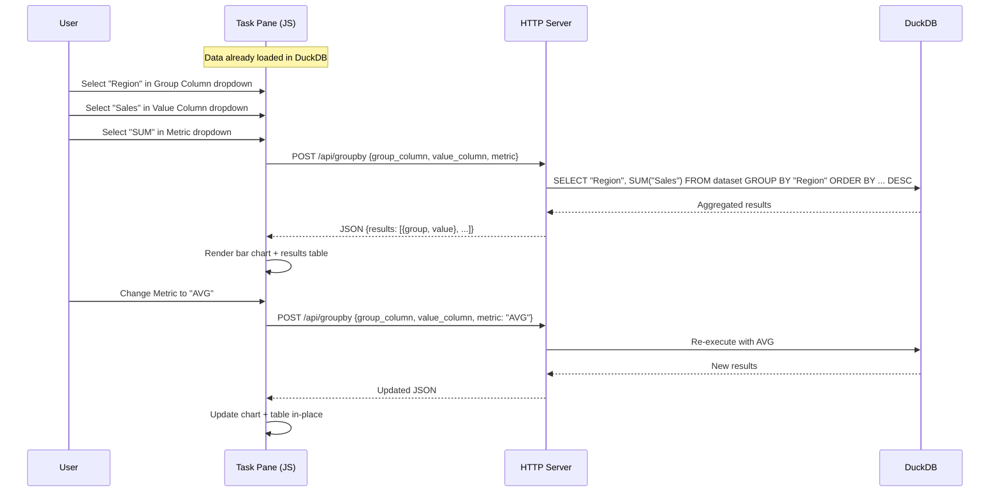
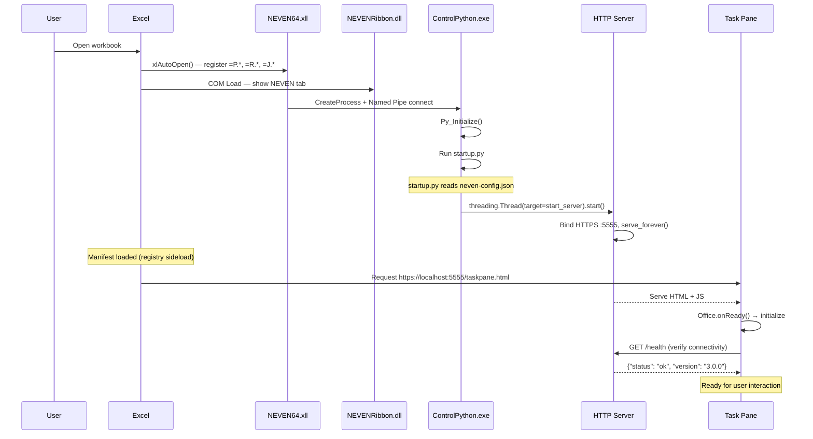

# NEVEN v3.0 Task Pane — Technical Design Document

## Overview

NEVEN v3.0 Task Pane embeds an interactive analytics panel inside Excel using the Office.js API, enabling bidirectional communication between the HTML/JS panel and Excel cells. Users can select ranges, run DuckDB-powered queries (GROUP BY, SQL, descriptive statistics), and export results — all without leaving Excel. The feature coexists with the existing NEVEN64.xll (worksheet functions) and NEVENRibbon.dll (COM Ribbon) on the same machine.

Key technical decisions:
- **HTTP server in ControlPython** on a dedicated Python thread (port 5555, HTTPS with self-signed cert)
- **Office.js** for reading/writing Excel data from the Task Pane
- **DuckDB** as the in-memory analytical engine for fast aggregation on large datasets (1M+ rows)
- **Registry-based sideload** for deployment without AppSource publication
- **Fallback to WebView2** when Task Pane is disabled or unsupported

## Architecture

### System Diagram



### Component Responsibilities

| Component | Responsibility |
|---|---|
| **manifest.xml** | Registers the Task Pane with Excel, declares coexistence with XLL |
| **Task Pane (taskpane.html + taskpane.js)** | UI layer: reads Excel ranges via Office.js, renders results, sends API requests |
| **HTTP Server (neven_http_server.py)** | Serves static assets, exposes REST API endpoints, bridges to DuckDB |
| **DuckDB** | In-memory analytical SQL engine for fast aggregation on large datasets |
| **NEVEN64.xll** | Existing XLL functions (=P.*, =R.*, =J.*) — unchanged |
| **NEVENRibbon.dll** | Existing COM Ribbon — adds "NEVEN Studio" button to open Task Pane |
| **ControlPython.exe** | Host process for Python + HTTP server thread |

### Startup Sequence



---

## Components and Interfaces

### manifest.xml

Full Office Web Add-in manifest conforming to schema version 1.1 (Req 1).

```xml
<?xml version="1.0" encoding="UTF-8"?>
<OfficeApp xmlns="http://schemas.microsoft.com/office/appforoffice/1.1"
           xmlns:xsi="http://www.w3.org/2001/XMLSchema-instance"
           xmlns:bt="http://schemas.microsoft.com/office/officeappbasictypes/1.0"
           xsi:type="TaskPaneApp">

  <Id>a1b2c3d4-e5f6-7890-abcd-ef1234567890</Id>
  <Version>3.0.0.0</Version>
  <ProviderName>NEVEN Project</ProviderName>
  <DefaultLocale>es-ES</DefaultLocale>
  <DisplayName DefaultValue="NEVEN Studio"/>
  <Description DefaultValue="Análisis interactivo embebido en Excel — DuckDB, GROUP BY en vivo, SQL"/>
  <IconUrl DefaultValue="https://localhost:5555/assets/icon-32.png"/>
  <HighResolutionIconUrl DefaultValue="https://localhost:5555/assets/icon-64.png"/>
  <SupportUrl DefaultValue="https://localhost:5555/taskpane.html"/>

  <Hosts>
    <Host Name="Workbook"/>
  </Hosts>

  <Requirements>
    <Sets>
      <Set Name="ExcelApi" MinVersion="1.1"/>
    </Sets>
  </Requirements>

  <DefaultSettings>
    <SourceLocation DefaultValue="https://localhost:5555/taskpane.html"/>
  </DefaultSettings>

  <Permissions>ReadWriteDocument</Permissions>

  <!-- Coexistence: prevent Excel from disabling the XLL (Req 9) -->
  <EquivalentAddins>
    <EquivalentAddin>
      <FileName>NEVEN64.xll</FileName>
      <Type>XLL</Type>
    </EquivalentAddin>
  </EquivalentAddins>

</OfficeApp>
```

**Key decisions:**
- `ReadWriteDocument` permission enables both reading selected ranges and writing results back (Req 3, Req 4).
- `EquivalentAddins` declares the XLL so Excel keeps both active simultaneously (Req 9, AC 3).
- `SourceLocation` points to HTTPS localhost — required by Office.js security model (Req 2, AC 7).
- A unique GUID will be generated at build time for the `<Id>` element.

---

### HTTP Server (neven_http_server.py)

**Threading model:** The HTTP server runs on a dedicated Python thread, started from `startup.py` after ControlPython initializes. It does NOT block the Named Pipe loop in `control_python.cc` (Req 2, AC 5).



**Implementation approach:**
- The C++ `main()` in `control_python.cc` calls `PythonInit()` which runs `startup.py`.
- `startup.py` imports `neven_http_server` and calls `start_server()` on a daemon thread.
- The HTTP server uses Python's `http.server` (stdlib) wrapped with `ssl` for HTTPS.
- DuckDB queries run on the HTTP server thread — safe because DuckDB is thread-safe for reads.

#### Endpoints

| Method | Path | Purpose | Req |
|--------|------|---------|-----|
| GET | `/health` | Server status check | Req 2, AC 3 |
| GET | `/taskpane.html` | Serve main Task Pane HTML | Req 2, AC 2 |
| GET | `/assets/*` | Static files (CSS, JS, icons) | Req 2, AC 2 |
| GET | `/viewers/*` | Existing viewer HTML files | Req 11, AC 3 |
| POST | `/api/analyze` | Descriptive statistics | Req 6 |
| POST | `/api/groupby` | Live GROUP BY aggregation | Req 7 |
| POST | `/api/query` | Arbitrary SQL execution | Req 8 |

#### HTTPS Configuration

```python
import ssl

ssl_context = ssl.SSLContext(ssl.PROTOCOL_TLS_SERVER)
ssl_context.load_cert_chain(
    certfile=cert_path,  # From neven-config.json TaskPane.certPath
    keyfile=key_path
)
server.socket = ssl_context.wrap_socket(server.socket, server_side=True)
```

The self-signed certificate is generated once during installation by `Install-NEVEN.ps1` using:
```powershell
openssl req -x509 -newkey rsa:2048 -keyout localhost.key -out localhost.crt \
  -days 3650 -nodes -subj "/CN=localhost"
```

#### CORS Configuration

All responses include (Req 2, AC 4):
```
Access-Control-Allow-Origin: https://localhost:5555
Access-Control-Allow-Methods: GET, POST, OPTIONS
Access-Control-Allow-Headers: Content-Type
Access-Control-Max-Age: 86400
```

#### Port Fallback Logic (Req 2, AC 6)

```python
def start_server():
    for port in [5555, 5556]:
        try:
            server = HTTPServer(('127.0.0.1', port), NEVENHandler)
            log(f"HTTP server bound to port {port}")
            break
        except OSError as e:
            log(f"Port {port} unavailable: {e}")
    else:
        log("FATAL: Cannot bind HTTP server", level="ERROR")
        return
    server.serve_forever()
```

#### Request/Response JSON Schemas

**POST /api/analyze** (Req 6)
```json
// Request
{
  "data": [[col1, col2, ...], [val1, val2, ...], ...],
  "columns": ["A", "B", "C"],
  "types": {"A": "numeric", "B": "text", "C": "date"}
}

// Response (200 OK)
{
  "status": "ok",
  "statistics": [
    {
      "column": "A",
      "type": "numeric",
      "count": 50000,
      "mean": 42.5,
      "std": 12.3,
      "min": 1.0,
      "q25": 33.0,
      "q50": 42.0,
      "q75": 52.0,
      "max": 99.0
    }
  ],
  "row_count": 50000,
  "col_count": 3
}
```

**POST /api/groupby** (Req 7)
```json
// Request
{
  "group_column": "Region",
  "value_column": "Sales",
  "metric": "SUM"
}

// Response (200 OK)
{
  "status": "ok",
  "results": [
    {"group": "Norte", "value": 125000.0},
    {"group": "Sur", "value": 98000.0}
  ],
  "metric": "SUM",
  "row_count": 2
}
```

**POST /api/query** (Req 8)
```json
// Request
{
  "sql": "SELECT Region, AVG(Sales) FROM dataset GROUP BY Region",
  "page": 1,
  "page_size": 100
}

// Response (200 OK)
{
  "status": "ok",
  "columns": ["Region", "avg(Sales)"],
  "rows": [["Norte", 450.0], ["Sur", 320.0]],
  "total_rows": 2,
  "page": 1,
  "total_pages": 1
}

// Response (400 Bad Request — syntax error, Req 8 AC 5)
{
  "status": "error",
  "message": "Parser Error: syntax error at or near \"SELEC\""
}

// Response (408 Request Timeout — Req 8 AC 6)
{
  "status": "error",
  "message": "Query exceeded 30 second timeout"
}
```

---

### Task Pane Frontend (taskpane.html + taskpane.js)

#### Office.js Initialization

```javascript
Office.onReady(function(info) {
    if (info.host === Office.HostType.Excel) {
        initializeApp();
        registerSelectionHandler();
    }
});
```

#### Range Reading with Chunking (Req 3, AC 2)

For datasets > 100,000 rows, data is read in chunks of 50,000 to avoid Office.js memory limits:

```javascript
async function readRangeChunked(rangeAddress, totalRows, totalCols) {
    const CHUNK_SIZE = 50000;
    let allData = [];
    
    for (let startRow = 0; startRow < totalRows; startRow += CHUNK_SIZE) {
        const endRow = Math.min(startRow + CHUNK_SIZE, totalRows);
        await Excel.run(async (context) => {
            const sheet = context.workbook.worksheets.getActiveWorksheet();
            const chunk = sheet.getRangeByIndexes(startRow, 0, endRow - startRow, totalCols);
            chunk.load("values");
            await context.sync();
            allData = allData.concat(chunk.values);
        });
    }
    return allData;
}
```

#### Selection Change Event Handler (Req 5)

```javascript
async function registerSelectionHandler() {
    await Excel.run(async (context) => {
        const sheet = context.workbook.worksheets.getActiveWorksheet();
        sheet.onSelectionChanged.add(onSelectionChanged);
        await context.sync();
    });
}

async function onSelectionChanged(event) {
    updateStatusBar(event.address);  // Always update address (Req 5, AC 2)
    
    if (document.getElementById('autoLoadToggle').checked) {
        await loadDataFromSelection();  // Auto-load if enabled (Req 5, AC 3)
    }
}
```

#### UI Structure

```
┌─────────────────────────────────────┐
│  NEVEN Studio          [≡] [×]     │
├─────────────────────────────────────┤
│  [Data Studio] [Viewers] [SQL]      │  ← Tab navigation
├─────────────────────────────────────┤
│                                     │
│  Tab Content Area                   │
│  • Data Studio: Analyze, GROUP BY   │
│  • Viewers: Dashboard, Geodata...   │
│  • SQL: Query editor + results      │
│                                     │
├─────────────────────────────────────┤
│  Status: Sheet1!A1:D50000 (50K×4)  │  ← Status bar
│  [Auto-load: ON]                    │
└─────────────────────────────────────┘
```

**Tab: Data Studio** (Req 6, Req 7)
- "Load Data" button → reads selected range
- Preview table (first 20 rows)
- "Analyze" button → POST /api/analyze
- GROUP BY controls: Group Column dropdown, Value Column dropdown, Metric dropdown
- Results area: formatted table + bar chart (using lightweight charting, e.g., Chart.js)

**Tab: Viewers** (Req 11)
- Navigation menu: Dashboard, Geodata, Timeline, Network, ML Reports
- Viewer container (iframe) loads from `/viewers/{type}.html`
- Loaded dataset persists in memory across viewer switches (Req 11, AC 5)

**Tab: SQL** (Req 8)
- Text area with basic SQL keyword highlighting (CSS-based)
- Execute button + Ctrl+Enter shortcut
- Scrollable results table with pagination (100 rows/page, Req 8 AC 7)
- Error display area below input
- "Export to Sheet" button

#### Communication with HTTP Server

All API calls use `fetch()` to `https://localhost:5555`:

```javascript
async function apiCall(endpoint, body) {
    try {
        const response = await fetch(`https://localhost:5555${endpoint}`, {
            method: 'POST',
            headers: { 'Content-Type': 'application/json' },
            body: JSON.stringify(body)
        });
        if (!response.ok) {
            const error = await response.json();
            throw new Error(error.message || `HTTP ${response.status}`);
        }
        return await response.json();
    } catch (err) {
        showError(err.message);
        throw err;
    }
}
```

---

### DuckDB Integration

#### In-Memory Table Creation

When data arrives at `/api/analyze` or is loaded for the first time:

```python
import duckdb

# Global connection — one per HTTP server lifetime
db = duckdb.connect(database=':memory:')

def load_data(columns, rows):
    """Create/replace the 'dataset' table from received data."""
    db.execute("DROP TABLE IF EXISTS dataset")
    
    # Build CREATE TABLE from detected types
    col_defs = ', '.join(f'"{c}" {sql_type(t)}' for c, t in columns.items())
    db.execute(f"CREATE TABLE dataset ({col_defs})")
    
    # Bulk insert using DuckDB's native list ingestion
    db.executemany(
        f"INSERT INTO dataset VALUES ({','.join(['?']*len(columns))})",
        rows
    )
```

#### Query Execution with Timeout (Req 8, AC 6)

```python
import signal
import threading

QUERY_TIMEOUT_SEC = 30

def execute_query_with_timeout(sql, page=1, page_size=100):
    """Execute SQL with 30s timeout. Returns paginated results."""
    result_holder = {}
    error_holder = {}
    
    def run_query():
        try:
            result = db.execute(sql).fetchall()
            result_holder['data'] = result
            result_holder['columns'] = [desc[0] for desc in db.description]
        except Exception as e:
            error_holder['message'] = str(e)
    
    thread = threading.Thread(target=run_query)
    thread.start()
    thread.join(timeout=QUERY_TIMEOUT_SEC)
    
    if thread.is_alive():
        db.interrupt()
        return None, "Query exceeded 30 second timeout"
    
    if 'message' in error_holder:
        return None, error_holder['message']
    
    # Paginate results (Req 8, AC 7)
    all_rows = result_holder['data']
    total = len(all_rows)
    start = (page - 1) * page_size
    end = min(start + page_size, total)
    
    return {
        'columns': result_holder['columns'],
        'rows': all_rows[start:end],
        'total_rows': total,
        'page': page,
        'total_pages': (total + page_size - 1) // page_size
    }, None
```

#### GROUP BY Endpoint Logic (Req 7)

```python
VALID_METRICS = {'SUM', 'AVG', 'COUNT', 'MIN', 'MAX', 'MEDIAN'}

def execute_groupby(group_column, value_column, metric):
    """Execute GROUP BY with validated metric."""
    if metric.upper() not in VALID_METRICS:
        raise ValueError(f"Invalid metric: {metric}")
    
    # MEDIAN requires special handling in DuckDB
    if metric.upper() == 'MEDIAN':
        agg_expr = f'MEDIAN("{value_column}")'
    else:
        agg_expr = f'{metric.upper()}("{value_column}")'
    
    sql = f'''
        SELECT "{group_column}" as "group", {agg_expr} as "value"
        FROM dataset
        GROUP BY "{group_column}"
        ORDER BY "value" DESC
    '''
    
    result = db.execute(sql).fetchall()
    return [{"group": row[0], "value": row[1]} for row in result]
```

#### Result Pagination (Req 8, AC 7)

- Default page size: 100 rows
- Client sends `page` parameter (1-indexed)
- Response includes `total_rows` and `total_pages` for navigation controls
- For results ≤ 100 rows, pagination is implicit (single page)

---

### Deployment / Sideload

#### Registry-Based Sideload (Req 10, AC 2)

Primary method — no network share needed:

```powershell
# Registry key for Office Web Add-in developer sideload
$regPath = "HKCU:\Software\Microsoft\Office\16.0\WEF\Developer\"
$manifestPath = "\\$InstallDir\manifest.xml"

if (-not (Test-Path $regPath)) {
    New-Item -Path $regPath -Force | Out-Null
}
New-ItemProperty -Path $regPath -Name "NEVENStudio" -Value $manifestPath -PropertyType String -Force
```

#### Shared Folder Catalog Alternative (Req 10, AC 1)

For enterprise deployments with multiple machines:

```powershell
# 1. Copy manifest to network share
$sharePath = "\\server\neven-addins"
Copy-Item "$InstallDir\manifest.xml" -Destination $sharePath

# 2. Configure Excel Trusted Catalog
$catalogRegPath = "HKCU:\Software\Microsoft\Office\16.0\WEF\TrustedCatalogs\neven-catalog"
New-Item -Path $catalogRegPath -Force | Out-Null
Set-ItemProperty -Path $catalogRegPath -Name "Url" -Value $sharePath
Set-ItemProperty -Path $catalogRegPath -Name "Flags" -Value 1  # Visible in menu
```

#### Install-NEVEN.ps1 Additions (Req 10, AC 4-5)

New Phase 4b added after existing XLL/COM registration:

```powershell
# ─── Phase 4b: Task Pane Registration ───

function Register-TaskPane {
    param(
        [Parameter(Mandatory)][string]$InstallDir,
        [Parameter(Mandatory)][string[]]$ExcelVersions
    )
    
    # Verify Excel version >= 16.0 (Req 10, AC 4)
    $hasExcel16 = $ExcelVersions | Where-Object { [double]$_ -ge 16.0 }
    if (-not $hasExcel16) {
        Write-Log "Excel 2016+ not detected — Task Pane sideload skipped" -Level WARN
        Write-Log "Task Pane requires Excel 2016 (build 16.0.4266+) or Microsoft 365" -Level WARN
        return $false  # (Req 10, AC 5)
    }
    
    # Generate self-signed certificate for HTTPS
    $certDir = Join-Path $InstallDir 'certs'
    if (-not (Test-Path $certDir)) {
        New-Item -Path $certDir -ItemType Directory -Force | Out-Null
    }
    
    $certPath = Join-Path $certDir 'localhost.crt'
    $keyPath = Join-Path $certDir 'localhost.key'
    
    if (-not (Test-Path $certPath)) {
        # Use PowerShell native cert generation (no openssl dependency)
        $cert = New-SelfSignedCertificate -DnsName "localhost" -CertStoreLocation "Cert:\CurrentUser\My" `
            -NotAfter (Get-Date).AddYears(10) -KeySpec KeyExchange
        Export-Certificate -Cert $cert -FilePath $certPath -Type CERT | Out-Null
        # Export PFX for Python ssl module
        $pfxPath = Join-Path $certDir 'localhost.pfx'
        Export-PfxCertificate -Cert $cert -FilePath $pfxPath -Password (ConvertTo-SecureString -String "" -AsPlainText -Force) | Out-Null
        Write-Log "Generated self-signed certificate for localhost"
    }
    
    # Register via WEF\Developer registry key
    $regPath = "HKCU:\Software\Microsoft\Office\16.0\WEF\Developer\"
    $manifestPath = Join-Path $InstallDir 'manifest.xml'
    
    if (-not (Test-Path $regPath)) {
        New-Item -Path $regPath -Force | Out-Null
    }
    New-ItemProperty -Path $regPath -Name "NEVENStudio" -Value $manifestPath -PropertyType String -Force | Out-Null
    Write-Log "Registered Task Pane manifest via WEF\Developer registry"
    
    return $true
}
```

---

### Configuration (neven-config.json)

New `"TaskPane"` section added to the existing configuration (Req 12, AC 3):

```json
{
  "NEVEN": { ... },
  "WebView2": { ... },
  "Pluto": { ... },
  "AI": { ... },
  "TaskPane": {
    "enabled": true,
    "port": 5555,
    "fallbackPort": 5556,
    "certPath": "C:\\NEVEN\\certs\\localhost.crt",
    "keyPath": "C:\\NEVEN\\certs\\localhost.key",
    "staticDir": "C:\\NEVEN\\taskpane",
    "viewersDir": "C:\\NEVEN\\graphics",
    "queryTimeoutSec": 30,
    "maxPayloadMB": 50
  }
}
```

#### Fallback Logic (Req 12, AC 3-4)

```python
# In startup.py
config = load_neven_config()

if config.get("TaskPane", {}).get("enabled", True):
    from neven_http_server import start_server
    start_server(config["TaskPane"])
else:
    log("TaskPane disabled in config — HTTP server not started")
```

When `TaskPane.enabled = false`:
- The HTTP server thread is never started
- The COM Ribbon button "NEVEN Studio" falls back to opening WebView2 popup viewer (Req 12, AC 4)
- All existing `=P.*`, `=R.*`, `=J.*` functions and Viewer behavior remains unchanged

---

## Data Models

### Data Flow 1: Select Range → Analyze → Render

```mermaid
sequenceDiagram
    participant User
    participant Excel
    participant TP as Task Pane (JS)
    participant HTTP as HTTP Server
    participant DB as DuckDB

    User->>Excel: Select range A1:D50000
    Excel->>TP: onSelectionChanged event
    TP->>TP: Update status bar "A1:D50000 (50K×4)"
    User->>TP: Click "Load Data"
    TP->>Excel: Excel.run() → range.load("values")
    Excel-->>TP: 2D array [50000][4]
    TP->>TP: Show preview (first 20 rows)
    User->>TP: Click "Analyze"
    TP->>HTTP: POST /api/analyze {data, columns, types}
    HTTP->>DB: CREATE TABLE dataset (...); INSERT ...
    DB->>DB: Compute statistics (count, mean, std, min, max, quartiles)
    DB-->>HTTP: Result set
    HTTP-->>TP: JSON {statistics: [...]}
    TP->>TP: Render statistics table
```

### Data Flow 2: SQL Query → Execute → Export



### Data Flow 3: Live GROUP BY



---

## Error Handling

### HTTP Server Errors

| Scenario | Behavior |
|---|---|
| Port 5555 in use | Retry on port 5556; log error if both fail (Req 2, AC 6) |
| SSL cert not found | Log error, server does not start, fallback to WebView2 |
| DuckDB query syntax error | Return HTTP 400 with DuckDB error message (Req 8, AC 5) |
| Query timeout (>30s) | Interrupt query, return HTTP 408 (Req 8, AC 6) |
| Payload exceeds maxPayloadMB | Return HTTP 413 with size limit message |
| Server thread crashes | Log exception, XLL/Named Pipe loop continues unaffected |

### Task Pane Frontend Errors

| Scenario | Behavior |
|---|---|
| HTTP server unreachable | Show "Server unavailable" message with retry button (Req 6, AC 5) |
| Empty selection | Show "Select a data range" instruction (Req 3, AC 4) |
| Data exceeds Excel row limit (1,048,576) | Truncate output, display warning with count of omitted rows (Req 4, AC 4) |
| Office.js API error | Catch in Excel.run(), display error in status bar |
| Network fetch timeout (10s client-side) | Show timeout message, offer retry |

### Graceful Degradation (Req 12)

- If HTTP server fails to start → XLL and COM Ribbon continue operating without degradation (Req 9, AC 5)
- If Office.js unavailable (Excel < 2016) → WebView2 popup viewer is used instead (Req 12, AC 1)
- If `TaskPane.enabled = false` → All existing v2.1 behavior preserved (Req 12, AC 3-4)

## Security Considerations

### HTTPS with Self-Signed Certificate (Req 2, AC 7)

- Office.js **requires** HTTPS for the SourceLocation (no HTTP fallback)
- A self-signed certificate for `localhost` is generated during installation
- The certificate is stored in `C:\NEVEN\certs\` and added to the user's trusted root store
- No CA infrastructure needed — purely local communication

### No External Network Access (Req 13, AC 5)

- The HTTP server binds exclusively to `127.0.0.1` (loopback)
- No external connections are made or accepted
- All Office.js CDN resources can be cached locally for air-gapped environments
- The `fetch()` calls from the Task Pane target only `localhost:5555`

### Sandbox Boundaries

- The Task Pane runs inside Excel's Office.js sandbox — it **cannot** execute arbitrary code on the machine
- It can only read/write Excel cell data through the Office.js API
- The HTTP server only accepts requests from the same origin (`https://localhost:5555`)
- DuckDB operates in-memory only — no file system access from queries

### Rate Limiting

```python
from collections import defaultdict
import time

class RateLimiter:
    """Simple token-bucket rate limiter for the HTTP server."""
    def __init__(self, max_requests=60, window_sec=60):
        self.max_requests = max_requests
        self.window_sec = window_sec
        self.requests = []
    
    def allow(self):
        now = time.time()
        self.requests = [t for t in self.requests if now - t < self.window_sec]
        if len(self.requests) >= self.max_requests:
            return False
        self.requests.append(now)
        return True
```

- 60 requests per minute per endpoint (sufficient for interactive use)
- Prevents accidental infinite loops in client-side code from overwhelming DuckDB

### Input Validation

- SQL queries are limited to SELECT statements only (no DDL/DML on system tables)
- Column names are quoted with double-quotes to prevent SQL injection
- Maximum payload size enforced (configurable, default 50 MB)
- Query timeout (30 seconds) prevents resource exhaustion

---

## Integration with Existing Components

### XLL Functions Continue Working (Req 9, AC 1-2)

The Task Pane and XLL operate on completely separate communication channels:

| Channel | Protocol | Purpose |
|---------|----------|---------|
| XLL ↔ ControlPython | Named Pipes + Protobuf | `=P.*` function calls |
| Task Pane ↔ HTTP Server | HTTPS + JSON | Interactive analysis |

No shared state conflicts because:
- Named Pipe messages are handled on the main thread
- HTTP requests are handled on a separate Python thread
- DuckDB has its own connection (thread-safe for concurrent reads)
- The `dataset` table in DuckDB is independent of any XLL function state

### COM Ribbon Button Opens Task Pane

A new button is added to the existing `CustomUI.xml` in the `grpAnalysis` group:

```xml
<!-- Added to grpAnalysis in CustomUI.xml -->
<button id="btnNEVENStudio"
        label="NEVEN Studio"
        size="large"
        onAction="OnNEVENStudioCommand"
        imageMso="ControlLayoutPanel"
        screentip="Panel de Análisis NEVEN"
        supertip="Abre el Task Pane de NEVEN Studio para análisis interactivo con DuckDB." />
```

The `OnNEVENStudioCommand` handler in `NEVENRibbon.dll`:
- If `TaskPane.enabled = true` and Excel supports Office.js: shows the Task Pane via COM automation (call `Application.ShowTaskpane`)
- If `TaskPane.enabled = false` or Office.js unavailable: opens WebView2 popup viewer (existing behavior, Req 12)

### Existing Viewer HTMLs Served from HTTP Server (Req 11, AC 3)

The HTTP server serves viewer files from the same directory used by the WebView2 popup:

```
GET /viewers/dashboard.html  → C:\NEVEN\graphics\dashboard.html
GET /viewers/geodata.html    → C:\NEVEN\graphics\geodata.html
GET /viewers/timeline.html   → C:\NEVEN\graphics\timeline.html
GET /viewers/network.html    → C:\NEVEN\graphics\network.html
GET /viewers/ml-report.html  → C:\NEVEN\graphics\ml-report.html
```

The `viewersDir` path is configurable in `neven-config.json` (defaults to `C:\NEVEN\graphics`).

### Full Startup Sequence



---

## Testing Strategy

### Unit Tests (Python — pytest)

| Test Area | What's Verified |
|---|---|
| HTTP server binding | Binds port 5555; falls back to 5556 if occupied |
| CORS headers | All responses include correct `Access-Control-*` headers |
| `/api/analyze` | Correct statistics for known datasets (count, mean, std, quartiles) |
| `/api/groupby` | Valid metrics produce correct aggregations; invalid metrics return 400 |
| `/api/query` | Valid SQL returns results; invalid SQL returns 400 with error message |
| Query timeout | Long-running query triggers 408 after 30 seconds |
| Rate limiter | Exceeding 60 req/min returns 429 |
| Config loading | `TaskPane.enabled=false` prevents server start |

### Integration Tests (Office.js mock + HTTP server)

| Test Area | What's Verified |
|---|---|
| Range reading (small) | Reads 100-row range correctly, sends to API |
| Range reading (chunked) | Reads 150,000-row range in 3 chunks of 50K |
| Selection change | Event fires, status bar updates within 200ms |
| Export to sheet | New worksheet created with correct data at A1 |
| End-to-end flow | Select → Load → Analyze → Render → Export |

### Manual Testing Checklist

- [ ] Task Pane loads after Excel restart with manifest sideloaded
- [ ] XLL functions (=P.Eval, =R.Eval, =J.Eval) work while Task Pane is open
- [ ] GROUP BY dropdown updates chart and table on metric change
- [ ] SQL query with 1M rows completes within 5 seconds
- [ ] Air-gapped machine (no internet) — all assets load from localhost
- [ ] `TaskPane.enabled=false` — Ribbon button opens WebView2 popup

## File Structure

### New Files

```
C:\NEVEN\
├── manifest.xml                      # Office Web Add-in manifest
├── certs\
│   ├── localhost.crt                 # Self-signed certificate
│   └── localhost.key                 # Private key
├── taskpane\
│   ├── taskpane.html                 # Main Task Pane UI
│   ├── taskpane.js                   # Office.js logic + API client
│   ├── taskpane.css                  # Styles (Fluent UI inspired)
│   ├── chart.min.js                  # Lightweight charting library
│   └── assets\
│       ├── icon-32.png               # Add-in icon (32×32)
│       └── icon-64.png               # Add-in icon (64×64)
└── startup\
    └── neven_http_server.py          # HTTP server module (imported by startup.py)
```

### Modified Files

| File | Change |
|------|--------|
| `startup/startup.py` | Add import + launch of `neven_http_server` |
| `neven-config.json` | Add `"TaskPane"` section |
| `Install-NEVEN.ps1` | Add Phase 4b (cert generation, manifest copy, registry sideload) |
| `Uninstall-NEVEN.ps1` | Add cleanup of WEF\Developer registry key and certs directory |
| `Addin/CustomUI.xml` | Add "NEVEN Studio" button to `grpAnalysis` |
| `NEVENRibbon.dll` (source) | Add `OnNEVENStudioCommand` handler with fallback logic |

### Repository Source Locations

```
NEVEN/
├── TaskPane/                          # New directory
│   ├── manifest.xml
│   ├── taskpane.html
│   ├── taskpane.js
│   ├── taskpane.css
│   └── assets/
├── ControlPython/
│   └── startup/
│       ├── startup.py                 # Modified
│       └── neven_http_server.py       # New
├── Addin/
│   └── CustomUI.xml                   # Modified
└── DISTRIBUIR/NEVEN/
    └── Install-NEVEN.ps1              # Modified
```

---

## Dependencies

### Python Packages

| Package | Source | Purpose |
|---------|--------|---------|
| `http.server` | stdlib | HTTP server base classes |
| `ssl` | stdlib | HTTPS/TLS wrapping |
| `json` | stdlib | JSON serialization |
| `threading` | stdlib | Dedicated server thread |
| `duckdb` | PyPI (`pip install duckdb>=0.9.0`) | Analytical SQL engine (Req 13, AC 4) |

**No new C++ compilation** is needed for this feature. The HTTP server is purely Python, running inside the existing ControlPython.exe process via the Stable ABI.

### Frontend (loaded from localhost, not CDN in production)

| Resource | Source | Purpose |
|----------|--------|---------|
| `office.js` | Microsoft CDN or local cache | Office.js API for Excel interaction |
| CDN URL | `https://appsforoffice.microsoft.com/lib/1.1/hosted/office.js` | Development/online |
| Chart.js (or similar) | Bundled locally | Bar charts for GROUP BY results |

For air-gapped environments (Req 13, AC 5), `office.js` can be served from the local HTTP server. However, Microsoft recommends using the CDN for automatic updates. The design supports both modes via configuration.

### System Requirements (Req 13)

| Requirement | Minimum |
|---|---|
| Operating System | Windows 10 build 1903+ or Windows 11 |
| Excel | Excel 2016 (build 16.0.4266+) or Microsoft 365 |
| Python | 3.10+ (Stable ABI, already required by ControlPython) |
| DuckDB | 0.9.0+ |
| Internet | **Not required** — all assets served from localhost |

---

## Appendix: Requirements Traceability

| Requirement | Design Sections |
|---|---|
| Req 1: Office Web Add-in Manifest | §2.1 |
| Req 2: HTTP Server in ControlPython | §2.2 |
| Req 3: Office.js Range Reading | §2.3 (chunking) |
| Req 4: Write Results to Excel | §2.3 (Export to Sheet flow) |
| Req 5: Selection Change Reactivity | §2.3 (event handler) |
| Req 6: Data Studio Analysis | §2.4, §3 Flow 1 |
| Req 7: Live GROUP BY Aggregation | §2.4, §3 Flow 3 |
| Req 8: SQL Query Builder | §2.4 (timeout + pagination), §3 Flow 2 |
| Req 9: Coexistence with XLL and COM | §2.1 (EquivalentAddins), §5.1 |
| Req 10: Sideload Deployment | §2.5 |
| Req 11: Existing Viewers in Task Pane | §5.3 |
| Req 12: Fallback to v2.1 WebView2 | §2.6 (fallback logic), §5.2 |
| Req 13: Platform and Version Constraints | §7 (Dependencies) |
