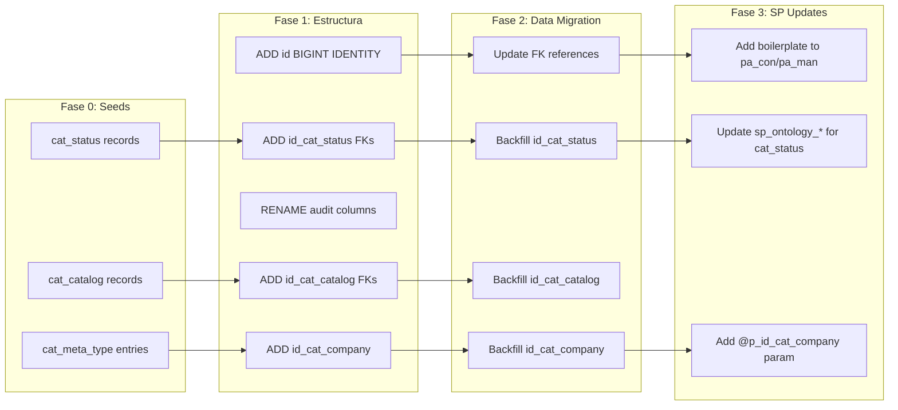

# Documento de Diseño — Ontology Engine Framework (Migración a Estándares)

## Visión General

Migración del esquema `[IA]` existente (~60 tablas, ~96 SPs) a cumplimiento 100% de estándares buklo_lab, más construcción de las capas de Gateway, AI Core y Frontend.

**Estrategia: Migración in-place** — se modifican las tablas y SPs existentes (ALTER TABLE, CREATE OR ALTER PROCEDURE). No se crea esquema nuevo.

---

## Arquitectura de Migración

### Fases de Migración de BD



### Cambios por Tabla (Resumen)

| Tabla | ADD id_cat_company | PK→BIGINT | Audit Rename | Status→cat_status | Types→cat_catalog |
|-------|:-:|:-:|:-:|:-:|:-:|
| ontology | ✅ | ✅ | ✅ | ✅ status | — |
| ontology_entity_type | ✅ | ✅ | ✅ | — | — |
| ontology_entity | ✅ | ✅ | ✅ | — | — |
| ontology_entity_attribute | ✅ | ✅ | ✅ | — | ✅ type |
| ontology_entity_tag | ✅ | ✅ | ✅ | — | — |
| causal_relationship | ✅ | ✅ | ✅ | — | — |
| causal_relationship_context | ✅ | ✅ | ✅ | — | ✅ operator |
| data_source | ✅ | ✅ | ✅ | — | ✅ source_type |
| data_source_mapping | ✅ | ✅ | ✅ | — | ✅ mapping_type |
| data_source_access_rule | ✅ | ✅ | ✅ | — | ✅ access_type |
| agent | ✅ | ✅ | ✅ | — | ✅ mode→agent_type |
| conversation_session | ✅ | ✅ | ✅ | ✅ status | ✅ session_type |
| artifact_reference | ✅ | ✅ | ✅ | — | — |
| ontology_audit_log | ✅ | ✅ | ✅ | — | — |
| (+ ~45 tablas más) | ✅ | ✅ | ✅ | — | — |

### Estrategia de PK Migration

```sql
-- Paso 1: Agregar nueva PK BIGINT
ALTER TABLE [IA].[ontology] ADD [id_new] BIGINT IDENTITY(1,1) NOT NULL;

-- Paso 2: Renombrar columnas
EXEC sp_rename 'IA.ontology.id', 'legacy_uuid', 'COLUMN';
EXEC sp_rename 'IA.ontology.id_new', 'id', 'COLUMN';

-- Paso 3: Drop PK vieja, crear nueva
ALTER TABLE [IA].[ontology] DROP CONSTRAINT [PK_ontology];
ALTER TABLE [IA].[ontology] ADD CONSTRAINT [PK_ontology] PRIMARY KEY CLUSTERED ([id]);
CREATE UNIQUE INDEX [ix_ontology_legacy_uuid] ON [IA].[ontology]([legacy_uuid]);

-- Paso 4: Agregar columna identifier para portabilidad
ALTER TABLE [IA].[ontology] ADD [identifier] NVARCHAR(100) NULL;
UPDATE [IA].[ontology] SET [identifier] = CAST([legacy_uuid] AS NVARCHAR(100));

-- Paso 5: Actualizar FKs en tablas hijas
-- (ontology_entity.ontology_id → mapear via legacy_uuid lookup)
```

**Nota:** Esta migración es arriesgada y debe ejecutarse en orden, con backup previo. Los FKs se actualizan en cadena.

---

## Catálogo de Seeds (cat_meta_type)

| identifier | key_00 | key_01 | key_02 | key_03 | key_04 |
|-----------|--------|--------|--------|--------|--------|
| ontology_version_status | buklo_lab | IA | cat_status | id_cat_meta_type_status | ontology |
| ontology_session_status | buklo_lab | IA | cat_status | id_cat_meta_type_status | conversation_session |
| ontology_artifact_status | buklo_lab | IA | cat_status | id_cat_meta_type_status | artifact_reference |
| ontology_source_type | buklo_lab | IA | cat_catalog | id_cat_meta_type_catalog | data_source |
| ontology_mapping_type | buklo_lab | IA | cat_catalog | id_cat_meta_type_catalog | data_source_mapping |
| ontology_access_level | buklo_lab | IA | cat_catalog | id_cat_meta_type_catalog | data_source_access_rule |
| ontology_value_type | buklo_lab | IA | cat_catalog | id_cat_meta_type_catalog | ontology_entity_attribute |
| ontology_operator | buklo_lab | IA | cat_catalog | id_cat_meta_type_catalog | causal_relationship_context |
| ontology_sensitivity | buklo_lab | IA | cat_catalog | id_cat_meta_type_catalog | data_source |
| ontology_session_type | buklo_lab | IA | cat_catalog | id_cat_meta_type_catalog | conversation_session |
| ontology_agent_type | buklo_lab | IA | cat_catalog | id_cat_meta_type_catalog | agent |
| ontology_agent_role | buklo_lab | IA | cat_catalog | id_cat_meta_type_catalog | agent_role |
| ontology_dependency_type | buklo_lab | IA | cat_catalog | id_cat_meta_type_catalog | agent_dependency |

---

## SP Boilerplate (Template de Actualización)

```sql
CREATE OR ALTER PROCEDURE [IA].[pa_con_ontology]
    @p_user             NVARCHAR(100),
    @p_execution_mode   INT,
    @p_option           INT,
    @p_identifier_external NVARCHAR(500),
    -- params negocio existentes (se mantienen)
    @p_id               BIGINT = NULL,
    @p_id_cat_company   BIGINT = NULL,
    @p_id_cat_status    BIGINT = NULL,
    @p_domain           NVARCHAR(100) = NULL,
    -- paginación
    @p_page_number      INT = 1,
    @p_rows_page        INT = 20
AS
BEGIN
    SET NOCOUNT ON;
    
    EXEC utility.pa_man_execution @p_consecutive = 1,
        @p_procedure = 'IA.pa_con_ontology',
        @p_user = @p_user, @p_option = @p_option;

    BEGIN TRY
        IF @p_option = 1 -- GET by ID
        BEGIN
            SELECT ... FROM [IA].[ontology] WITH (NOLOCK)
            WHERE [id] = @p_id AND [id_cat_company] = @p_id_cat_company;
        END
        
        IF @p_option = 2 -- LIST paginado
        BEGIN
            SELECT ..., COUNT(*) OVER() AS total_count
            FROM [IA].[ontology] WITH (NOLOCK)
            WHERE [id_cat_company] = @p_id_cat_company
            AND (@p_id_cat_status IS NULL OR [id_cat_status] = @p_id_cat_status)
            ORDER BY [create_date] DESC
            OFFSET (@p_page_number - 1) * @p_rows_page ROWS
            FETCH NEXT @p_rows_page ROWS ONLY;
        END
    END TRY
    BEGIN CATCH
        EXEC utility.pa_man_exception
            @p_procedure = 'IA.pa_con_ontology', @p_user = @p_user;
        THROW;
    END CATCH;

    EXEC utility.pa_man_execution @p_consecutive = 99999,
        @p_procedure = 'IA.pa_con_ontology',
        @p_user = @p_user, @p_option = @p_option;
END;
GO
```

---

## Capas 2-4 (sin cambios respecto al diseño anterior)

### Capa 2: Gateway
- Registro de SPs via utility.pa_man_microservice_method
- Rutas de chat: POST /api/chat/message, GET /api/chat/stream/:sessionId

### Capa 3: AI Core (TCP 3004)
- Intent Classifier → Agent Executor → Trust Boundary → Tool Registry → LLM Adapter → SSE
- Comunica con Engine Core via TCP 3001

### Capa 4: Frontend
- Buklo CRUD configs apuntando a pa_con/pa_man existentes
- Servicios MAA refactorizados (Gateway con fallback)
- Rich Messages, Chat SSE, Version Diff

---

## Riesgos de la Migración

| Riesgo | Mitigación |
|--------|-----------|
| Pérdida de datos en ALTER TABLE | Backup completo antes de cada fase. Scripts idempotentes. |
| FKs rotas al cambiar PKs | Migrar en orden: tablas padre primero, hijas después. Usar lookup por legacy_uuid. |
| SPs existentes rompen con columnas renombradas | Actualizar TODOS los SPs antes de ejecutar la migración de columnas. O hacerlo en una sola transacción. |
| Aplicaciones consumiendo columnas viejas | Mantener aliases/views temporales durante transición. |
| Datos con NULL en id_cat_company | Asignar company default de Grupo Montecristo. |

---

## Testing Strategy

| Fase | Validación |
|------|-----------|
| Pre-migración | Backup completo. Contar registros por tabla. |
| Post-DDL | Verificar que todas las tablas tienen: id BIGINT PK, id_cat_company, campos auditoría renombrados |
| Post-data migration | Contar registros = pre-migración. Verificar FKs resuelven. |
| Post-SP update | Ejecutar cada SP con parámetros de prueba. Verificar utility.pa_man_execution registra. |
| Post-registro REST | Verificar métodos en restful.tra_method con search_key correcto. |
