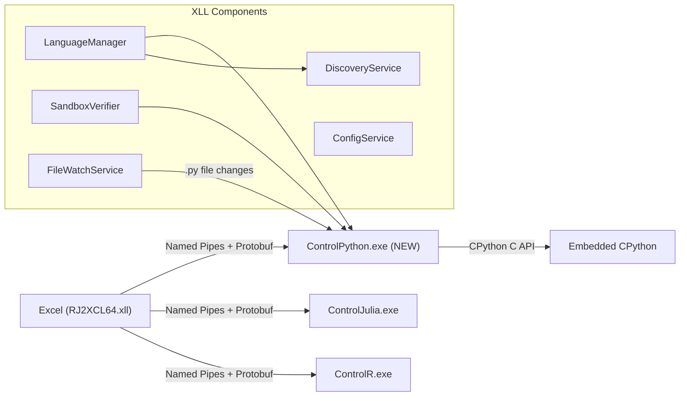
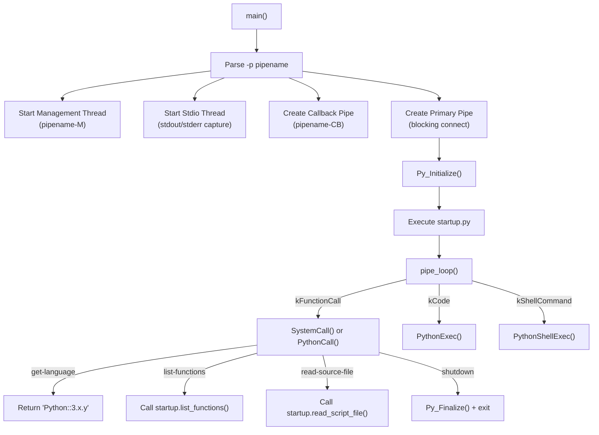

# Design Document: Python Integration for RJ2XCL

## Overview

This design adds Python as a third language to the RJ2XCL platform, following the established architecture where each language runs in an isolated child process communicating with the Excel XLL via Named Pipes and Protobuf. The new `ControlPython.exe` embeds CPython via the C API and mirrors the structure of `ControlJulia.exe`. Users invoke Python from Excel cells using `=RJ2XCL.P("expression")` for inline code and `=P.my_function(args)` for registered functions, consistent with the `R.`/`J.` convention.

The integration touches five layers of the system:

1. **Discovery** — `DiscoveryService` gains a `FindPython()` method to locate CPython installations via registry, environment variables, and filesystem heuristics.
2. **Configuration** — `rj2xcl-languages.json` gets a Python entry; `rj2xcl-config.json` gets a `"Python"` section with version constraints.
3. **Child Process** — A new `ControlPython/` subdirectory containing `control_python.cc` (main + pipe loop) and `python_interface.cc` (CPython embedding, type conversion).
4. **Sandbox** — `SandboxVerifier.cc` gains Python-specific blocked patterns (os.system, subprocess, exec, eval, ctypes, etc.).
5. **Startup** — `startup/startup.py` provides `list_functions()`, `read_script_file()`, graphics helpers, and package availability checks.

### Design Decisions

| Decision | Choice | Rationale |
|---|---|---|
| Prefix | `P` | Consistent with `R` → R, `J` → Julia, `P` → Python |
| Embedding API | CPython C API (stable ABI via `python3.dll`) | Direct embedding like Julia; stable ABI avoids version-specific DLL coupling |
| Process model | Separate `ControlPython.exe` | Matches ControlR/ControlJulia isolation pattern; crash isolation from Excel |
| Type mapping | pandas DataFrame ↔ Protobuf matrix, numpy array ↔ Protobuf array | Natural mapping; graceful fallback to list-of-lists when pandas/numpy unavailable |
| Graphics | matplotlib Agg backend → PNG, plotly → HTML | Non-interactive backends avoid GUI windows from child process |
| Sandbox approach | Pattern-based string matching (same as R/Julia) | Consistent with existing defense-in-depth model |

## Architecture

### System Context



### ControlPython Process Architecture

`ControlPython.exe` follows the exact same pattern as `ControlJulia.exe`:



### Thread Model

Identical to ControlJulia:

| Thread | Responsibility |
|---|---|
| Main thread | `pipe_loop()` — processes Protobuf messages, executes Python code via GIL |
| Management thread | Listens on `<pipename>-M` for break signals → `PyErr_SetInterrupt()` |
| Stdio thread | Captures redirected stdout/stderr pipes, forwards to console clients |

## Components and Interfaces

### 1. ControlPython.exe — `ControlPython/src/control_python.cc`

Main entry point. Mirrors `control_julia.cc` structure.

```cpp
// Key functions (same signatures as ControlJulia)
int main(int argc, char** argv);
void pipe_loop();
bool SystemCall(RJ2XCLBuffers::CallResponse& response, 
                const RJ2XCLBuffers::CallResponse& call, int pipe_index);
void NextPipeInstance(bool block, std::string& name);
void CloseClient(int index);
void PushConsoleMessage(google::protobuf::Message& message);
void ConsolePrompt(const char* prompt, uint32_t id);
unsigned __stdcall ManagementThreadFunction(void* data);
unsigned __stdcall StdioThreadFunction(void* data);
```

### 2. Python Interface — `ControlPython/src/python_interface.cc`

CPython embedding layer. Mirrors `julia_interface.cc`.

```cpp
// python_interface.h
void PythonInit();
void PythonShutdown();
void PythonGetVersion(int32_t* major, int32_t* minor, int32_t* patch);

// Code execution
void PythonExec(RJ2XCLBuffers::CallResponse& response, 
                const RJ2XCLBuffers::CallResponse& call);
void PythonCall(RJ2XCLBuffers::CallResponse& response, 
                const RJ2XCLBuffers::CallResponse& call);
ExecResult PythonShellExec(const std::string& command, std::string& shell_buffer);

// Function discovery
void ListScriptFunctions(RJ2XCLBuffers::CallResponse& response, 
                         const RJ2XCLBuffers::CallResponse& call);

// Source file loading
bool ReadSourceFile(const std::string& file, bool notify = false);

// Type conversion
PyObject* VariableToPyObject(const RJ2XCLBuffers::Variable* variable);
void PyObjectToVariable(RJ2XCLBuffers::Variable* variable, PyObject* value);
```

**CPython C API usage:**

| Operation | C API Function |
|---|---|
| Initialize interpreter | `Py_Initialize()`, `Py_IsInitialized()` |
| Finalize interpreter | `Py_Finalize()` |
| Get version | `Py_GetVersion()` (parse major.minor.patch) |
| Execute expression | `PyRun_String(code, Py_eval_input, globals, locals)` |
| Execute statements | `PyRun_String(code, Py_file_input, globals, locals)` |
| Call function by name | `PyObject_GetAttrString(module, name)` + `PyObject_CallObject(func, args)` |
| Error handling | `PyErr_Occurred()`, `PyErr_Fetch()`, `PyErr_Clear()` |
| Interrupt | `PyErr_SetInterrupt()` (from management thread) |
| GIL management | `PyGILState_Ensure()` / `PyGILState_Release()` (for management thread) |

### 3. DiscoveryService Extension — `Common/DiscoveryService.cc`

New method `FindPython()` added to the existing `DiscoveryService` class:

```cpp
// DiscoveryService.h — new method
std::vector<LanguageInstallation> FindPython();
```

**Discovery priority order:**
1. `home` override from `rj2xcl-config.json` Python section
2. `PYTHON_HOME` or `PYTHONHOME` environment variable
3. Windows Registry: `HKLM\SOFTWARE\Python\PythonCore\<version>\InstallPath`
4. Filesystem heuristics: `%LOCALAPPDATA%\Programs\Python\Python3*`, `%PROGRAMFILES%\Python3*`

**Validation:** Each candidate is verified to contain `python3.dll` (stable ABI) or `python3XX.dll`, plus `include/Python.h`.

### 4. SandboxVerifier Extension — `Common/SandboxVerifier.cc`

New `python_blocked` pattern vector added alongside existing `r_blocked` and `julia_blocked`:

```cpp
static const std::vector<std::pair<std::string, std::string>> python_blocked = {
    // Shell execution
    {"os.system(", "os.system() — shell command execution blocked"},
    {"os.popen(", "os.popen() — shell command execution blocked"},
    {"subprocess.call(", "subprocess — shell command execution blocked"},
    {"subprocess.run(", "subprocess — shell command execution blocked"},
    {"subprocess.popen(", "subprocess — shell command execution blocked"},
    {"subprocess.check_output(", "subprocess — shell command execution blocked"},
    {"subprocess.check_call(", "subprocess — shell command execution blocked"},
    // File manipulation
    {"os.remove(", "os.remove() — file deletion blocked"},
    {"os.unlink(", "os.unlink() — file deletion blocked"},
    {"os.rmdir(", "os.rmdir() — directory removal blocked"},
    {"os.rename(", "os.rename() — file manipulation blocked"},
    {"shutil.rmtree(", "shutil.rmtree() — recursive deletion blocked"},
    {"shutil.move(", "shutil.move() — file manipulation blocked"},
    {"shutil.copy(", "shutil.copy() — file copy blocked"},
    // Dynamic code execution
    {"exec(", "exec() — dynamic code execution blocked"},
    {"eval(", "eval() — dynamic code evaluation blocked"},
    {"compile(", "compile() — code compilation blocked"},
    {"__import__(", "__import__() — dynamic import blocked"},
    {"importlib.import_module(", "importlib — dynamic import blocked"},
    // Native/unsafe
    {"ctypes.cdll", "ctypes — native code access blocked"},
    {"ctypes.windll", "ctypes — native code access blocked"},
    {"ctypes.cdll(", "ctypes — native code loading blocked"},
    {"ctypes.windll(", "ctypes — native code loading blocked"},
    // Network
    {"urllib.request.urlopen(", "urllib — network access blocked"},
    {"socket.socket(", "socket — network access blocked"},
    {"http.client.httpconnection(", "http.client — network access blocked"},
    // Environment manipulation
    {"os.environ[", "os.environ — environment manipulation blocked"},
    {"os.putenv(", "os.putenv() — environment manipulation blocked"},
    {"os.chdir(", "os.chdir() — working directory change blocked"},
};
```

**Bypass detection** (added to the advanced bypass section):
```cpp
// Python getattr bypass: getattr(__import__('os'), 'system')
if (lower_code.find("getattr(") != std::string::npos &&
    (lower_code.find("os") != std::string::npos ||
     lower_code.find("subprocess") != std::string::npos ||
     lower_code.find("shutil") != std::string::npos)) {
    rejection_reason = "getattr() with suspicious module — potential sandbox bypass blocked";
    return false;
}

// Python string concatenation: "os" + ".system"
if (lower_code.find("\"os\"") != std::string::npos &&
    lower_code.find("+") != std::string::npos &&
    lower_code.find("system") != std::string::npos) {
    rejection_reason = "string concatenation with os.system — potential sandbox bypass blocked";
    return false;
}
```

### 5. Startup Script — `startup/startup.py`

```python
# startup/startup.py — Key functions

def list_functions() -> list[dict]:
    """Introspects __main__ for user-defined functions.
    Returns metadata in the format expected by XLL's CreateFunctionList."""

def read_script_file(path: str, notify: bool = False) -> bool:
    """Executes a Python source file in __main__ namespace."""

def install_application_pointer(pointer: int) -> None:
    """Stores Excel COM application pointer."""

def rj2xcl_graphics_device(width: int = 800, height: int = 600) -> str:
    """Creates matplotlib figure, returns output PNG path."""

def rj2xcl_last_plot() -> str:
    """Returns path of last generated plot (Windows backslashes)."""
```

### 6. Configuration Files

**`rj2xcl-languages.json`** — new entry:
```json
{
    "name": "Python",
    "executable": "ControlPython.exe",
    "prefix": "P",
    "extensions": ["py"],
    "command_arguments": "",
    "prepend_path": "$HOME",
    "priority": 10,
    "startup_resource": "startup.py"
}
```

**`rj2xcl-config.json`** — new section under `"RJ2XCL"`:
```json
"Python": {
    "home": "",
    "minMajor": 3,
    "minMinor": 10,
    "maxMajor": 99
}
```

### 7. CMake Build — `ControlPython/CMakeLists.txt`

Follows the `ControlJulia/CMakeLists.txt` pattern:
- Finds Python via `PYTHON_HOME` CMake variable, `PYTHON_HOME` env var, or filesystem heuristic
- Links against `python3.lib` (stable ABI) from the Python installation
- Includes `Python.h` from the Python installation's `include/` directory
- Source files: `control_python.cc`, `python_interface.cc`, plus shared Common/PB sources

## Data Models

### Type Conversion Map (Excel ↔ Protobuf ↔ Python)

| Protobuf Type | Python Type | Notes |
|---|---|---|
| `double` (real) | `float` | Direct mapping |
| `integer` | `int` | Direct mapping |
| `string` (str) | `str` | Direct mapping |
| `boolean` | `bool` | Direct mapping |
| `nil/missing` | `None` | Maps to `jl_nothing` equivalent |
| `Array` (1D) | `numpy.ndarray` | Fallback: Python `list` if numpy unavailable |
| `Array` (2D matrix) | `pandas.DataFrame` | Column headers from first row; fallback: list of lists |
| `ComPointer` | `int` (pointer value) | For COM automation |
| `Error` | Exception string | `str(exception)` |

### Return Type Serialization

| Python Return Type | Protobuf Serialization |
|---|---|
| `int` | `Variable.integer` |
| `float` | `Variable.real` |
| `str` | `Variable.str` |
| `bool` | `Variable.boolean` |
| `None` | `Variable.nil` |
| `numpy.ndarray` (1D) | `Array` with rows=N, cols=1 |
| `numpy.ndarray` (2D) | `Array` with rows=M, cols=N |
| `pandas.DataFrame` | `Array` with headers as first row |
| `list` | `Array` (1D) |
| `list[list]` | `Array` (2D) |
| Unsupported type | `Variable.str` via `str(obj)` |

### Function Metadata Format

The `list_functions()` return format matches what `CreateFunctionList` expects:

```python
{
    "name": "my_function",
    "flags": 0,
    "arguments": [
        {"name": "x"},
        {"name": "y", "default": 10}
    ],
    "attributes": {
        "description": "Docstring text",
        "category": "Python"
    }
}
```


## Correctness Properties

*A property is a characteristic or behavior that should hold true across all valid executions of a system — essentially, a formal statement about what the system should do. Properties serve as the bridge between human-readable specifications and machine-verifiable correctness guarantees.*

### Property 1: Version Selection — Highest Satisfying Constraint

*For any* list of Python installation candidates with varying (major, minor, patch) versions, and *for any* minimum version constraint (minMajor, minMinor), the `GetBestVersion` function SHALL return the installation with the highest version that satisfies `major >= minMajor && (major > minMajor || minor >= minMinor)`, or an empty result if no candidate satisfies the constraint.

**Validates: Requirements 1.2**

### Property 2: Scalar Type Round-Trip

*For any* scalar value of type `float`, `int`, `str`, `bool`, or `None`, converting from a Protobuf `Variable` to a Python object and back to a Protobuf `Variable` SHALL produce a value equal to the original. Specifically: `PyObjectToVariable(VariableToPyObject(variable)) == variable` for all scalar types.

**Validates: Requirements 6.1, 6.6**

### Property 3: Array and Matrix Round-Trip

*For any* Protobuf `Array` with valid dimensions (rows > 0, cols > 0, data_size == rows × cols) containing homogeneous numeric data, converting to a Python object (numpy.ndarray for 1D, pandas.DataFrame for 2D) and back to a Protobuf `Array` SHALL preserve the dimensions and all element values. For DataFrames, column headers serialized as the first row SHALL be recoverable.

**Validates: Requirements 6.2, 6.3, 6.4, 6.5**

### Property 4: Function Metadata Extraction

*For any* set of user-defined Python functions registered in the `__main__` module, calling `list_functions()` SHALL return metadata where: (a) every function's name matches its definition, (b) argument names and default values match the function's `inspect.signature`, (c) the docstring matches the function's `__doc__` attribute, and (d) the category field is `"Python"` for all entries.

**Validates: Requirements 4.1, 4.4, 5.2, 5.3**

### Property 5: Sandbox Blocks All Python Dangerous Patterns

*For any* code string that contains at least one blocked Python pattern (from the shell execution, file manipulation, dynamic code, native/unsafe, network, or environment categories), regardless of whitespace insertion or case variation, the `ValidateCodeForExecution` function SHALL return `false` and provide a non-empty rejection reason string identifying the blocked operation.

**Validates: Requirements 7.1, 7.2, 7.3, 7.4, 7.5, 7.6, 7.7, 13.5**

### Property 6: Sandbox Bypass Detection

*For any* code string containing a `getattr()` call targeting a suspicious module (`os`, `subprocess`, `shutil`), or a string concatenation pattern constructing `"os" + ".system"`, the `ValidateCodeForExecution` function SHALL return `false` with a non-empty rejection reason.

**Validates: Requirements 7.8**

### Property 7: Sandbox Allows Safe Python Code

*For any* Python code string that contains no blocked patterns, no bypass constructs, and consists of legitimate operations (arithmetic, variable assignment, function calls on safe modules, list/dict comprehensions), the `ValidateCodeForExecution` function SHALL return `true` with an empty rejection reason.

**Validates: Requirements 7.9**

### Property 8: Sandbox Idempotence

*For any* Python code string (whether safe or unsafe), calling `ValidateCodeForExecution` twice on the same input SHALL produce identical results — the same boolean return value and the same rejection reason (empty or non-empty).

**Validates: Requirements 13.4**

### Property 9: Exception Capture Returns Traceback

*For any* Python code that raises an exception (TypeError, ValueError, ZeroDivisionError, KeyError, AttributeError, or any other standard exception), the `PythonExec` function SHALL populate the Protobuf response's error field with a non-empty string containing the exception type name, and the process SHALL continue accepting subsequent requests.

**Validates: Requirements 11.4, 14.5**

### Property 10: Graphics Filename Uniqueness

*For any* sequence of calls to `rj2xcl_graphics_device()`, each generated filename SHALL be unique. No two calls SHALL produce the same file path, even when called in rapid succession within the same second.

**Validates: Requirements 9.5**

### Property 11: Language Tag Format

*For any* valid Python version triple (major, minor, patch) where major >= 3, the language tag reported by the `get-language` system command SHALL match the format `"Python::<major>.<minor>.<patch>"` exactly.

**Validates: Requirements 3.5**

## Error Handling

### ControlPython Process Errors

| Error Condition | Handling | Exit Code |
|---|---|---|
| `Py_Initialize()` fails | Log error, exit immediately | `PROCESS_ERROR_CONFIGURATION_ERROR` |
| Python version < 3.10 | Log version mismatch, exit | `PROCESS_ERROR_UNSUPPORTED_VERSION` |
| No `-p` argument provided | Log usage error, exit | `PROCESS_ERROR_CONFIGURATION_ERROR` |
| Pipe connection broken | Log, allow XLL to reconnect | N/A (process continues) |
| `shutdown` command received | `Py_Finalize()`, clean exit | 0 |

### Python Execution Errors

| Error Condition | Handling | User-Visible Result |
|---|---|---|
| Python exception during `kCode` | `PyErr_Fetch()` + `traceback.format_exc()` → Protobuf error field | `#ERROR: <traceback>` in Excel cell |
| Python exception during `kFunctionCall` | Same as above | `#ERROR: <traceback>` in Excel cell |
| `ModuleNotFoundError` | Captured like any exception | `#ERROR: ModuleNotFoundError: No module named 'xxx'` |
| Unsupported return type | `str(obj)` fallback | String representation in cell |
| Sandbox rejection | `ValidateCodeForExecution` returns false before sending to process | `#ERROR: <rejection_reason>` in Excel cell |
| Call timeout (`callTimeoutMs`) | XLL cancels pending pipe read | `#ERROR: Call timed out` in Excel cell |

### GIL and Thread Safety

- All Python code execution happens on the main thread (which holds the GIL).
- The management thread uses `PyGILState_Ensure()`/`PyGILState_Release()` only for `PyErr_SetInterrupt()`.
- The stdio thread does not interact with the Python interpreter.

### Startup Error Recovery

- If `numpy`, `pandas`, `matplotlib`, or `sklearn` are not installed, startup logs a warning per missing package but continues normally.
- If `startup.py` itself fails to execute, ControlPython logs the error and exits with `PROCESS_ERROR_CONFIGURATION_ERROR`.

## Testing Strategy

### Unit Tests (GTest — `tests/sandbox_tests.cc`)

The primary unit-testable component is the **SandboxVerifier** extension. These tests follow the existing pattern in `sandbox_tests.cc`:

**Python blocked pattern tests** (one test per pattern category):
- Shell execution: `os.system(`, `os.popen(`, `subprocess.call(`, `subprocess.run(`, `subprocess.Popen(`, `subprocess.check_output(`, `subprocess.check_call(`
- File manipulation: `os.remove(`, `os.unlink(`, `os.rmdir(`, `os.rename(`, `shutil.rmtree(`, `shutil.move(`, `shutil.copy(`
- Dynamic code: `exec(`, `eval(`, `compile(`, `__import__(`, `importlib.import_module(`
- Native/unsafe: `ctypes.cdll`, `ctypes.windll`, `ctypes.CDLL(`, `ctypes.WinDLL(`
- Network: `urllib.request.urlopen(`, `socket.socket(`, `http.client.HTTPConnection(`
- Environment: `os.environ[`, `os.putenv(`, `os.chdir(`

**Python bypass prevention tests:**
- Whitespace insertion: `"os . system('dir')"`, `"os.system ('dir')"`
- Case variation: `"OS.SYSTEM('dir')"`, `"Os.System('dir')"`
- `getattr` bypass: `"getattr(__import__('os'), 'system')('dir')"`
- String concatenation: patterns with `"os" + ".system"`

**Python allowed operations tests (false positive prevention):**
- `"import pandas as pd"` — must NOT be blocked
- `"df.describe()"` — must NOT be blocked
- `"np.mean([1,2,3])"` — must NOT be blocked
- `"len([1,2,3])"` — must NOT be blocked
- `"x = 42"` — must NOT be blocked
- `"print('hello')"` — note: `print` is not `exec`/`eval`, must NOT be blocked
- `"[x**2 for x in range(10)]"` — must NOT be blocked

### Property-Based Tests (GTest + custom generators)

Property-based tests validate the correctness properties defined above. Each test runs a minimum of **100 iterations** with randomly generated inputs.

**Library:** Custom generators within GTest (the project already uses GTest; we generate random inputs in test fixtures).

**Property tests to implement:**

| Property | Test Description | Tag |
|---|---|---|
| P5 | Generate random blocked patterns with whitespace/case variation, verify rejection | `Feature: python-integration, Property 5: Sandbox blocks all Python dangerous patterns` |
| P7 | Generate random safe Python code strings, verify acceptance | `Feature: python-integration, Property 7: Sandbox allows safe Python code` |
| P8 | Generate random code strings, verify idempotent validation | `Feature: python-integration, Property 8: Sandbox idempotence` |

> Properties P1–P4, P6, P9–P11 are best tested as example-based unit tests or integration tests because they require Python runtime, filesystem access, or process lifecycle — not suitable for pure property-based testing in the GTest sandbox test suite.

### Integration Tests

Integration tests require a running ControlPython process and a Python installation:

- **Process lifecycle:** Launch ControlPython with `-p`, verify pipe connection, send `get-language`, verify response format, send `shutdown`, verify clean exit.
- **Code execution:** Send `kCode` with Python expressions and statements, verify correct results via Protobuf response.
- **Function registration:** Load a `.py` file via `read-source-file`, call `list-functions`, verify metadata.
- **Type conversion:** Send various Protobuf types, verify Python-side conversion and round-trip.
- **Hot-reload:** Modify a `.py` file, verify `FileWatchService` triggers reload and updated functions are available.
- **Console:** Connect console client, send shell commands, verify prompt and output.
- **Graphics:** Execute matplotlib/plotly code, verify output files are created.
- **Error handling:** Send code that raises exceptions, verify error capture and process continuation.

### Test File Organization

```
tests/
├── sandbox_tests.cc          # Existing — add Python pattern tests here
├── python_sandbox_pbt.cc     # NEW — Property-based tests for Python sandbox
└── ...
```

The Python sandbox property-based tests are in a separate file to keep the existing `sandbox_tests.cc` focused on deterministic example-based tests, while `python_sandbox_pbt.cc` handles randomized property verification.
