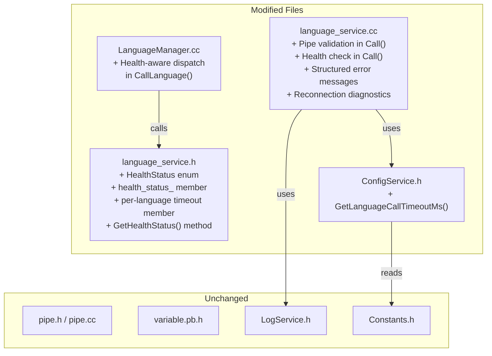
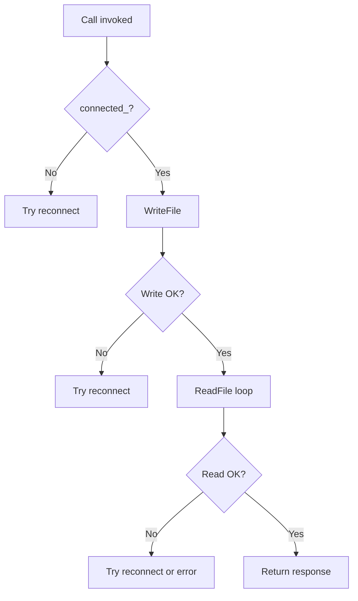
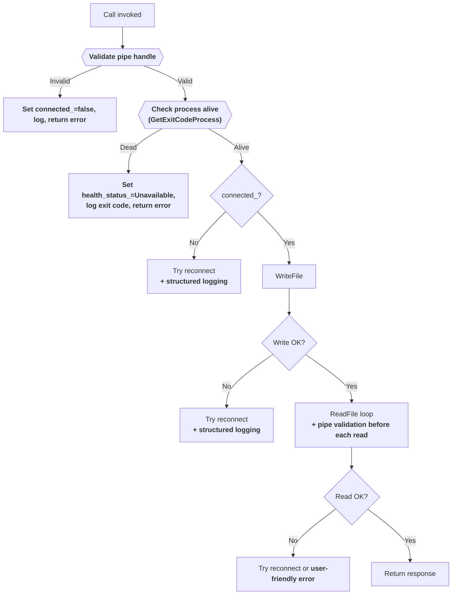
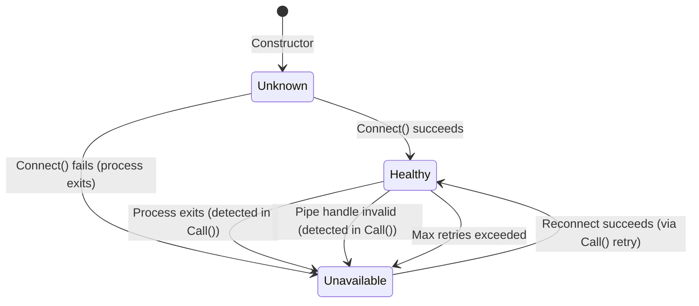

# Design Document: Reliability Improvements for RJ2XCL

## Overview

This design adds defensive reliability improvements to the RJ2XCL Excel add-in (XLL) that integrates R, Julia, and Python via Named Pipes and Protobuf. The current reliability score is 6/10; these changes target 7.5–8/10 through surgical, low-risk modifications to existing code paths.

The improvements span six areas:

1. **Graceful degradation** — When one language process crashes, the others continue working. `LanguageManager` skips unavailable services instead of propagating failures.
2. **User-friendly error messages** — Every error returned to Excel includes the language name and actionable guidance (e.g., "restart Excel", "check the log file").
3. **Pipe state validation** — The `Call()` method validates the pipe handle before every `WriteFile`/`ReadFile`, preventing crashes from stale handles.
4. **Per-language timeouts** — Each language can have its own `callTimeoutMs` in `rj2xcl-config.json` (Julia gets longer for JIT, Python gets shorter).
5. **Reconnection diagnostics** — Detailed structured logging during reconnection: language name, pipe name, retry number, error codes, elapsed time.
6. **Process health monitoring** — A `HealthStatus` enum and pre-call `GetExitCodeProcess` check detect dead processes before attempting pipe I/O.

### Design Constraints

| Constraint | Rationale |
|---|---|
| No architectural rewrites of `Call()` | The goto-based retry loop works; we add guards around it, not replace it |
| No new threads or synchronization primitives | All changes execute on the existing call path |
| No pipe protocol changes | Protobuf message format is unchanged |
| All 165 existing tests must pass | Changes are additive — new code paths only activate on error conditions |
| LOW-RISK changes only | Each change is a small, isolated addition to an existing function |

### Design Decisions

| Decision | Choice | Rationale |
|---|---|---|
| Health status storage | Per-instance `HealthStatus` enum on `LanguageService` | Simplest approach — no shared state, no synchronization needed |
| Per-language timeout | Read from `config["RJ2XCL"][languageName]["callTimeoutMs"]` | Follows existing config pattern (e.g., `config["RJ2XCL"]["Julia"]["home"]`) |
| Error message format | `"[Language] <description> — <action>"` | Consistent, scannable, actionable |
| Pipe validation | Inline checks at top of `Call()` and before each `ReadFile` | Minimal code, no new abstractions |
| Health check mechanism | `GetExitCodeProcess` before `WriteFile` | Already used in `Connect()` — proven pattern |

## Architecture

### Change Scope

All changes are confined to four files. No new files are created (except tests).



### Call() Method Flow — Before and After

**Current flow** (simplified):



**New flow** (additions in bold):



## Components and Interfaces

### 1. HealthStatus Enum — `language_service.h`

New enum added to the header, alongside a private member and public accessor:

```cpp
/** @brief Per-language process health status. */
enum class HealthStatus {
    Healthy,      ///< Process is running and pipe is connected
    Unavailable,  ///< Process has exited or pipe is permanently broken
    Unknown       ///< Initial state before first connection attempt
};
```

Added to `LanguageService`:
- `HealthStatus health_status_ = HealthStatus::Unknown;` (private member)
- `HealthStatus GetHealthStatus() const { return health_status_; }` (public accessor)
- `DWORD per_language_timeout_ms_ = 0;` (private member, 0 = use global)

The constructor sets `health_status_` to `Unknown`. `Connect()` sets it to `Healthy` on success. `Call()` sets it to `Unavailable` when a dead process is detected.

### 2. Pipe Validation — `language_service.cc` (`Call()`)

Two validation points added to `Call()`:

**Pre-write validation** (at top of method, before the `retry:` label):
```cpp
// Validate pipe handle before any I/O
if (connected_ && (!pipe_handle_.is_valid())) {
    connected_ = false;
    health_status_ = HealthStatus::Unavailable;
    RJ2XCL_LOG_WARN("%s: pipe handle invalid while connected_ was true — resetting",
        language_descriptor_.name_.c_str());
}
```

**Pre-read validation** (inside the read loop, before each `ReadFile`):
```cpp
if (!pipe_handle_.is_valid()) {
    response.set_err(language_descriptor_.name_ + 
        " service unavailable — restart Excel to reconnect.");
    break;
}
```

### 3. Process Health Check — `language_service.cc` (`Call()`)

Added after pipe validation, before the `WriteFile` call:

```cpp
// Check if child process is still alive before writing
DWORD exit_code = 0;
if (GetExitCodeProcess(process_info_.hProcess, &exit_code)) {
    if (exit_code != STILL_ACTIVE) {
        connected_ = false;
        health_status_ = HealthStatus::Unavailable;
        RJ2XCL_LOG_ERR("%s process is not running (exit code %d)",
            language_descriptor_.name_.c_str(), exit_code);
        std::stringstream ss;
        ss << language_descriptor_.name_ << " process is not running (exit code " 
           << exit_code << ").";
        response.set_err(ss.str());
        return;
    }
}
```

### 4. User-Friendly Error Messages — `language_service.cc`

All error messages in `Call()` are updated to include the language name and actionable guidance:

| Error Condition | Current Message | New Message |
|---|---|---|
| Broken pipe on write | `"write error"` | `"[Lang] service unavailable — restart Excel to reconnect."` |
| Read timeout | `"timeout waiting for [Lang] response"` | `"[Lang] did not respond within [N] seconds. Check the log file for details."` |
| Max retries exceeded | `"max retries exceeded — language service unavailable"` | `"[Lang] reconnection failed after [N] attempts — restart Excel."` |
| Process exited during connect | (logged but not returned) | `"[Lang] process exited unexpectedly (code [X]). Check the log file."` |
| Pipe not connected | `"not connected"` | `"[Lang] is not connected — restart Excel to reconnect."` |
| Parse error | `"parse error (0x10)"` / `"parse error (0x11)"` | `"[Lang] returned an invalid response. Check the log file for details."` |

### 5. Per-Language Timeout — `ConfigService.h` + `language_service.cc`

New getter on `ConfigService`:

```cpp
/**
 * @brief Returns the call timeout for a specific language.
 * @param language_name Language name (e.g., "Julia", "R", "Python").
 * @return Per-language timeout if configured, otherwise the global timeout.
 */
DWORD GetLanguageCallTimeoutMs(const std::string& language_name) const {
    int val = config_["RJ2XCL"][language_name]["callTimeoutMs"].int_value();
    if (val >= 1000 && val <= 1800000) return (DWORD)val;
    if (val > 0) {
        // Out of range — clamp and warn
        DWORD clamped = (val < 1000) ? 1000 : 1800000;
        // Warning logged during ValidateConfig
        return clamped;
    }
    return GetCallTimeoutMs(); // Fall back to global
}
```

In `LanguageService` constructor, the per-language timeout is read and cached:

```cpp
per_language_timeout_ms_ = rj2xcl::ConfigService::Instance()
    .GetLanguageCallTimeoutMs(language_descriptor_.name_);
```

In `Call()`, the timeout selection becomes:

```cpp
DWORD timeout_ms = loading_timeout_ms_ > 0 
    ? loading_timeout_ms_ 
    : per_language_timeout_ms_;
```

### 6. Reconnection Diagnostics — `language_service.cc`

Structured logging added at each reconnection decision point in `Call()`:

**On reconnection initiation:**
```cpp
RJ2XCL_LOG_INFO("[%s] Reconnecting: pipe=%s, attempt=%d, reason=ERROR_BROKEN_PIPE",
    language_descriptor_.name_.c_str(), pipe_name_.c_str(), retry_count);
```

**On reconnection success:**
```cpp
RJ2XCL_LOG_INFO("[%s] Reconnected: pipe=%s, elapsed=%dms",
    language_descriptor_.name_.c_str(), pipe_name_.c_str(), elapsed_ms);
```

**On reconnection failure:**
```cpp
RJ2XCL_LOG_ERR("[%s] Reconnect failed: pipe=%s, error=%d, attempt=%d",
    language_descriptor_.name_.c_str(), pipe_name_.c_str(), err, retry_count);
```

**On max retries exceeded:**
```cpp
RJ2XCL_LOG_ERR("[%s] Max retries (%d) exceeded. Original error: %d",
    language_descriptor_.name_.c_str(), MAX_RETRIES, original_error);
```

**On process exit code during reconnection:**
```cpp
RJ2XCL_LOG_WARN("[%s] Process exit code: %d",
    language_descriptor_.name_.c_str(), exit_code);
```

### 7. Health-Aware Dispatch — `LanguageManager.cc`

`CallLanguage()` checks health status before dispatching:

```cpp
void LanguageManager::CallLanguage(uint32_t language_key, 
    RJ2XCLBuffers::CallResponse &response, RJ2XCLBuffers::CallResponse &call) {
    auto service = GetLanguageService(language_key);
    if (!service) {
        response.set_err("invalid language key");
        return;
    }
    if (service->GetHealthStatus() == HealthStatus::Unavailable) {
        response.set_err(service->name() + " is currently unavailable.");
        return;
    }
    service->Call(response, call);
}
```

### 8. Connect() Updates — `language_service.cc`

`Connect()` sets `health_status_` on success/failure:

```cpp
// On successful pipe connection:
connected_ = true;
health_status_ = HealthStatus::Healthy;

// On premature process exit:
health_status_ = HealthStatus::Unavailable;

// On max retries exceeded:
health_status_ = HealthStatus::Unavailable;
```

## Data Models

### HealthStatus Enum

```cpp
enum class HealthStatus {
    Healthy,      // Process running, pipe connected
    Unavailable,  // Process exited or pipe permanently broken
    Unknown       // Before first connection attempt
};
```

### Per-Language Configuration Schema

Existing `rj2xcl-config.json` structure extended with optional `callTimeoutMs` per language:

```json
{
    "RJ2XCL": {
        "callTimeoutMs": 600000,
        "maxRetries": 2,
        "R": {
            "home": "",
            "callTimeoutMs": 300000
        },
        "Julia": {
            "home": "",
            "callTimeoutMs": 900000
        },
        "Python": {
            "home": "",
            "callTimeoutMs": 120000
        }
    }
}
```

| Field | Type | Range | Default | Description |
|---|---|---|---|---|
| `RJ2XCL.callTimeoutMs` | int | 1–1,800,000 | 600,000 | Global call timeout (ms) |
| `RJ2XCL.<Lang>.callTimeoutMs` | int | 1,000–1,800,000 | (global) | Per-language override |

### Modified Class Members

**`LanguageService` (new members):**

| Member | Type | Default | Description |
|---|---|---|---|
| `health_status_` | `HealthStatus` | `Unknown` | Current process health |
| `per_language_timeout_ms_` | `DWORD` | 0 (use global) | Cached per-language timeout |

**`LanguageService` (new public methods):**

| Method | Return | Description |
|---|---|---|
| `GetHealthStatus()` | `HealthStatus` | Returns current health status |

**`ConfigService` (new public methods):**

| Method | Return | Description |
|---|---|---|
| `GetLanguageCallTimeoutMs(name)` | `DWORD` | Per-language timeout with global fallback |


## Correctness Properties

*A property is a characteristic or behavior that should hold true across all valid executions of a system — essentially, a formal statement about what the system should do. Properties serve as the bridge between human-readable specifications and machine-verifiable correctness guarantees.*

### Property 1: Failure Isolation

*For any* set of LanguageService instances managed by LanguageManager, and *for any* single service whose HealthStatus is set to Unavailable, all other services SHALL retain their original HealthStatus and connected state unchanged. Dispatching a call to a healthy service SHALL succeed regardless of how many other services are Unavailable.

**Validates: Requirements 1.1, 1.5**

### Property 2: Error Messages Always Contain Language Name

*For any* language display name (R, Julia, Python, or any future language string), and *for any* error condition triggered in `Call()` (broken pipe, timeout, max retries exceeded, dead process, invalid handle, parse error), the error string set in the Protobuf response's `err` field SHALL contain the language display name as a substring.

**Validates: Requirements 2.1, 2.2, 2.3, 2.4, 2.5**

### Property 3: Error Message Formatting Includes Context Values

*For any* language display name and *for any* numeric context value (timeout in seconds, retry count, or exit code), each error message template SHALL produce a string that contains both the language name and the string representation of the numeric context value. Specifically:
- Timeout message contains the language name and the timeout in seconds
- Retry message contains the language name and the retry count
- Exit code message contains the language name and the exit code

**Validates: Requirements 2.1, 2.2, 2.3, 2.4**

### Property 4: Per-Language Timeout Override

*For any* language name string and *for any* valid `callTimeoutMs` value (1000–1,800,000) configured under `RJ2XCL.<language>.callTimeoutMs` in the JSON config, `GetLanguageCallTimeoutMs(language)` SHALL return that per-language value, not the global `callTimeoutMs`.

**Validates: Requirements 4.1, 4.2**

### Property 5: Timeout Value Clamping

*For any* integer value configured as a per-language `callTimeoutMs`, the value returned by `GetLanguageCallTimeoutMs()` SHALL be within the range [1000, 1,800,000]. Values below 1000 SHALL be clamped to 1000; values above 1,800,000 SHALL be clamped to 1,800,000; values within range SHALL be returned unchanged.

**Validates: Requirements 4.4, 4.5**

### Property 6: Health-Aware Dispatch Skips Unavailable Services

*For any* language key whose corresponding LanguageService has HealthStatus::Unavailable, `LanguageManager::CallLanguage()` SHALL set the Protobuf response's `err` field to a non-empty string containing the language name, and SHALL NOT invoke `LanguageService::Call()`.

**Validates: Requirements 6.5**

### Property 7: Dead Process Detection Sets Correct State and Error

*For any* language name and *for any* non-STILL_ACTIVE exit code (any DWORD value ≠ 259), when `Call()` detects the process has exited, it SHALL: (a) set `health_status_` to `HealthStatus::Unavailable`, (b) set `connected_` to `false`, and (c) set the response `err` field to a string containing both the language name and the numeric exit code.

**Validates: Requirements 1.2, 6.2, 6.3**

## Error Handling

### Error Conditions and Responses

All error messages follow the pattern: `"[Language] <description> — <action>"` or `"[Language] <description>. <guidance>."`.

| Error Condition | Detection Point | Error Message | Log Level |
|---|---|---|---|
| Invalid pipe handle (connected_ true) | Top of `Call()` | `"[Lang] service unavailable — restart Excel to reconnect."` | WARN |
| Process exited (health check) | Before `WriteFile` in `Call()` | `"[Lang] process is not running (exit code [X])."` | ERROR |
| Not connected, no job handle | After reconnect check | `"[Lang] is not connected — restart Excel to reconnect."` | — |
| Broken pipe on write | `WriteFile` / `GetOverlappedResult` | `"[Lang] service unavailable — restart Excel to reconnect."` | WARN |
| Read timeout | `WaitForSingleObject` returns `WAIT_TIMEOUT` | `"[Lang] did not respond within [N] seconds. Check the log file for details."` | WARN |
| Broken pipe on read | `GetOverlappedResult` in read loop | `"[Lang] service unavailable — restart Excel to reconnect."` | WARN |
| Parse error | `MessageUtilities::Unframe` returns false | `"[Lang] returned an invalid response. Check the log file for details."` | ERROR |
| Max retries exceeded | Retry counter check | `"[Lang] reconnection failed after [N] attempts — restart Excel."` | ERROR |
| Wait error | `WaitForSingleObject` returns unexpected | `"[Lang] encountered a wait error. Check the log file for details."` | ERROR |
| Unavailable at dispatch | `LanguageManager::CallLanguage()` | `"[Lang] is currently unavailable."` | — |

### State Transitions



### Reconnection Behavior

The existing `goto retry` loop in `Call()` is preserved. The additions are:

1. **Before retry:** Log the reconnection reason (error code), language name, pipe name, and attempt number at INFO level.
2. **After successful reconnect:** Log success with elapsed time at INFO level. Set `health_status_ = Healthy`.
3. **After failed reconnect:** Log failure with error code at ERROR level.
4. **After max retries:** Log final failure at ERROR level with total attempts and original error. Set `health_status_ = Unavailable`.

Elapsed time is measured using `GetTickCount64()` captured before the first reconnection attempt.

## Testing Strategy

### Unit Tests (GTest)

Unit tests verify specific examples, edge cases, and state transitions. These use the existing `MockLanguageService` and test fixtures.

**New test file:** `tests/reliability_tests.cc`

**Pipe validation tests:**
- Invalid pipe handle with `connected_=true` → verify `connected_` set to false, error returned
- Invalid pipe handle with `connected_=false` → verify error returned without crash
- Valid pipe handle → verify no premature error

**Health status tests:**
- Initial health status is `Unknown`
- After successful connect, health status is `Healthy`
- After dead process detected, health status is `Unavailable`
- `GetHealthStatus()` returns correct value for each state

**Error message tests:**
- Broken pipe error contains language name and "restart Excel"
- Timeout error contains language name and timeout in seconds
- Max retries error contains language name and retry count
- Dead process error contains language name and exit code

**LanguageManager dispatch tests:**
- Call to healthy service succeeds (mock Call invoked)
- Call to unavailable service returns error without invoking Call
- Call to invalid key returns "invalid language key"
- Multiple services: one unavailable, others still dispatchable

**ConfigService per-language timeout tests:**
- Per-language timeout present → returns per-language value
- Per-language timeout absent → returns global value
- Both absent → returns default 600000
- Out-of-range low (500) → clamped to 1000
- Out-of-range high (2000000) → clamped to 1800000
- Boundary values: 1000, 1800000 → returned as-is

### Property-Based Tests (GTest + custom generators)

Property-based tests validate the correctness properties defined above. Each test runs a minimum of **100 iterations** with randomly generated inputs.

**Library:** Custom generators within GTest (consistent with existing `python_sandbox_pbt.cc` pattern).

**New test file:** `tests/reliability_pbt.cc`

| Property | Test Description | Tag |
|---|---|---|
| P1 | Generate random sets of services (1–5) with random health statuses, mark one as Unavailable, verify others unchanged | `Feature: reliability-improvements, Property 1: Failure isolation` |
| P2 | Generate random language names (1–50 chars, alphanumeric), trigger each error path, verify language name appears in error string | `Feature: reliability-improvements, Property 2: Error messages always contain language name` |
| P3 | Generate random language names and random numeric context values (0–2^31), verify each error template contains both | `Feature: reliability-improvements, Property 3: Error message formatting includes context values` |
| P4 | Generate random language names and random valid timeouts (1000–1800000), build config JSON, verify GetLanguageCallTimeoutMs returns per-language value | `Feature: reliability-improvements, Property 4: Per-language timeout override` |
| P5 | Generate random integers (INT_MIN to INT_MAX), verify GetLanguageCallTimeoutMs returns value in [1000, 1800000] | `Feature: reliability-improvements, Property 5: Timeout value clamping` |
| P6 | Generate random language names, set health to Unavailable, call CallLanguage, verify error contains name and Call() not invoked | `Feature: reliability-improvements, Property 6: Health-aware dispatch skips unavailable services` |
| P7 | Generate random language names and random exit codes (0–255, excluding 259), verify error contains both name and exit code, health set to Unavailable | `Feature: reliability-improvements, Property 7: Dead process detection sets correct state and error` |

### Integration Tests

Integration tests require actual pipe connections and process lifecycle:

- **Graceful degradation end-to-end:** Start two language processes, kill one, verify the other continues responding.
- **Reconnection logging:** Trigger a pipe break, verify log file contains structured reconnection entries with language name, pipe name, retry count.
- **Timeout behavior:** Configure a short per-language timeout, send a long-running command, verify timeout error message format.
- **Pipe break during read:** Break a pipe while a call is waiting, verify the call returns within the configured timeout with an appropriate error.

### Test File Organization

```
tests/
├── reliability_tests.cc      # NEW — Unit tests for all 6 requirement areas
├── reliability_pbt.cc         # NEW — Property-based tests for correctness properties
├── language_service_tests.cc  # Existing — unchanged
├── config_service_tests.cc    # Existing — unchanged
└── ...
```

### Test Configuration

- Property-based tests: minimum 100 iterations per property
- Each property test tagged with: `Feature: reliability-improvements, Property N: <title>`
- All 165 existing tests must continue to pass — new tests are additive only
