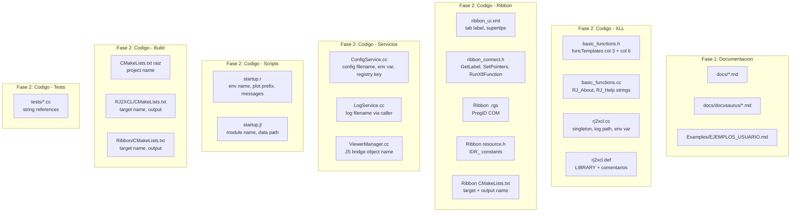

# Documento de Diseno: Renombrar RJ2XCL a NEVEN

## Resumen

Este documento describe el diseno tecnico para renombrar el proyecto RJ2XCL a NEVEN en todas las interfaces visibles al usuario, archivos de configuracion, binarios, registro COM, scripts de inicio, documentacion y pruebas. El renombramiento se ejecuta en dos fases: Fase 1 (documentacion) y Fase 2 (codigo). Los nombres internos de funciones C++ (prefijo `RJ_`) no cambian.

### Principio fundamental

El renombramiento sigue una regla clara: **todo lo que el usuario ve cambia a NEVEN; todo lo que el compilador/linker ve (simbolos C++) permanece como `RJ_`**. Esto minimiza el riesgo de romper la ABI y los ~2000 simbolos exportados en el archivo .def.

---

## Arquitectura

El sistema NEVEN (antes RJ2XCL) tiene una arquitectura de 4 capas. El renombramiento afecta las capas 1 y 2 en sus interfaces visibles al usuario, pero no modifica la logica interna.

```
+---------------------------------------------------------------------+
|                    CAPA 1: Interface Excel (XLL)                    |
|  NEVEN_Engine (singleton) - basic_functions - MenuService           |
|  funcTemplates: col 3 = Nombre_Excel_Visible, col 6 = Categoria    |
+---------------------------------------------------------------------+
|                 CAPA 2: Servicios del Nucleo                        |
|  ConfigService (neven-config.json) - LanguageManager                |
|  LogService (neven.log) - EnvService (NEVEN_HOME)                   |
+---------------------------------------------------------------------+
|              CAPA 3: Subsistemas Especializados                     |
|  ViewerManager - PlutoManager - ContentPipeline                     |
|  (sin cambios de nombre en esta capa)                               |
+---------------------------------------------------------------------+
|              CAPA 4: Herramientas Comunes                           |
|  Pipe - WindowManager - json11 - type_conversions                   |
|  (sin cambios en esta capa)                                         |
+---------------------------------------------------------------------+
```

### Componentes afectados por el renombramiento



### Decision: No renombrar directorios del repositorio

Los directorios del repositorio (`RJ2XCL/`, `RJ2XCL/RJ2XCL/`, etc.) **no se renombran** en esta fase. Renombrar directorios del repo requiere actualizar cientos de rutas en CMakeLists.txt, includes, y CI/CD. El beneficio es cosmetico y el riesgo es alto. Se puede hacer en una fase posterior si se desea.

---

## Componentes e Interfaces

### Componente 1: Registro de funciones Excel (basic_functions.h)

El archivo `basic_functions.h` contiene dos arrays estaticos que definen como Excel ve las funciones:

**funcTemplates** — Cada fila tiene 16 columnas. Las columnas criticas son:
- Columna 1 (indice 0): Nombre interno C++ (ej: `RJ_View`) — **NO CAMBIA**
- Columna 3 (indice 2): Nombre visible en Excel (ej: `RJ2XCL.VIEW`) — **CAMBIA a `NEVEN.v`**
- Columna 6 (indice 5): Categoria en el Asistente de Funciones (ej: `RJ2XCL`) — **CAMBIA a `NEVEN`**
- Columna 9+ (indices 8+): Descripciones de ayuda — **Actualizar referencias a RJ2XCL**

**callTemplates** — Mismo formato, para funciones `Call` y `Exec`:
- `RJ2XCL.Call` cambia a `NEVEN.Call`
- `RJ2XCL.Exec` cambia a `NEVEN.Exec`

Mapeo completo de nombres Excel:

| Nombre anterior | Nombre nuevo |
|:---|:---|
| `RJ2XCL.VIEW` | `NEVEN.v` |
| `RJ2XCL.VIEWER.CLOSE` | `NEVEN.v.close` |
| `RJ2XCL.VIEWER.LIST` | `NEVEN.v.list` |
| `RJ2XCL.VIEWER.SEND` | `NEVEN.v.send` |
| `RJ2XCL.PLUTO.START` | `NEVEN.pluto.start` |
| `RJ2XCL.PLUTO.STOP` | `NEVEN.pluto.stop` |
| `RJ2XCL.PLUTO.STATUS` | `NEVEN.pluto.status` |
| `RJ2XCL.PLUTO.DATA` | `NEVEN.pluto.data` |
| `RJ2XCL.NOTEBOOK.OPEN` | `NEVEN.notebook.open` |
| `RJ2XCL.NOTEBOOK.LIST` | `NEVEN.notebook.list` |
| `RJ2XCL.NOTEBOOK.EXPORT` | `NEVEN.notebook.export` |
| `RJ2XCL.PRESENTATION.NEW` | `NEVEN.presentation.new` |
| `RJ2XCL.PRESENTATION.ADD.SLIDE` | `NEVEN.presentation.add.slide` |
| `RJ2XCL.PRESENTATION.BUILD` | `NEVEN.presentation.build` |
| `RJ2XCL.QUARTO` | `NEVEN.q` |
| `RJ2XCL.ABOUT` | `NEVEN.about` |
| `RJ2XCL.HELP` | `NEVEN.help` |
| `RJ2XCL.EDITOR` | `NEVEN.editor` |
| `RJ2XCL.LANG.TOGGLE` | `NEVEN.lang.toggle` |
| `RJ2XCL.VIEW.DIALOG` | `NEVEN.v.dialog` |
| `RJ2XCL.NOTEBOOK.DIALOG` | `NEVEN.notebook.dialog` |
| `RJ2XCL.ABOUT.DIALOG` | `NEVEN.about.dialog` |
| `RJ2XCL.VIEWER.CLOSEALL` | `NEVEN.v.closeall` |
| `RJ2XCL.CMD.PLUTO.START` | `NEVEN.cmd.pluto.start` |
| `RJ2XCL.CMD.PLUTO.STOP` | `NEVEN.cmd.pluto.stop` |
| `RJ2XCL.CMD.EDITOR` | `NEVEN.cmd.editor` |
| `RJ2XCL.Call` | `NEVEN.Call` |
| `RJ2XCL.Exec` | `NEVEN.Exec` |
| `R.func()`, `J.func()` | `R.func()`, `J.func()` (sin cambio) |

### Componente 2: Ribbon COM Add-in

**ribbon_ui.xml** — Cambios:
- `<tab id="TabRJ2XCL" label="RJ2XCL">` cambia a `<tab id="TabNEVEN" label="NEVEN">`
- Supertip de "Acerca de": `"RJ2XCL v2.0..."` cambia a `"NEVEN v2.0..."`
- Supertip de "Config JSON": referencia a `neven-config.json`

**ribbon_connect.h** — Cambios:
- `GetLabel` retorna `"NEVEN Console"` en lugar de `"RJ2XCL\u00a0Console"`
- `RunXllFunction` calls actualizados a nuevos nombres (ej: `L"NEVEN.cmd.pluto.start"`)
- `SetPointers()`: busqueda de modulo cambia de `"RJ2XCL"` a `"NEVEN"` y de `.xll` (ya correcto)
- `OnOpenConfig`: ruta cambia a `"C:\\NEVEN\\neven-config.json"`
- `OnOpenScriptsDir`: ruta cambia a `"C:\\NEVEN\\"`
- `OnAbout`: llama `NEVEN.about.dialog`
- `DECLARE_REGISTRY_RESOURCEID(IDR_RJ2XCLRIBBON)` cambia a `IDR_NEVENRIBBON`
- MessageBox titles: `"RJ2XCL - ..."` cambia a `"NEVEN - ..."`
- `_Run2` calls con `L"RJ2XCL.R"` y `L"RJ2XCL.J"` cambian a `L"NEVEN.r"` y `L"NEVEN.j"`

**Archivo .rgs** — Cambios:
- ProgID: `RJ2XCLRibbon.Connect` cambia a `NEVENRibbon.Connect`
- Descripcion: actualizar referencias

**resource.h** — Cambios:
- `IDR_RJ2XCLRIBBON` cambia a `IDR_NEVENRIBBON`

### Componente 3: ConfigService

**ConfigService.cc** — Cambios:
- `"RJ2XCL.DevOptions"` cambia a `"NEVEN.DevOptions"` (clave de registro)
- `"RJ2XCL_HOME"` cambia a `"NEVEN_HOME"` (variable de entorno)
- `"rj2xcl-config.json"` cambia a `"neven-config.json"` (archivo de configuracion)
- Log warnings: `"RJ2XCL home directory"` cambia a `"NEVEN home directory"`
- `ValidateConfig()`: la clave JSON raiz `config_["RJ2XCL"]` cambia a `config_["NEVEN"]`

**Nota**: El archivo JSON de configuracion tambien debe renombrar su clave raiz de `"RJ2XCL"` a `"NEVEN"`.

### Componente 4: LogService

**rj2xcl.cc (xlAutoOpen)** — El path del log se construye en `xlAutoOpen()`:
```cpp
std::string logPath = ModuleFunctions::ModulePath() + "rj2xcl.log";
```
Cambia a:
```cpp
std::string logPath = ModuleFunctions::ModulePath() + "neven.log";
```

### Componente 5: Scripts de inicio

**startup.r** — Cambios:
- `RJ2XCL <- new.env(...)` cambia a `NEVEN <- new.env(...)`
- Todas las referencias a `RJ2XCL$` cambian a `NEVEN$`
- `"rj2xcl_plot_"` cambia a `"neven_plot_"`
- `".rj2xcl.last.plot"` cambia a `".neven.last.plot"`
- `"RJ2XCL.last.plot"` cambia a `"NEVEN.last.plot"`
- `"RJ2XCL R startup complete"` cambia a `"NEVEN R startup complete"`
- Directorio de graficos: `"RJ2XCL"` cambia a `"NEVEN"`

**startup.jl** — Cambios:
- `module RJ2XCL` cambia a `module NEVEN`
- `end # module RJ2XCL` cambia a `end # module NEVEN`
- `const RJ = RJ2XCL` cambia a `const RJ = NEVEN` (mantiene alias `RJ`)
- `"RJ2XCL_HOME"` cambia a `"NEVEN_HOME"` en `set_data()`
- `"C:\\RJ2XCL"` cambia a `"C:\\NEVEN"` (fallback)
- Docstrings: `RJ2XCL.get_data` cambia a `NEVEN.get_data`
- `struct RJ2XCLDisplay` cambia a `struct NEVENDisplay`
- `RJ2XCLDisplay()` cambia a `NEVENDisplay()`

### Componente 6: Build System (CMake)

**CMakeLists.txt raiz** — Cambios:
- `project(RJ2XCL ...)` cambia a `project(NEVEN ...)`
- `option(RJ2XCL_ENABLE_PYTHON ...)` cambia a `option(NEVEN_ENABLE_PYTHON ...)`

**RJ2XCL/CMakeLists.txt** (subdirectorio XLL) — Cambios:
- Target name: `RJ2XCL_Core` cambia a `NEVEN_Core`
- `OUTPUT_NAME "RJ2XCL64"` cambia a `OUTPUT_NAME "NEVEN64"`
- Post-build copy: `RJ2XCL64.xll` cambia a `NEVEN64.xll`

**Ribbon/CMakeLists.txt** — Cambios:
- `project(RJ2XCLRibbon)` cambia a `project(NEVENRibbon)`
- Target: `RJ2XCLRibbon` cambia a `NEVENRibbon`
- IDL/TLB references: `RJ2XCLRibbon.idl/tlb` cambia a `NEVENRibbon.idl/tlb`
- `OUTPUT_NAME "RJ2XCLRibbon"` cambia a `OUTPUT_NAME "NEVENRibbon"`
- Post-build: `RJ2XCLRibbon.dll` cambia a `NEVENRibbon.dll`

### Componente 7: Archivo .def

**rj2xcl.def** — Cambios:
- Directiva `LIBRARY` (sin argumento actualmente, pero si tuviera `LIBRARY RJ2XCL` cambia a `LIBRARY NEVEN`)
- Comentarios: `"RJ2XCL Project"` cambia a `"NEVEN Project"`
- Todos los simbolos exportados (`RJ_*`) **NO CAMBIAN**

### Componente 8: rj2xcl.cc (Singleton principal)

- `xlAddInManagerInfo12`: Pascal string `L"\006RJ2XCL"` cambia a `L"\005NEVEN"`
- Log messages: `"RJ2XCL: Engine::Init"` cambia a `"NEVEN: Engine::Init"`
- Command line check: `"/x:RJ2XCL"` cambia a `"/x:NEVEN"`
- MessageBox: `"RJ2XCL"` cambia a `"NEVEN"`
- `LANGUAGE_CONFIG_FILE_NAME` (si es constante): `"rj2xcl-languages.json"` cambia a `"neven-languages.json"`

### Componente 9: basic_functions.cc (Strings de salida)

- `RJ_About()`: String de about cambia `"RJ2XCL v2.0"` a `"NEVEN v2.0"`
- `RJ_Help()`: Todas las formulas de ejemplo cambian de `RJ2XCL.*` a `NEVEN.*`
- `RJ_Version()`: `"RJ2XCL 2.0.0"` cambia a `"NEVEN 2.0.0"`
- `RJ_PlutoData()`: Julia code string `"RJ2XCL.set_data"` cambia a `"NEVEN.set_data"`

### Componente 10: Tests

- Actualizar cadenas de texto que referencian `"RJ2XCL"` en assertions
- Actualizar rutas `"C:\\RJ2XCL\\"` a `"C:\\NEVEN\\"`
- Actualizar nombres de funciones Excel en tests
- Los 205 tests deben pasar despues del renombramiento

---

## Modelos de Datos

Este proyecto no introduce nuevos modelos de datos. Los cambios son exclusivamente de renombramiento de strings, constantes y configuracion. Los modelos existentes (Protocol Buffers `variable.proto`, JSON configs, etc.) no cambian su estructura.

### Mapeo de configuracion

**neven-config.json** (antes rj2xcl-config.json):
```json
{
  "NEVEN": {
    "callTimeoutMs": 600000,
    "maxRetries": 2,
    "homeDirectory": "C:\\NEVEN\\",
    "functionsDirectory": "%USERPROFILE%\\Documents\\NEVEN\\functions",
    "openConsole": false,
    "useJobObject": true
  },
  "Quarto": { ... }
}
```

**neven-languages.json** (antes rj2xcl-languages.json):
```json
{
  "languages": [
    { "name": "R", "enabled": true, ... },
    { "name": "Julia", "enabled": true, ... }
  ]
}
```

### Variables de entorno

| Anterior | Nuevo |
|:---|:---|
| `RJ2XCL_HOME` | `NEVEN_HOME` |

### Registro de Windows

| Anterior | Nuevo |
|:---|:---|
| `RJ2XCL.DevOptions` (DWORD) | `NEVEN.DevOptions` |
| `HKCU:\...\Addins\RJ2XCLRibbon.Connect` | `HKCU:\...\Addins\NEVENRibbon.Connect` |

### Estructura de directorios en produccion

```
C:\NEVEN\
+-- NEVEN64.xll
+-- NEVENRibbon.dll
+-- ControlR.exe
+-- ControlJulia.exe
+-- neven-config.json
+-- neven-languages.json
+-- startup\
|   +-- startup.r
|   +-- startup.jl
+-- notebooks\
+-- data\
+-- quarto\
+-- webview2-data\
+-- CreadorPresentaciones\
+-- neven.log
```

