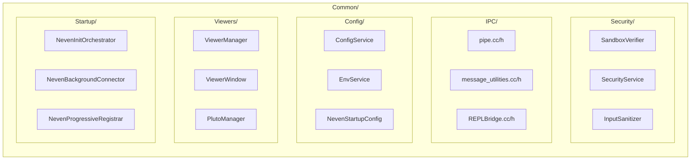

# Design Document: Security Remediation

## Overview

This design addresses the comprehensive security remediation of the NEVEN project, a C++17 XLL add-in for Microsoft Excel integrating R 4.4.1 and Julia 1.12.6. The remediation covers 36 findings from a code audit (8 critical, 7 high, 5 medium, 14 low) organized into 15 requirement areas spanning input sanitization, sandbox hardening, build security, IPC validation, code cleanup, and documentation.

The design follows a defense-in-depth strategy: multiple independent security layers ensure that a bypass of one layer does not compromise the entire system. Changes are organized by priority — critical and high-severity items first — with backward-compatible APIs to avoid breaking existing user workflows.

### Design Principles

1. **Fail-closed**: All validation defaults to rejection when uncertain
2. **Centralized validation**: Single point of truth for input sanitization (InputSanitizer) and code verification (SandboxVerifier)
3. **Idempotent operations**: Sanitization and verification produce stable results regardless of application count
4. **Minimal privilege**: CI pipelines, processes, and modules operate with least-required permissions
5. **Defense in depth**: Compilation flags, sandbox patterns, input validation, and IPC validation form independent layers

## Architecture

### High-Level Security Architecture

```mermaid
graph TB
    subgraph "Excel Process"
        A[Excel Cell Input] --> B[InputSanitizer]
        B --> C{Valid?}
        C -->|Yes| D[SandboxVerifier]
        C -->|No| E[Error Response]
        D --> F{Trusted?}
        F -->|Blocked| E
        F -->|PromptUser/Trusted| G[IPC Layer]
    end

    subgraph "IPC Layer"
        G --> H[MessageValidator]
        H --> I[Frame/Unframe with size check]
        I --> J[Named Pipe with RAII handles]
    end

    subgraph "Child Process"
        J --> K[ControlR.exe / ControlJulia.exe]
    end

    subgraph "Build Security"
        L[CMakeLists.txt] --> M[/GS /guard:cf /DYNAMICBASE /NXCOMPAT]
    end

    subgraph "CI Security"
        N[build-and-test.yml] --> O[permissions: contents: read]
    end
```

### Module Dependency After Refactoring



## Components and Interfaces

### 1. InputSanitizer (NEW — Common/Security/)

Centralizes all input validation before use in command-line construction or process creation.

```cpp
namespace rj2xcl {
namespace security {

/**
 * @brief Centralized input sanitizer for command-line argument safety.
 *
 * Validates strings against a character allowlist before they are used
 * in CreateProcess calls or command-line construction. Prevents OS
 * command injection via metacharacters in file paths from Excel cells.
 */
class InputSanitizer {
public:
    /** @brief Validation result with error details. */
    struct ValidationResult {
        bool is_valid;
        std::string error_message;      ///< Empty if valid
        char first_invalid_char;        ///< First offending character (0 if valid)
        size_t invalid_char_position;   ///< Position of first offending char
    };

    /**
     * @brief Validates a file path against the character allowlist.
     *
     * Allowed characters: [A-Za-z0-9], path separators (\ /), dot (.),
     * hyphen (-), underscore (_), space, colon (:) for drive letters.
     *
     * @param path The file path string to validate.
     * @return ValidationResult indicating pass/fail with details.
     */
    static ValidationResult ValidatePath(const std::string& path);

    /**
     * @brief Validates a generic argument string (stricter than path).
     *
     * Rejects: & | ; ` < > " \n \r % and all control characters.
     *
     * @param argument The argument string to validate.
     * @return ValidationResult indicating pass/fail with details.
     */
    static ValidationResult ValidateArgument(const std::string& argument);

    /**
     * @brief Sanitizes a path by removing disallowed characters.
     *
     * Idempotent: sanitize(sanitize(x)) == sanitize(x).
     *
     * @param path The file path to sanitize.
     * @return Sanitized path with only allowed characters.
     */
    static std::string SanitizePath(const std::string& path);

    /**
     * @brief Constructs a safe CreateProcess call with separated
     *        lpApplicationName and lpCommandLine.
     *
     * @param executable Validated path to the executable.
     * @param arguments Vector of validated argument strings.
     * @return Pair of (lpApplicationName, lpCommandLine) strings.
     */
    static std::pair<std::string, std::string> BuildSafeCommandLine(
        const std::string& executable,
        const std::vector<std::string>& arguments);

private:
    static bool IsAllowedPathChar(char c);
    static bool IsAllowedArgumentChar(char c);
};

} // namespace security
} // namespace rj2xcl
```

### 2. SandboxVerifier (ENHANCED — Common/Security/)

Extended with additional blocked patterns, REPL/AutoLoader integration, and env var blocking.

```cpp
namespace rj2xcl {
namespace security {

// Existing interface preserved, new methods added:

class SandboxVerifier {
public:
    // ... existing public interface unchanged ...

    /**
     * @brief Validates code for execution from ANY path (cell, REPL, AutoLoader).
     *
     * Unified entry point ensuring all execution paths apply identical checks.
     * Replaces direct calls from REPL and AutoLoader that previously bypassed.
     *
     * @param code The code string to validate.
     * @param source Execution source for audit logging.
     * @param rejection_reason Output: reason if blocked.
     * @return true if safe, false if blocked.
     */
    bool ValidateFromAnySource(const std::string& code,
                               ExecutionSource source,
                               std::string& rejection_reason) const;

    /** @brief Execution source for audit trail. */
    enum class ExecutionSource {
        ExcelCell,      ///< =RJ2XCL.R("...") or =RJ2XCL.J("...")
        REPL,           ///< Console/REPL interactive input
        AutoLoader,     ///< User script directory auto-load
        RegisteredFunc  ///< Pre-loaded registered function (bypasses sandbox)
    };

private:
    // Extended blocklists (additions to existing):
    // R: readLines (pipe arg), get, source, library, open, Sys.getenv,
    //    .Internal, unsafe_pointer_to_objref
    // Julia: unsafe_pointer_to_objref, unsafe_wrap, ENV, open (process),
    //        Sockets.connect
    
    static const std::vector<std::pair<std::string, std::string>>& GetRBlocklist();
    static const std::vector<std::pair<std::string, std::string>>& GetJuliaBlocklist();
    static const std::vector<std::pair<std::string, std::string>>& GetPythonBlocklist();
};

} // namespace security
} // namespace rj2xcl
```

### 3. MessageValidator (NEW — Common/IPC/)

Validates Protobuf frames before deserialization to prevent buffer overflows and undefined behavior.

```cpp
namespace rj2xcl {
namespace ipc {

/**
 * @brief Validates IPC message frames before Protobuf deserialization.
 *
 * Enforces size limits and structural integrity on incoming Named Pipe
 * messages to prevent memory corruption from malformed data.
 */
class MessageValidator {
public:
    /** @brief Default maximum message size: 64 MB. */
    static constexpr uint32_t kDefaultMaxMessageSize = 64 * 1024 * 1024;

    /** @brief Minimum valid message size: 4 bytes (length prefix only). */
    static constexpr uint32_t kMinFrameSize = sizeof(uint32_t);

    /**
     * @brief Validates a framed message before deserialization.
     *
     * Checks:
     * 1. Buffer has at least 4 bytes for length prefix
     * 2. Length prefix does not exceed max_message_size
     * 3. Buffer contains enough data for the declared length
     *
     * @param data Raw buffer pointer.
     * @param buffer_len Total bytes available in buffer.
     * @param max_message_size Maximum allowed payload size.
     * @return true if frame structure is valid for deserialization attempt.
     */
    static bool ValidateFrame(const char* data, uint32_t buffer_len,
                              uint32_t max_message_size = kDefaultMaxMessageSize);

    /**
     * @brief Enhanced Unframe with validation.
     *
     * Validates frame structure, then attempts Protobuf deserialization.
     * Logs errors via LogService on failure.
     *
     * @param message Output protobuf message.
     * @param data Raw buffer.
     * @param len Buffer length.
     * @param max_message_size Maximum allowed payload.
     * @return true if successfully deserialized.
     */
    static bool SafeUnframe(google::protobuf::Message& message,
                            const char* data, uint32_t len,
                            uint32_t max_message_size = kDefaultMaxMessageSize);
};

} // namespace ipc
} // namespace rj2xcl
```

### 4. PipeHandle RAII Wrapper (ENHANCED — Common/IPC/)

```cpp
namespace rj2xcl {
namespace ipc {

/**
 * @brief RAII wrapper for Windows HANDLE with atomic validity checking.
 *
 * Prevents TOCTOU races by combining validity check and operation
 * under a single critical section. Ensures handles are always closed
 * on destruction or error.
 */
class SafePipeHandle {
public:
    explicit SafePipeHandle(HANDLE h = INVALID_HANDLE_VALUE);
    ~SafePipeHandle();

    // Move-only semantics
    SafePipeHandle(SafePipeHandle&& other) noexcept;
    SafePipeHandle& operator=(SafePipeHandle&& other) noexcept;
    SafePipeHandle(const SafePipeHandle&) = delete;
    SafePipeHandle& operator=(const SafePipeHandle&) = delete;

    /**
     * @brief Atomically validates handle and performs a read operation.
     *
     * Acquires mutex, checks handle validity, performs ReadFile,
     * all within the same critical section.
     *
     * @param buffer Output buffer.
     * @param buffer_size Size of output buffer.
     * @param bytes_read Output: bytes actually read.
     * @param overlapped OVERLAPPED structure for async I/O.
     * @return true if operation initiated successfully.
     */
    bool AtomicRead(char* buffer, DWORD buffer_size,
                    DWORD* bytes_read, LPOVERLAPPED overlapped);

    /**
     * @brief Atomically validates handle and performs a write operation.
     */
    bool AtomicWrite(const char* data, DWORD data_size,
                     DWORD* bytes_written, LPOVERLAPPED overlapped);

    /** @brief Returns true if handle is valid (not INVALID_HANDLE_VALUE). */
    bool IsValid() const;

    /** @brief Closes the handle and resets to INVALID_HANDLE_VALUE. */
    void Close();

    /** @brief Gets the raw handle (for WaitForMultipleObjects etc.). */
    HANDLE Get() const { return handle_; }

private:
    HANDLE handle_;
    mutable CRITICAL_SECTION cs_;
};

} // namespace ipc
} // namespace rj2xcl
```

### 5. AutoLoader (MODIFIED — Common/Startup/)

```cpp
// Modified SourcingRFiles and SourcingJuliaFiles to call SandboxVerifier:

void AutoLoader::SourcingRFiles() {
    auto engine = RuntimeLoader::GetInstance().GetEngine(RuntimeLoader::EngineType::R);
    if (!engine) return;

    auto& sandbox = security::SandboxVerifier::GetInstance();

    for (const auto& entry : fs::directory_iterator(m_script_directory)) {
        if (entry.is_regular_file() && entry.path().extension() == ".R") {
            std::string content = ReadFileContent(entry.path().string());
            if (!content.empty()) {
                std::string rejection_reason;
                if (!sandbox.ValidateFromAnySource(content,
                        security::SandboxVerifier::ExecutionSource::AutoLoader,
                        rejection_reason)) {
                    LogService::Warning("[AutoLoader] Blocked: " +
                        entry.path().filename().string() + " — " + rejection_reason);
                    continue;
                }
                engine->ExecuteString(content);
            }
        }
    }
}
```

### 6. ConfigService (ENHANCED — Common/Config/)

```cpp
// New method for sandbox disable confirmation:

/**
 * @brief Attempts to disable the sandbox with user confirmation.
 *
 * Shows an Excel dialog requiring explicit confirmation.
 * Logs the event with timestamp and Windows username on success.
 *
 * @return true if user confirmed and sandbox was disabled.
 */
bool RequestSandboxDisable();
```

### 7. CMake Security Flags (Root CMakeLists.txt)

```cmake
# Security compilation flags — applied globally to all targets
if(MSVC)
    # /GS: Buffer security check (stack canaries)
    # /guard:cf: Control Flow Guard
    add_compile_options(/GS /guard:cf)

    # /DYNAMICBASE: ASLR
    # /NXCOMPAT: Data Execution Prevention
    # /CETCOMPAT: Intel CET Shadow Stack (future-proofing)
    add_link_options(/DYNAMICBASE /NXCOMPAT /CETCOMPAT)

    # Additional hardening
    add_compile_definitions(_CRT_SECURE_NO_WARNINGS=0)
    add_compile_options(/sdl)  # Additional security checks
endif()
```

### 8. GitHub Actions Permissions

```yaml
# Top-level permissions declaration
permissions:
  contents: read

jobs:
  unit-tests:
    # Inherits workflow-level permissions (read-only)
    ...

  full-build:
    permissions:
      contents: read
    ...
```

### 9. Environment Variable Lookup with Fallback (Common/Config/)

```cpp
namespace rj2xcl {

/**
 * @brief Reads an environment variable with NEVEN_ > RJ2XCL_ > BERT_ priority.
 *
 * @param base_name Variable name without prefix (e.g., "HOME").
 * @return Value from highest-priority prefix found, or empty string.
 */
std::string GetNevenEnvVar(const std::string& base_name);

} // namespace rj2xcl
```

## Data Models

### InputSanitizer Character Allowlist

| Context | Allowed Characters |
|---------|-------------------|
| File Path | `[A-Za-z0-9]`, `\`, `/`, `.`, `-`, `_`, ` ` (space), `:` (drive letter) |
| Argument | `[A-Za-z0-9]`, `.`, `-`, `_`, ` ` (space) |
| Blocked (universal) | `&`, `\|`, `;`, `` ` ``, `<`, `>`, `"`, `\n`, `\r`, `%`, `$`, `!` |

### SandboxVerifier Extended Blocklists

**R additions** (beyond current implementation):
- `readLines` (with connection/pipe argument detection)
- `get(` — dynamic symbol lookup
- `source(` — file execution
- `library(` — unrestricted package loading
- `open(` — connection opening
- `Sys.getenv(` — environment variable read
- `.Internal(` — internal R function access

**Julia additions** (beyond current implementation):
- `unsafe_pointer_to_objref` — unsafe memory access
- `unsafe_wrap` — unsafe array wrapping
- `ENV[` and `ENV` — environment dictionary access
- `open` (with process detection via backtick or `Cmd`)
- `Sockets.connect` — network access

### Protobuf Message Validation Limits

| Parameter | Default | Configurable | Range |
|-----------|---------|--------------|-------|
| Max message size | 64 MB | Yes (neven-config.json) | 1 KB – 256 MB |
| Max array elements | 1,000,000 | Yes | 1 – 10,000,000 |
| Read timeout | 30s | Yes | 1s – 300s |

### Common Module Directory Structure (Post-Refactoring)

```
Common/
├── Security/
│   ├── SandboxVerifier.cc/h
│   ├── SecurityService.cc/h
│   └── InputSanitizer.cc/h
├── IPC/
│   ├── pipe.cc/h
│   ├── message_utilities.cc/h
│   ├── MessageValidator.cc/h
│   ├── SafePipeHandle.cc/h
│   └── REPLBridge.cc/h
├── Config/
│   ├── ConfigService.cc/h
│   ├── EnvService.cc/h
│   └── NevenStartupConfig.cc/h
├── Viewers/
│   ├── ViewerManager.cc/h
│   ├── ViewerWindow.cc/h
│   ├── PlutoManager.cc/h
│   ├── PostMessageBridge.cc/h
│   ├── NotebookLibrary.cc/h
│   ├── NotebookExporter.cc/h
│   └── PresentationBuilder.cc/h
├── Startup/
│   ├── AutoLoader.cc (header in Include/)
│   ├── NevenInitOrchestrator.cc/h
│   ├── NevenBackgroundConnector.cc/h
│   ├── NevenProgressiveRegistrar.cc/h
│   ├── NevenProgressiveRegisterExport.cc/h
│   ├── NevenStatusBarReporter.cc/h
│   └── NevenWatchdogTimer.cc/h
├── Diagnostics/
│   ├── DiagnosticRouter.cc/h
│   ├── LogService.cc/h
│   ├── CrashHandler.cc/h
│   └── child_process_log.cc/h
├── Utilities/
│   ├── string_utilities.h
│   ├── result.h
│   ├── UniqueHandle.h
│   ├── Constants.h
│   ├── process_exit_codes.h
│   ├── windows_api_functions.cc/h
│   ├── module_functions.cc/h
│   └── debug_functions.cc/h
├── REPL/
│   ├── REPLManager.cc/h
│   └── REPLLanguageAccessor.cc/h
├── json11/
│   └── json11.cpp/hpp
└── CMakeLists.txt (updated with subdirectory sources)
```

## Correctness Properties

*A property is a characteristic or behavior that should hold true across all valid executions of a system — essentially, a formal statement about what the system should do. Properties serve as the bridge between human-readable specifications and machine-verifiable correctness guarantees.*

### Property 1: InputSanitizer allowlist correctness

*For any* string, the InputSanitizer SHALL accept it if and only if every character in the string belongs to the defined allowlist for the given context (path or argument). Conversely, *for any* string containing at least one character outside the allowlist, the InputSanitizer SHALL reject it.

**Validates: Requirements 1.1, 1.2, 1.3, 1.5**

### Property 2: InputSanitizer idempotence

*For any* string, applying `SanitizePath` once and then applying it again SHALL produce the same result: `SanitizePath(SanitizePath(x)) == SanitizePath(x)`.

**Validates: Requirements 1.6**

### Property 3: Sandbox execution path equivalence

*For any* code string, submitting it through the Excel cell path, the REPL path, or the AutoLoader path SHALL produce the same sandbox verdict (Trusted, PromptUser, or Blocked).

**Validates: Requirements 3.1, 3.2**

### Property 4: Sandbox blocklist enforcement

*For any* code string containing a function pattern from the R, Julia, or Python blocklist (including whitespace-stripped and case-normalized variants), the SandboxVerifier SHALL return `Blocked` status regardless of surrounding code context.

**Validates: Requirements 3.3, 3.4, 10.1, 10.2**

### Property 5: Sandbox error message specificity

*For any* code string that is blocked by the SandboxVerifier, the rejection reason SHALL contain the name of the specific blocked function or pattern that triggered the rejection.

**Validates: Requirements 3.7, 10.3**

### Property 6: Sandbox verification idempotence

*For any* code string, calling `ValidateCodeForExecution` once and then calling it again on the same input SHALL produce the same boolean result and the same rejection reason string.

**Validates: Requirements 3.8**

### Property 7: Protobuf Frame/Unframe round-trip

*For any* valid `RJ2XCLBuffers::Variable` message, calling `Frame()` to serialize it and then `SafeUnframe()` to deserialize SHALL produce a message equivalent to the original (all fields match).

**Validates: Requirements 7.4**

### Property 8: Protobuf Unframe rejects invalid data

*For any* byte sequence that either (a) has a length prefix exceeding the configured maximum, or (b) contains payload bytes that do not form a valid Protobuf message, `SafeUnframe()` SHALL return false without crashing or invoking undefined behavior.

**Validates: Requirements 7.1, 7.3**

### Property 9: Environment variable lookup priority

*For any* base variable name, `GetNevenEnvVar(name)` SHALL return the value of `NEVEN_{name}` if set, otherwise `RJ2XCL_{name}` if set, otherwise `BERT_{name}` if set, otherwise empty string. The priority order is strict: NEVEN_ > RJ2XCL_ > BERT_.

**Validates: Requirements 15.3**

## Error Handling

### InputSanitizer Errors

| Condition | Behavior | Error Code |
|-----------|----------|------------|
| Disallowed character in path | Reject with position info | `NEVEN_ERR_INVALID_PATH_CHAR` |
| Empty path | Reject | `NEVEN_ERR_EMPTY_PATH` |
| Path exceeds MAX_PATH (260) | Reject | `NEVEN_ERR_PATH_TOO_LONG` |
| Null pointer input | Reject | `NEVEN_ERR_NULL_INPUT` |

All errors are logged via `LogService::Warning()` with the rejected input (truncated to 128 chars) and the specific violation.

### SandboxVerifier Errors

| Condition | Behavior |
|-----------|----------|
| Blocked function detected | Return false + rejection_reason identifying the function |
| Bypass attempt detected (paste+sys, getattr+os) | Return false + "potential sandbox bypass" message |
| Sandbox disabled without confirmation | Log warning, keep sandbox enabled |
| Sandbox disabled with confirmation | Log event with timestamp + Windows username |

### IPC/Protobuf Errors

| Condition | Behavior |
|-----------|----------|
| Length prefix > max_message_size | Discard message, log error, return false |
| Buffer too short for declared length | Discard, log error, return false |
| Protobuf ParseFromArray fails | Discard, log error, return false |
| Pipe handle invalid during operation | Close handle, log error, attempt reconnection |
| Pipe read timeout | Log warning, retry up to max_retries |

### Child Process Lifecycle Errors

| Condition | Behavior |
|-----------|----------|
| Process creation fails | Close all partially-allocated handles, log error |
| Process unresponsive (timeout) | TerminateProcess, close handles, free buffers |
| Process exits unexpectedly | Close handles, free buffers, notify LanguageService |
| Pipe creation fails mid-setup | Close already-created pipes, free buffers, return error |

All handle cleanup uses RAII (`SafePipeHandle` or `UniqueHandle`) to guarantee cleanup even on exception paths.

## Testing Strategy

### Property-Based Testing (PBT)

This feature is well-suited for property-based testing because the core security components (InputSanitizer, SandboxVerifier, MessageValidator) are pure functions with clear input/output behavior and large input spaces where edge cases matter significantly.

**Library**: [rapidcheck](https://github.com/emil-e/rapidcheck) integrated with Google Test v1.14.0

**Configuration**:
- Minimum 100 iterations per property test
- Each property test tagged with: `Feature: security-remediation, Property {N}: {title}`
- Generators produce:
  - Random Unicode strings (for sanitizer tests)
  - Random code snippets with embedded blocked patterns (for sandbox tests)
  - Random byte arrays and valid Protobuf messages (for IPC tests)
  - Random environment variable configurations (for env lookup tests)

### Test Organization

| Property | Test File | Generators |
|----------|-----------|------------|
| 1: Allowlist correctness | `tests/input_sanitizer_pbt.cc` | Random strings with mixed allowed/disallowed chars |
| 2: Sanitizer idempotence | `tests/input_sanitizer_pbt.cc` | Arbitrary strings |
| 3: Path equivalence | `tests/sandbox_path_pbt.cc` | Random code strings |
| 4: Blocklist enforcement | `tests/sandbox_blocklist_pbt.cc` | Code with embedded blocked patterns |
| 5: Error specificity | `tests/sandbox_blocklist_pbt.cc` | Code with single blocked pattern |
| 6: Sandbox idempotence | `tests/sandbox_path_pbt.cc` | Arbitrary strings |
| 7: Frame/Unframe round-trip | `tests/protobuf_ipc_pbt.cc` | Random valid Variable messages |
| 8: Unframe rejects invalid | `tests/protobuf_ipc_pbt.cc` | Random byte arrays, oversized prefixes |
| 9: Env var priority | `tests/env_lookup_pbt.cc` | Random var names + env configurations |

### Unit Tests (Example-Based)

| Area | Test File | Coverage |
|------|-----------|----------|
| CreateProcess separation | `tests/input_sanitizer_tests.cc` | lpApplicationName vs lpCommandLine |
| Sandbox disable confirmation | `tests/config_service_tests.cc` | Dialog mock, log verification |
| MSVC flags presence | `tests/build_verification_tests.cc` | dumpbin /headers check |
| .gitignore patterns | `tests/repo_hygiene_tests.cc` | Pattern presence verification |
| CI permissions | `tests/repo_hygiene_tests.cc` | YAML parsing verification |
| eval(parse()) elimination | `tests/r_library_tests.cc` | Grep verification |
| Dead code removal | `tests/repo_hygiene_tests.cc` | File existence checks |
| Console independence | `tests/integration_tests.cc` | Build without Console |
| Handle cleanup | `tests/pipe_lifecycle_tests.cc` | Process termination scenarios |

### Integration Tests

| Scenario | Description |
|----------|-------------|
| Full pipe lifecycle | Create pipe → connect → exchange messages → terminate child → verify cleanup |
| AutoLoader with blocked script | Place blocked script in directory → verify rejection + log |
| Sandbox disable flow | Mock dialog → confirm → verify log entry |
| Oversized message handling | Send 65MB message → verify rejection without crash |

### Test Execution

```bash
# Run all tests including PBT (single execution, no watch mode)
cmake --build build --config Release --target rj2xcl_tests
ctest --output-on-failure -C Release --timeout 120

# Run only security PBT tests
ctest --output-on-failure -C Release -R "pbt" --timeout 120
```
