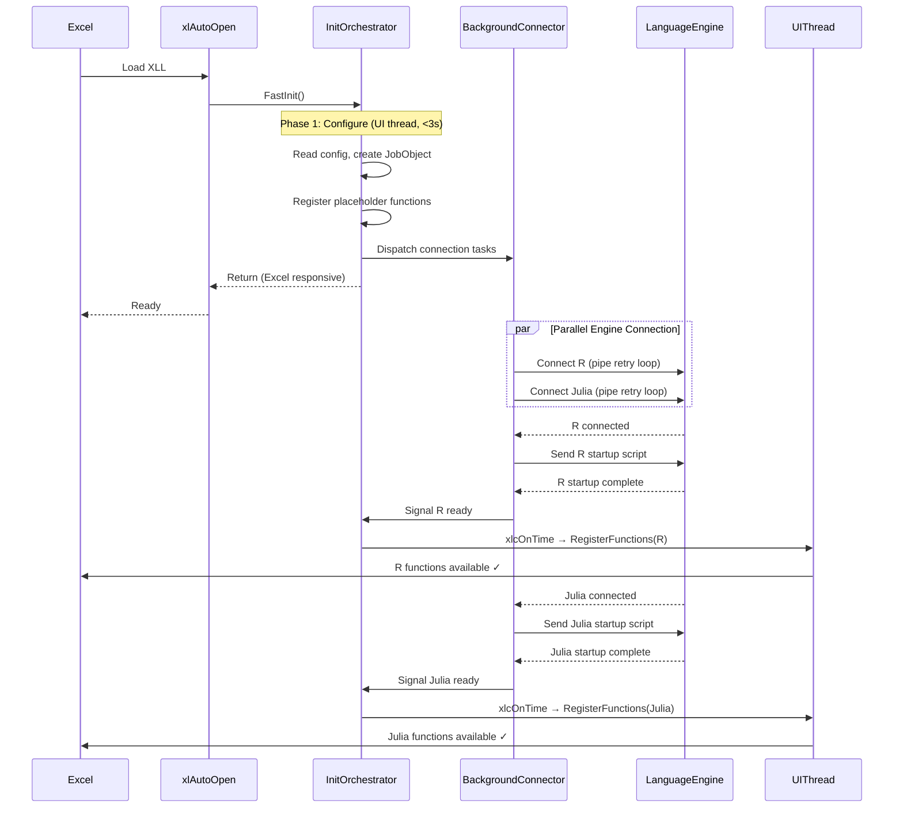
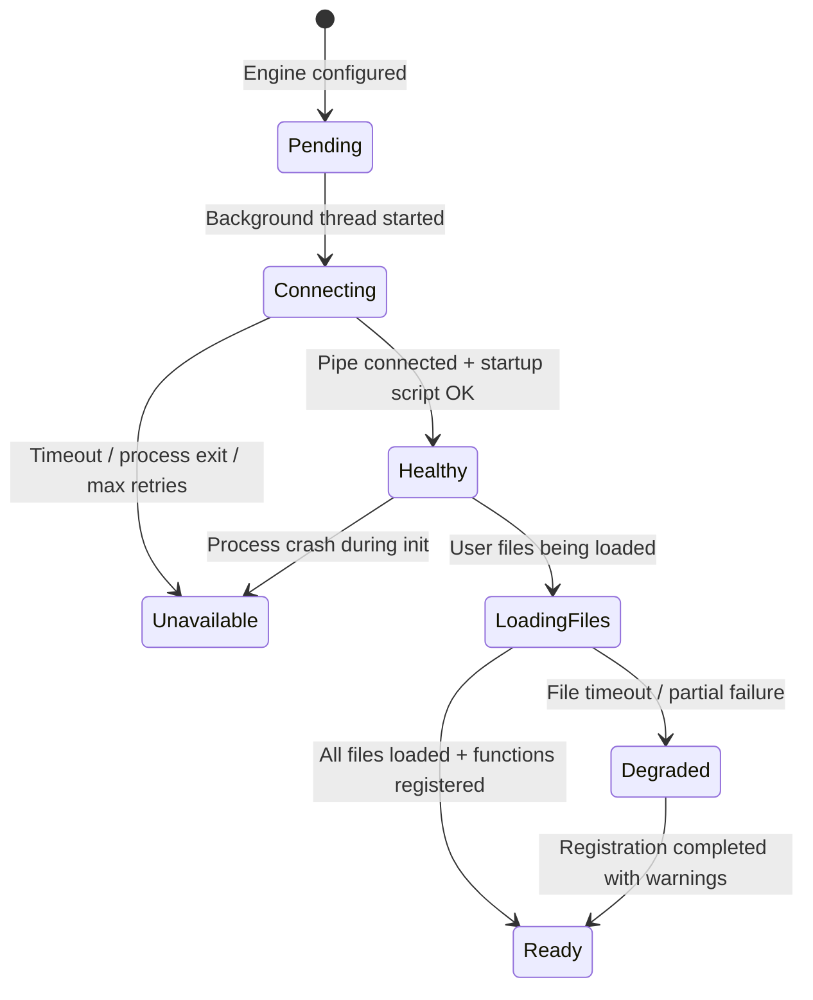
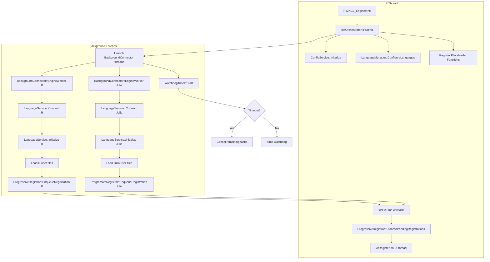

# Design Document: Startup Optimization

## Overview

This design transforms NEVEN's monolithic `Init()` method from a sequential, UI-thread-blocking operation into a two-phase architecture: a fast synchronous phase that completes within 3 seconds on the UI thread, followed by a parallel asynchronous phase that connects language engines, runs startup scripts, loads user files, and progressively registers functions — all without freezing Excel.

The key insight from the existing codebase is that `xlfRegister` **must** be called from the UI thread and historically only worked reliably during `xlAutoOpen`. The design solves this by using `xlcOnTime` to schedule registration callbacks back onto the UI thread after background work completes, combined with a state machine that tracks each engine's lifecycle independently.

### Design Rationale

1. **Minimal invasiveness**: The existing `LanguageManager`, `LanguageService`, and `ConfigService` singletons remain unchanged. A new `InitOrchestrator` class wraps the startup sequence without modifying the existing class hierarchy.
2. **Progressive enhancement**: Functions become available incrementally as each engine completes, rather than all-or-nothing.
3. **Graceful degradation**: A failed engine never blocks other engines or Excel itself.
4. **Observability**: Every phase transition is timestamped and logged for diagnostics.

### Naming Convention: NEVEN for New Code

All new components introduced by this feature use the `neven` namespace instead of the legacy `rj2xcl` namespace. This is the first step toward a gradual migration:

- **New namespace**: `neven::` (for `InitOrchestrator`, `BackgroundConnector`, `StatusBarReporter`, `WatchdogTimer`, `ProgressiveRegistrar`)
- **New file prefix**: `Neven` (e.g., `NevenInitOrchestrator.h`, `NevenBackgroundConnector.cc`)
- **Existing code**: Remains `rj2xcl::` and `RJ2XCL_Engine` — no ABI-breaking renames in this feature
- **Bridge pattern**: The new `neven::InitOrchestrator` calls into existing `rj2xcl::LanguageManager` and `RJ2XCL_Engine` via their current interfaces
- **Exported XLL functions**: New exports use `NEVEN_` prefix (e.g., `NEVEN_ProgressiveRegister`) while existing `RJ_FunctionCall*` exports remain unchanged for backward compatibility

This approach avoids ABI breaks while establishing the new naming convention for all future development.

## Architecture

### High-Level Architecture



### Low-Level Architecture

The startup is split into two execution contexts:

**UI Thread (synchronous, ≤3s)**:
1. `ConfigService::Initialize()` — read neven-config.json
2. `LanguageManager::ConfigureLanguages()` — parse language descriptors
3. Create JobObject for child process management
4. Register placeholder/stub functions via `xlfRegister`
5. Set global `InitState::Connecting` flag
6. Launch `BackgroundConnector` thread pool
7. Return control to Excel

**Background Threads (asynchronous)**:
1. Per-engine: `StartChildProcess()` → pipe retry loop → `Initialize()` → load user files
2. On completion: enqueue registration request to UI thread via `xlcOnTime`
3. Watchdog thread monitors total elapsed time



## Components and Interfaces

### 1. InitOrchestrator

**Responsibility**: Coordinates the entire startup sequence, owns the global initialization state, and manages the transition from synchronous to asynchronous phases.

```cpp
namespace neven {

enum class StartupPhase {
    Configure,    // Reading config, creating JobObject
    Connect,      // Background pipe connection in progress
    Initialize,   // Startup scripts executing
    LoadFiles,    // User function files loading
    Register,     // Progressive xlfRegister calls
    Complete      // All engines finalized
};

enum class InitState {
    NotStarted,
    Connecting,
    Ready,
    Failed
};

struct EngineTimingData {
    std::string engine_name;
    DWORD connect_start_ms;
    DWORD connect_end_ms;
    DWORD init_start_ms;
    DWORD init_end_ms;
    DWORD files_start_ms;
    DWORD files_end_ms;
    int retry_count;
    int files_loaded;
    int functions_registered;
    HealthStatus final_status;
};

struct StartupReport {
    DWORD total_elapsed_ms;
    std::vector<EngineTimingData> engines;
    int total_functions_registered;
    int total_files_loaded;
    int engines_healthy;
    int engines_unavailable;
};

class InitOrchestrator {
public:
    static InitOrchestrator& Instance();

    /// Phase 1: Fast synchronous init on UI thread (≤3s)
    void FastInit(HANDLE job_handle, CallbackInfo& callback_info,
                  COMObjectMap& object_map);

    /// Query current global init state
    InitState GetInitState() const;

    /// Query per-engine health status
    HealthStatus GetEngineHealth(const std::string& engine_name) const;

    /// Get startup report for NEVEN.STATUS()
    StartupReport GetStartupReport() const;

    /// Signal all background threads to stop (called from xlAutoClose)
    void CancelAndWait(DWORD timeout_ms = 5000);

    /// Check if a specific engine is ready for function calls
    bool IsEngineReady(const std::string& engine_name) const;

    /// Get user-facing status message for an engine
    std::string GetEngineStatusMessage(const std::string& engine_name) const;

private:
    InitOrchestrator();

    /// Phase 2 entry point — runs on a dedicated coordinator thread
    void BackgroundInitSequence();

    /// Called by background threads when an engine completes
    void OnEngineReady(uint32_t engine_index);

    /// Schedule xlfRegister on UI thread via SetTimer
    void ScheduleRegistration(uint32_t engine_index);

    // State
    std::atomic<InitState> init_state_{InitState::NotStarted};
    std::atomic<bool> cancellation_requested_{false};
    mutable std::mutex state_mutex_;
    std::vector<EngineTimingData> timing_data_;
    DWORD init_start_tick_;

    // Configuration (read from neven-config.json)
    DWORD connection_timeout_ms_ = 15000;
    DWORD script_timeout_ms_ = 30000;
    DWORD file_timeout_ms_ = 30000;
    DWORD total_timeout_ms_ = 60000;
    int max_parallel_connections_ = 3;
};

} // namespace neven
```

### 2. BackgroundConnector

**Responsibility**: Manages per-engine worker threads that perform the blocking operations (process launch, pipe connection, startup script, file loading).

```cpp
namespace neven {

class BackgroundConnector {
public:
    /// Launch a worker thread for a single engine
    void ConnectEngine(uint32_t engine_index,
                       std::shared_ptr<LanguageService> service,
                       HANDLE job_handle,
                       std::atomic<bool>& cancellation_token);

    /// Wait for all worker threads to complete (with timeout)
    bool WaitAll(DWORD timeout_ms);

    /// Get the thread handle for a specific engine
    HANDLE GetThreadHandle(uint32_t engine_index) const;

private:
    /// Worker thread function for a single engine
    static unsigned __stdcall EngineWorker(void* param);

    struct WorkerContext {
        uint32_t engine_index;
        std::shared_ptr<LanguageService> service;
        HANDLE job_handle;
        std::atomic<bool>* cancellation_token;
        InitOrchestrator* orchestrator;
        DWORD connection_timeout_ms;
        DWORD script_timeout_ms;
        DWORD file_timeout_ms;
    };

    std::vector<HANDLE> thread_handles_;
    mutable std::mutex mutex_;
};

} // namespace neven
```

### 3. StatusBarReporter

**Responsibility**: Throttled status bar updates via Excel's `xlcMessage` API.

```cpp
namespace neven {

class StatusBarReporter {
public:
    static StatusBarReporter& Instance();

    /// Post a status message (throttled to 1/second)
    void ReportProgress(const std::string& message);

    /// Report engine ready
    void ReportEngineReady(const std::string& engine_name, int function_count);

    /// Report final summary and schedule clear
    void ReportComplete(const StartupReport& report);

    /// Clear the status bar
    void Clear();

private:
    DWORD last_update_tick_ = 0;
    static constexpr DWORD MIN_UPDATE_INTERVAL_MS = 1000;
};

} // namespace neven
```

### 4. WatchdogTimer

**Responsibility**: Monitors total initialization time and terminates stuck tasks.

```cpp
namespace neven {

class WatchdogTimer {
public:
    /// Start the watchdog on a dedicated thread
    void Start(DWORD total_timeout_ms, std::atomic<bool>& cancellation_token);

    /// Stop the watchdog (called when init completes normally)
    void Stop();

    /// Register a task for individual timeout monitoring
    void RegisterTask(uint32_t engine_index, DWORD timeout_ms);

    /// Mark a task as making progress (resets its individual timer)
    void ReportProgress(uint32_t engine_index);

private:
    static unsigned __stdcall WatchdogThread(void* param);

    HANDLE thread_handle_ = nullptr;
    HANDLE stop_event_ = nullptr;
    std::atomic<bool>* cancellation_token_ = nullptr;
    DWORD total_timeout_ms_;

    struct TaskInfo {
        DWORD timeout_ms;
        DWORD last_progress_tick;
        bool completed;
    };
    std::unordered_map<uint32_t, TaskInfo> tasks_;
    std::mutex tasks_mutex_;
};

} // namespace neven
```

### 5. ProgressiveRegistrar

**Responsibility**: Handles the UI-thread-safe registration of functions after background init completes. Uses `SetTimer` to schedule callbacks.

```cpp
namespace neven {

class ProgressiveRegistrar {
public:
    static ProgressiveRegistrar& Instance();

    /// Enqueue an engine for registration (called from background thread)
    void EnqueueRegistration(uint32_t engine_index);

    /// Process pending registrations (called on UI thread via SetTimer callback)
    void ProcessPendingRegistrations();

    /// Check if an engine's functions are already registered
    bool IsRegistered(uint32_t engine_index) const;

    /// Check if there are pending registrations
    bool HasPending() const;

    /// Check if all expected engines are registered
    bool AllComplete() const;

private:
    std::queue<uint32_t> pending_registrations_;
    std::mutex queue_mutex_;
    std::set<uint32_t> registered_engines_;
    int expected_engine_count_ = 0;
};

} // namespace neven
```

### Component Interaction Diagram



## Data Models

### StartupConfig (read from neven-config.json)

New configuration section added to `neven-config.json`:

```json
{
  "NEVEN": {
    "startup": {
      "connectionTimeoutMs": 15000,
      "scriptTimeoutMs": 30000,
      "fileTimeoutMs": 30000,
      "totalTimeoutMs": 60000,
      "maxParallelConnections": 3,
      "statusBarUpdates": true
    },
    "R": {
      "startupPriority": 1,
      "lazyConnect": false
    },
    "Julia": {
      "startupPriority": 2,
      "lazyConnect": false
    },
    "Python": {
      "startupPriority": 3,
      "lazyConnect": true
    }
  }
}
```

### HealthStatus Enum (extended)

```cpp
enum class HealthStatus {
    Pending,       // Configured but not yet started
    Connecting,    // Background thread is attempting pipe connection
    Healthy,       // Pipe connected, startup script completed
    LoadingFiles,  // User function files being loaded
    Ready,         // Fully initialized, functions registered
    Degraded,      // Partially initialized (some files failed)
    Unavailable    // Failed to connect or process crashed
};
```

### Thread Synchronization Model

| Shared State | Protection | Writers | Readers |
|---|---|---|---|
| `HealthStatus` per engine | `std::atomic<HealthStatus>` | Background worker | UI thread, other workers |
| `EngineTimingData` | `state_mutex_` | Background worker (own entry) | UI thread (for STATUS) |
| `pending_registrations_` queue | `queue_mutex_` | Background workers | UI thread (xlcOnTime callback) |
| `cancellation_requested_` | `std::atomic<bool>` | UI thread (xlAutoClose) | All background workers |
| `function_list_` | UI thread only (no lock needed) | UI thread (during registration) | UI thread (during calls) |

### Registration Callback Mechanism

The critical challenge is calling `xlfRegister` from the UI thread after background work completes. The solution uses a global exported function that `xlcOnTime` can invoke:

```cpp
// Exported XLL function callable via xlcOnTime
extern "C" __declspec(dllexport) LPXLOPER12 WINAPI NEVEN_ProgressiveRegister(void) {
    neven::ProgressiveRegistrar::Instance().ProcessPendingRegistrations();
    // Return value ignored by xlcOnTime
    static XLOPER12 result;
    result.xltype = xltypeNil;
    return &result;
}
```

The background thread signals readiness by:
1. Adding the engine index to `pending_registrations_` queue
2. Calling `xlcOnTime` with the name `"RJ_ProgressiveRegister"` and a time of "now" (empty time = immediate next idle)

**Important constraint discovered in research**: `xlcOnTime` cannot be called during `xlAutoOpen` itself, but it CAN be called from a timer callback or from a function call context. The background thread uses `PostThreadMessage` to the UI thread with a custom message that triggers the `xlcOnTime` scheduling.

Alternative approach (simpler, proven in existing code): Use `SetTimer(NULL, ...)` which posts `WM_TIMER` to the calling thread's message queue. The timer callback runs on the UI thread and can safely call `xlfRegister`.

**Chosen approach**: `SetTimer` with a short interval (100ms) that checks the `pending_registrations_` queue. This avoids the complexity of `xlcOnTime` scheduling from background threads and matches the existing pattern used in `ScheduleDelayedUpdate()`.

```cpp
// Timer callback — runs on UI thread
void CALLBACK RegistrationTimerProc(HWND, UINT, UINT_PTR timerId, DWORD) {
    auto& registrar = neven::ProgressiveRegistrar::Instance();
    if (registrar.HasPending()) {
        registrar.ProcessPendingRegistrations();
    }
    if (registrar.AllComplete()) {
        KillTimer(NULL, timerId);
    }
}
```

## Correctness Properties

*A property is a characteristic or behavior that should hold true across all valid executions of a system — essentially, a formal statement about what the system should do. Properties serve as the bridge between human-readable specifications and machine-verifiable correctness guarantees.*

### Property 1: All configured engines are dispatched to background threads

*For any* set of configured language engines (1 to N), after `FastInit()` returns, every non-lazy engine SHALL have a corresponding background worker thread launched, and the total number of dispatched threads SHALL equal the number of non-lazy configured engines.

**Validates: Requirements 1.3, 2.1**

### Property 2: Placeholder registration covers all configured engines

*For any* set of configured language engines, after `FastInit()` returns, placeholder/stub functions SHALL have been registered for every configured engine, regardless of whether the engine will connect successfully.

**Validates: Requirements 1.4**

### Property 3: Health status correctly reflects connection outcome

*For any* language engine, the final `HealthStatus` after the connection phase SHALL be:
- `Healthy` if and only if the pipe connection succeeded
- `Unavailable` if the retry loop exhausted all attempts, OR the child process exited prematurely

No engine SHALL remain in `Connecting` state after its connection phase completes.

**Validates: Requirements 2.2, 2.3, 2.4**

### Property 4: Exponential backoff retry delays

*For any* pipe connection retry sequence of length N, the delay before retry `i` (0-indexed) SHALL equal `min(50 * 2^i, 800)` milliseconds, and the total elapsed time SHALL not exceed the configured connection timeout.

**Validates: Requirements 2.6**

### Property 5: Priority-based connection ordering

*For any* set of engines with assigned `startupPriority` values, the order in which `BackgroundConnector` launches connection threads SHALL be sorted by ascending priority value (lowest priority number = first to connect).

**Validates: Requirements 2.7, 12.2**

### Property 6: Completion triggers progressive registration

*For any* language engine that completes its initialization sequence (startup script + file loading), a registration request SHALL be enqueued exactly once, and no registration SHALL be enqueued for engines that have not completed initialization.

**Validates: Requirements 3.3, 4.2, 5.1**

### Property 7: No duplicate function registrations

*For any* sequence of progressive registration events, each function SHALL be registered with Excel at most once. If an engine's registration is triggered multiple times, subsequent triggers SHALL be no-ops.

**Validates: Requirements 5.3**

### Property 8: Failure isolation — failed engines do not block others

*For any* subset of K engines that fail (out of N total, where K < N), the remaining N-K engines SHALL complete their full initialization sequence (connect → startup script → file loading → registration) independently.

**Validates: Requirements 8.1**

### Property 9: Unavailable engines produce stub functions

*For any* engine with `HealthStatus::Unavailable`, all of that engine's functions SHALL be registered as stubs that return a descriptive error message containing the engine name and a troubleshooting hint when called.

**Validates: Requirements 8.2, 8.5**

### Property 10: Status-aware function dispatch

*For any* function call targeting an engine in `Connecting` state, the system SHALL return a message indicating the engine is still starting. *For any* function call targeting an engine in `Unavailable` state, the system SHALL return an error message with troubleshooting guidance. The returned message SHALL always contain the engine name.

**Validates: Requirements 6.2, 6.3**

### Property 11: File loading respects startup script ordering

*For any* engine, user function files SHALL NOT begin loading until that engine's startup script has completed (status has transitioned through `Healthy`). If the startup script fails, no files SHALL be loaded for that engine.

**Validates: Requirements 4.4**

### Property 12: File timeout results in skip-and-continue

*For any* ordered list of user function files where file at index `i` times out, all files at indices `i+1..N` SHALL still be attempted for loading (unless the engine crashes).

**Validates: Requirements 4.3**

### Property 13: Engine crash during file loading skips remaining files

*For any* engine that crashes (process exits) while loading file at index `i` out of M total files, files `i+1..M` SHALL NOT be attempted, and the engine's status SHALL transition to `Unavailable`.

**Validates: Requirements 4.7**

### Property 14: Configuration validation with sensible defaults

*For any* `neven-config.json` content where startup configuration fields are missing or invalid (negative timeouts, zero values, non-numeric), the `InitOrchestrator` SHALL use default values: 15000ms connection timeout, 30000ms script timeout, 30000ms file timeout, 60000ms total timeout, 3 max parallel connections.

**Validates: Requirements 12.4, 12.5**

### Property 15: Lazy connect defers connection

*For any* engine with `lazyConnect: true` in configuration, no background connection thread SHALL be launched during `FastInit()`. The connection SHALL only be initiated upon the first function call that targets that engine.

**Validates: Requirements 12.3**

### Property 16: Cooperative cancellation at retry boundaries

*For any* engine in its pipe connection retry loop, when the cancellation token is set to `true`, the loop SHALL exit within one additional retry iteration (i.e., it checks the token between each retry).

**Validates: Requirements 13.1, 13.2**

### Property 17: Telemetry completeness and timing invariants

*For any* engine that completes any startup phase, the corresponding `EngineTimingData` SHALL have: (a) `connect_end_ms >= connect_start_ms`, (b) `init_end_ms >= init_start_ms`, (c) `files_end_ms >= files_start_ms`, and (d) `retry_count` equal to the actual number of pipe connection retries performed.

**Validates: Requirements 3.5, 10.1, 10.5**

### Property 18: Status bar update rate limiting

*For any* sequence of N calls to `StatusBarReporter::ReportProgress()` within a 1-second window, at most 1 actual status bar update SHALL be performed (the first call updates immediately, subsequent calls within the same second are suppressed).

**Validates: Requirements 9.4**

### Property 19: Watchdog respects progress reports

*For any* background task that calls `WatchdogTimer::ReportProgress()` before its individual timeout expires, the watchdog SHALL NOT terminate that task. The individual timeout resets on each progress report.

**Validates: Requirements 11.5**

### Property 20: Watchdog terminates stuck tasks

*For any* background task that does NOT report progress within its configured individual timeout, the watchdog SHALL terminate that task and set the associated engine's `HealthStatus` to `Unavailable`.

**Validates: Requirements 11.2**


## Error Handling

### Error Categories and Responses

| Error | Detection | Response | Recovery |
|---|---|---|---|
| Child process fails to start | `StartChildProcess()` returns non-zero | Set `Unavailable`, log error with exit code | Register stubs, continue other engines |
| Pipe connection timeout | Retry loop exceeds `connectionTimeoutMs` | Set `Unavailable`, log total elapsed time | Register stubs, continue other engines |
| Child process exits during connection | `GetExitCodeProcess` ≠ `STILL_ACTIVE` | Abort retry loop immediately, set `Unavailable` | Log exit code, register stubs |
| Startup script timeout | `WaitForSingleObject` exceeds `scriptTimeoutMs` | Set `Degraded`, log failure details | Register available functions, skip file loading |
| Startup script error | Protobuf response contains error | Set `Degraded`, log error message | Register available functions, skip file loading |
| User file timeout | File loading exceeds `fileTimeoutMs` | Skip file, log warning | Continue with remaining files |
| User file causes crash | Process exit detected during `ReadSourceFile` | Set `Unavailable`, skip remaining files | Preserve already-registered functions as stubs |
| Total timeout exceeded | Watchdog detects `totalTimeoutMs` elapsed | Terminate all remaining tasks | Finalize with whatever engines are available |
| Invalid configuration | Negative/zero/out-of-range values | Log warning, use defaults | Normal startup with default values |
| `xlfRegister` failure | Return code from `Excel12()` | Log warning, mark function as unregistered | Function unavailable but engine continues |
| `xlcOnTime`/`SetTimer` failure | API returns 0/error | Fall back to synchronous registration | Attempt immediate registration if in safe context |
| Thread creation failure | `_beginthreadex` returns 0 | Log error, mark engine as Unavailable | Continue with other engines |
| Cancellation during init | `cancellation_requested_` set to true | All workers check token and exit | Clean shutdown within 5 seconds |

### Error Propagation Strategy

1. **Errors are isolated per-engine**: A failure in one engine's initialization never propagates to other engines.
2. **Errors are non-fatal to Excel**: No error during NEVEN startup should crash Excel or leave it unresponsive.
3. **Errors are observable**: All errors are logged with context (engine name, phase, elapsed time, error code).
4. **Errors degrade gracefully**: Failed engines still have their functions visible in Excel (as stubs), so users know the functions exist but the engine is unavailable.

### Thread Safety Error Handling

- All lock acquisitions use `std::lock_guard` or `std::unique_lock` (RAII) — no manual lock/unlock.
- No locks are held during blocking I/O (pipe operations, process launch, `Sleep`).
- The cancellation token is `std::atomic<bool>` — no lock needed for read/write.
- `HealthStatus` is `std::atomic<HealthStatus>` — lock-free reads from UI thread.
- The `pending_registrations_` queue uses a dedicated `queue_mutex_` with minimal hold time (push/pop only).

## Testing Strategy

### Property-Based Testing

This feature is well-suited for property-based testing because:
- The state machine transitions have universal properties that must hold for all inputs
- Configuration validation must handle arbitrary input values
- The isolation property (failed engines don't block others) must hold for all failure combinations
- Retry/backoff logic has mathematical properties verifiable across all retry counts

**Library**: [RapidCheck](https://github.com/emil-e/rapidcheck) (C++ property-based testing, integrates with Google Test)

**Configuration**: Minimum 100 iterations per property test.

**Tag format**: `Feature: startup-optimization, Property {N}: {property_text}`

Each correctness property (1–20) maps to a single property-based test that generates random inputs and verifies the universal property holds.

### Key Property Test Generators

```cpp
// Generator: Random engine configuration (1-5 engines with random priorities)
rc::Gen<std::vector<EngineConfig>> arbitraryEngineConfigs();

// Generator: Random startup config (timeouts, parallelism)
rc::Gen<StartupConfig> arbitraryStartupConfig();

// Generator: Random connection outcomes per engine (success/fail/timeout/crash)
rc::Gen<ConnectionOutcome> arbitraryConnectionOutcome();

// Generator: Random file lists with random success/fail/timeout outcomes
rc::Gen<std::vector<FileLoadOutcome>> arbitraryFileOutcomes(int engine_count);

// Generator: Invalid config values (negative, zero, extremely large)
rc::Gen<json11::Json> arbitraryInvalidConfig();
```

### Unit Tests (Example-Based)

Unit tests complement property tests for specific scenarios:

1. **Phase ordering**: Verify Configure → Connect → Initialize → LoadFiles → Register sequence
2. **xlAutoOpen timing**: Verify FastInit returns within 3 seconds with mock services
3. **Status bar messages**: Verify correct message format for each engine state
4. **NEVEN.STATUS() output**: Verify formatted output contains all required fields
5. **Cancellation edge cases**: Cancel during each specific phase
6. **Empty configuration**: No engines configured — startup completes with basic functions only
7. **All engines lazy**: No background threads launched during FastInit

### Integration Tests

1. **End-to-end startup**: Full startup with mock language processes, verify all functions registered
2. **UI thread responsiveness**: Verify no blocking calls on UI thread during background init
3. **Watchdog total timeout**: Simulate all engines stuck, verify 60-second termination
4. **xlAutoClose during init**: Close Excel during various init phases, verify clean shutdown

### Test Infrastructure

- **MockLanguageService**: Simulates pipe connection with configurable delays, success/failure, and crash behavior
- **MockExcelBridge**: Already exists in the test suite — captures `xlfRegister` calls for verification
- **MockTimer**: Simulates `SetTimer`/`KillTimer` for testing timer-based registration
- **TestClock**: Injectable clock for deterministic timing tests without real `Sleep` calls

### Test File Organization

```
tests/
├── startup_optimization/
│   ├── init_orchestrator_test.cc       # Unit tests for InitOrchestrator
│   ├── background_connector_test.cc    # Unit tests for BackgroundConnector
│   ├── progressive_registrar_test.cc   # Unit tests for ProgressiveRegistrar
│   ├── watchdog_timer_test.cc          # Unit tests for WatchdogTimer
│   ├── status_bar_reporter_test.cc     # Unit tests for StatusBarReporter
│   ├── startup_properties_test.cc      # Property-based tests (all 20 properties)
│   └── startup_integration_test.cc     # Integration tests
```
