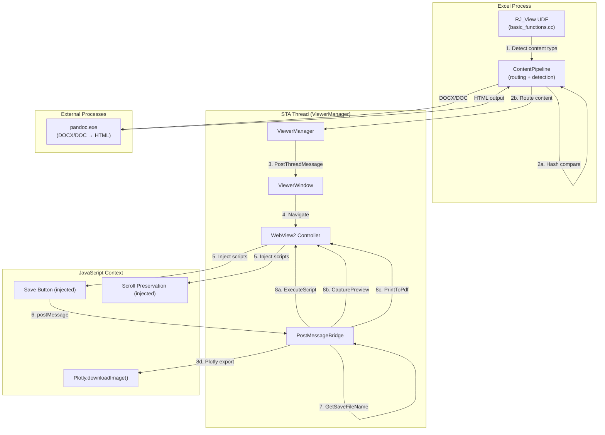

# Design Document: Viewer Professional

## Overview

This design extends the NEVEN WebView2 Viewer with three professional capabilities:

1. **Auto-Refresh** — When Excel recalculates the `RJ_View` UDF with new content, the existing viewer window updates in-place with scroll position preservation and duplicate-content skipping via content hashing.
2. **Floating Save Button** — A semi-transparent save icon injected into every viewer page via `AddScriptToExecuteOnDocumentCreated`. Clicking it triggers a native `GetSaveFileName` dialog, then exports as HTML (page source), PNG (`CapturePreview` or `Plotly.downloadImage`), or PDF (`PrintToPdf` or `Plotly.downloadImage`).
3. **Document Viewing** — Extends `ContentPipeline` to detect `.pdf`, `.txt`, `.docx`, `.doc` file extensions and route them appropriately: PDF via native WebView2 rendering, TXT via `<pre>`-wrapped dark-theme HTML, DOCX/DOC via Pandoc conversion to HTML.

All WebView2 COM operations remain on the dedicated STA thread. The design preserves full backward compatibility with existing `=NEVEN.v()` usage patterns.

## Architecture



### Threading Model

| Operation | Thread | Mechanism |
|-----------|--------|-----------|
| Content hash comparison | Excel calc thread | Inline in `RJ_View` UDF |
| File extension detection | Excel calc thread | `ContentPipeline` static methods |
| Pandoc conversion | Excel calc thread | `CreateProcess` + `WaitForSingleObject` (30s timeout) |
| WebView2 navigation | STA thread | `PostThreadMessage(WM_APP_NAVIGATE_*)` |
| Save dialog | STA thread | `GetSaveFileName` (modal, must be STA) |
| CapturePreview / PrintToPdf | STA thread | WebView2 async callbacks |
| JS injection | STA thread | `AddScriptToExecuteOnDocumentCreated` |
| Scroll save/restore | JS context | `window.scrollX/Y` before nav, `scrollTo` after |

## Components and Interfaces

### 1. ContentPipeline Extensions

New static methods added to `ContentPipeline`:

```cpp
class ContentPipeline {
public:
    // Existing methods remain unchanged...

    // ─── New: Document Type Detection ────────────────────────────────
    
    /** @brief Check if path ends with .pdf (case-insensitive). */
    static bool IsPdfFile(const std::string& file_path);
    
    /** @brief Check if path ends with .txt (case-insensitive). */
    static bool IsTxtFile(const std::string& file_path);
    
    /** @brief Check if path ends with .docx (case-insensitive). */
    static bool IsDocxFile(const std::string& file_path);
    
    /** @brief Check if path ends with .doc but NOT .docx (case-insensitive). */
    static bool IsDocFile(const std::string& file_path);
    
    /** @brief Check if path is any supported document type (.pdf/.txt/.docx/.doc). */
    static bool IsDocumentFile(const std::string& file_path);

    // ─── New: Document Conversion ────────────────────────────────────
    
    /**
     * @brief Read a TXT file and wrap in dark-theme HTML with <pre>.
     * @param file_path Path to the .txt file.
     * @return Complete HTML string, or empty on failure.
     */
    static std::string WrapTxtAsHtml(const std::string& file_path);
    
    /**
     * @brief Convert DOCX/DOC to HTML via Pandoc.
     * @param file_path Path to the .docx or .doc file.
     * @param from_format "docx" or "doc".
     * @return HTML string on success, or error string prefixed with "Error:".
     */
    static std::string ConvertWithPandoc(const std::string& file_path,
                                          const std::string& from_format);
    
    /**
     * @brief Locate pandoc.exe: check PATH first, then C:\Quarto\bin\pandoc.exe.
     * @return Full path to pandoc.exe, or empty string if not found.
     */
    static std::string FindPandoc();

    // ─── New: Content Hashing ────────────────────────────────────────
    
    /**
     * @brief Compute a fast hash of content string using std::hash<std::string>.
     * @param content The content to hash.
     * @return Hash value.
     */
    static size_t ComputeContentHash(const std::string& content);
};
```

### 2. ViewerWindow Extensions

New methods on `ViewerWindow` for save functionality and scroll preservation:

```cpp
class ViewerWindow {
public:
    // Existing interface unchanged...

    // ─── New: Save Operations ────────────────────────────────────────
    
    /**
     * @brief Get page source via ExecuteScript("document.documentElement.outerHTML").
     * @param callback Called with the HTML string result.
     */
    void GetPageSource(std::function<void(const std::string&)> callback);
    
    /**
     * @brief Capture the viewport as PNG using ICoreWebView2::CapturePreview.
     * @param file_path Destination file path.
     * @param callback Called with HRESULT on completion.
     */
    void CaptureAsPng(const std::string& file_path,
                       std::function<void(HRESULT)> callback);
    
    /**
     * @brief Print page to PDF using ICoreWebView2_7::PrintToPdf.
     * @param file_path Destination file path.
     * @param callback Called with HRESULT on completion.
     */
    void PrintToPdf(const std::string& file_path,
                     std::function<void(HRESULT)> callback);
    
    /**
     * @brief Execute Plotly.downloadImage() for Plotly chart export.
     * @param file_path Destination file path.
     * @param format "png" or "pdf".
     * @param callback Called with success/failure.
     */
    void ExportPlotly(const std::string& file_path,
                       const std::string& format,
                       std::function<void(bool)> callback);

    // ─── New: Scroll Preservation ────────────────────────────────────
    
    /** @brief Save current scroll position via JS (window.scrollX/Y). */
    void SaveScrollPosition();
    
    /** @brief Restore previously saved scroll position after navigation. */
    void RestoreScrollPosition();

    // ─── New: Content Hash ───────────────────────────────────────────
    
    /** @brief Get the hash of the currently displayed content. */
    size_t GetContentHash() const;
    
    /** @brief Set the content hash after navigation. */
    void SetContentHash(size_t hash);

private:
    size_t content_hash_ = 0;
    int saved_scroll_x_ = 0;
    int saved_scroll_y_ = 0;
};
```

### 3. ViewerManager Extensions

New custom message for save operations:

```cpp
// New WM_APP message
static constexpr UINT WM_APP_SAVE_CONTENT = WM_APP + 105;

// Save request struct
struct SaveContentRequest {
    std::string viewer_id;
    std::string file_path;
    std::string format;  // "html", "png", "pdf"
};
```

### 4. PostMessageBridge Extension

New action handler for the save button:

```cpp
// New action: "save-request"
// JS sends: { action: "save-request" }
// C++ responds by opening GetSaveFileName dialog on STA thread
```

### 5. Save Button JavaScript (Injected)

```javascript
// Injected via AddScriptToExecuteOnDocumentCreated (separate from bridge script)
(function() {
    if (document.getElementById('neven-save-btn')) return; // Prevent duplicates
    
    var btn = document.createElement('div');
    btn.id = 'neven-save-btn';
    btn.innerHTML = '💾';
    btn.style.cssText = 'position:fixed;bottom:20px;right:20px;width:44px;height:44px;' +
        'border-radius:50%;background:rgba(45,45,45,0.7);color:#a0e515;font-size:22px;' +
        'display:flex;align-items:center;justify-content:center;cursor:pointer;' +
        'z-index:99999;transition:opacity 0.2s;opacity:0.5;user-select:none;';
    btn.onmouseenter = function() { btn.style.opacity = '1'; };
    btn.onmouseleave = function() { btn.style.opacity = '0.5'; };
    btn.onclick = function() {
        btn.innerHTML = '⏳';
        window.chrome.webview.postMessage(JSON.stringify({ action: 'save-request' }));
        setTimeout(function() { btn.innerHTML = '💾'; }, 2000);
    };
    document.body.appendChild(btn);
})();
```

### 6. Scroll Preservation JavaScript

```javascript
// Executed BEFORE navigation to save scroll state
var __neven_scroll = { x: window.scrollX, y: window.scrollY };
window.chrome.webview.postMessage(JSON.stringify({
    action: 'scroll-save',
    x: __neven_scroll.x,
    y: __neven_scroll.y
}));
```

```javascript
// Executed AFTER navigation completes (in NavigationCompleted handler)
window.scrollTo(SAVED_X, SAVED_Y);
```

## Data Models

### Content Hash State

```cpp
// Stored per-viewer in ViewerEntry (ViewerManager)
struct ViewerEntry {
    std::string id;
    std::string language;
    std::string title;
    ViewerWindow* window;
    FILETIME created_at;
    size_t content_size_bytes;
    size_t content_hash;        // NEW: std::hash<std::string> of last content
    int scroll_x;               // NEW: saved scroll X position
    int scroll_y;               // NEW: saved scroll Y position
};
```

### Save Dialog Filter Spec

```cpp
// OPENFILENAMEA filter string for GetSaveFileName
static const char* SAVE_FILTERS =
    "HTML File (*.html)\0*.html\0"
    "PNG Image (*.png)\0*.png\0"
    "PDF Document (*.pdf)\0*.pdf\0"
    "\0";
```

### Pandoc Invocation Parameters

```cpp
struct PandocRequest {
    std::string input_path;      // Full path to .docx or .doc
    std::string from_format;     // "docx" or "doc"
    std::string pandoc_path;     // Resolved path to pandoc.exe
    DWORD timeout_ms = 30000;    // 30 second timeout
};
```

### Auto-Refresh Flow (Updated RJ_View Logic)

```
1. UDF recalculates → receives new content string
2. Compute hash = std::hash<std::string>(content)
3. If viewer alive AND hash == viewer.content_hash → skip (return viewer_id)
4. If viewer alive AND hash != viewer.content_hash:
   a. Save scroll position (ExecuteScript → get scrollX/Y)
   b. Navigate to new content
   c. On NavigationCompleted → restore scroll position
   d. Update content_hash
5. If viewer not alive → create new viewer (existing behavior)
```

## Correctness Properties

*A property is a characteristic or behavior that should hold true across all valid executions of a system — essentially, a formal statement about what the system should do. Properties serve as the bridge between human-readable specifications and machine-verifiable correctness guarantees.*

### Property 1: File extension classification is correct and mutually exclusive

*For any* file path string, the content type detection functions (`IsPdfFile`, `IsTxtFile`, `IsDocxFile`, `IsDocFile`, `IsHtmlFile`) SHALL correctly classify the file based on its extension (case-insensitive), and at most one document-type detector returns true for any given path. Specifically:
- A path ending in `.pdf` (any case) → only `IsPdfFile` returns true
- A path ending in `.txt` (any case) → only `IsTxtFile` returns true
- A path ending in `.docx` (any case) → only `IsDocxFile` returns true
- A path ending in `.doc` but NOT `.docx` (any case) → only `IsDocFile` returns true
- A path ending in `.html`/`.htm` (any case) → only `IsHtmlFile` returns true

**Validates: Requirements 3.1, 4.1, 5.1, 6.1**

### Property 2: Content hash is deterministic (identical content → identical hash)

*For any* content string, `ComputeContentHash(content)` SHALL always produce the same hash value when called multiple times with the same input. This guarantees that identical content is correctly detected and navigation is skipped.

**Validates: Requirements 1.4**

### Property 3: TXT wrapping preserves original text content

*For any* non-empty text string, `WrapTxtAsHtml(text)` SHALL produce an HTML string that contains the original text verbatim within a `<pre>` element, and the output SHALL be valid HTML (contains `<!DOCTYPE`, `<html>`, `<body>` structure).

**Validates: Requirements 4.1, 4.2**

## Error Handling

### File Not Found Errors

| Scenario | Detection | Response |
|----------|-----------|----------|
| PDF path doesn't exist | `GetFileAttributesA` returns `INVALID_FILE_ATTRIBUTES` | Return `"Error: file not found — {path}"` |
| TXT path doesn't exist | `std::ifstream::is_open()` fails | Return `"Error: file not found — {path}"` |
| DOCX/DOC path doesn't exist | `GetFileAttributesA` check before Pandoc | Return `"Error: file not found — {path}"` |

### Pandoc Errors

| Scenario | Detection | Response |
|----------|-----------|----------|
| Pandoc not found | `FindPandoc()` returns empty | Return `"Error: Pandoc not found — install Quarto or add pandoc to PATH"` |
| Pandoc exits non-zero | `GetExitCodeProcess` ≠ 0 | Return `"Error: Pandoc conversion failed — {stderr_output}"` |
| Pandoc hangs (>30s) | `WaitForSingleObject` returns `WAIT_TIMEOUT` | `TerminateProcess`, return `"Error: Pandoc timed out (30s)"` |

### Save Operation Errors

| Scenario | Detection | Response |
|----------|-----------|----------|
| User cancels save dialog | `GetSaveFileName` returns FALSE | No action (silent cancel) |
| File write permission denied | `CreateFileA` / `std::ofstream` fails | PostMessage notify: `"Save failed: permission denied"` |
| CapturePreview fails | HRESULT failure in callback | PostMessage notify: `"Save failed: capture error"` |
| PrintToPdf fails | HRESULT failure in callback | PostMessage notify: `"Save failed: PDF generation error"` |
| Plotly not detected but Plotly export requested | ExecuteScript check for `window.Plotly` | Fall back to CapturePreview/PrintToPdf |

### WebView2 Errors

| Scenario | Detection | Response |
|----------|-----------|----------|
| WebView2 not available | `ViewerManager::IsAvailable()` false | Return `"WebView2 not available — install Edge WebView2 Runtime"` |
| Navigation fails | HRESULT from `NavigateToString`/`Navigate` | Log error, viewer shows blank |
| ExecuteScript fails | HRESULT from callback | Log warning, operation silently fails |

## Testing Strategy

### Unit Tests (Example-Based)

Unit tests cover specific scenarios, edge cases, and error conditions:

1. **File extension detection** — verify each detector with representative paths:
   - `"C:\\docs\\report.pdf"` → `IsPdfFile` true
   - `"C:\\docs\\report.PDF"` → `IsPdfFile` true (case-insensitive)
   - `"C:\\docs\\report.docx"` → `IsDocxFile` true, `IsDocFile` false
   - `"C:\\docs\\report.doc"` → `IsDocFile` true, `IsDocxFile` false
   - `"C:\\docs\\notes.txt"` → `IsTxtFile` true
   - `"C:\\docs\\page.html"` → `IsHtmlFile` true, `IsPdfFile` false

2. **Content hash comparison** — verify skip logic:
   - Same content → same hash → skip navigation
   - Different content → different hash → navigate

3. **TXT wrapping** — verify HTML structure:
   - Output contains `<pre>` with original text
   - Output has dark theme CSS (background `#1e1e1e`)
   - Special characters (`<`, `>`, `&`) are HTML-escaped

4. **Save filter string** — verify all three formats present

5. **PostMessageBridge routing** — verify "save-request" action is handled without interfering with "write-cell" and "notify"

6. **Error messages** — verify descriptive error strings for:
   - Missing files
   - Missing Pandoc
   - Pandoc failure with stderr

7. **Backward compatibility** — regression tests for:
   - Inline HTML detection and routing
   - HTML file path detection
   - Markdown detection and wrapping
   - Viewer reuse when alive

### Property-Based Tests

Property-based tests verify universal properties across generated inputs. Uses Google Test with a custom property test harness (100+ iterations per property).

Each property test references its design document property:

- **Feature: viewer-professional, Property 1: File extension classification is correct and mutually exclusive**
  - Generate random file paths with random extensions from the set {.pdf, .txt, .docx, .doc, .html, .htm, .css, .js, .png, ""} with random case variations
  - Verify mutual exclusivity and correct classification

- **Feature: viewer-professional, Property 2: Content hash is deterministic**
  - Generate random strings (varying length 0–10000, random bytes)
  - Verify `ComputeContentHash(s) == ComputeContentHash(s)` always holds
  - Verify that for pairs of distinct strings, hash collision rate is acceptably low (not a hard requirement, but statistical check)

- **Feature: viewer-professional, Property 3: TXT wrapping preserves original text content**
  - Generate random text strings (including special chars, unicode, empty lines, long lines)
  - Verify the output HTML contains the HTML-escaped original text within `<pre>` tags
  - Verify the output is structurally valid HTML (has doctype, html, body, pre elements)

### Integration Tests

Integration tests verify component interactions with mocked WebView2:

1. **Auto-refresh flow** — mock ViewerManager, verify:
   - Same content → no navigation call
   - Different content → navigation called
   - Viewer closed → new viewer created

2. **Save flow** — mock WebView2 APIs, verify:
   - HTML save → `ExecuteScript` called with outerHTML query
   - PNG save (no Plotly) → `CapturePreview` called
   - PDF save (no Plotly) → `PrintToPdf` called
   - PNG/PDF save (with Plotly) → `ExecuteScript` with `Plotly.downloadImage` called

3. **Pandoc conversion** — with mock CreateProcess:
   - Verify correct command-line arguments
   - Verify timeout handling (30s)
   - Verify stderr capture on failure

### Test Configuration

- Property tests: minimum 100 iterations per property
- Test framework: Google Test v1.14.0 (existing project infrastructure)
- Property test harness: custom random generator using `std::mt19937` with `std::random_device` seed
- All tests run without Excel, WebView2, or Pandoc via mocks (per project convention)

