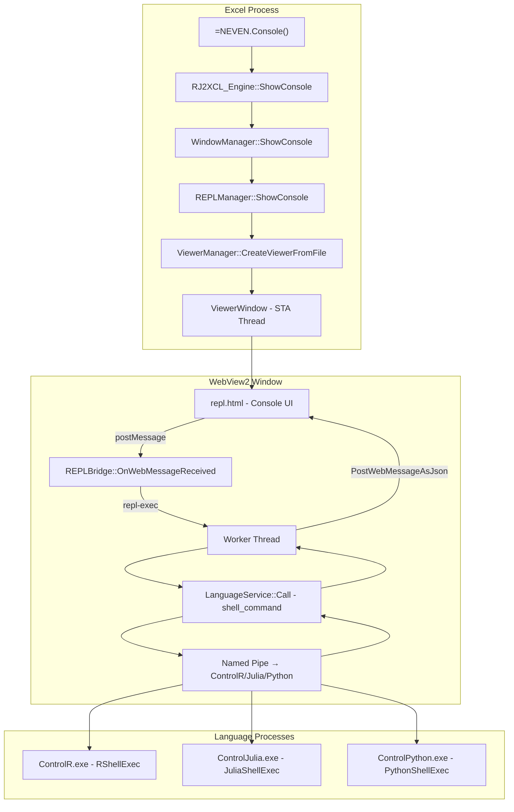

# Design Document: WebView2 REPL Console

## Overview

This design replaces the obsolete Electron-based console (Electron 1.8, xterm.js + Monaco, 2018) with a lightweight, self-contained REPL console running inside the existing WebView2 viewer subsystem. The new console is a single HTML file served to a dedicated `ViewerWindow` via `NavigateToString` or file navigation, communicating with language engines (R, Julia, Python) through an extended `PostMessageBridge`.

The key architectural decision is to treat the REPL console as a **specialized singleton viewer** managed by `ViewerManager`, with a dedicated `REPLBridge` class that extends the existing `PostMessageBridge` pattern to handle REPL-specific message actions (`repl-exec`, `repl-result`, `repl-interrupt`, `repl-status`).

### Design Rationale

1. **Reuse existing infrastructure**: `ViewerManager` already handles WebView2 lifecycle, STA threading, and environment creation. The REPL console is just another viewer with special message handling.
2. **Zero external dependencies**: The console HTML is self-contained (inline CSS/JS), eliminating Node.js, npm, Electron, and build tooling.
3. **Singleton pattern**: Only one REPL console exists at a time, matching the existing `WindowManager` behavior but without the Electron process overhead.
4. **Asynchronous execution**: Code execution is dispatched to a worker thread to avoid blocking the STA thread or the WebView2 message pump.

## Architecture



### Data Flow

1. User types code in `Input_Line` and presses Enter
2. JavaScript sends `{ action: "repl-exec", language: "R", code: "summary(x)", id: 1 }` via `window.chrome.webview.postMessage()`
3. `ViewerWindow` receives the message and routes to `REPLBridge::OnWebMessageReceived()`
4. `REPLBridge` validates the language, dispatches to a worker thread
5. Worker thread constructs a `CallResponse` with `shell_command` field set and calls `LanguageService::Call()`
6. Response arrives via Named Pipe from the child process
7. Worker thread posts result back to STA thread via `PostThreadMessage`
8. STA thread calls `ViewerWindow::PostWebMessage()` with `{ action: "repl-result", id: 1, status: "ok", output: "..." }`
9. JavaScript receives the message and renders output in `Output_Panel`

## Components and Interfaces

### 1. REPLManager (New — `Common/REPLManager.h/.cc`)

Singleton that manages the REPL console lifecycle. Replaces the Electron-launching logic in `WindowManager`.

```cpp
namespace rj2xcl {

class REPLManager {
public:
    static REPLManager& Instance();

    /// Open or bring-to-front the REPL console window.
    /// Returns viewer_id or error string.
    std::string ShowConsole();

    /// Hide the REPL console window and return focus to Excel.
    void HideConsole();

    /// Close the REPL console and release resources (called from xlAutoClose).
    void Shutdown();

    /// Returns true if the REPL console window is currently open.
    bool IsConsoleOpen() const;

    /// Get the viewer_id of the REPL console (empty if not open).
    std::string GetConsoleViewerId() const;

    /// Store command in history for a language (called from REPLBridge after exec).
    void AddToHistory(const std::string& language, const std::string& command);

    /// Get command history for a language.
    const std::deque<std::string>& GetHistory(const std::string& language) const;

    /// Get the last active language tab name.
    std::string GetLastActiveLanguage() const;
    void SetLastActiveLanguage(const std::string& language);

private:
    REPLManager();
    ~REPLManager();

    std::string console_viewer_id_;
    std::string last_active_language_;

    struct LanguageHistory {
        std::deque<std::string> commands;
        static constexpr size_t MAX_HISTORY = 500;
    };
    std::unordered_map<std::string, LanguageHistory> history_;
    mutable std::mutex mutex_;
};

} // namespace rj2xcl
```

### 2. REPLBridge (New — `Common/REPLBridge.h/.cc`)

Handles REPL-specific PostMessage actions. Registered as the `WebMessageCallback` on the REPL console's `ViewerWindow`.

```cpp
namespace rj2xcl {

class REPLBridge {
public:
    /// Process an incoming REPL message from JavaScript.
    /// Called on the STA thread by ViewerWindow's WebMessageReceived handler.
    static void OnWebMessageReceived(
        const std::string& viewer_id,
        const std::string& json_message);

    /// Send a status update to the REPL console (language connected/disconnected).
    static void SendLanguageStatus(
        const std::string& viewer_id,
        const std::string& language,
        bool connected);

private:
    /// Dispatch code execution to a worker thread.
    static void DispatchExec(
        const std::string& viewer_id,
        const std::string& language,
        const std::string& code,
        int request_id);

    /// Worker thread function for code execution.
    static unsigned __stdcall ExecWorkerThread(void* param);

    /// Send result back to the REPL console via PostWebMessage on STA thread.
    static void SendResult(
        const std::string& viewer_id,
        int request_id,
        const std::string& status,      // "ok" or "error"
        const std::string& output,
        const std::string& language,
        const std::string& content_type = "text");  // "text", "html", "image"

    /// Handle interrupt request.
    static void HandleInterrupt(const std::string& language);
};

} // namespace rj2xcl
```

### 3. Modified WindowManager (`Common/WindowManager.h/.cc`)

`ShowConsole()` and `HideConsole()` are redirected to `REPLManager`. The Electron pipe communication code (`ConsoleThreadFunction`, `StartConsoleProcess`, `console_pipe_name_`, `console_notifications_`) is removed.

```cpp
// WindowManager.h — simplified
namespace rj2xcl {

class WindowManager {
public:
    static WindowManager& Instance();

    void ShowConsole();   // Delegates to REPLManager::Instance().ShowConsole()
    void HideConsole();   // Delegates to REPLManager::Instance().HideConsole()
    void ShutdownConsole(); // Delegates to REPLManager::Instance().Shutdown()

    void SetJobHandle(HANDLE hJob) { job_handle_ = hJob; }

private:
    WindowManager();
    ~WindowManager();

    static BOOL CALLBACK FocusExcelWindowCallback(HWND hwnd, LPARAM lParam);
    HANDLE job_handle_;
};

} // namespace rj2xcl
```

### 4. Console HTML (`console/repl.html`)

Self-contained HTML file with inline CSS and JavaScript. Loaded from `%NEVEN_HOME%/console/repl.html` via `ViewerManager::CreateViewerFromFile()`.

**JavaScript API exposed to the bridge:**

```javascript
// Outgoing messages (JS → C++)
window.chrome.webview.postMessage(JSON.stringify({
    action: "repl-exec",
    language: "R",        // "R" | "Julia" | "Python"
    code: "summary(x)",
    id: 42                // unique request ID
}));

window.chrome.webview.postMessage(JSON.stringify({
    action: "repl-interrupt",
    language: "R"
}));

// Incoming messages (C++ → JS)
window.chrome.webview.addEventListener('message', (event) => {
    const msg = JSON.parse(event.data);
    switch (msg.action) {
        case "repl-result":
            // { id, status, output, language, contentType }
            break;
        case "repl-status":
            // { language, connected }
            break;
    }
});
```

### 5. Message Protocol

#### JS → C++ Messages

| Action | Fields | Description |
|--------|--------|-------------|
| `repl-exec` | `language`, `code`, `id` | Execute code in the specified language |
| `repl-interrupt` | `language` | Request cancellation of running command |

#### C++ → JS Messages

| Action | Fields | Description |
|--------|--------|-------------|
| `repl-result` | `id`, `status`, `output`, `language`, `contentType` | Execution result |
| `repl-status` | `language`, `connected` | Language service connection change |

### 6. Integration Points

- **ViewerManager**: Creates the REPL viewer window via `CreateViewerFromFile()`. The REPL viewer is tracked separately from regular viewers (not subject to FIFO eviction).
- **LanguageService::Call()**: Used with `shell_command` field in the protobuf `CallResponse` to dispatch REPL execution to child processes.
- **LanguageManager**: Provides access to registered `LanguageService` instances by name for connection status checks and code dispatch.
- **ConfigService**: Reads `%NEVEN_HOME%` path for locating `console/repl.html`.

## Data Models

### Command History (in-memory, per-session)

```cpp
struct LanguageHistory {
    std::deque<std::string> commands;  // Most recent at back
    static constexpr size_t MAX_HISTORY = 500;

    void Add(const std::string& cmd) {
        // Skip duplicate consecutive commands
        if (!commands.empty() && commands.back() == cmd) return;
        if (commands.size() >= MAX_HISTORY) commands.pop_front();
        commands.push_back(cmd);
    }
};
```

### REPL Execution Request (worker thread parameter)

```cpp
struct REPLExecRequest {
    std::string viewer_id;
    std::string language;
    std::string code;
    int request_id;
};
```

### Console State (JavaScript side)

```javascript
const state = {
    activeTab: "R",           // Current language tab
    tabs: {
        R:      { history: [], historyIndex: -1, savedInput: "", output: [] },
        Julia:  { history: [], historyIndex: -1, savedInput: "", output: [] },
        Python: { history: [], historyIndex: -1, savedInput: "", output: [] }
    },
    executing: false,         // Whether a command is in-flight
    nextRequestId: 1          // Monotonically increasing request ID
};
```

### Output Entry (JavaScript side)

```javascript
// Each entry in tabs[lang].output
{
    type: "command" | "result" | "error" | "warning" | "html" | "image",
    text: "...",              // For text-based entries
    src: "data:image/png;base64,...",  // For image entries
    html: "<div>...</div>",  // For HTML entries
    timestamp: 1700000000000
}
```

## Correctness Properties

*A property is a characteristic or behavior that should hold true across all valid executions of a system — essentially, a formal statement about what the system should do. Properties serve as the bridge between human-readable specifications and machine-verifiable correctness guarantees.*

### Property 1: Console Singleton Guarantee

*For any* sequence of N calls to `ShowConsole()` (where N ≥ 1), the number of active REPL console viewer windows SHALL always be exactly 1, and subsequent calls SHALL reuse the existing window.

**Validates: Requirements 1.2, 1.6, 8.3**

### Property 2: Command History Persistence Round-Trip

*For any* sequence of commands added to a language's history, closing the REPL console and reopening it within the same Excel session SHALL preserve the complete command history in the same order.

**Validates: Requirements 1.4, 4.4**

### Property 3: Command History Language Isolation

*For any* two distinct languages A and B, and any command string C, adding C to language A's history SHALL not modify language B's history (size or content).

**Validates: Requirements 2.6**

### Property 4: Disconnected Language Tab State

*For any* language service with `connected() == false`, the corresponding Language_Tab SHALL be in disabled state and attempting to execute code SHALL produce an error result with message "Language engine not connected".

**Validates: Requirements 2.4, 3.7**

### Property 5: Last Active Tab Persistence

*For any* language tab selection, setting the active tab to language L, closing the console, and reopening it SHALL restore the active tab to language L.

**Validates: Requirements 2.5**

### Property 6: REPL Message Construction from Input

*For any* non-empty input string (single-line or multi-line) and any active language, submitting the input SHALL produce a correctly structured `repl-exec` message containing the complete input text (with newlines preserved for multi-line) and the correct language identifier.

**Validates: Requirements 3.1, 5.3**

### Property 7: Execution Dispatch to Correct Language

*For any* valid language name L and code string C, the `REPLBridge` SHALL dispatch the execution to the `LanguageService` instance whose `name()` matches L, using the `shell_command` protobuf field.

**Validates: Requirements 3.2**

### Property 8: Result Message Construction

*For any* execution result with id I, status S ("ok" or "error"), output text O, and language L, the `REPLBridge` SHALL construct a JSON response containing all fields (`id`, `status`, `output`, `language`) with values matching the execution result.

**Validates: Requirements 3.3, 9.3**

### Property 9: History Navigation Correctness

*For any* command history of length N and any sequence of Up/Down arrow presses, the displayed command SHALL equal `history[N - upCount]` when navigating up, and pressing Down from any position K SHALL show `history[K+1]` or empty string when at the end of history.

**Validates: Requirements 4.1, 4.2**

### Property 10: History Bounded Buffer

*For any* number of commands N added to a single language's history, the history size SHALL be `min(N, 500)` and SHALL contain the N most recent commands in order.

**Validates: Requirements 4.3**

### Property 11: Partial Input Preservation During Navigation

*For any* non-empty partial input string P in the Input_Line, navigating up through history (any number of Up presses) and then navigating back to the end of history SHALL restore the Input_Line to the original partial input P.

**Validates: Requirements 4.5**

### Property 12: Consecutive Command Deduplication

*For any* command string C executed K consecutive times (K ≥ 2), the command history SHALL contain only one entry for C at the end (not K entries).

**Validates: Requirements 4.6**

### Property 13: Output Buffer Bounded at 1000 Lines

*For any* number of output lines N appended to a Language_Tab's Output_Panel, the panel SHALL contain `min(N, 1000)` lines, retaining the most recent lines when the limit is exceeded.

**Validates: Requirements 6.7**

### Property 14: Clear Output Preserves History

*For any* console state with H commands in history and O lines in output, clearing the Output_Panel SHALL result in 0 output lines while the command history remains exactly H entries unchanged.

**Validates: Requirements 6.8**

### Property 15: Command Echo with Correct Prompt

*For any* executed command string C and language L, the Output_Panel SHALL display an entry containing the language-specific prompt indicator (`R>`, `julia>`, or `>>>`) followed by the command text C.

**Validates: Requirements 6.1**

### Property 16: Language Validation Rejects Unknown Languages

*For any* string S that is not a registered language name ("R", "Julia", "Python"), sending a `repl-exec` message with `language: S` SHALL produce a `repl-result` with status "error" and output containing "Unknown language: S".

**Validates: Requirements 9.5**

### Property 17: Content-Type Detection

*For any* execution output containing HTML content markers (e.g., `<html>`, `<div>`, or `text/html` MIME), the `contentType` field SHALL be "html". *For any* output containing PNG/SVG binary data (detected by magic bytes or MIME type), the output SHALL be base64-encoded and `contentType` SHALL be "image".

**Validates: Requirements 10.1, 10.3**

### Property 18: Multi-Line Block as Single History Entry

*For any* multi-line code block (containing N newlines, N ≥ 1), after execution the Command_History SHALL store the entire block as exactly one entry, preserving all newlines within the entry.

**Validates: Requirements 5.5**


## Error Handling

### C++ Side (REPLBridge / REPLManager)

| Error Condition | Handling Strategy |
|----------------|-------------------|
| WebView2 not available | `ShowConsole()` returns error string; no window created |
| HTML file not found at `%NEVEN_HOME%/console/repl.html` | Log error, return error string to caller |
| Language not recognized in `repl-exec` | Return `repl-result` with status "error", message "Unknown language: [name]" |
| Language service not connected | Return `repl-result` with status "error", message "Language engine not connected" |
| LanguageService::Call() returns error/timeout | Return `repl-result` with status "error", forward the error message from the pipe |
| PostWebMessage fails (WebView2 closed during exec) | Log warning, discard result (no crash) |
| Worker thread fails to start | Return `repl-result` with status "error", message "Internal error: thread creation failed" |
| JSON parse error on incoming message | Log warning, ignore malformed message |
| Viewer window closed while command executing | Worker thread completes, SendResult detects viewer gone, discards result gracefully |

### JavaScript Side (Console HTML)

| Error Condition | Handling Strategy |
|----------------|-------------------|
| `window.chrome.webview` not available | Display fallback message "This page must run inside WebView2" |
| Malformed `repl-result` JSON | Log to console, ignore message |
| Output buffer overflow (>1000 lines) | Remove oldest DOM nodes to maintain limit |
| Input exceeds reasonable size (>100KB) | Truncate with warning before sending |
| Network timeout (no response after 60s) | Re-enable input, show timeout warning in output |

### Recovery Strategy

- **Pipe disconnection during execution**: The `LanguageService::Call()` method already handles reconnection with retry logic (max retries from config). If reconnection fails, the error propagates as a `repl-result` with status "error".
- **Child process crash**: `LanguageService` detects broken pipe, sets `health_status_ = Unavailable`. `REPLBridge` sends `repl-status` with `connected: false` to update the UI tab indicator.
- **WebView2 crash**: `ViewerWindow` close callback fires, `REPLManager` clears `console_viewer_id_`. Next `ShowConsole()` call creates a fresh window.

## Testing Strategy

### Unit Tests (Example-Based)

Unit tests cover specific scenarios, edge cases, and integration points:

- **REPLManager lifecycle**: Open/close/reopen sequences, singleton enforcement
- **REPLBridge message parsing**: Valid and malformed JSON handling
- **REPLBridge dispatch**: Correct routing to language services (mocked)
- **Command history**: Add, navigate, boundary conditions (empty history, single entry)
- **Content-type detection**: HTML markers, PNG magic bytes, plain text
- **WindowManager delegation**: Verify ShowConsole/HideConsole route to REPLManager
- **Error paths**: Disconnected language, unknown language, WebView2 unavailable

### Property-Based Tests

Property-based tests verify universal correctness properties using randomized inputs. Each property test runs a minimum of **100 iterations** with generated inputs.

**Library**: A C++ property-based testing library compatible with GTest (e.g., [RapidCheck](https://github.com/emil-e/rapidcheck) integrated with GTest).

**Properties to implement:**

| Property | Generator Strategy |
|----------|-------------------|
| P1: Singleton | Generate random sequences of ShowConsole/CloseConsole calls |
| P2: History persistence | Generate random command strings, add to history, close/reopen |
| P3: History isolation | Generate commands for two languages, verify independence |
| P9: History navigation | Generate history of random length, random Up/Down sequences |
| P10: Bounded buffer | Generate N commands (N from 1..2000), verify size ≤ 500 |
| P11: Partial input preservation | Generate random partial input + random Up/Down sequences |
| P12: Deduplication | Generate random command, repeat K times (K from 2..10) |
| P13: Output buffer | Generate N output lines (N from 1..5000), verify size ≤ 1000 |
| P14: Clear preserves history | Generate random history + output, clear, verify history intact |
| P15: Command echo | Generate random command strings + language, verify prompt prefix |
| P16: Language validation | Generate random non-language strings, verify error response |
| P17: Content-type detection | Generate strings with/without HTML markers, verify classification |
| P18: Multi-line history | Generate multi-line blocks (random line count), verify single entry |

**Tag format**: Each property test is tagged with a comment:
```cpp
// Feature: webview2-repl-console, Property 10: History Bounded Buffer
```

### Integration Tests

- **End-to-end REPL flow**: Send code via PostMessage mock, verify result arrives (requires MockLanguageService)
- **WebView2 rendering**: Load `repl.html` in a test WebView2 instance, verify DOM structure
- **WindowManager → REPLManager delegation**: Verify the full call chain from `RJ_Console()` to viewer creation

### Test Infrastructure

- Tests run without Excel, R, Julia, or Python (using existing mock infrastructure: `MockExcelBridge`, mocked `LanguageService`)
- `REPLBridge` tests use a mock `ViewerManager` that captures `PostWebMessage` calls
- JavaScript tests (if added) use a headless WebView2 or jsdom for DOM verification
- All tests integrate with the existing GTest v1.14.0 framework in `NEVEN/tests/`
