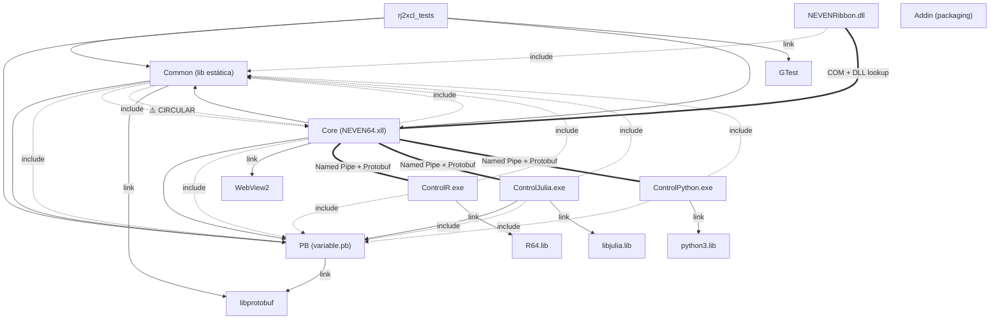

# 09 — Evaluación de Arquitectura

**Proyecto:** NEVEN v2.0  
**Fecha:** 2026-05-20  
**Auditor:** Kiro (Auditoría Automatizada)  
**Alcance:** Core, Common, ControlR, ControlJulia, ControlPython, Ribbon, PB, tests

---

## 1. Grafo de Dependencias entre Módulos

### 1.1 Diagrama Mermaid



### 1.2 Tabla de Acoplamiento por Módulo

| Módulo | Ca (Aferente) | Ce (Eferente) | Inestabilidad I=Ce/(Ca+Ce) | Rol |
|--------|:---:|:---:|:---:|-----|
| **PB** | 6 | 1 | 0.14 | Estable (librería base) |
| **Common** | 5 | 3 | 0.38 | Semi-estable (utilidades) |
| **Core** | 3 | 3 | 0.50 | Intermedio (orquestador) |
| **ControlR** | 1 | 3 | 0.75 | Inestable (hoja) |
| **ControlJulia** | 1 | 3 | 0.75 | Inestable (hoja) |
| **ControlPython** | 1 | 3 | 0.75 | Inestable (hoja) |
| **Ribbon** | 1 | 2 | 0.67 | Inestable (hoja) |
| **tests** | 0 | 4 | 1.00 | Inestable (consumidor puro) |

**Leyenda:**
- **Ca (Acoplamiento Aferente):** Número de módulos que dependen de este módulo.
- **Ce (Acoplamiento Eferente):** Número de módulos de los que este módulo depende.
- **I (Inestabilidad):** 0 = totalmente estable, 1 = totalmente inestable.

---

## 2. Hallazgos

### [ARQ-ALT-001] Dependencia Circular entre Common y Core

- **Módulo(s):** Common, Core
- **Severidad:** Alta
- **Descripción:** El módulo Common incluye headers de Core (`LanguageManager.h`, `rj2xcl.h`, `excel_api_functions.h`) en los archivos `NevenProgressiveRegistrar.cc` y `NevenInitOrchestrator.cc`. Simultáneamente, Core depende de Common como librería enlazada. Esto crea un ciclo de dependencia bidireccional: `Common → Core → Common`.
- **Evidencia:**
  - `Common/CMakeLists.txt` línea 57: `target_include_directories(... ${CMAKE_SOURCE_DIR}/Core/include)`
  - `Common/NevenProgressiveRegistrar.cc` líneas 13-15: `#include "LanguageManager.h"`, `#include "rj2xcl.h"`, `#include "excel_api_functions.h"`
  - `Common/NevenInitOrchestrator.cc` línea 14: `#include "LanguageManager.h"`
  - `Core/CMakeLists.txt`: `target_link_libraries(NEVEN_Core PRIVATE Common PB ...)`
  - **Cadena del ciclo:** `Common → Core/include/LanguageManager.h → Core → Common`
- **Recomendación:** Extraer `NevenProgressiveRegistrar` y `NevenInitOrchestrator` del módulo Common y moverlos a Core (donde pertenecen lógicamente, ya que orquestan el registro de funciones Excel y la conexión de lenguajes). Alternativamente, crear una interfaz abstracta `ILanguageRegistry` en Common que Core implemente, invirtiendo la dependencia.

---

### [ARQ-ALT-002] Common incluye archivos fuente de ControlR y ControlJulia (RuntimeLoader)

- **Módulo(s):** Common, ControlR, ControlJulia
- **Severidad:** Alta
- **Descripción:** El archivo `Common/RuntimeLoader.cc` incluye directamente headers de ControlR y ControlJulia mediante rutas relativas (`../ControlR/include/R_Environment.h`, `../ControlJulia/include/Julia_Environment.h`). Esto crea una dependencia ascendente desde una librería de utilidades hacia módulos de aplicación específicos.
- **Evidencia:**
  - `Common/RuntimeLoader.cc` líneas 13-14:
    ```cpp
    #include "../ControlR/include/R_Environment.h"
    #include "../ControlJulia/include/Julia_Environment.h"
    ```
  - **Cadena del ciclo:** `Common → ControlR/include` y `Common → ControlJulia/include`
- **Recomendación:** Aplicar el patrón Abstract Factory. Definir una interfaz `IScriptEngine` en Common y registrar las implementaciones concretas (R_Environment, Julia_Environment) desde sus respectivos módulos mediante inyección de dependencias o un registro dinámico. RuntimeLoader no debería conocer las implementaciones concretas.

---

### [ARQ-MED-003] ControlR y ControlPython duplican archivos fuente de Common

- **Módulo(s):** ControlR, ControlPython, Common
- **Severidad:** Media
- **Descripción:** Los CMakeLists de ControlR y ControlPython compilan directamente archivos fuente de Common (`../Common/windows_api_functions.cc`, `../Common/pipe.cc`, `../Common/message_utilities.cc`, `../Common/child_process_log.cc`, `../Common/json11/json11.cpp`) en lugar de enlazar contra la librería Common. Esto genera duplicación de código objeto y riesgo de inconsistencias si los archivos divergen.
- **Evidencia:**
  - `ControlR/CMakeLists.txt` líneas 56-62: `file(GLOB SRC_FILES ... "../Common/windows_api_functions.cc" "../Common/pipe.cc" ...)`
  - `ControlPython/CMakeLists.txt` líneas 47-53: `file(GLOB SRC_FILES ... "../Common/windows_api_functions.cc" "../Common/pipe.cc" ...)`
  - ControlJulia enlaza correctamente contra `PB` pero también compila archivos Common directamente.
- **Recomendación:** Crear una sub-librería estática `Common_IPC` (o similar) con solo los archivos necesarios para los procesos hijo (pipe, message_utilities, child_process_log, json11) y enlazar los ControlX contra ella. Esto elimina la duplicación y garantiza consistencia.

---

### [ARQ-MED-004] Módulo Common viola el Principio de Responsabilidad Única (SRP)

- **Módulo(s):** Common
- **Severidad:** Media
- **Descripción:** El módulo Common agrupa al menos 8 responsabilidades distintas en una sola librería estática de 47 archivos fuente:
  1. **IPC/Pipes:** `pipe.cc`, `message_utilities.cc`
  2. **Configuración:** `ConfigService.cc`, `EnvService.cc`, `DiscoveryService.cc`
  3. **Seguridad:** `SecurityService.cc`, `SandboxVerifier.cc`
  4. **Logging/Diagnóstico:** `LogService.cc`, `DiagnosticRouter.cc`, `child_process_log.cc`, `debug_functions.cc`
  5. **WebView2/Viewers:** `ViewerManager.cc`, `ViewerWindow.cc`, `PostMessageBridge.cc`, `ContentPipeline.cc`
  6. **Pluto/Notebooks:** `PlutoManager.cc`, `NotebookLibrary.cc`, `NotebookExporter.cc`, `PresentationBuilder.cc`
  7. **REPL:** `REPLManager.cc`, `REPLBridge.cc`, `REPLLanguageAccessor.cc`
  8. **Startup/Orquestación:** `NevenInitOrchestrator.cc`, `NevenBackgroundConnector.cc`, `NevenProgressiveRegistrar.cc`, `NevenWatchdogTimer.cc`, `NevenStatusBarReporter.cc`, `NevenStartupConfig.cc`
  9. **UI/Ventanas:** `WindowManager.cc`, `MenuService.cc`
  10. **Runtime:** `RuntimeLoader.cc`, `GCMonitor.cc`, `AutoLoader.cc`
- **Evidencia:** `Common/CMakeLists.txt` — 47 archivos `.cc` en un solo target `add_library(Common STATIC ...)`.
- **Recomendación:** Descomponer Common en sub-módulos cohesivos:
  - `Common_IPC` — pipe, message_utilities, child_process_log
  - `Common_Config` — ConfigService, EnvService, DiscoveryService
  - `Common_Security` — SecurityService, SandboxVerifier
  - `Common_Viewer` — ViewerManager, ViewerWindow, PostMessageBridge, ContentPipeline
  - `Common_Pluto` — PlutoManager, NotebookLibrary, NotebookExporter
  - `Common_REPL` — REPLManager, REPLBridge
  - `Common_Startup` — NevenInitOrchestrator y familia

---

### [ARQ-MED-005] Ribbon mezcla lógica de negocio con presentación COM

- **Módulo(s):** Ribbon
- **Severidad:** Media
- **Descripción:** El archivo `ribbon_connect.h` (CConnect::Invoke) contiene ~350 líneas de lógica de negocio directamente en el dispatch COM: instalación de paquetes, búsqueda de ejecutables R/Julia en el filesystem, construcción de comandos de lenguaje, y manejo de diálogos. Esto viola la separación de capas (presentación vs. lógica de negocio).
- **Evidencia:**
  - `Ribbon/ribbon_connect.h` caso `OnInstallPkgR`: construye comandos `install.packages(...)` y `Pkg.add(...)` directamente en el handler COM.
  - `Ribbon/ribbon_connect.h` caso `ShowRTerminal`: hardcodea rutas de R (`"C:\\Program Files\\R\\R-4.4.1\\bin\\x64\\Rgui.exe"`).
  - `Ribbon/ribbon_connect.h` caso `OnOpenScriptsDir`: hardcodea `"C:\\NEVEN\\"`.
- **Recomendación:** Extraer la lógica de negocio a un servicio en Core (ej: `RibbonCommandService`) que el Ribbon invoque mediante la función exportada `RJ_SetPointers` o un mecanismo similar. El Ribbon debería limitarse a despachar comandos por nombre, sin conocer la implementación.

---

### [ARQ-MED-006] Uso inconsistente de patrones Singleton

- **Módulo(s):** Core, Common
- **Severidad:** Media
- **Descripción:** El proyecto utiliza el patrón Singleton extensivamente pero con implementaciones inconsistentes:
  - `RJ2XCL_Engine`: Singleton con puntero estático raw (`static RJ2XCL_Engine *instance_`), sin thread-safety.
  - `LanguageManager`: Singleton con `static` local (Meyer's Singleton), thread-safe en C++11+.
  - `ConfigService`: Meyer's Singleton (correcto).
  - `ViewerManager`: Meyer's Singleton (correcto).
  - `RuntimeLoader`: Meyer's Singleton (correcto).
  
  La inconsistencia en `RJ2XCL_Engine` es la más preocupante dado que es el punto de entrada del XLL.
- **Evidencia:**
  - `Core/include/rj2xcl.h` línea 60: `static RJ2XCL_Engine *instance_;`
  - `Core/src/rj2xcl.cc` línea 61: `RJ2XCL_Engine* RJ2XCL_Engine::instance_ = 0;`
  - `Core/include/LanguageManager.h`: `static LanguageManager& Instance();` (Meyer's)
  - `Common/ConfigService.h`: `static ConfigService& Instance();` (Meyer's)
- **Recomendación:** Migrar `RJ2XCL_Engine` a Meyer's Singleton (`static RJ2XCL_Engine& Instance()`) para garantizar thread-safety en la inicialización. Considerar si todos los Singletons son realmente necesarios o si algunos podrían ser servicios inyectados para mejorar la testabilidad.

---

### [ARQ-BAJ-007] Patrón IPC consistente y bien diseñado para escalabilidad

- **Módulo(s):** Core, ControlR, ControlJulia, ControlPython
- **Severidad:** Baja (Hallazgo Positivo)
- **Descripción:** La arquitectura IPC sigue un patrón uniforme Named Pipe + Protobuf para todos los lenguajes. Agregar un nuevo lenguaje requiere:
  1. Crear un nuevo directorio `ControlX/` con el ejecutable.
  2. Implementar el loop de mensajes usando `pipe.h` y `message_utilities.h` de Common.
  3. Agregar una entrada en `neven-languages.json`.
  4. Agregar `add_subdirectory(ControlX)` en el CMakeLists raíz.
  
  **No se requieren cambios estructurales en Core** — `LanguageManager` descubre y conecta lenguajes dinámicamente desde la configuración JSON.
- **Evidencia:**
  - `Core/include/LanguageManager.h`: `ConfigureLanguages()` acepta JSON genérico.
  - `Core/include/language_service.h`: Clase base abstracta con métodos virtuales (`StartChildProcess`, `Connect`, `Call`).
  - Los tres ControlX siguen el mismo patrón: incluyen `pipe.h`, `message_utilities.h`, `variable.pb.h`, `Constants.h`.
  - `CMakeLists.txt` raíz: `option(NEVEN_ENABLE_PYTHON ...)` demuestra que lenguajes son opcionales.
- **Recomendación:** Documentar formalmente el "Language Service Protocol" como guía para futuros contribuidores. Considerar crear un template/scaffold para nuevos lenguajes.

---

### [ARQ-BAJ-008] Buena abstracción de Excel mediante IExcelBridge

- **Módulo(s):** Core, tests
- **Severidad:** Baja (Hallazgo Positivo)
- **Descripción:** La dependencia de Excel está correctamente abstraída detrás de la interfaz `IExcelBridge`, con una implementación real (`WinExcelBridge`) y un mock (`MockExcelBridge`). Esto permite ejecutar los 228 tests sin Excel instalado.
- **Evidencia:**
  - `Core/include/IExcelBridge.h`: Interfaz pura con `Excel12()` y `Excel12v()`.
  - `Core/include/MockExcelBridge.h`: Mock con tracking de llamadas.
  - `Core/include/rj2xcl.h` línea: `void SetBridge(std::unique_ptr<rj2xcl::IExcelBridge> bridge)` — inyección de dependencia.
  - `tests/raii_xloper_tests.cc`: `TrackingMockExcelBridge` extiende el mock para tests específicos.
- **Recomendación:** Ninguna corrección necesaria. Considerar extender el mock para simular errores de Excel (retornar `xlretFailed`) en tests de resiliencia.

---

### [ARQ-BAJ-009] Patrón Dispatcher bien implementado para callbacks

- **Módulo(s):** Core
- **Severidad:** Baja (Hallazgo Positivo)
- **Descripción:** El `CallbackDispatcher` implementa correctamente el patrón Strategy/Registry para despachar callbacks por tipo. Cada handler implementa `ICallbackHandler` y se registra dinámicamente. Esto permite agregar nuevos tipos de callback sin modificar el dispatcher.
- **Evidencia:**
  - `Core/include/CallbackDispatcher.h`: `RegisterHandler()` + `Dispatch()` por tipo string.
  - `Core/include/ICallbackHandler.h`: Interfaz abstracta con `Result<void, int>`.
  - `Core/include/GraphicsHandler.h`: Implementación concreta de `ICallbackHandler`.
- **Recomendación:** Ninguna corrección necesaria. Patrón limpio y extensible.

---

### [ARQ-MED-010] Testabilidad limitada para LanguageService (dependencia de Windows API)

- **Módulo(s):** Core, tests
- **Severidad:** Media
- **Descripción:** La clase `LanguageService` tiene dependencias directas de Windows API (CreateProcess, Named Pipes, OVERLAPPED I/O) sin abstracción intermedia. Aunque existe `MockLanguageService` para tests unitarios, no es posible testear la lógica de conexión/reconexión sin un proceso real o el `mock_engine_backend`.
- **Evidencia:**
  - `Core/include/language_service.h`: Miembros `PROCESS_INFORMATION`, `OVERLAPPED`, `HANDLE` directamente en la clase.
  - `tests/mock_engine_backend.cc`: Se requiere un ejecutable separado para simular el proceso hijo.
  - `tests/mocks/mock_language_service.h`: Mock completo pero no permite testear la lógica interna de `Connect()` o `LaunchProcess()`.
- **Recomendación:** Extraer las operaciones de proceso y pipe a interfaces (`IProcessLauncher`, `IPipeTransport`) que puedan ser mockeadas independientemente. Esto permitiría tests unitarios de la lógica de reconexión y timeout sin procesos reales.

---

### [ARQ-MED-011] Ausencia de interfaces para servicios de Common (Pluto, Quarto, Viewer)

- **Módulo(s):** Common
- **Severidad:** Media
- **Descripción:** Los servicios de alto nivel en Common (`PlutoManager`, `QuartoService`, `ViewerManager`) son Singletons concretos sin interfaces abstractas. Esto dificulta su mockeo en tests y crea acoplamiento directo entre consumidores y la implementación.
- **Evidencia:**
  - `Common/PlutoManager.h`: Singleton concreto, no implementa interfaz.
  - `Common/QuartoService.h`: Clase concreta con dependencias de Windows API (`CreateProcess`).
  - `Common/ViewerManager.h`: Singleton concreto con dependencia directa de WebView2 COM.
  - No existen mocks para estos servicios en `tests/mocks/`.
- **Recomendación:** Definir interfaces (`IViewerManager`, `IPlutoManager`, `IQuartoService`) y permitir inyección de implementaciones mock en tests. Seguir el mismo patrón exitoso de `IExcelBridge`.

---

### [ARQ-BAJ-012] Ribbon correctamente aislado como proceso COM independiente

- **Módulo(s):** Ribbon
- **Severidad:** Baja (Hallazgo Positivo)
- **Descripción:** NEVENRibbon.dll es un COM Add-in completamente separado que se comunica con el XLL mediante búsqueda dinámica de módulos (`EnumProcessModules` + `GetProcAddress`). No tiene dependencia de enlace contra Core ni Common (solo incluye `user_button.h` de Common para un struct de datos).
- **Evidencia:**
  - `Ribbon/CMakeLists.txt`: `target_link_libraries(NEVENRibbon PRIVATE gdiplus shlwapi psapi)` — sin Common ni Core.
  - `Ribbon/ribbon_connect.h` método `SetPointers()`: Busca dinámicamente `NEVEN*.xll` y llama `RJ_SetPointers`.
  - Dependencia mínima: solo `#include "../Common/user_button.h"` (un struct POD).
- **Recomendación:** Mover `user_button.h` a un directorio compartido de interfaces (ej: `Include/`) para eliminar la última referencia directa a Common.

---

## 3. Evaluación de Escalabilidad IPC

### Pregunta: ¿Agregar un nuevo lenguaje requiere cambios estructurales o solo configuración?

**Respuesta: Principalmente configuración + nuevo ejecutable.**

| Paso | Tipo de cambio | Archivos afectados |
|------|---------------|-------------------|
| 1. Crear `ControlX/` con ejecutable | Nuevo código | `ControlX/src/control_x.cc` (nuevo) |
| 2. Implementar loop de mensajes | Nuevo código | Usa `pipe.h`, `message_utilities.h`, `variable.pb.h` existentes |
| 3. Agregar entrada en config | Configuración | `neven-languages.json` |
| 4. Agregar `add_subdirectory` | Build config | `CMakeLists.txt` raíz (1 línea) |
| 5. Agregar option() para CI | Build config | `CMakeLists.txt` raíz (1 línea) |

**No se requieren cambios en:**
- `Core/` — LanguageManager descubre lenguajes dinámicamente
- `Common/` — Las utilidades IPC son genéricas
- `PB/` — El protocolo Protobuf es agnóstico al lenguaje
- `Ribbon/` — Los comandos se despachan por nombre

**Evaluación:** ⭐⭐⭐⭐ (4/5) — Excelente escalabilidad. El único punto de fricción es que `RuntimeLoader.cc` en Common conoce las implementaciones concretas, lo cual debería resolverse con el hallazgo ARQ-ALT-002.

---

## 4. Evaluación de Consistencia de Patrones

| Patrón | Módulos que lo usan | Consistencia |
|--------|-------------------|:---:|
| **Singleton** | Core (RJ2XCL_Engine), Common (ConfigService, ViewerManager, RuntimeLoader), Core (LanguageManager) | ⚠️ Parcial — RJ2XCL_Engine usa raw pointer, el resto Meyer's |
| **Strategy/Registry** | Core (CallbackDispatcher + ICallbackHandler) | ✅ Consistente |
| **Abstract Factory** | Core (LanguageService como base abstracta) | ✅ Consistente |
| **Bridge** | Core (IExcelBridge → WinExcelBridge/MockExcelBridge) | ✅ Consistente |
| **Observer** | No identificado formalmente | — |
| **Service Locator** | Common (RuntimeLoader.GetEngine) | ⚠️ Anti-patrón — conoce implementaciones |
| **Dependency Injection** | Core (SetBridge para tests) | ✅ Parcial — solo para Excel |

---

## 5. Evaluación de Testabilidad

| Aspecto | Estado | Nota |
|---------|:---:|------|
| Excel abstraído tras interfaz | ✅ | IExcelBridge + MockExcelBridge |
| Tests sin Excel/R/Julia | ✅ | 228 tests corren con mocks |
| Mock de LanguageService | ✅ | MockLanguageService con GMock |
| Mock de COM (IDispatch, ITypeInfo) | ✅ | mock_type_info.h completo |
| Mock de proceso hijo | ✅ | mock_engine_backend.exe |
| Mock de ViewerManager | ❌ | Sin interfaz abstracta |
| Mock de PlutoManager | ❌ | Sin interfaz abstracta |
| Mock de QuartoService | ❌ | Sin interfaz abstracta |
| Mock de Windows API (pipes) | ❌ | Dependencia directa |
| Property-Based Testing | ✅ | python_sandbox_pbt, reliability_pbt, webview2_pbt |
| Integration tests | ✅ | integration_tests.cc, e2e_tests.cc |
| ResetForTesting() en singletons | ✅ | RJ2XCL_Engine y LanguageManager |

---

## 6. Fortalezas Arquitectónicas

1. **Arquitectura multi-proceso robusta:** La separación XLL ↔ ControlX mediante procesos independientes proporciona aislamiento de fallos. Un crash en R/Julia no tumba Excel.

2. **Protocolo IPC bien definido:** Named Pipes + Protobuf es una elección sólida para Windows — bajo overhead, tipado fuerte, y serialización eficiente.

3. **Extensibilidad de lenguajes:** El diseño de `LanguageManager` + `LanguageService` abstracto permite agregar lenguajes sin modificar el core.

4. **Testabilidad del core:** La inversión de dependencia con `IExcelBridge` es un patrón ejemplar que permite 228 tests sin dependencias externas.

5. **Job Object para gestión de procesos:** El uso de Windows Job Objects garantiza que los procesos hijo se terminan cuando Excel cierra, eliminando zombies.

6. **Configuración externalizada:** `neven-config.json` y `neven-languages.json` permiten personalización sin recompilación.

7. **Property-Based Testing:** La presencia de PBT (python_sandbox_pbt, reliability_pbt, webview2_pbt) demuestra madurez en la estrategia de testing.

---

## 7. Resumen de Hallazgos por Severidad

| Severidad | Cantidad | IDs |
|-----------|:---:|-----|
| **Alta** | 2 | ARQ-ALT-001, ARQ-ALT-002 |
| **Media** | 5 | ARQ-MED-003, ARQ-MED-004, ARQ-MED-005, ARQ-MED-006, ARQ-MED-010, ARQ-MED-011 |
| **Baja (Positivos)** | 4 | ARQ-BAJ-007, ARQ-BAJ-008, ARQ-BAJ-009, ARQ-BAJ-012 |

---

## 8. Recomendaciones Priorizadas

1. **[P1]** Resolver la dependencia circular Common → Core (ARQ-ALT-001) moviendo los archivos Neven* de orquestación a Core.
2. **[P1]** Eliminar la dependencia Common → ControlR/ControlJulia (ARQ-ALT-002) mediante Abstract Factory.
3. **[P2]** Descomponer Common en sub-módulos cohesivos (ARQ-MED-004).
4. **[P2]** Crear librería `Common_IPC` para eliminar duplicación en ControlR/ControlPython (ARQ-MED-003).
5. **[P3]** Extraer lógica de negocio del Ribbon a un servicio en Core (ARQ-MED-005).
6. **[P3]** Unificar implementación de Singleton en RJ2XCL_Engine (ARQ-MED-006).
7. **[P3]** Definir interfaces para ViewerManager, PlutoManager, QuartoService (ARQ-MED-011).
8. **[P4]** Abstraer Windows API de LanguageService para mejorar testabilidad (ARQ-MED-010).
